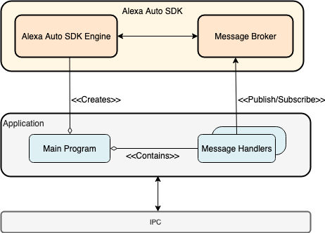

# Auto SDK Integration Guide for Linux-based platforms

The [Message Broker](./modules/core/README.md) API in Auto SDK provides a way for your application to interact with the Engine for a particular functionality, such as audio input, media streaming or location services. The Engine publishes messages when it needs to query data or delegate handling, such as rendering visual elements or placing a phone call to your custom implementation. Your application must publish messages to the Engine to provide a proactive notification of a state change or error. This loosely coupled MessageBroker API to subscribe to and publish messages allows you to have a lot more flexibility with how you design the application. 

The following architecture diagram illustrates a common design used for integrating the Auto SDK in Linux platforms. 

<p align="left">
   
</p>


To integrate your application with Auto SDK using the MessageBroker interface, follow these steps:

## Creating the Engine

To create an instance of the Engine, call the static function `aace::core::Engine::create()`:
```
auto engine = aace::core::Engine::create();
```

## Configuring the Engine

Before you can start the Engine, you must configure it using the required `aace::core::config::EngineConfiguration` object(s) for the services you will be using:

1. Generate the `EngineConfiguration` object(s). You can do this using a JSON configuration file, programmatically (using factory functions), or using a combination of both approaches.

    >**Note:** You can generate a single `EngineConfiguration` object that includes all configuration data for the services you will be using, or you can break the configuration data into logical sections and generate multiple `EngineConfiguration` objects. For example, you might generate one `EngineConfiguration` object for each module. Please refer to the respective module README for details.
    
2. Call the Engine's `configure()` function, passing in the `EngineConfiguration` object(s): 

    * For a single `EngineConfiguration` object, use:
        ```
        engine->configure( config );
        ```
  
    *  For multiple `EngineConfiguration` objects, use:
        ```
        engine->configure( { xConfig, yConfig, zConfig, ... } );
        ```
      
        replacing `xConfig, yConfig, zConfig` with logical names to identify the `EngineConfiguration` objects you generated; for example: `coreConfig, alexaConfig, navigationConfig`

     >**Note**: You can call the Engine's `configure()` function only once, and you must call it before you subscribe to any messages or start the Engine.

## Subscribing to messages from Engine

1. Get a reference to the message broker from the Engine.

   ```
   auto messageBroker = engine->getMessageBroker();
   ```
2. Use the following MessageBroker `subscribe()` function, passing in a message handler (a function that will handle the messages published by the Engine), the topic and action for which you want to receive messages from the Engine. 

   ```
   void subscribe(MessageHandler handler, const std::string& topic = "", const std::string& action = "");
   ```
   >**Note**: If no topic or action is specified, then the application will receive messages for all topics and all actions.

## Publishing messages to Engine

Messages are published to the Engine to provide a proactive notification of a state change or an error. Use the MessageBroker `publish()` function to send a specific message to the Engine. 

```
void publish(const std::string& message)
```

## Handling synchronous-style messages

Most messages are either fire-and-forget, or they have a separate message that the application or Engine sends as an asynchronous response. However, some messages exchanged between the Engine and the application require a special reply message type. Typically these messages retrieve data that the requester requires "synchronously", such as application states retrieved for Alexa events. The Engine may either require a reply in response to a published message, or may send a reply to the application in response to a published message.

### Replying to messages from the Engine

Some messages that are sent to the application require a special `reply` message type to be sent back. In most cases the engine will block other messages from being sent until the reply is received (or until a timeout occurs), so it is important to send the reply message right away. To reply to a message:

1. Set the `replyToId` in the reply message to the ID of the original message.

2. Use the MessageBroker `publish()` function to send the reply.

### Receiving reply messages from the Engine

For some messages published by the application, the Engine may send a reply back to the application. In such cases, your application must subscribe to and handle the reply from the Engine. The `replyToId` in the reply message will contain the message ID for which the reply is sent.

## Handling audio and stream based interface

Stream based interfaces, such as AudioInput and AudioOutput, require the application to read from or write to a stream. For such messages, a stream ID is included in the message payload.

1. Use the MessageBroker `openStream()` function to fetch the MessageStream corresponding to the stream ID.

2. Specify the operation mode when opening the stream using the `MessageStream::Mode` enumeration. Streams can either be read-only, write-only, or support both input and output operations.

   ```
   std::shared_ptr<MessageStream> openStream(const std::string& streamId, MessageStream::Mode mode)
   ```

   >**Note**: If a stream can not be opened for the specified operation, the openStream() call will fail and return a null object
