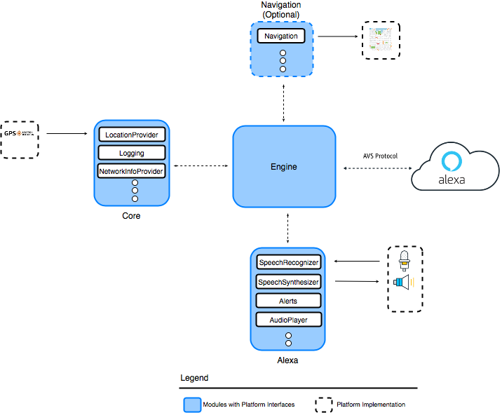

# Overview of the Alexa Auto SDK

The Alexa Auto SDK contains essential client-side software required to integrate Alexa into the automobile. The software includes the source code and function libraries in C++ and Java. The Auto SDK is modular and abstract, providing a runtime engine for your vehicle to communicate with the Alexa service. It also provides interfaces for you to implement platform-specific behavior, such as audio input, media playback, template and state rendering, phone control, and navigation. After you build and install the Auto SDK, you can use the included sample applications, one for C++ and one for Android, to learn about the Auto SDK interfaces and to test interactions before integration.

<!-- omit in toc -->
## Table of Contents
- [Auto SDK Architecture and Modules](#auto-sdk-architecture-and-modules)
- [Alexa Auto Client Service (AACS)](#alexa-auto-client-service-aacs)
- [Security Best Practices](#security-best-practices)
- [See Also](#see-also)

## Auto SDK Architecture and Modules

> **Note**: This diagram shows only some of the available platform interfaces.

The following sections describe the Auto SDK modules and extensions, which are optional modules.

###  Alexa Auto SDK Engine

The Auto SDK Engine is the runtime implementation of the Auto SDK. Platform-specific behavior in the Alexa Auto SDK is abstracted into interfaces called "platform interfaces." Modules in the Auto SDK extend the Engine by providing services and defining the runtime behavior for platform interfaces that are registered by the application. The platform interfaces define the API that determines how the application communicates with the Engine.

###  Core Module

The Core module (for [C++](./modules/core/README.md) or [Android](./platforms/android/modules/core/README.md)) includes the Engine class and platform interfaces. It also provides the infrastructure for audio input and output. The infrastructure is necessary for any modules that provide platform interfaces involving audio (for example, the Alexa module). All modules depend on the Core module, which provides them with logging, location reporting, and network monitoring services. 

The Auto SDK provides a Java version of each C++ platform interface in the Android platform portion of the SDK. The Java interfaces are built, using the Java Native Interface (JNI), on top of the core C++ interfaces. As a result, Android integrations can use Auto SDK interfaces directly.

###  Alexa Module

The Alexa module (for [C++](./modules/alexa/README.md) or [Android](./platforms/android/modules/alexa/README.md)) includes platform interfaces and runtime Engine support for Alexa features in the Auto SDK, including speech input and output, audio output, authorization, Alexa speaker, media playback, equalizer control, template and state rendering, local media sources, alerts, notifications, and Do Not Disturb (DND). 

###  Navigation Module

The Navigation module (for [C++](./modules/navigation/README.md) or [Android](./platforms/android/modules/navigation/README.md)) includes platform interfaces and runtime Engine support for Alexa to interface with the onboard navigation system.

###  Phone Call Controller Module

The Phone Control module (for [C++](./modules/phone-control/README.md) or [Android](./platforms/android/modules/phonecontrol/README.md)) includes platform interfaces and runtime Engine support for Alexa to interface with the onboard telephony system.

### Address Book Module

The Address Book module (for [C++](./modules/address-book/README.md) or [Android](./platforms/android/modules/addressbook/README.md)) includes platform interfaces and runtime Engine support to augment the communications and navigation capabilities of Alexa with user data such as phone contacts and navigation favorites ("home", "work", etc.)

### Code-Based Linking (CBL) Module

The CBL module (for [C++](./modules/cbl/README.md) or [Android](./platforms/android/modules/cbl/README.md)) includes platform interfaces and runtime Engine support to implement the CBL mechanism of acquiring Login with Amazon (LWA) access tokens.

### Alexa Presentation Language (APL) Module
The APL module (for [C++](./modules/apl/README.md) or [Android](./platforms/android/modules/apl/README.md)) includes platform interfaces and runtime Engine support to enable devices with graphical user interface (GUI) support to implement APL directives and events.

>**Note:** APL rendering on the Android Sample App requires a component that is available by [request from your Amazon Solutions Architect (SA) or Partner Manager](./NEED_HELP.md#requesting-additional-functionality).

### Messaging Module 
The Messaging module (for [C++](./modules/messaging/README.md) or [Android](./platforms/android/modules/messaging/README.md)) includes platform interfaces and runtime Engine support for Short Message Service (SMS) capabilities of Alexa such as sending and reading text messages.

### Car Control Module
The Car Control module (for [C++](./modules/car-control/README.md) or [Android](./platforms/android/modules/car-control/README.md)) enables your application to build a custom vehicle-control experience that allows the user to voice-control vehicle features using Alexa.

### Connectivity Module
The Connectivity module (for [C++](./modules/connectivity/README.md) or [Android](./platforms/android/modules/connectivity/README.md)) creates a lower data consumption mode for Alexa, allowing automakers to offer tiered functionality based on the status of their connectivity plans.

### Text To Speech (TTS) Module
The TTS module (for [C++](./modules/text-to-speech/README.md) or [Android](./platforms/android/modules/text-to-speech/README.md)) enables a platform implementation to request synthesis of Alexa speech on demand from a text or Speech Synthesis Markup Language (SSML) string.

### Text To Speech (TTS) Provider Module
The TTS provider module (for [C++](./modules/text-to-speech-provider/README.md) or [Android](./platforms/android/modules/text-to-speech-provider/README.md)) synthesizes Alexa speech on demand. This module requires Auto SDK to be built with the Local Voice Control extension.
  
### AmazonLite Wake Word Extension
Wake Word enables hands-free, voice-initiated interactions with Alexa. The Wake Word extension enables AmazonLite Wake Word support in the Auto SDK.

### Alexa Communications Extension
The Alexa Communications extension enables integration with Alexa-to-Alexa calling, Alexa-to-PSTN calling, and messaging capabilities.

### Local Voice Control (LVC) Extension
The Local Voice Control (LVC) extension provides car control, communication, navigation, and entertainment functionality, with and without an internet connection. It includes components that run an Alexa endpoint inside the vehicle's head unit. Local Voice Control is currently supported on Linux x86 64-bit, Linux ARM 64-bit, Android x86 64-bit, and Android ARM 64-bit platforms.

#### Local Navigation Module
The Local Navigation module enables you to provide customers with Alexa local search and navigation without WiFi or data plan connectivity.

### Device Client Metrics (DCM) Extension
The Device Client Metrics (DCM) extension enables logging and uploading Alexa Auto SDK metrics to the Amazon cloud. Voice request metrics, for example, include start and end timestamps of user and Alexa speech and user perceived latency (UPL) between the request and Alexa’s response. Metrics may be tagged Beta, Gamma, or Prod depending on the vehicle lifecycle. The DCM extension is available for all Linux and Android platforms.

### Voice Chrome for Android Extension
The Voice Chrome extension adds Voice Chrome support to the Auto SDK for Android x86 64-bit and Android ARM 32/64-bit platforms. Voice Chrome provides a consistent set of visual cues representing Alexa attention state across a range of Alexa-enabled devices. The Voice Chrome extension includes a prebuilt Android AAR library for easy integration with your applications, as well as a patch to the Android Sample App that adds the Voice Chrome functionality.

>**Note:** Auto SDK extensions are available by request. Contact your Amazon Solutions Architect (SA) or Partner Manager for more information.

## Alexa Auto Client Service (AACS)
The Auto SDK includes AACS, an APK (Android package) that enables OEMs of Android-based devices to simplify the process of integrating the Auto SDK. After you install, configure, and initialize AACS, it communicates with the applications, providing an interface between the applications and various Alexa functions, such as navigation and car control. For more information about AACS, see the AACS [README](./platforms/android/alexa-auto-client-service/README.md).

AACS requires the Alexa Auto Service Bridge (AASB) extension, which provides a message-based interface to the Auto SDK Engine.  For more information about AASB, see the [AASB README](./extensions/aasb/README.md).

## Security Best Practices

All Alexa products are required to follow the [Security Best Practices for Alexa](https://developer.amazon.com/en-US/docs/alexa/alexa-voice-service/avs-security-reqs.html). When building an Alexa experience using the Alexa Auto SDK, additionally adhere to the following security principles:

* Protect configuration files for the Auto SDK Engine from tampering and inspection.
* Protect configuration parameters, such as those found in Auto SDK Engine configuration files, from tampering and inspection, including but not limited to the following: SQLite database files, Unix Domain Sockets, wake word models, and metrics sink files.
* Protect components used for the Local Voice Control (LVC) extension, including associated LVC language model packages (Linux) and APKs (Android), from tampering and inspection, including but not limited to the following: Unix Domain Sockets, model directories, skill and service executables, prompts and assets JSON files, and all files configuring these components. 
* Your C++ implementation of Auto SDK interfaces must not retain locks, crash, hang, or throw exceptions.
* Use exploit mitigation flags and memory randomization techniques when you compile your source code to prevent vulnerabilities from exploiting buffer overflows and memory corruptions. 

## See Also
The following documents or websites provide more information about the Auto SDK.

* [In-vehicle Alexa experience design guidelines](https://developer.amazon.com/en-US/docs/alexa/alexa-auto/about-this-guide.html) include principles, voice, visual, user interface (UI) patterns, and multimodal best practices. 
* [Getting Started Guide](./GETSTARTED.md) provides steps for getting started with the Auto SDK and for downloading extensions.
* [Change Log](./CHANGELOG.md) provides a summary of feature enhancements, updates, and resolved and known issues. 
* [Android Sample App](./samples/android/README.md) and [C++ Sample App](./samples/cpp/README.md) READMEs provide release notes about the sample apps.
* For Auto SDK API documentation, see the interface reference documentation:
    * [Alexa Auto SDK for Android](https://alexa.github.io/alexa-auto-sdk/docs/android/)
    * [Alexa Auto SDK for C++](https://alexa.github.io/alexa-auto-sdk/docs/cpp/)
* [Migration Guide](./MIGRATION.md) describes how to migrate from one Auto SDK version to another.

