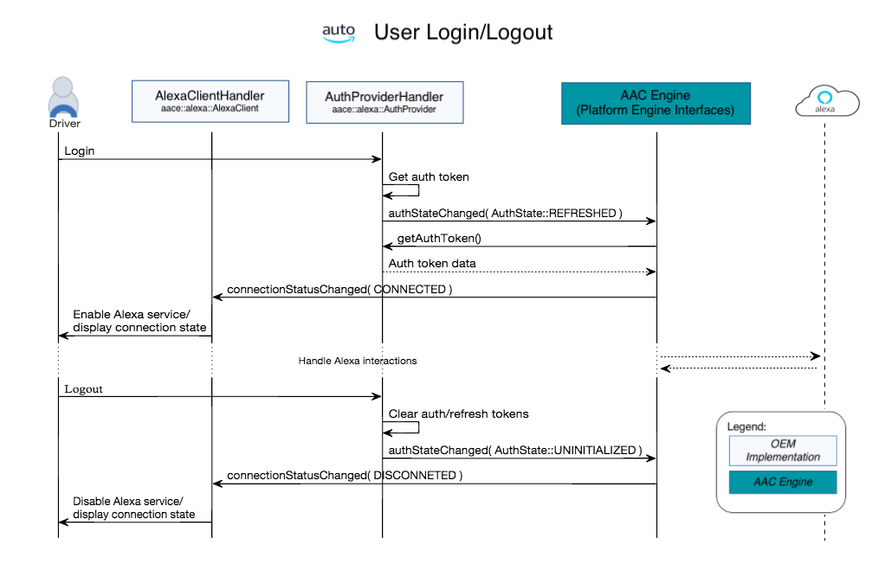

# Alexa Module Sequence Diagrams for Alexa Auto SDK

Here are a few sequence diagrams that are representative of some of the basic flows used in the Alexa Auto SDK.

## Login/Logout Sequence Diagram

Alexa Auto SDK requires that you use access tokens for login. Application developers need to provide access so that users can register the head unit as an Alexa-enabled product with Login With Amazon (LWA). It is the OEM developer's responsibility to manage authentication and authorization.

Alexa Auto SDK doesn't maintain or manage access tokens. Maintaining and managing access tokens is the responsibility of the authorization app being used. To logout the authorization and refresh tokens need to be cleared. Anytime the authorization and refresh tokens are cleared, users must go through the authentication and authorization process again.

**Additional Authorization Resources:**

* [Customer Experience in Android/Fire apps](https://developer.amazon.com/docs/login-with-amazon/customer-experience-android.html#login-flows)
* [Implement Authorization for AVS Using Login With Amazon](https://developer.amazon.com/alexa-voice-service/auth)
* [Understanding Login Authentication with the AVS Sample App and the Node.js Server](https://developer.amazon.com/blogs/alexa/post/bb4a34ad-f805-43d9-bbe0-c113105dd8fd/understanding-login-authentication-with-the-avs-sample-app-and-the-node-js-server)

## Tap to Talk Sequence Diagram

This sequence diagram illustrates the initial sequence followed to access Alexa through the automotive tap to talk flow. The driver initiates the  action by pushing the voice button located in the car.

Once the driver pushes the voice button, Alexa is brought to a listening state ready for voice input, processing, and playback.

This diagram includes the actual names and syntax for the methods and functions used in the Alexa Auto SDK.

> **Note**: Tap to Talk can be used with PCM and OPUS audio formats.

> **Tip**: Tap to Talk can be used to initiate speech recognition from external services such as external wake word engines, physical voice command buttons, and on screen buttons from the In-vehicle Voice Infotainment (IVI) system.

### Tap to Talk Flow Summary

 &ensp; The driver pushes the voice button in the car. This specific human action puts Alexa into a listening state. There should be a visual indication to the driver that Alexa is now ready for audio input.  

 &ensp; The car's microphone is now actively receiving voice input and preparing an audio buffer to send to the Alexa Auto SDK Engine. The Alexa Auto SDK Engine audio input function loops until a directive is returned indicating that the audio input has finished.  

 &ensp; A visual indication should be displayed on the head unit screen indicating that Alexa is in a thinking state. In this state, Alexa is processing the input buffer and creating an appropriate response type. In this example Alexa is creating an audio out file that is sent to the cars head unit to play.  

## Wake Word Enabled Sequence Diagram

This sequence diagram illustrates the initial sequence followed to access Alexa with the wake word enabled. The driver initiates the action by uttering the Alexa wake word.

This diagram includes the actual names and syntax for the methods and functions used in the Alexa Auto SDK.

> **Note**: WWE can be used with PCM audio format only.

### Wake Word Enabled Flow Summary

 &ensp; Alexa recognizes the wake word and starts building an audio data buffer until the audio request is complete.  

 &ensp; Once the audio request is complete, a thinking state voice chrome should be displayed.  
