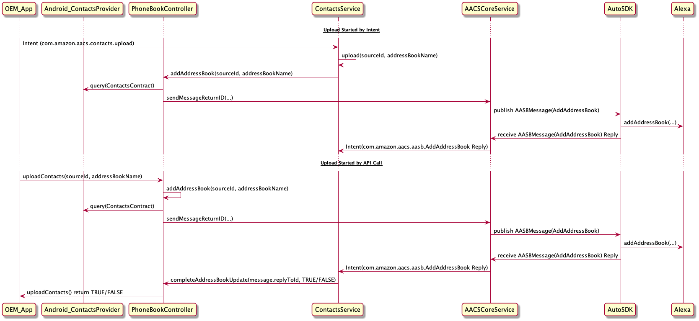

# AACS Contacts <!-- omit in toc -->

The AACS Contacts library is an Android library used by the AACS Core Service to fetch contact information from the vehicle's head unit and send it to Alexa. The AACS Core Service can also use this library to remove from Alexa the uploaded contact information.

<!-- omit in toc -->
## Table of Contents
- [Overview](#overview)
- [Building the Library](#building-the-library)
- [Setup for AACS Contacts Library](#setup-for-aacs-contacts-library)
    - [Providing Permission in Android Manifest](#providing-permission-in-android-manifest)
    - [Specifying Intent Targets](#specifying-intent-targets)
- [Sequence Diagrams](#sequence-diagrams)
- [How the AACS Contacts Library Works with an Address Book](#how-the-aacs-contacts-library-works-with-an-address-book)
    - [Uploading Address Book](#uploading-address-book)
    - [Removing Address Book](#removing-address-book)

## Overview
Using the Contacts Library, AACS enables your app to interact with the Auto SDK Engine easily to add or remove an address book, which contains all contact information maintained by the Android Contacts Provider. For information about Contacts Provider, see the [Contacts Provider documentation](https://developer.android.com/guide/topics/providers/contacts-provider). 

>**Note:** An address book can be of the type Contact or Navigation. The Contacts Library only works with the Contact type. For example, AACS cannot use the library to fetch data about a navigation favorite. See the Auto SDK `Address Book` module documentation for more information about the `AddressBookType` API. 

The following list describes the major components of the library: 

* The AACS Contacts Service is responsible for:
    * Receiving AASB `AddAddressBook` or `RemoveAddressBook` messages from the AACS Core Service.
    * Receiving defined intents from your application to upload or remove an address book

* The AACS Contacts Library platform implementation (`PhoneBookController`) is responsible for:
    * Fetching the address book from the Android Contacts Provider
    * Parsing all contact data from the address book into an AASB `AddAddressBook` message
    * Sending the AASB `AddAddressBook` intent to the AACS Core Service to upload the address book to Alexa
    * Sending the AASB `RemoveAddressBook` intent to the AACS Core Service to remove from Alexa an address book with a specific `addressBookSourceId`, a unique address book identifier defined in the Address Book handler (Bluetooth MAC address of connected phone)
    * Providing the API for adding or removing an address book for your application to call

The AACS Contacts Library is an optional module, which you can use as is or as a reference when you integrate the Address Book module with AACS. You can build it into an Android archive (AAR) to be included in the AACS APK (recommended) or in your application APK.

## Building the Library
You can build the library locally using the following steps:

  1) Enter the following command to change the directory:
  ~~~
      cd ${AAC_SDK_HOME}/aacs/android/sample-app
  ~~~
  2) Enter the following command to build the Contacts library:
    ~~~
        ./gradlew :alexa-auto-contacts:assembleRelease
    ~~~
    Replace `assembleRelease` with `assembleDebug` if you want to build the debug version of the library. The generated AAR is available at `alexa-auto-sdk/aacs/android/app-components/alexa-auto-contacts/aacscontacts/build/outputs/aar`.
    You must include the `AACSIPC`, `AACSConstants`, `AACSCommonUtils`, `AACS` and `Auto SDK` AARs in your application to use with the AACS Contacts AAR.


To enable contacts support in the AACS Sample App, follow these steps:

1) Enter the following command to change the directory:
~~~
    cd ${AAC_SDK_HOME}/aacs/android/sample-app
~~~   
2) Enter the following command to start the local build with contacts enabled.
~~~
    ./gradlew assembleLocalRelease -PenabledContacts
~~~
For more build options, see the [AACS Sample App README](../../sample-app/README.md#optional-arguments).

## Setup for AACS Contacts Library
Before using the AACS Contacts Library, follow these major steps:

1. Provide permission in your application's Android manifest.
2. Specify targets for intents from the AACS Core Service.

### Providing Permission in Android Manifest
For security reasons, for your application to send intents to or receive intents from the AACS Contacts Service, specify the `com.amazon.aacscontacts` permission in your application's Android manifest as follows: 

```
<uses-permission android:name="com.amazon.aacscontacts" />
```

### Specifying Intent Targets
The AACS Contacts Service listens to intents from the AACS Core Service with the `AddressBook` topic. To specify AACS Contacts Service with  an intent target for the `AddressBook` topic, follow one of these steps:

* Manually specify the messages in the AACS configuration file, as described in the [AACS README](../../README.md#specifying-the-intent-targets-for-handling-messages). The targets in the AACS configuration file override the ones specified by intent filters. The following example shows how to specify an intent target in the AACS configuration file. In this example, the AACS Contacts Library AAR is part of the AACS APK.

```
    "AddressBook" : {
        "type": ["<target_1_type>", "SERVICE", ...],
        "package": ["<target_1_package_name>", "com.amazon.alexaautoclientservice", ...],   
        "class": ["<target_1_class_name>", "com.amazon.aacscontacts.AACSContactsService", ...]
    }
``` 

* Omit ANY targets for `AddressBook` in the AACS configuration file. As a result, the intent filter defined in the AACS Contacts Library takes effect, enabling the AACS Contacts Service to receive the intents. 

## Sequence Diagrams
The following diagram illustrates the flow when an address book is uploaded to Alexa.


The following diagram illustrates the flow when an address book is removed from Alexa.


## How the AACS Contacts Library Works with an Address Book
This section describes how the Contacts Library uploads or removes an address book.

### Uploading Address Book
Use one of the following methods to upload an address book to Alexa:

* Use intent. Your application can inform the AACS Contacts Library to upload an address book to Alexa by using an intent. When the AACS Contacts Library receives the intent, the library fetches contacts from the Contacts Provider on the head unit and uploads them to Alexa. To determine whether the upload is successful, your application can subscribe to the AASB `AddressBook` intents. Define the attributes of the intent as follows:

    * Action is `com.amazon.aacscontacts.upload`. 
    * Category is `com.amazon.aacscontacts`.
    * Extras is `addressBookSourceId` (Must be Bluetooth MAC address from connected phone fetched from client application) and the name of the address book (defined in the Address Book platform interface), specified as follows:
  
~~~
        {
            "addressBookSourceId": "<addressBookSourceId>",
            "addressBookName": "<Name of phone book>"
        }
~~~

* Use a direct API call. This method is applicable only if you put the AACS Contacts Library in your application. The `PhoneBookController.uploadContacts` API blocks the current thread and returns a boolean value indicating if the operation is successful. The following code shows how to use `PhoneBookController.uploadContacts`:

```
    // Instantiate PhoneBookController
    PhoneBookController phoneBookController = new PhoneBookController(context);
    Boolean succeeded = phoneBookController.uploadContacts(addressBookSourceId, addressBookName);
```
Note that `addressBookSourceId` must be Bluetooth MAC address from connected phone fetched from client application in order to have contacts upload working properly

### Removing Address Book
Use one of the following methods to remove an address book from Alexa:

* Use intent. Your application can inform the AACS Contacts Service to remove an address book from Alexa by using an intent. Define the attributes of the intent as follows:

* Action is `com.amazon.aacscontacts.remove`.
* Category is `com.amazon.aacscontacts`.
* Extras is `addressBookSourceId` (defined in the Address Book platform interface), specified as follows:

```
    {
        "addressBookSourceId": "<addressBookSourceId>"
    }
```

* Use a direct API call. This method is applicable only if you put the AACS Contacts Library in your application. The `PhoneBookController.removeContacts` API blocks the current thread and returns a boolean value indicating if the operation is successful. The following code shows how to use `PhoneBookController.removeContacts`:

```
    // Instantiate PhoneBookController
    PhoneBookController phoneBookController = new PhoneBookController(context);
    Boolean succeeded = phoneBookController.removeContacts(addressBookSourceId);
```
Note that `addressBookSourceId` must be Bluetooth MAC address from connected phone fetched from client application in order to have contacts remove working properly