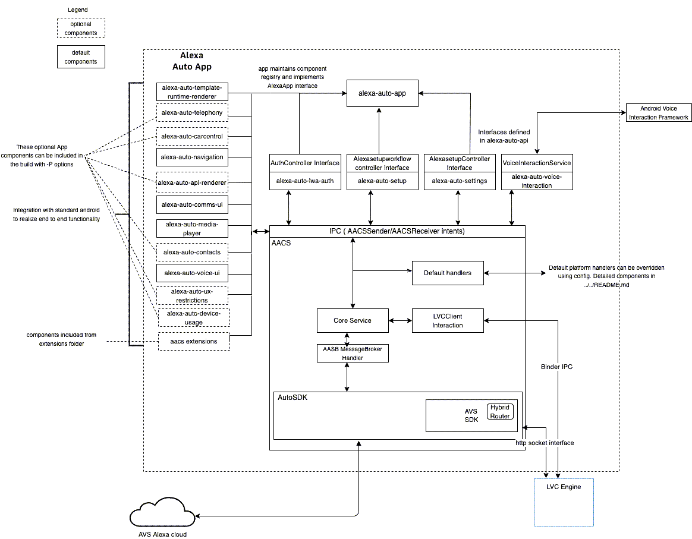

# AACS Sample App <!-- omit in toc -->

The AACS Sample App is an Android application that runs on your vehicle's head unit. It demonstrates how an application uses Alexa Auto Client Service (AACS), an Alexa Auto SDK feature that speeds up Alexa integration for in-vehicle infotainment (IVI). The app enables the user to select Alexa as an alternative to another voice assistant and configure the way the user interacts with Alexa. The app also allows Alexa and another application to run simultaneously.

This document provides conceptual information about the purpose and features of the AACS Sample App. It provides the steps for building the app and setting up Alexa. It also describes the user experience when the user interacts with Alexa when the app is running.

>**Note:** Amazon recommends that you familiarize yourself with AACS by reading the [AACS README](../README.md).

<!-- omit in toc -->
## Table of Contents
- [AACS Sample App Architecture](#aacs-sample-app-architecture)
- [Prerequisites](#prerequisites)
  - [Requirements for Using AACS Sample App](#requirements-for-using-aacs-sample-app)
  - [Requirements for Using AACS Sample App with Preview Mode](#requirements-for-using-aacs-sample-app-with-preview-mode)
  - [Requirements for Using AACS Sample App with APL](#requirements-for-using-aacs-sample-app-with-apl)
  - [Requirements for Building AACS Sample App](#requirements-for-building-aacs-sample-app)
  - [Requirements for Using Optional Features](#requirements-for-using-optional-features)
- [About App Components](#about-app-components)
- [Building the AACS Sample App Using AACS AAR](#building-the-aacs-sample-app-using-aacs-aar)
  - [Cloning the Auto SDK Repository](#cloning-the-auto-sdk-repository)
  - [Editing the Configuration File](#editing-the-configuration-file)
  - [Including Build Dependency (AAR)](#including-build-dependency-aar)
  - [Building and Signing the AACS Sample App APK](#building-and-signing-the-aacs-sample-app-apk)
    - [Using the CLI](#using-the-cli)
    - [Optional Arguments](#optional-arguments)
    - [Using the CLI to Sign the APK](#using-the-cli-to-sign-the-apk)
    - [Using Android Studio](#using-android-studio)
- [Alexa Setup](#alexa-setup)
  - [Language Selection](#language-selection)
  - [Starting Alexa on the Sign in Screen](#starting-alexa-on-the-sign-in-screen)
  - [Starting Authorization](#starting-authorization)
    - [Authorization With Preview Mode](#authorization-with-preview-mode)
    - [Authorization Without Preview Mode](#authorization-without-preview-mode)
    - [Interrupting Authorization](#interrupting-authorization)
  - [Alexa Configuration for Logged-in Users](#alexa-configuration-for-logged-in-users)
- [Using the Alexa Menu](#using-the-alexa-menu)
  - [Alexa Menu for Preview Mode Users](#alexa-menu-for-preview-mode-users)
  - [Alexa Menu for Signed-in Users](#alexa-menu-for-signed-in-users)
  - [Alexa Menu Options](#alexa-menu-options)
- [Using the AACS Sample App](#using-the-aacs-sample-app)
  - [Selecting Alexa as the Assistant](#selecting-alexa-as-the-assistant)
  - [Using Alexa Custom Assistant Module Library for Animation](#using-alexa-custom-assistant-module-library-for-animation)
  - [Using the AACS Sample App for Media Player](#using-the-aacs-sample-app-for-media-player)
  - [Media Resume Last Playing Media After Platform Reboot](#media-resume-last-playing-media-after-platform-reboot)
  - [Using the AACS Sample App for Alexa's Language](#using-the-aacs-sample-app-for-alexas-language)
- [Known Issues](#known-issues)

## AACS Sample App Architecture
The following diagram illustrates the AACS Sample App Architecture.



## Prerequisites
You must meet the prerequisites described in this section before you can run the AACS Sample App.

### Requirements for Using AACS Sample App
The following list describes the requirements for the AACS Sample App:

* The app can only run on an Android device.
* The app requires AACS to be running. You can obtain the AACS AAR according to the instructions in the [AACS README](../README.md).
* The app requires the Voice Chrome extension.

The app is optimized for and tested with the Android Automotive operating system. It is tested with Android API level 28.

> **Note:** The AACS Sample App requires hardware accelerated encryption on your target device. Almost all hardware-based security concepts contain this acceleration. If you see a performance issue when running the app, your device might be missing mandatory security features.

### Requirements for Using AACS Sample App with Preview Mode
Preview Mode is an Alexa feature that gives users a restricted set of Alexa features without requiring a login to the Amazon account. To allow users to use the app with Preview Mode, obtain an app component `alexa-auto-preview-mode-util` from Amazon with the help of your Solutions Architect (SA) or Partner Manager. Follow the instructions included to build the app component before you proceed.

### Requirements for Using AACS Sample App with APL
Alexa has a visual design framework called Alexa Presentation Language (APL), which allows you to build interactive voice and visual experiences across the device landscape. To allow users to use the app with APL, follow the instructions in [Alexa Auto APL Renderer README](../app-components/alexa-auto-apl-renderer/README.md) to configure and build the app.

### Requirements for Building AACS Sample App
The following list describes the dependencies required for building the AACS Sample App:
* [Conan package manager version 1.33 or higher](https://conan.io/downloads.html). The AACS Sample App build system integrates Conan into the Android Gradle system as the underlying package manager to build the Auto SDK native libraries.
* [Android SDK level 29 or higher](https://android-doc.github.io/sdk/installing/index.html). AACS service and AACS sample app are pure android projects built by Gradle. It requires the Android SDK to be installed on your work environment and the `ANDROID_SDK_ROOT` should point to root folder of the Android SDK.
* [Android Studio version 4.0 or higher](https://developer.android.com/studio#downloads)(optional). Make sure that your Gradle version and Android Studio are compatible. See the [Android Gradle Plugin Release Notes](https://developer.android.com/studio/releases/gradle-plugin#updating-gradle) for information about matching Android Studio versions to Gradle versions.

### Requirements for Using Optional Features
To use optional features delivered by Auto SDK extensions, contact your Solutions Architect or Partner Manager. The following list describes the extensions that you can use with the AACS Sample App:

* Alexa Custom Assistant extension gives the user the option of using a custom voice assistant when running the AACS Sample App.

* Mobile Authorization extension enables the user to log in to Amazon through the Alexa mobile app on the user's phone, without requiring the user to enter the CBL code.

## About App Components

The AACS Sample App APK contains several app components, each of which consists of the compiled source code or resources used by the app to provide the UI layout, communicate with AACS, and so on. See the app components directory [`alexa-auto-sdk/aacs/android/app-components/`](../app-components/) for the complete list of app components used by the AACS Sample App.

See the respective README file about the purpose of each component.

## Building the AACS Sample App Using AACS AAR
To build the AACS Sample App, follow these major steps:

1. Clone the Auto SDK repository.
2. Edit the configuration information for your device.
3. Include the build dependencies.
4. Build the AACS Sample App.

### Cloning the Auto SDK Repository
Follow these steps to clone the Auto SDK repository:

1) Create your project directory (if you do not already have one):

```shell
    mkdir ~/Projects
    cd ~/Projects
```

2) Clone the alexa-auto-sdk repository into your project directory:

```shell
    git clone https://github.com/alexa/alexa-auto-sdk.git
    cd alexa-auto-sdk
```

The Projects directory contains the Auto SDK directory structure with the `android-aacs-sample-app` directory and `app-components` directory, as shown in the following Auto SDK directory structure:
```bash
.
├── aacs
│   └── android
│       ├── app-components
│       │   ├── alexa-auto-apis
│       │   ├── alexa-auto-apl-renderer
│       │   ├── alexa-auto-apps-common-ui
│       │   ├── alexa-auto-apps-common-util
│       │   ├── alexa-auto-carcontrol
│       │   ├── alexa-auto-comms-ui
│       │   ├── alexa-auto-contacts
│       │   ├── alexa-auto-device-usage
│       │   ├── alexa-auto-lwa-auth
│       │   ├── alexa-auto-media-player
│       │   ├── alexa-auto-navigation
│       │   ├── alexa-auto-preview-mode-util
│       │   ├── alexa-auto-settings
│       │   ├── alexa-auto-setup
│       │   ├── alexa-auto-telephony
│       │   ├── alexa-auto-templateruntime-renderer
│       │   ├── alexa-auto-tts
│       │   ├── alexa-auto-ux-restrictions
│       │   ├── alexa-auto-voice-interaction
│       │   └── alexa-auto-voice-ui
│       ├── assets
│       ├── common
│       │   ├── commonutils
│       │   ├── constants
│       │   └── ipc
│       ├── sample-app
│       │   ├── alexa-auto-app
│       │   ├── build
│       │   └── gradle
│       └── service
│           ├── core-service
│           ├── gradle
│           └── modules
```

### Editing the Configuration File
For Alexa Voice Service (AVS) to authenticate your device profile, specify the configuration information in this file:

[`alexa-auto-sdk/aacs/android/sample-app/alexa-auto-app/src/main/assets/config/aacs_config.json`](https://github.com/alexa/alexa-auto-sdk/blob/master/aacs/android/sample-app/alexa-auto-app/src/main/assets/config/aacs_config.json)

The following list describes the required information for `aacs.alexa.deviceInfo`:

* For `clientId`, specify the Client ID that you generated when you [set up your security profile](https://developer.amazon.com/en-US/docs/alexa/alexa-voice-service/register-a-product.html#set-up-your-security-profile) for your development device.
* For `productId`, specify the Product ID that you entered when you [filled in the product information](https://developer.amazon.com/en-US/docs/alexa/alexa-voice-service/register-a-product.html#fill-in-product-information) for your development device.

    >**Note:** `clientId` and `productId` must correspond to a development device profile that you created as an **automotive** product by selecting the `Automotive` product category when you [filled in the product information](https://developer.amazon.com/en-US/docs/alexa/alexa-voice-service/register-a-product.html#fill-in-product-information).

* For `deviceSerialNumber`, specify the serial number of your device.
* For `manufacturerName`, specify the name of the device manufacturer.
* For `description`, specify a description of your device.

### Including Build Dependency (AAR)
The AACS Sample App APK requires the Auto SDK Voice Chrome extension (autovoicechrome.aar) as a dependency. Follow these steps to include the AAR:

1. Create the following directory:

    `alexa-auto-sdk/aacs/android/app-components/alexa-auto-voice-interaction/libs`

2. Copy the AAR into the directory.

After including the dependency, you can build the AACS Sample App APK either on the CLI or by using Android Studio.

### Building and Signing the AACS Sample App APK
You can use the command line interface (CLI) or the Android Studio to build and sign the AACS Sample App APK.

#### Using the CLI
Follow these steps to build the AACS Sample App APK:

1) Enter the following command to change the directory:

~~~
    cd ~/Projects/alexa-auto-sdk/aacs/android/sample-app
~~~

2) Enter the following command to start the local build.

~~~
    ./gradlew assembleLocalRelease
~~~
This command builds the Alexa Auto SDK, AACS, AACS Sample App and all the extensions present under the `alexa-auto-sdk/extensions/extras` directory for armv8 targets.

*  To enable the local debug log during the build, use `assembleLocalDebug` in the `gradlew` command.
*  To build AACS Sample App using the pre-built Alexa Auto SDK AARs, use `assembleRemoteRelease` in the `gradlew` command.

The `gradlew` command creates the unsigned APK, which is located in the following directory:

alexa-auto-app/build/outputs/apk/release/alexa-auto-app_release_4.0.apk

The `gradlew` command also creates each app component's AAR, which is located in each component's build output directory. For example, the Alexa Auto Media Player AAR is in the following directory:

`~/Projects/alexa-auto-sdk/aacs/android/app-components/alexa-auto-media-player/build/outputs/aar/alexa-auto-media-player_release.aar`

#### Optional Arguments
The following optional arguments are supported:

1.  Enable Optional Modules
    * To build AACS Sample App optional modules, use `-Penabled<module_name>`. For example, enable APL by appending `-PenabledAPL` to the build command. The supported module options are `-PenabledAPL`, `-PenabledUXRestrictions`, `-PenabledPreviewMode`, `-PenabledDeviceUsage`.
    * To enable AACS optional libraries, use `-P<enabledAACSModuleName>`. For example, enable AACS Telephony service by appending `-PenabledTelephony` to the build command. The supported module options are `-PenabledTelephony`, `-PenabledContacts`, `-PenabledCarControl`.

    See the below for the full command to enable APL, UX restrictions, telephony and contacts:
    ```
        ./gradlew assembleLocalRelease -PenabledAPL -PenabledUXRestrictions -PenabledTelephony -PenabledContacts
    ```

2.  Specify Path to Extensions
    * By default, the builder picks up all the extensions present under the `alexa-auto-sdk/extensions/extras` directory. To override with your custom paths to the extensions, use `-Pextensions`. See the below for the full command:

    ```
        ./gradlew assembleLocalRelease -Pextensions=~/your/custom/path/to/extension1,~/your/custom/path/to/extension2,...
    ```

3.  Clean Cache and Rebuild
    * To clean the AACS and AACS Sample App build cache, run `./gradlew clean` first before running the build command.
    * To rebuild only outdated dependencies, append `-Pforce` to the build command. This option is required when you make a change on Alexa Auto SDK. It forces the builder to re-export all the package recipes and triggers rebuild for the packages on which changes are detected.
    * To clean all the Alexa Auto SDK cache and rebuild all the dependencies: use `-PcleanDeps`.

4.  Skip Dependencies
    * To skip the step of building dependencies, use `-PskipDeps`. Make sure the Alexa Auto SDK dependency AARs are already present under `alexa-auto-sdk/aacs/android/service/core-service/libs` directory before you use this option.

5.  Specify Architecture
    * Specify the build target by appending the option `-Parch=<your_arch>`, for example: `-Parch=x86_64`. The supported architectures are `x86`,`x86_64`,`armv7`,`armv8`. If not specified, the builder by default builds for the armv8 target.

6.  Enable Sensitive Logs
    * Use the option `-PsensitiveLogs` to enable senstive logs. Note that sensitive logs are allowed in debug builds only.

7.  Change the dependency cache location
    * Change the location of the Alexa Auto SDK build cache by using this option: `-PconanHome=your/custom/home`. The default location is set to `alexa-auto-sdk/builder/.builder`.

8.  Automatically Accept Licenses
    * You need to manually accept the Android SDK licenses from command line when you build the first time. Use `-PacceptLicenses` to automatically accept the licenses.

9.  Specify Options for Dependencies
    * Use `-PconanOptions=<recipe_name>:<option>=<custom_option>` to pass any options for dependencies to the builder. AACS Sample App uses Conan to build all the Auto SDK dependencies. You can use this option to change the Conan options for any dependency recipe.

#### Using the CLI to Sign the APK

The procedure for signing the APK requires these commands:

* `zipalign` is included in the Android SDK Build Tools. On a Mac, it is usually located in this directory:

    ~/Library/Android/sdk/build-tools/<Android_SDK_Build_Tools_version>/zipalign

* `apksigner` is in Android SDK Build Tools 24.0.3 or higher. On a Mac, it is usually in the following directory:

    ~/Library/Android/sdk/build-tools/<Android_SDK_Build_Tools_version>/apksigner

You can include the build tools in your path so that you can run the commands from any directory. The following example is for Android SDK Build Tools version 30.0.2:

   `echo "export PATH=\$PATH:~/Library/Android/sdk/build-tools/30.0.2/" ~/.bash_profile && . ~/.bash_profile`

To sign the APK, follow these steps:

1. Create a custom keystore using the following command, or skip to the next step and use an existing keystore:

    `keytool -genkey -v -keystore <keystore_name>.keystore -alias <alias> -keyalg RSA -keysize 2048 -validity 10000`

2. Enter the following command to change to the directory where the APK is:

    `cd alexa-auto-app/build/outputs/apk/release`

3. Enter the following command to optimize the APK files

    `zipalign -v -p 4 alexa-auto-app_release_1.0.apk alexa-auto-app_unsigned_release_1.0-aligned.apk`

4. Enter the following commands to sign the APK by using your keystore:

    `apksigner sign --ks <path_to_keystore>/<keystore_name>.keystore  --ks-pass pass:<passphrase> --out alexa-auto-app_signed_release_1.0.apk alexa-auto-app_unsigned_release_1.0-aligned.apk`

5. When prompted, enter the passphrase that you set when you created the keystore.

#### Using Android Studio

> **Note:** These instructions assume that you have edited the [configuration files](#editing-the-configuration-file).

1. Launch <a href=https://developer.android.com/studio/index.html>Android Studio</a> and select Open an existing Android Studio project.
2. Open the folder containing the APK. For example, open the `alexa-auto-app/samples/android-aacs-sample-app` folder.
3. Click the <strong>Open</strong> button.
4. Under **Build Variants**, select **localRelease**.
5. Add optional arguments in the `alexa-auto-sdk/aacs/android/sample-app/gradle.properties` file. See [optional arguments](#optional-arguments) for all the supported options. Remove the `-P` prefix when adding the option to the `gradle.properties` file.

> **Note**: Android Studio builds and signs the APK.

## Alexa Setup
This section describes what the user must do to set up Alexa, which determines the user experience when the user interacts with Alexa. The information here supersedes the information in the [Setup documentation](https://developer.amazon.com/en-US/docs/alexa/alexa-auto/setup.html).

>**Note:** The Alexa setup process is different for users of Preview Mode and users who signed in.

The setup procedure includes the following steps:

1. Select Alexa's language (if the language used for IVI is not supported by Alexa).
2. Accept the use of Alexa in Preview Mode or perform a user login.
3. Configure initial Alexa settings (for logged-in users).

>**Note:** To complete Alexa setup, the user must have internet connection.

### Language Selection
The Alexa setup starts with selecting a language to be used by Alexa. The workflow for language selection depends on the language used by the IVI:

* If the language used for the IVI is supported by Alexa, there is no need to select a language because the app sets Alexa's language to match the IVI language. If the user prefers to use a different language for Alexa, the user can change it at a later time through the Alexa menu.

* If the language used for the IVI is not supported by Alexa, a menu is displayed for language selection. After the selection, the locale is changed according to the language selected, the setup workflow also displays text in the language selected.

  For a list of languages supported by Alexa, see the [Alexa Voice Service documentation](https://developer.amazon.com/en-US/docs/alexa/alexa-voice-service/system.html#locales).

### Starting Alexa on the Sign in Screen
The Sign in screen is displayed after the user selects the language. It displays the following contents depending on whether the AACS Sample App is used with Preview Mode:

* With Preview Mode: The screen shows two buttons. The user can click on the `TRY ALEXA` button to connect to Alexa in Preview mode, or on the `SIGN-IN` button to sign in using their Amazon account credentials.
* Without Preview Mode: The screen shows the `SIGN-IN` button only.

### Starting Authorization

The exact authorization workflow depends on whether the AACS Sample App is used with Preview Mode. If so, the Alexa Voice Service (AVS) access token is retrieved without a user login. Otherwise, the user uses Login With Amazon (LWA) to gain access to Alexa. The Auto SDK can use various authorization methods, such as Code-Based Linking (CBL) and Mobile Authorization, to retrieve the access token.

#### Authorization With Preview Mode
On the Sign-in screen, the user can click `TRY ALEXA`, which means that the user will access Alexa through Preview Mode. The Preview Mode consent screen is then displayed wherein the user can review Amazon’s Conditions of Use, Alexa & Alexa Device terms and Privacy policy. After clicking on the `AGREE & ENABLE ALEXA` button, the Success screen is displayed providing sample utterances for the user to try.

#### Authorization Without Preview Mode
The user can log in to Amazon to access the complete set of Alexa features. How the user logs in depends on whether the Auto SDK is running with the Bluetooth extension and Mobile Authorization extension.

Without the Mobile Authorization feature, the user sees the Sign-in screen showing the URL and a code (in the form of a string and a QR code), which the user uses to finish the CBL authorization. After authorization, the user's Amazon account is linked to the vehicle.

With the Mobile Authorization feature, when the user's phone is connected to the head unit via Bluetooth, the user sees a notification on the phone. After the user accepts the notification, the user is authenticated with the Amazon account information that the Alexa mobile app uses for Amazon login. For more information about Mobile Authorization, see the Mobile Authorization extension README.

#### Interrupting Authorization 
When the user is in the process of login authorization, interrupting the setup flow at this stage will cause the app to reset to the general login page when the user returns to the app. In the case of the CBL authorization mode, if the user is interrupted at the code pair screen, the app will cancel the current authorization request. The user must regenerate a new code by pressing on the sign in button again.

There are currently two types of interruption popups that the AACS Sample App implements:
1. Network status changes (e.g. `NETWORK_DISCONNECTED`)
2. Driving state changes (e.g. `CAR_STATE_DRIVE`) 

### Alexa Configuration for Logged-in Users
If the user is logged in, the user is prompted to further configure Alexa. The user is shown the location consent screen wherein they have the option to either enable location sharing or skip it. Next, if a Bluetooth-connected phone is detected, the app prompts the user to give permission for Alexa to access contacts.

After this configuration step, the app displays the Success screen as confirmation that the user can start using Alexa. If your device is allow-listed by Amazon for supporting device setup, the user hears a first-time conversation from Alexa, which provides the on-boarding experience.

## Using the Alexa Menu
The AACS Sample App provides an Alexa menu through which the user can change any settings configured during the setup process. For options with an On or Off value, the menu provides a toggle button. The Alexa menu is different for users of Preview Mode and users who signed in.

>**Note:** When developing your Android app, you may add options to the Alexa menu. Add such option at the end of the Alexa menu.

### Alexa Menu for Preview Mode Users
In Preview Mode, the Alexa menu is organized as follows:

* Sign in
* Alexa Hands-Free
* Location sharing
* Sync navigation favorites
* Sounds
* Alexa's language
* Things to try
* Disable Alexa

### Alexa Menu for Signed-in Users
For signed-in users, the Alexa menu is organized as follows:

* Alexa Hands-Free
* Do Not Disturb
* Location sharing
* Sync navigation favorites
* Communication
    * Device name
        * Contacts
* Sounds
* Alexa's language
* Things to try
* Sign out

### Alexa Menu Options
The following table describes each Alexa menu option:

| Option | Description | Possible values (Default)
|-|-|-|
|Sign in | (For Preview Mode users only) It allows the user to sign in with CBL or Mobile Authorization. |
|Alexa Hands-Free | If it is enabled, the user can say "Alexa" to invoke Alexa. If it is disabled, the user can still use PTT or TTT to invoke Alexa. | On, Off (On)
|Do Not Disturb | (For signed-in users only) If enabled, it disables Alexa notifications. | On, Off (Off)
|Location sharing | If it is enabled, the user can use location-based utterances like "Alexa, show me some coffee shops near me". If it is disabled, Alexa will not have access to the device's location and will expect the user to explicitly provide their location as a follow up voice utterance in order to respond to location-based utterances. | On, Off (value specified during Alexa setup)
|Sync navigation favorites | If it is enabled, navigation favorites from the local navigation provider would be uploaded. The user can say "Alexa, navigate to gym" where the gym address is expected to be in the favorites. If it is disabled, uploaded favorites would be cleared and Alexa will not have access to the device's navigation favorites list. | On, Off (Off)
|Communication | Name of the device on which the app runs (e.g., Sam's iPhone). |
|Communication > Contacts | If it is enabled, contacts are uploaded from the phone to Alexa, and the user can use Alexa to call or receive a call from a contact. | On, Off (value specified during Alexa setup)
|Sounds | Alexa sound settings. |
|Sounds > Start/End of request sound | If enabled, a sound is played with Alexa starts/stops listening. | On, Off (On)
|Alexa's language | The language used by Alexa when responding to your request. | Languages supported by Alexa (language specified during Alexa setup or in Alexa menu)
|Things to try | The Alexa utterances to try out for different domains |
|Sign out | (For signed-in users only) Button for the user to sign out of Alexa. It displays a confirmation message before the user is signed out. |
|Disable Alexa | (For Preview Mode users only) It displays a screen with a DISABLE button, which stops Alexa from being available in the vehicle. |

## Using the AACS Sample App
This section describes the user experience after you deploy the AACS Sample App on an Android device.

### Selecting Alexa as the Assistant
While Google Assistant is usually the default voice assistant on an Android device, user has the option of selecting Alexa as the assistant. AACS sample app behaves differently in the following scenarios:
* If AACS sample app is granted the `android.permission.WRITE_SECURE_SETTINGS` permission:
  * If there is no assistant currently selected, when a user launches the Alexa app from home screen, Alexa will be automatically set as the default assist app for the system.
  * If another assistant is currently selected as the default, when a user launches the Alexa app from home screen, a page will be displayed to ask user whether they want to replace the currently active assistant with Alexa. If the user confirms, Alexa will be set as the default assist app and the user can continue with the Alexa setup flow to sign in.
  >**Note:** AACS Sample App modifies the system setting to make Alexa the system default assist app. This approach requires your Android system UI to properly respond to the system setting change, otherwise your Android system UI may become out of sync. If your Android system cannot handle the system setting change gracefully, remove the `android.permission.WRITE_SECURE_SETTINGS` from AACS sample app to enable the fallback approach. The behavior is further described in the following bullet point.
* If AACS sample app does not have the `android.permission.WRITE_SECURE_SETTINGS` permission:
  * When user launches the Alexa app from home screen, a page will be displayed to ask user to manually select Alexa as default. The page provides a `SETTINGS` button which deep-links to the `Assist & voice input` setting page.

Alternatively, the user can also set Alexa as default assistant using the following steps:
1. Go to the device's Settings.
2. Go to `Apps & notifications` > `Default apps` > `Assist & voice input`. Then select Alexa.

>**Note:** After selecting Alexa as the assistant, if the Auto SDK is built with the Alexa Custom Assistant extension, the user can invoke either Alexa or a custom voice assistant (e.g., Brandon).

### Using Alexa Custom Assistant Module Library for Animation
If the Alexa Custom Assistant extension is installed, you can use the Alexa Custom Assistant Module Library to display custom animation when user is interacting with the custom assistant. For more information about how to enable custom animation, see the Alexa Custom Assistant extension README.

### Using the AACS Sample App for Media Player
In addition to letting the user choose Alexa as the voice assistant, the AACS Sample app enables the user to start and control the media player.

Alexa integrates with most music providers in cloud. After the user launches the app and selects Alexa as the assistant, the user can say, for example, "Alexa, play the station [station call sign] on iHeartRadio."

The app displays the user interface (UI) that comes with Android Automotive. The same UI is presented for all media providers, such as iHeartRadio and Amazon Music. However, the exact UI elements depend on the provider. For example, when the app plays music from iHeartRadio, it does not include a rewind button to go back. When the app plays music from Amazon Music, the rewind button is present. In addition, the user can say, "Go back 30 seconds," to go back.

The user can also use the app to listen to audio books. For example, if the user says, "Alexa, play the start of lord of the rings book one," Alexa starts playing the audio book from Audible. The UI displayed by the app includes the buttons for skipping 30 seconds backward or forward.
### Media Resume Last Playing Media After Platform Reboot
Generally, automotive infotainment platforms support media media resume after the reboot. Alexa `Media Resume` is a feature that helps Alexa play customers’ favorite content when they restart their Alexa-enabled vehicles. `Media Resume` simplifies the content selection and playing process for customers, removing the need for them to use dash touch buttons or to ask Alexa. Refer to [Media Resume](../../../../modules/alexa#handling-media-resuming-last-playing-alexa-media-after-device-reboot) for more information about the feature. This feature works out of the box on Automotive Android OS. Following configuration is required to enable and use this feature:

```JSON
"aacs.alexa": {
  "requestMediaPlayback": {
      "mediaResumeThreshold": 50000
    }
}
```

>**Note** If you are not using automotive android then it is assumed that your platform manages the sessions, enables the MediaBrowserService after reboot and sends the `play` command. In that case you may need to modify [alexa-auto-media-player](../app-components/alexa-auto-media-player/README.md) code to send the `requestMediaPlayback` message.

>**Note** The default implementation in [`PlaybackControlMessages.java`](https://github.com/alexa/alexa-auto-sdk/blob/master/aacs/android/common/commonutils/aacscommonutils/src/main/java/com/amazon/alexa/auto/aacs/common/PlaybackControlMessages.java) gets the elapsed boot time using Android API [SystemClock.elapsedRealtime()](https://developer.android.com/reference/android/os/SystemClock#elapsedRealtime()) If your platform provides the correct elapsed boot time value using any different API, please update it.

### Using the AACS Sample App for Alexa's Language
The AACS sample app enables the user to select Alexa's Language during the first-time user experience (FTUE) and after the FTUE:

* During the FTUE, if Alexa supports the System Language, then the AACS Sample app automatically sets Alexa’s Language to match the System Language. Else, the app informs the customer of the limitation and ask them to manually select a language for Alexa’s Language.

* After the FTUE, if a customer changes the System Language after setting up Alexa, and Alexa supports the new System Language, then the app automatically updates Alexa’s Language to match the System Language. Else, the app informs the customer of Alexa’s limitation and ask them to select a language for Alexa. If a customer changes Alexa’s Language to something that doesn’t match the System Language, and the System Language is supported by Alexa, then the app informs the customer of the mismatch and ask them to confirm before proceeding.

## Known Issues

* Android Emulator on macOS has poor audio quality, which would cause the Alexa Text-to-Speech (TTS) output to be unusable.
* In the Android Automotive Emulator, the Push-to-Talk button on the system navigation bar does not integrate with the Android Voice Interaction module properly. It is hard coded to invoke Google Assistant instead. Therefore, even if the user tries to switch from the default voice assistant to Alexa, the Push-to-Talk button on the system navigation bar still invokes the Google Assistant.

Note: Please refer to the component level README files for more information/known issues that relate to the component
