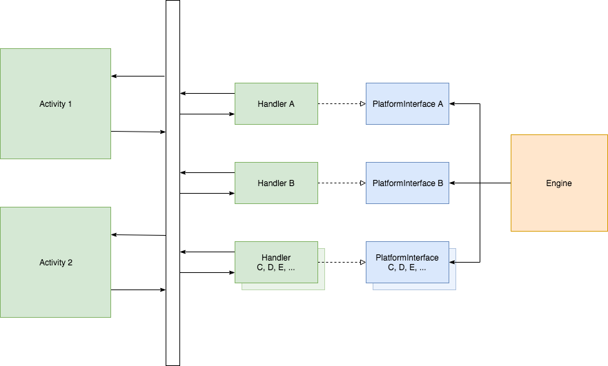
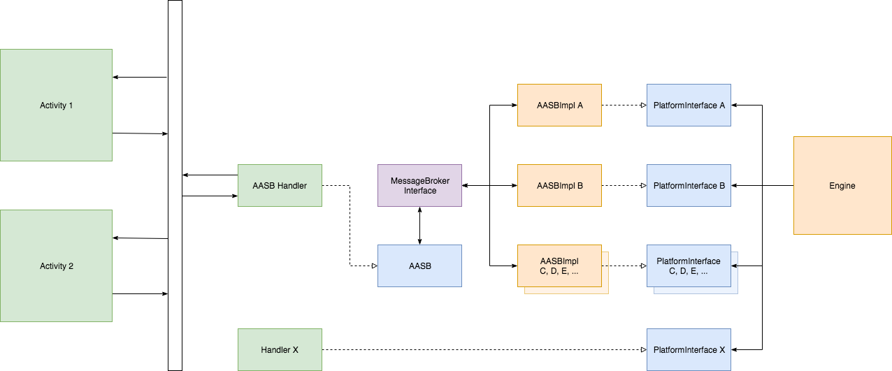

#  Alexa Auto Services Bridge (AASB) Extension

The Alexa Auto Services Bridge (AASB) extension simplifies the integration work required to implement the Alexa Auto SDK. To generate messages and events without the AASB extension, you must create a handler and implement the message serialization and underlying event behavior for all the Auto SDK modules required by your service and applications. In contrast, the AASB extension provides a single platform interface that you can customize and implement to consume messages from and reply back to the Auto SDK Engine. 

<!-- omit in toc -->
## Table of Contents
- [Overview and High-level Architecture](#overview-and-high-level-architecture)
- [Building the Auto SDK with the AASB Extension](#building-the-auto-sdk-with-the-aasb-extension)
- [Using the AASB Extension](#using-the-aasb-extension)

## Overview and High-level Architecture
The most common approach to integrating the Auto SDK without the AASB extension is to implement custom handlers for each Auto SDK platform interface, as illustrated in the architecture diagram below.

**System without the AASB Extension**

<p align="center">

</p>

The custom handlers transform API calls into messages specific to your system and send events to the service and applications using your system's message transport layer. In addition, you must implement a solution to do the reverse: handle events from the service and applications and send messages corresponding to platform interface calls.

When you use the AASB extension, you implement a single custom handler (labeled "AASB Handler" in the diagram below), and the AASB extension includes its default implementations of the Auto SDK platform interfaces. For functionality such as audio input/output, where a message-based interface may not be the most appropriate solution (due to performance or integration complexity considerations, for example), you can override AASB behavior for a particular interface by creating a custom handler for that interface (labeled "Handler X" in the diagram below) and register that handler with the Auto SDK Engine as you normally would if you weren't using the AASB extension.

**System with the AASB Extension**
<p align="center">

</p>

The default AASB implementations register their platform interfaces with the Auto SDK Engine and serialize API calls into a standardized AASB message format by overriding the platform interface methods and converting the method parameters into the corresponding AASB message payload. For details about the AASB messages, see the [AASB protocol and message reference documentation](./docs/Introduction.html). 

The default implementations send the messages, each with a specific message topic, to the application through the AASB Message Broker interface (`MessageBrokerInterface`). The default implementations also subscribe to message topics that are sent from the application to the Auto SDK Engine, invoking the appropriate Engine interface method in the platform interface when the messages are received.

>**Note:** The AASB extension adds its default implementation only if you have not registered the handler for the corresponding platform interface with the Auto SDK Engine.

## Building the Auto SDK with the AASB Extension

This section describes how to build the Auto SDK with the AASB extension by using the Auto SDK Builder. The builder is located in the directory where you installed the Auto SDK (represented as `${AAC_SDK_HOME}` in this document).

If your platform is Android and you want to build the Auto SDK with AACS, the Auto SDK Builder builds AASB by default. To build the Auto SDK with AACS, specify `--aacs-android` for the build command. The following command syntax builds the Auto SDK with AACS and AASB:

```
${AAC_SDK_HOME}/builder/build.sh android -t <target> --aacs-android
```

If you do not build the Auto SDK with AACS but want to use the AASB extension, specify AASB as an extension for the build command as in the following command syntax:

```
${AAC_SDK_HOME}/builder/build.sh <platform> -t <target> extensions/aasb
```

For details about the Auto SDK Builder and build command arguments, see the [Auto SDK Builder README](../../builder/README.md).

## Using the AASB Extension
To use the AASB extension in your service and applications:

1. Implement a custom handler for the AASB platform interface by extending the `AASB` class to handle sending and receiving AASB messages to and from the Engine.

    >**Note:** In most cases, you will send the messages to the application layer using IPC.

```
#include <AACE/AASB/AASB.h>

    class AASBHandler : public aace::core::PlatformInterface {
     
        void messageReceived( const std::sting& message ) override {
            // Handle the notification that an AASB message has been received from the Engine.
        }
    }   
```

2. Create the Auto SDK Engine:

```
auto engine = aace::core::Engine::create();
```

3. Configure the Auto SDK Engine, using a file-based JSON configuration: 

```
engine->configure( aace::core::config::ConfigurationFile::create( "config.json" ) );
```

  Any AASB service that has been included in the build will instantiate its AASB default implementations automatically, before you start the Engine; you don't need to perform any other additional setup before starting the Engine.  

4. Register your AASB platform interface handler:

``` 
engine->registerPlatformInterface( std::make_shared<AASBHandler>() );
```

5. Start the Engine:

```
engine->start();
```
### Configuring the AASB Version Being Used

If the Auto SDK is built with AASB, provide in the configuration a version string indicating the AASB version that the platform uses for communication with the Auto SDK. AASB version starts from 3.0. AASB validates the version before starting the Engine. Failure to provide a version string, which is considered valid if it lies within the range of minimum version supported and the current version, causes the Engine not to start. The following example shows the configuration with the AASB version string:
```
{
    "aace.aasb": {
        "version": "3.1"
    }
}
```

### Overriding the Default AASB Implementation (optional)
In some cases you may want to implement the behavior for a particular platform interface directly to achieve better performance, or to simplify integration with existing software components. To override the behavior provided by the AASB default platform interface implementation, simply register a handler for that interface:

1. Create the Auto SDK Engine.

```
auto engine = aace::core::Engine::create();
```

2. Configure the Engine using a file-based JSON configuration.

```
engine->configure( aace::core::config::ConfigurationFile::create( "config.json" ) );
``` 

3. Register the AASB platform interface handler.

```
engine->registerPlatformInterface( std::make_shared<AASBHandler>() );
```
 
4. Override the default AASB implementation for a specific platform interface by registering a custom handler with the Engine. For example, to register a custom LocationProvider handler:

```
engine->registerPlatformInterface( std::make_shared<LocationProviderHandler>() );
```

5. Start the Engine.

```
engine->start();
```

### Configuring the AASB Interface Handlers (optional)

Each Auto SDK Engine service defines an array of configuration objects for its interfaces, each of which includes the interface name, the "enable" setting, and an optional "config" object for interface-specific AASB configuration. The "enable" setting indicates to the service whether or not the interface should be registered. In most cases, you won't need to manually configure the interface configuration objects; however, in certain scenarios manual configuration may be required. 

Modules enable all interfaces that they implement by default. If you aren't overriding a specific platform interface, and you don't want AASB to provide its default handler, you can disable the interface using a configuration similar to the examples shown below for the TemplateRuntime and LocationProvider interfaces:

```
{
   "aasb.alexa": {
      "TemplateRuntime": {
         "enabled": false
      }
   }
}
...
{
   "aasb.location": {
      "LocationProvider": {
         "enabled": false
      }
   }
}
```

### Responding to Incoming Messages
Your application receives messages from the Engine by providing an AASB handler implementation and overriding the `messageReceived` method in the platform interface. AASB messages have a specific JSON format that allows you to determine what the appropriate response should be in your code. Each message contains a header section that identifies the `messageType`, `id`, and `version`, as well as `messageDescription` that includes a specific `topic` and `action`:

```
{
   "header": {
      "messageType": "Publish",
      "id": "50d95dd4-2536-4358-a7be-3e688a11a03a",
      "version": "1.0",
      "messageDescription": {
         "topic": "TemplateRuntime",
         "action": "RenderTemplate"
      }
   },
   ...
}
```

>**Note:** In most cases, the message `topic` and `action` correspond to a specific platform interface and method that you would need to implement in the Auto SDK if you were not using AASB.

Your AASB handler implementation must parse the JSON message after it is received to properly handle the action, or to request other components in the system to respond (over IPC for example). Some messages require a specific immediate reply from your application, while others do not.

In addition to the message header, each AASB JSON message includes a `payload` section, which provides the data for the specific message. For example, the `RenderTemplate` message sends the template information as the payload data:

```
{
   "header": {
      "messageType": "Publish",
      "id": "50d95dd4-2536-4358-a7be-3e688a11a03a",
      "version": "1.0",
      "messageDescription": {
         "topic": "TemplateRuntime",
         "action": "RenderTemplate"
      }
   },
   "payload": {
      "type": "BodyTemplate2",
      "token": "e8557c96-556a-4e05-8e18-83a1e5b2f79a",
      "title": {
         "mainTitle": "Amazon (company)",
         "subTitle": "Wikipedia"
      },
      ...
   }
}
```

Each message defines a specific schema for its payload data, so you should refer to the [AASB protocol and message reference documentation](./docs/Introduction.html) before implementing any message behavior.

### Publishing Messages
Your application must notify the Auto SDK when a state has changed, or to perform an action. To do this, your application sends messages to the Engine using the `publish()` method of the AASB platform interface. The format is the same as that of the messages received from the Engine. To understand which messages to send, refer to the [AASB protocol and message reference documentation](./docs/Introduction.html).

The following example shows how you would send a message to the Auto SDK to initiate a tap-to-talk interaction:

```
// this example uses nlohmann to create the JSON message object:
nlohmann::json message {
   { "header", {
      { "id", uuid::create() },
      { "messageType", "Publish" },
      { "messageDescription", {
         { "topic", "SpeechRecognizer" },
         { "action", "StartCapture" }
      }}
   }},
   { "payload", {
      { "initiator", "TAP_TO_TALK" },
      { "keywordBegin", -1 },
      { "keywordEnd", -1 },
      { "keyword", "" },
   }}
};

// use the aasb handler to publish the message:
aasb->publish( message.dump() );
```

>**Note:** The example above uses nlohmann to create the message JSON; however, you can use any JSON library or method to create the message data since the message JSON is serialized to a string before being published.

### Responding to Synchronous Messages
All messages that are received from the Auto SDK are sent asynchronously; however, certain messages require your application to respond immediately by publishing a special `Reply` message. For these messages, the Engine blocks its execution thread and waits for the response before continuing. If your application does not send a response before the message timeout expires, the Engine will fail to execute properly. Refer to the [AASB protocol and message reference documentation](./docs/Introduction.html) for details about which messages require a `Reply` message response.

The `GetLocation` message is an example of a request sent by the Auto SDK that requires a `Reply` message response:

```
{
   "header": {
      "messageType": "Publish",
      "id": "23b578ed-6dc3-460a-998e-1647ba6cde42",
      "version": "1.0",
      "messageDescription": {
         "topic": "LocationProvider"
         "action": "GetLocation"
      }
   }
}
```

After receiving the `GetLocation` message, your application must respond immediately by publishing a `Reply` message. Publishing the `Reply` message works as described under [Publishing Messages](#publishing-messages); however, the message format is slightly different than a regular publish message. You must specify the `messageType` to be `Reply`, and rather than specifying the `topic` and `action` in the header's `messageDescription`, you should specify a `replyToId`, using the original `GetLocation` messages's `id` as the value:

```
{
  "header": {
    "id": "4c4d13b6-6a8d-445b-931a-a3feb0878311",
    "messageType": "Reply",
    "version": "1.0",
    "messageDescription": {
      "replyToId": "23b578ed-6dc3-460a-998e-1647ba6cde42"
    }
  },
  "payload": {
    "location": {
      "latitude": 37.410,
      "longitude": -122.025
    }
  }
}
```

### Handling Audio and Other Stream-based Messages with AASB
Some interfaces (such as `AudioOutput`) have methods that require an object (such as `AudioStream`) to read and write their data. When these interfaces are implemented by an AASB handler, the underlying I/O implementation is wrapped by an object that implements the `AASBStream` interface.

AASB messages that are associated with a corresponding stream pass a reference to the stream as the `streamId` in their payloads. For example, the payload of the following `AudioOutput:Prepare` message includes an audio source specified as a `STREAM`. The payload also includes a stream ID (in this case `cdfd1759-04bc-4e0c-b87a-02c8e590a88a`): 

```
{
   "header": {
      "id": "50d95dd4-2536-4358-a7be-3e688a11a03a",
      "messageDescription": {
         "action": "Prepare",
         "topic": "AudioOutput"
      },
      "messageType": "Publish",
      "version": "1.0"
   },
   "payload": {
      "audioType": "TTS",
      "channel": "SpeechSynthesizer",
      "encoding": "MP3",
      "properties": {},
      "repeating": false,
      "source": "STREAM",
      "streamId": "cdfd1759-04bc-4e0c-b87a-02c8e590a88a",
      "token": "0082c6b3-9e36-4c17-ad78-2984e4bccc74"
   }
}
```

To get a reference to the `AASBStream` object from the AASB platform interface, you can include the source ID in a call to the `AASBStream` interface's `openStream()` method:

```
auto stream = aasb->openStream( "cdfd1759-04bc-4e0c-b87a-02c8e590a88a", AASBStream::Mode::READ );
```

Once you have a reference to the `AASBStream` object, you can use the methods provided by the interface to read data from the stream:

```
char buffer[2048];
while( ! stream->isClosed() ) {
    stream->read( buffer, 2048 );
        ... // do something with the buffer
}
```

You can also use the `AASBStream` interface's `write()` method to write data to the stream. Certain messages (such as `AudioInput:StartAudioInput`) pass in a stream reference and expect the stream to be opened in `WRITE` mode. After the stream is opened, data should be written to the stream object until another message is received to stop sending data or the stream is closed. 
