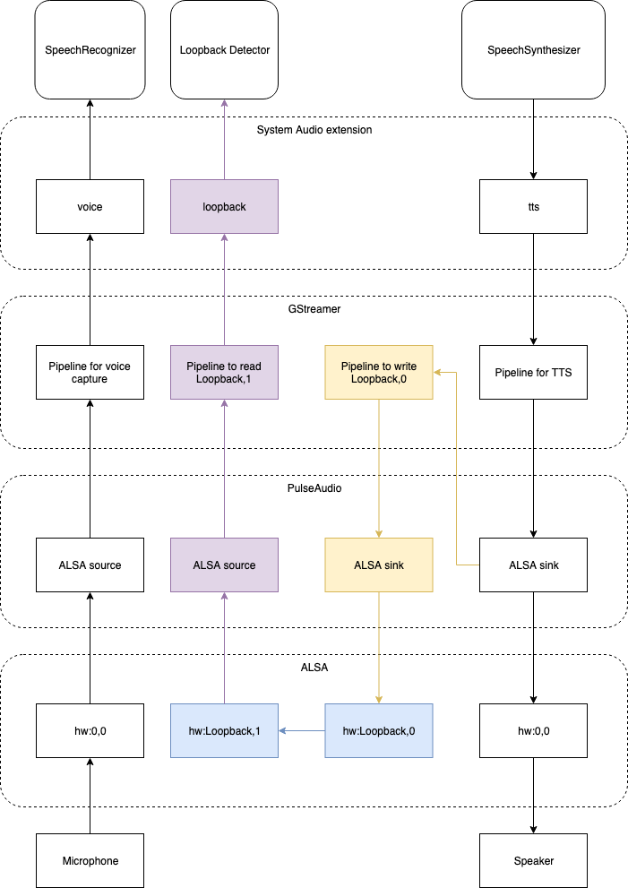

# Loopback Detector Extension

The Alexa Auto SDK Loopback Detector extension enables you to use the Alexa Auto SDK with the AmazonLite wake word to cancel out self references.

**Table of Contents**

* [Overview](#overview)
* [Setting up the Loopback Detector Extension](#setting-up-the-loopback-detector-extension)

## Overview<a id="overview"></a>

In some environments where *acoustic echo cancellation* capabilities are limited, the microphone may pick up the wake word from speakers, which will cause false wake word detection.
 For example, if the user says "Alexa, what's your name?", Alexa responds with "My name is Alexa", which may cause false wake word detection.

The Loopback Detector extension solves this issue by capturing speaker reference "loopback" audio and trying to detect the wake word at the same time.

## Setting up the Loopback Detector Extension <a id="setting-up-the-loopback-detector-extension"></a>

### Prerequisites

Your system must provide:
`aace::audio::AudioInputProvider::AudioInputType::LOOPBACK` type of audio via an `aace::audio::AudioInputProvider` implementation. This audio source should be the final mix of audio output (i.e. speaker reference/monitor).

>**Note:** If you are using the System Audio extension, see the [System Audio extension README](../experimental/system-audio/README.md) for details about how to provide the `LOOPBACK` type of audio.

### Building with the Loopback Detector Extension

To build the Alexa Auto SDK with the Loopback Detector extension, simply include the extension directory path when running the Auto SDK builder:

```
$ builder/build.sh <platform> extensions/loopback-detector
```
### Example Setup in Ubuntu Linux

Here is an example of how to provide loopback type of audio into the Alexa Auto SDK.

You will need the following software running on a Linux system:

* PulseAudio
* GStreamer
* Advanced Linux Sound Architecture (ALSA) `snd_aloop` module

If you are using the [System Audio extension](../experimental/system-audio/README.md), the Auto SDK (and all other applications on Linux) will use PulseAudio to output audio by default. PulseAudio mixes all audio then plays it through a hardware device. We need to capture this "final mix result" into the GStreamer pipeline and pass it through directly into the ALSA loopback device so the Auto SDK can capture this audio. To do this, follow these steps:

1. Make sure the `snd_aloop` module is loaded into kernel by running `sudo modprobe snd_aloop`.
1. Use this command to launch the GStreamer pipeline:
    ```
    gst-launch-1.0 -v autoaudiosrc ! audio/x-raw,format=S16LE,channels=1,rate=16000,layout=interleaved ! audioconvert ! audioresample ! alsasink device=hw:Loopback,0,0
    ```
    
    >**Note:** You need to keep this process throughout the testing.
1. Open the PulseAudio control panel (`pavucontrol`), and go to the **Recording** panel.
1. You will see that the **gst-launch-1.0** process is capturing the audio. Change the audio source to **Monitor of Built-in Audio Analog Stereo**.
1. Set the **SampleApp Record Stream** to **microphone device**.

At this point, all speaker outputs (through PulseAudio) will be eventually routed to the ALSA loopback device.

If you are using the System Audio extension, ensure the `LOOPBACK` type and `loopback` device are configured correctly.

```
"aace.systemAudio": {
  "AudioInputProvider": {
    "devices": {
      "default": {
        "module": "GStreamer"
      },
      "loopback": {
        "module": "GStreamer",
        "card": "hw:Loopback,1,0",
        "shared": true
      }
    },
    "types": {
      "LOOPBACK": "loopback"
    }
  },
  "AudioOutputProvider": {
    "devices": {
      "default": {
        "module": "GStreamer"
      }
    }
  }
}
```

After this, the Auto SDK can capture audio loopback from the `hw:Loopback,1,0` device.

The following diagram illustrates how the audio output data is routed to the Loopback Detector on Linux:

