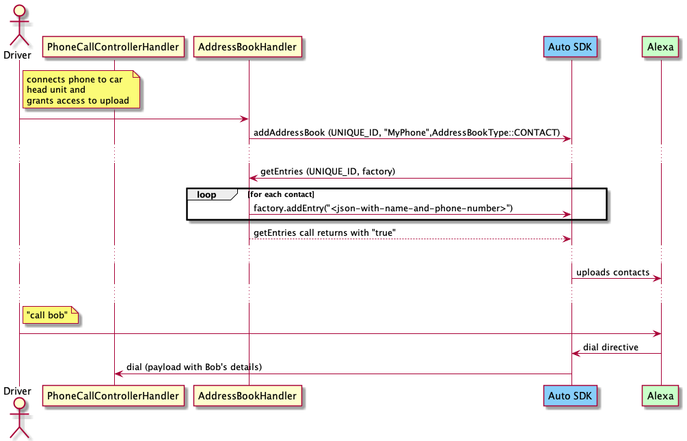
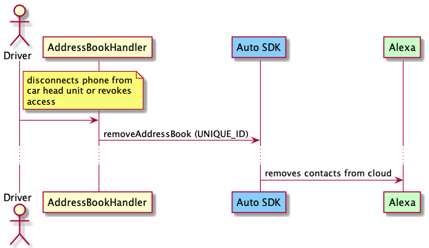
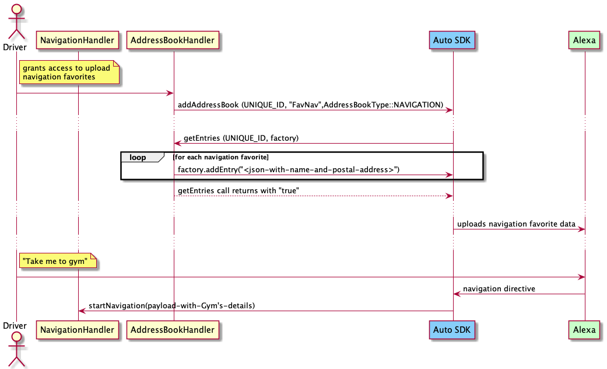
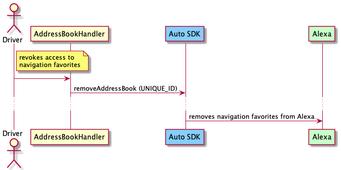

# Address Book Module


The Alexa Auto SDK Address Book module enables a platform implementation to augment the communication and navigation capabilities of Alexa with user data such as phone contacts or navigation favorites ("home", "work", etc.). Using this module, the user can upload their contacts or navigation favorites, or both, so that these capabilities could access them.

> **Note:** To use the Address Book contact and navigation favorites uploading functionality, your product must be placed on the allow list by Amazon. See [Requesting Additional Functionality](../../NEED_HELP.md#requesting-additional-functionality) for details.

**Table of Contents**

* [Overview](#overview)
* [Address Book Sequence Diagrams](#sequence-diagrams)
* [Using the Address Book Module](#using-the-address-book-module)

## Overview<a id="overview"></a>

The Address Book module provides a common platform interface that you can implement to either upload user data to Alexa or allow the local communication and navigation capabilities (supported by the optional Local Voice Control (LVC) module) to access user data for offline use cases. The user can then use Alexa to call contacts by name, be informed of a caller's name, or get directions to favorite destinations.

Both the [Phone Call Controller](../phone-control/README.md) and Alexa-to-Alexa communications implemented via the optional Alexa Communications extension use the phone contacts uploaded via the Address Book module. However, the Contact and Navigation favorites user data are not available for use with any other Alexa devices.

Your platform implementation is responsible for managing the life cycle of an address book, including:

* obtaining consent from end users to allow Alexa to use their data.
* notifying the Alexa Auto SDK Engine when users revoke permission for Alexa to use their data. (This notification ensures that the Engine will remove the user data from Alexa).

> **Important!** Each time an address book becomes unavailable (when the phone is disconnected, for example), your platform implementation must notify the Engine to trigger the deletion of the corresponding address book from Alexa. The platform implementation will notify the Engine to upload the address book when the phone connects again.

### AddressBookType
The AddressBook API defines the type `aace::addressBook::AddressBook::AddressBookType`, which specifies the type of address book to add. The currently supported address book types are:

* `aace::addressBook::AddressBook::AddressBookType::CONTACT` for phone contacts
* `aace::addressBook::AddressBook::AddressBookType::NAVIGATION` for navigation favorites

## Sequence Diagrams<a id = "sequence-diagrams"></a>

The following sequence diagrams provide an overview of how the Address Book module handles uploading and removing contacts and navigation favorites.

### Upload Contacts

This diagram illustrates the sequence for uploading contacts and calling one of the uploaded contacts using voice.



### Remove Contacts

This diagram illustrates the sequence for removing uploaded contacts.



### Upload Navigation Favorites

This diagram illustrates the sequence for uploading navigation favorites and navigating to one of the uploaded destinations using voice.



### Remove Navigation Favorites

This diagram illustrates the sequence for removing uploaded navigation favorites.



## Using the Address Book Module<a id="using-the-address-book-module"></a>

To implement a custom Address Book handler, extend the `AddressBook` class:

```
#include <AACE/AddressBook/AddressBook.h>

class MyAddressBookHandler : public aace::addressBook::AddressBook {

    // The user connected a phone
    addAddressBook(CONTACT_ADDRESS_BOOK_UNIQUE_ID, "MyPhoneBook",
        aace::addressBook::AddressBook::AddressBookType::CONTACT);
    ...
    
    // Ingesting the navigation favorites
    addAddressBook(NAVIGATION_ADDRESS_BOOK_UNIQUE_ID, "MyCarNavFavorites",
        aace::addressBook::AddressBook::AddressBookType::NAVIGATION);
    ...
    
    // Alexa Auto SDK to read the contact entries
    bool getEntries(std::string addressBookSourceId, IAddressBookEntriesFactory factory) {
    
        // For Contacts
        if (addressBookSourceId == CONTACT_ADDRESS_BOOK_UNIQUE_ID) {
            // Using factory, ingest all contacts
            for (auto& contact : ContactsBook) {
                factory.addEntry( 
                    "{
                        \"entryId\": \"UNIQUE_ENTRY_ID\",
                        \"name\": {
                            \"firstName\": \"FirstName\",
                            \"lastName\": \"LastName\",
                            \"nickName\": \"NickName\"        
                        },
                        \"phoneNumbers\": [
                            {
                                \"label\": \"Home\",
                                \"number\": \"1234567890\"
                            },
                            {
                                \"label\": \"Work\",
                                \"number\": \"1231231234\"
                            }
                        ]
                    }"
                );
                ...
            }
    
            // On successful ingestion return true
            return true;
        }
    
        //For Navigation
        else if (addressBookSourceId == NAVIGATION_ADDRESS_BOOK_UNIQUE_ID) {
            // Using factory, ingest all navigation favorites
            for (auto& navigation : NavigationBook) {
                factory.addEntry( 
                    "{
                        \"entryId\": \"UNIQUE_ENTRY_ID\",
                        \"name\": {
                            \"firstName\": \"Home\",        
                        },
                        \"postalAddresses\": [
                            {
                                \"label\": \"Home\",
                                \"addressLine1\": \"123 Address\",
                                \"city\": \"Seattle\",
                                \"stateOrRegion\": \"WA\",          
                                \"postalCode\": \"98109\",
                                \"country\": \"US\",
                                \"latitudeInDegrees\": 47.608,
                                \"longitudeInDegrees\": -122.33,
                                \"accuracyInMeters\": 1
                            }
                        ]
                    }"
                );
                ...
            }
    
            // On successful ingestion return true
            return true;
        }
    }
    ...

    // The user disconnected a phone
    removeAddressBook(CONTACT_ADDRESS_BOOK_UNIQUE_ID);
    ...

    // Navigation Favorites is unavailable
    removeAddressBook(NAVIGATION_ADDRESS_BOOK_UNIQUE_ID);
    ...
}
```

>**Note:** The `label` parameter used for adding phone numbers denotes the phone number type (e.g., Home, Work, Mobile) assigned by the user. If a contact has multiple numbers, Alexa reads out the labels for the user to select the desired number to call. If a number is not associated with a phone number type that Alexa recognizes, Alexa reads out the last four digits of each number.

>**Note:** If a `name` field contains Kanji characters in Japanese, you must also provide the corresponding phonetic field. Without the phonetic field, Alexa may not be able to resolve the name and may respond as if the contact or navigation favorite was not available. For information about how your application provides the phonetic fields, see [AddressBook.h](./platform/include/AACE/AddressBook/AddressBook.h).
