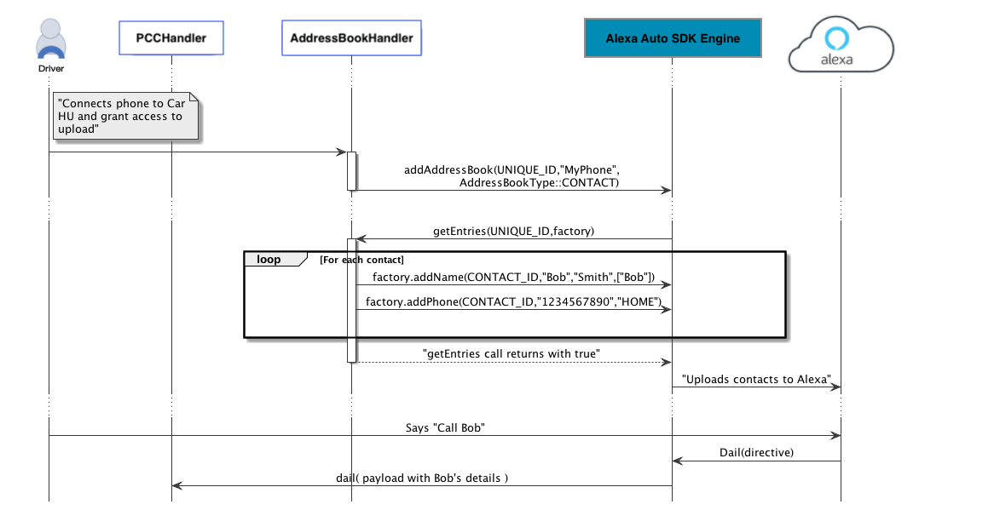
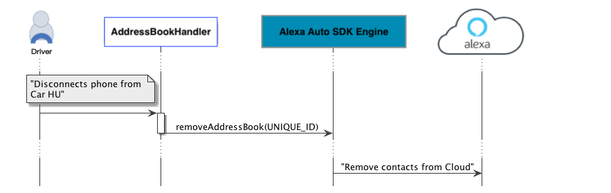
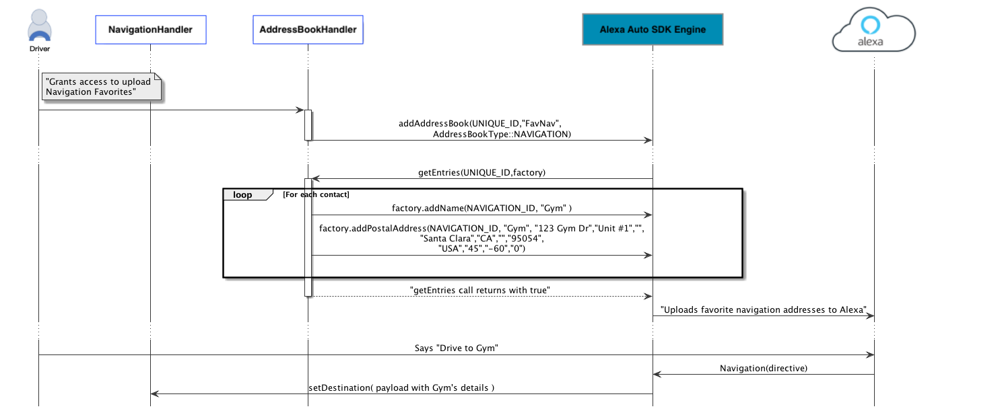
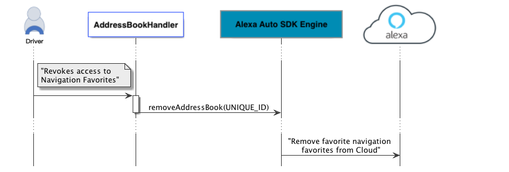

# Address Book Module


The Alexa Auto SDK Address Book module provides the features required by a platform implementation to augment the communications and navigation capabilities of Alexa with user data such as phone contacts and/or navigation favorites ("home", "work", etc.), allowing the user to upload and access phone contacts, or navigation favorites, or both.

**Table of Contents**

* [Overview](#overview)
* [Sequence Diagrams](#sequence-diagrams)
* [Using the Address Book Module](#using-the-address-book-module)

## Overview<a id="overview"></a>
The Address Book module provides a common platform interface that you can implement to either upload user data to the Alexa cloud or allow the local communications and navigation capabilities to access user data for offline use cases (supported by the optional Local Voice Control (LVC) module). The user can then use Alexa to call contacts by name, be informed of a caller's name, or get directions to favorite destinations.

The Contact and Navigation address books are not available for use with any other Alexa devices.

> **Note**: The Address Book module supersedes the [Contact Uploader module](../contact-uploader/README.md), which supports only phone contacts and only online (cloud) use cases. The Contact Uploader module is on the deprecation path beginning with Alexa Auto SDK release 2.0.0, and all new implementations should use the Address Book module instead of the Contact Uploader module.

The platform implementation is responsible for managing the life cycle of an address book, including:

* obtaining consent from end users to allow Alexa to use their data.
* notifying the Alexa Auto SDK Engine when end users revoke permission for Alexa to use their data (this notification ensures that the Alexa Auto SDK Engine will remove the user data from the Alexa cloud).

> **Important!** Each time an address book becomes unavailable (for example, the phone is disconnected), the platform implementation must notify the Alexa Auto SDK Engine to trigger the deletion of the corresponding address book from the Alexa cloud.

### AddressBookType
The AddressBook API defines the type `aace::addressBook::AddressBook::AddressBookType`, which specifies the type of address book to add. The currently supported address book types are:

* `aace::addressBook::AddressBook::AddressBookType::CONTACT` for phone contacts
* `aace::addressBook::AddressBook::AddressBookType::NAVIGATION` for navigation favorites

## Sequence Diagrams<a id ="sequence-diagrams"></a>

The following sequence diagrams provide an overview of how the Address Book module handles uploading and removing contacts and navigation favorites.

### Upload Contacts

This diagram illustrates the sequence for uploading contacts and calling one of the uploaded contacts using voice.



### Remove Contacts

This diagram illustrates the sequence for removing uploaded contacts.



### Upload Navigation Favorites

This diagram illustrates the sequence for uploading navigation favorites and navigating to one of the uploaded destinations using voice.



### Remove Navigation Favorites

This diagram illustrates the sequence for removing uploaded navigation favorites.



## Using the Address Book Module<a id="using-the-address-book-module"></a>

To implement a custom Address Book handler, extend the `AddressBook` class:

```
#include <AACE/AddressBook/AddressBook.h>

class MyAddressBookHandler : public aace::addressBook::AddressBook {

    // The user connected a phone
    addAddressBook( ContactAddressBookUniqueId, "MyPhoneBook",    
    aace::addressBook::AddressBook::AddressBookType::CONTACT );
       ...etc...
    
    // Ingesting the navigation favorites
    addAddressBook( NavigationAddressBookUniqueId, "MyCarNavFavorites", aace::addressBook::AddressBook::AddressBookType::NAVIGATION );
    ...etc...
    
    // Alexa Auto SDK to read the contact entries
    bool getEntries( addressBookSourceId, IAddressBookEntriesFactory factory ) {
    
        // For Contacts
        if ( addressBookSourceId == ContactAddressBookUniqueId ) {
            // Using factory, ingest all contacts data
            foreach( contact : ContactsBook ) {
            factory.addName( <UniqueContactEntryId>, "FirstName", "LastName", "NickName" );
                    factory.addNumber( <UniqueContactEntryId>, "HOME", "1234567890" );
                        ...
            }
    
            // On successful ingestion return true
            return true;
        }
    
        //For Navigation
        else if ( addressBookSourceId == NavigationAddressBookUniqueId ) {
            // Using factory, ingest all navigation favorites data
            foreach( navigation : NavigationBook ) {
                factory.addName( <UniqueNavigationEntryId>, "HOME" );
                factory.addPostalAddress( <UniqueNavigationEntryId>, "HOME", "123 Address", "", "", "Seattle", "WA" 
                            "US", "98109", "US", 47.608, -122.33 , 0  );
                        ...
            }
    
            // On successful ingestion return true
            return true;
        }
    }
    ...etc...

    // The user disconnected a phone
    removeAddressBook( ContactAddressBookUniqueId );
    ...etc...

    // Navigation Favorites is unavailable
    removeAddressBook( NavigationAddressBookUniqueId );
    ...etc...
}
```
