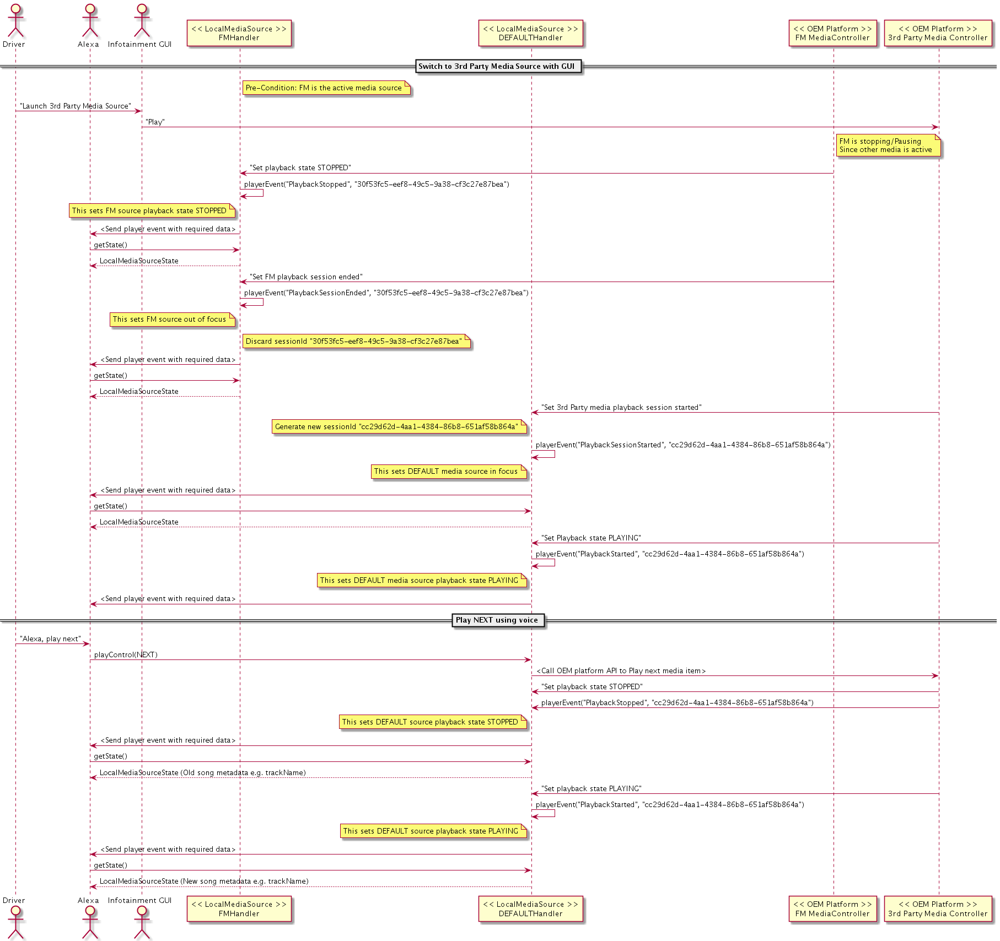

# LocalMediaSource Interface

## Overview

The `LocalMediaSource` interface allows the platform to register a local media source by type (`BLUETOOTH`, `USB`, `AM_RADIO`, `FM_RADIO`, `SATELLITE_RADIO`, `LINE_IN`, `COMPACT_DISC`, `SIRIUS_XM`, `DAB`, and `DEFAULT`). Registering a local media source allows playback control of that source via Alexa (e.g. "Alexa, play the CD player"). It also enables playback initiation via Alexa by frequency, channel, or preset for relevant source types (e.g. "Alexa, play 98.7 FM").

`DEFAULT` media source is a generic media source that can be used for controlling any local media source on the OEM infotainment system. It is recommended to use `DEFAULT` media source for all local media except Alexa music, MACC-supported deep linked media players, and other registered Local Media Sources. `DEFAULT` media player can not be launched by name like "Alexa, Play CD player" but it can be used to control playback actions reported in the [`supportedOperations`](#reporting-playback-state). For example, "Alexa, play" resumes the default player playback as long a the DEFAULT source is in [focus](#reporting-playback-events).

The following is an example of registering a CD player local media source using type `Source.COMPACT_DISC`:


```cpp
// Include necessary message header files:
#include <AASB/Message/Alexa/LocalMediaSource/PlayMessage.h>
using namespace aasb::message::alexa::localMediaSource;

#include <nlohmann/json.hpp>
using json = nlohmann::json;

...

    // Subscribe to corresponding messages with handlers:
    m_messageBroker->subscribe(
        [=](const std::string& message) {
            PlayMessage msg = json::parse(message);
            if (msg.payload.source == Source::COMPACT_DISC) {
                // Handle CD playback
            }
        }, PlayMessage::topic(), PlayMessage::action());
```

## Starting Playback with Content Selection by Voice

The `Play` message is sent when Alexa invokes play by `ContentSelector` type (`FREQUENCY`, `CHANNEL`, `PRESET`) for a radio local media source (`AM_RADIO`, `FM_RADIO`, `SIRIUS_XM`, `DAB`). The `payload` is a string that depends on the `ContentSelector` type and local media `Source` type (e.g., "1", "98.7 FM HD 1").

```cpp
bool play( ContentSelector type, std::string payload, const std::string& sessionId ) override {
    // play initiation for frequency, channel, or presets
    ...
}

    // Subscribe to corresponding messages with handlers:
    m_messageBroker->subscribe(
        [=](const std::string& message) {
            PlayMessage msg = json::parse(message);
            if (msg.payload.source == Source::FM_RADIO) {
                // Handle FM radio playback specified by:
                // - msg.payload.contentSelectorType
                // - msg.payload.payload:
                // - msg.payload.sessionId
            }
        }, PlayMessage::topic(), PlayMessage::action());

```

The table below provides details about the supported `ContentSelector` types based on `Source` type:


| `Source` | Supported `ContentSelector` | `payload` examples
|:---------|:----------------------------|:------------------|
| FM  | FREQUENCY | "105.9" <br> "98.7 HD 1" |
|     | PRESET    |  "2" |
| AM  | FREQUENCY | "1100" <br> "840" |
|     | PRESET    | "1" |
| SXM | CHANNEL   | "22" <br> "70" |
|     | PRESET    | "3"  |
| DAB | CHANNEL   | “BBC Radio Extra 4”
| DEFAULT | PRESET | "5" |

The supported ranges and increments for valid frequency, preset, and channel may vary depending on the region you are in. Contact your partner manager for more detailed information.

>**Note:** The `DAB` channel payload is the radio station name string. If supported, then the name string must be handled by the client's DAB implementation.

The `Play` message will not be sent if a source cannot handle the specified `ContentSelector` type.

The `DEFAULT` `Local Media Source` handles "Alexa, play preset \<number>\" utterances without requiring that users explicitly say which local media source (`AM_RADIO`, `FM_RADIO`, `SIRIUS_XM`) actually corresponds to the preset. The meaning of the preset in the `msg.payload.payload` field is determined by the `DEFAULT` platform implementation and should suit the needs of the vehicle's infotainment system, i.e. when the `Play` message is received, your implementation should map the preset to a preset that makes sense for the current context.

## Controlling Playback by Voice

The `PlayControl` message is sent with a `PlayControlType`(`RESUME`, `PAUSE`, `STOP`, `NEXT`, `PREVIOUS`, `START_OVER`, `FAST_FORWARD`, `REWIND`, `ENABLE_REPEAT_ONE`, `ENABLE_REPEAT`, `DISABLE_REPEAT`, `ENABLE_SHUFFLE`, `DISABLE_SHUFFLE`, `FAVORITE`, `UNFAVORITE`) when Alexa invokes a playback control on the local media source.

```cpp
    PlayControlMessage msg = json::parse(message);
    if (msg.payload.source == m_source) {
        switch (msg.payload.controlType) {
        case PlayControlType::RESUME:
            break;
        case PlayControlType::PAUSE:
            break;
        case PlayControlType::STOP:
            break;
        default:
            break;
        }
    }
```

>**Note:** The `Play` message is used to initiate playback with specified content selection, whereas `PlayControl` message with `PlayControlType::RESUME` is used to play or resume the source when content is not specified or not supported. E.g. FM receives `Play` message when the user requests FM with a specific frequency ("Alexa, play 98.7 FM radio"), and USB receives `PlayControl` message with `PlayControlType::RESUME` when the user requests playback with just the source name ("Alexa, play USB").

The `Seek` message and `AdjustSeek` message are sent to seek the currently focused `LocalMediaSource`. These messages are only used by sources that are capable of seeking. `Seek` message is for specifying an absolute offset, whereas `AdjustSeek` message is for specifying a relative offset.

The `VolumeChanged` message and `MutedStateChanged` message are sent to change the volume and mute state of the currently focused local media player. `VolumeChanged` message specifies the new volume. `MutedStateChanged` message specifies the new `MutedState`.

## Reporting Playback Events

The `LocalMediaSource` interface provides `PlayerEvent` message and `PlayerError` message for your implementation to report events regarding the state of the playback session managed by your local source. Even though your local source manages its own playback, including reacting to on-device transport control button presses from the user and reacting appropriately to other non-Alexa audio events on the system, sending  `PlayerEvent` message and `PlayerError` message provides important information to the Engine:

1. The Engine may use these messages to synchronize the state of your local source's playback session with Alexa.

2. The Engine may react to these calls according to the event name specified to update its internal view of your local source's state. Particular event names indicate if the source is focused on the system (meaning it has an active playback session) or if it is un-focused (meaning it is not in use and is brought into use only by further on-device interaction by the user or a user voice request to Alexa). The Engine uses this information to sync its internal focus management.

| PlayerEvent name | Description |
|:--|:--|
| "PlaybackSessionStarted" |  The local media source is switched from the inactive to active media state or a new playback session has started, either from a GUI interaction or as a result of a user voice request to Alexa. The Engine considers the player active and in focus (although it may or may not yet be playing).|
| "PlaybackSessionEnded" |  The local media source is switched from the active to inactive media state or an active playback session has ended. The player should no longer be playing or playable until a new session is started by GUI interaction or user voice request to Alexa. The Engine considers the player inactive and no longer in focus.|
| "PlaybackStarted" |  During an active session, the local source has started to play or resumed from a paused state. |
| "PlaybackStopped" | During an active session, the player stopped, either as a result of a GUI interaction or a user voice request to Alexa. |

| PlayerError name | Description |
|:--|:--|
| "INTERNAL\_ERROR" | During an active session, an internal error caused playback to stop.

Both `PlayerEvent` message and `PlayerError` message are expected to provide the appropriate sessionId.

Send `PlayerEventMessage{"PlaybackSessionStarted", sessionId}` to tell the Engine that the user brought the `LocalMediaSource` to the foreground with a GUI interaction. The Engine considers the source to have an active playback session, although it may or may not be playing yet. If no other Alexa media source is playing, utterances such as “Alexa, play” target this source. You must also send `PlayerEventMessage{"PlaybackSessionStarted", sessionId}` when the source is brought into the foreground after receiving `Player` message or `PlayerControl` message as a result of a user voice request. Once the source starts playing, send `PlayerEvent{"PlaybackStarted", sessionId}`.

Send `PlayerEventMessage{"PlaybackSessionEnded", sessionId}` to tell the Engine that the `LocalMediaSource` is no longer in the foreground, typically as a result of a GUI interaction from the user after the player is stopped. The Engine considers the source inactive or not in focus, and starting a new playback session for the source requires a further GUI interaction or user voice request to Alexa that targets the source by name.

```cpp
    void setAlexaFocusForFMRadio(bool isFocused) {
        if (isFocused) {
    	    // FM Radio begins playback independently of Alexa
       	    playerEvent("PlaybackSessionStarted", m_sessionId);
        } else {
            ...
     	    // Notify Alexa that FM Radio is no longer the active media source on the device as a result of platform driven change
       	    playerEvent("PlaybackSessionEnded", m_sessionId);
        }
    }

    void playerEvent(const std::string& eventName, const std::string& sessionId) {
        PlayerEventMessage msg;
        msg.payload.source = m_source;
        msg.payload.eventName = eventName;
        msg.payload.sessionId = sessionId;
        m_messageBroker->publish(msg);
    }
```

>**Note:** Only one `LocalMediaSource` type can have Alexa focus at a time.

>**Note:** `SetFocus` message is deprecated for the `LocalMediaSource` interface. Use `PlayerEvent` message with `"PlaybackSessionStarted"` or `"PlaybackSessionEnded"` instead.

Please abide by following rules related to `sessionId` in your `LocalMediaSource` integration:

- `sessionId` is a universally unique identifier (UUID) generated according to the RFC 4122 specification.

- If a media source starts because of a call to `PlayMessage{contentSelector, payload, sessionId}` from the Engine, note the `sessionId` field and use it in any `PlayerEvent` message calls until the session is inactive.

- If a media source starts for any other reason (e.g. a call to `PlayControlMessage{RESUME}` from the Engine, or user GUI interaction on the head unit), create a new `sessionId` and use it in any `PlayerEvent` message calls until the session is inactive.

- A `sessionId` is always associated with one media source playback session, so `USB`'s `sessionId` should be different than `COMPACT_DISC`'s `sessionId`.

- An individual `LocalMediaSource` should maintain the `sessionId` for the whole cycle from playback session start to playback session end.

- For any "opening" `PlayerEvent` message call for a particular `sessionId` (e.g. `"PlaybackSessionStarted"`, `"PlaybackStarted"`), you must report a corresponding closing call (e.g. `"PlaybackStopped"`, `"PlaybackSessionEnded"`) at the appropriate time (i.e., when the source is stopped, switched, etc.)

## Reporting Playback State

The Engine sends `GetState` message to synchronize the local player's state with the cloud. This method is used to maintain correct state during startup and with every Alexa request. All relevant information should be added to the `LocalMediaSourceState` in the reply message.

Many fields of the `LocalMediaSourceState` are not required for local media source players. You should omit these as noted below.

The following table describes the fields comprising a `LocalMediaSourceState`, which includes two sub-components: `PlaybackState` and `SessionState`.

| State        | Type           | Required | Notes  |
| :------------- |:-------------| :-----| :-----|
| **PlaybackState**      |
| state      | String        |  Yes | "IDLE"/"STOPPED"/"PLAYING" |
| supportedOperations | SupportedPlaybackOperation[] | Yes | see SupportedPlaybackOperation |
| trackOffset      | long  |  No | optional |
| shuffleEnabled      | boolean       |   No | optional |
| repeatEnabled      | boolean       |   No | optional |
| favorites      | Favorites  |   No  | see Favorites |
| type      | String  |   Yes | must be set to "ExternalMediaPlayerMusicItem" |
| playbackSource      | String       |  No | If available else use local player name |
| playbackSourceId      | String  |   No | optional |
| trackName      | String   | No | If available else use local player name |
| trackId      | String    | No |  empty |
| trackNumber      | String   | No | optional |
| artistName      | String    | No | optional |
| artistId      | String   | No |  empty |
| albumName      | String |  No | optional |
| albumId      | String |  No | empty |
| tinyURL      | String | No | optional |
| smallURL      | String | No |  optional |
| mediumURL      | String | No |  optional |
| largeURL      | String | No |  optional |
| coverId      | String  | No |  empty |
| mediaProvider      | String  | No | optional |
| mediaType      | MediaType | No |  see MediaType |
| duration      | long  | No |  optional |
| **SessionsState** |
| endpointId      | String  | No |  empty |
| loggedIn      | boolean  |  No | empty |
| userName      | String  | No |  empty |
| isGuest      | boolean  | No |  empty |
| launched      | boolean  |  Yes | true if the source is enabled, false otherwise |
| active      | boolean  | No |  empty |
| accessToken      | String  | No |  empty |
| tokenRefreshInterval      | long  | No |  empty |
| supportedContentSelectors      | ContentSelector[]  | No | see ContentSelector |
| spiVersion      | String  |  Yes | must be "1.0"  |

`supportedOperations` should list the operations that the local media source supports. Below is a list of all `SupportedPlaybackOperation`:

```
LocalMediaSource::SupportedPlaybackOperation::PLAY,
LocalMediaSource::SupportedPlaybackOperation::PAUSE,
LocalMediaSource::SupportedPlaybackOperation::STOP,
LocalMediaSource::SupportedPlaybackOperation::PREVIOUS,
LocalMediaSource::SupportedPlaybackOperation::NEXT,
LocalMediaSource::SupportedPlaybackOperation::ENABLE_SHUFFLE,
LocalMediaSource::SupportedPlaybackOperation::DISABLE_SHUFFLE,
LocalMediaSource::SupportedPlaybackOperation::ENABLE_REPEAT_ONE,
LocalMediaSource::SupportedPlaybackOperation::ENABLE_REPEAT,
LocalMediaSource::SupportedPlaybackOperation::DISABLE_REPEAT,
LocalMediaSource::SupportedPlaybackOperation::SEEK,
LocalMediaSource::SupportedPlaybackOperation::ADJUST_SEEK,
LocalMediaSource::SupportedPlaybackOperation::FAVORITE,
LocalMediaSource::SupportedPlaybackOperation::UNFAVORITE,
LocalMediaSource::SupportedPlaybackOperation::FAST_FORWARD,
LocalMediaSource::SupportedPlaybackOperation::REWIND,
LocalMediaSource::SupportedPlaybackOperation::START_OVER
```
>**Note:** Currently PLAY/PAUSE/STOP are always supported for a source. Passing null allows ALL supported operations for the source.


`supportedContentSelectors` should list the content selection types the local source can support. Below is a table of valid pairs.

| Source | Supportable `ContentSelector` Values |
|:---|:---|
| `AM_RADIO` |  `PRESET`, `FREQUENCY` |
| `FM_RADIO` |  `PRESET`, `FREQUENCY` |
| `SIRIUS_XM` |  `PRESET`, `CHANNEL` |
| `DEFAULT` |  `PRESET` |


`launched` specifies whether the source is enabled. The player is disabled for use with Alexa when this value is false, such as when a removable source like USB is disconnected.

## Example Sequence Diagrams

The following diagrams show examples of Local Media Source usage:

**1. Starting FM by voice**


**2. Switching from FM to DEFAULT media source with GUI**


**3. Switching between different DEFAULT sources**

