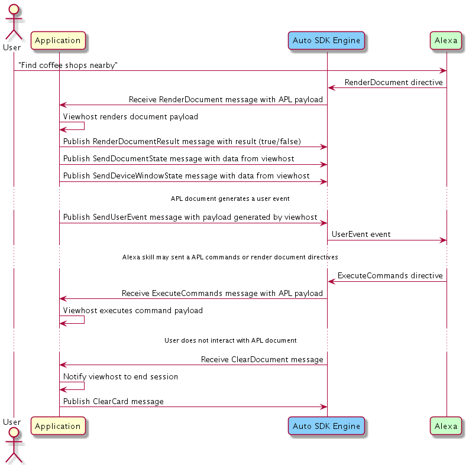

# Alexa Presentation Language (APL) Module

## Overview <a id="overview"></a>

The `Alexa Presentation Language (APL)` module enables your Alexa Auto SDK client application to use visual capabilities of Alexa. By using this module in your application, you enable your device to receive visual experiences from certified Alexa Skills that support APL. Additionally, this modules provides messages for reporting the driving state of the vehicle, the day/night mode, and theme id. All of those properties affect how APL is rendered in the vehicle. Support for three new Alexa Automotive viewport profiles is now available.  

[APL directives](https://developer.amazon.com/en-US/docs/alexa/alexa-presentation-language/apl-interface.html) from the Alexa Voice Service (AVS) contain metadata needed to render Alexa's visual responses for devices with a graphical user interface (GUI). The lifecycle of an APL document includes sending events, providing document and window state, and more. For more information about APL, see the [APL documentation](https://developer.amazon.com/en-US/docs/alexa/alexa-presentation-language/understand-apl.html).

>**Note:** The APL module doesn't render APL documents; it provides the conduit to render APL documents and process user events from the GUI or voice user interface (VUI). APL rendering is available separately for Android platforms.

### Automotive Viewport Profiles <a id="automotive-viewport-profiles"></a>
APL supports various types of [viewport profiles](https://developer.amazon.com/en-US/docs/alexa/alexa-presentation-language/apl-alexa-viewport-profiles-package.html) for different types of devices and screen sizes. There are three new viewport profiles specifically added for vehicles: auto extra small, auto small and auto medium. Please refer to the [viewport profile](https://developer.amazon.com/en-US/docs/alexa/alexa-presentation-language/apl-alexa-viewport-profiles-package.html) documentation for specific sizes and configuration information.

### Vehicle Driving State <a id="vehicle-driving-state"></a>

The vehicle driving state describes the motion state of the vehicle. The two supported values are `moving` and `parked`. Setting the appropriate driving state helps make visual experiences safer in the vehicle. When the vehicle is `parked`, APL experiences may contain more visual elements. When the vehicle is `moving`, some visual elements may be hidden to reduce cognitive load on the driver and make the experience safer. Video will automatically be disabled when the vehicle is `moving`.

### Day and Night Mode <a id="day-and-night-mode"></a>

Day and night mode provide a way to render APL experiences in different contrasts based on the ambient light conditions of the vehicle. During the day when more light is available, the APL experience will typically be rendered with a light background and dark font. During the night or when travelling through a tunnel, the APL experience will be rendered with a dark background and light font.

### Automotive Themes <a id="automotive-themes"></a> 

Automotive themes allow the OEM to customize some aspects of the APL experience such as background and font color. Themes have predefined color values and affect supported [Alexa Responsive Templates](https://developer.amazon.com/en-US/docs/alexa/alexa-presentation-language/responsive-templates.html). This can help make the APL experience match more closely to the look and feel of the native UI in the head unit. There are a total of six available themes that include three for day mode and three for night mode. Day mode includes a default theme, and two additional themes with values `gray1` and `gray2`. Night mode includes a default theme, and two additional themes with values `black` and `gray`. The OEM application must ensure that a valid theme is set for day and night modes. The theme is optional, and in the case that it is not provided then the default theme is used.

### Supported APL Experiences <a id="supported-apl-experiences"></a> 

Only APL experiences that have been certified for Automotive devices will be allowed to send APL directives. We are working to provide a process for skill developers to support automotive devices. More information will be provided in the [online documentation](https://developer.amazon.com/en-US/docs/alexa/alexa-auto/about-this-guide.html). Contact your Amazon Solutions Architect (SA) or Partner Manager for more information about what Alexa domains and skills support APL in the vehicle.

### APL Viewhost <a id="apl-viewhost"></a>

The [viewhost](https://github.com/alexa/apl-core-library#view-host-guide) is a software component responsible for rendering the APL payload on screen. The Auto SDK provides a native Android viewhost solution. Contact your Amazon Solutions Architect (SA) or Partner Manager for more information.
 
### Template Runtime <a id="template-runtime"></a>

APL and Template Runtime both provide visual experiences. The Auto SDK supports both capabilities on the vehicle. Alexa skills typically give APL preference if both capabilities are reported, and will return APL directives. The new Auto SDK audio ducking feature is necessary for Template Runtime render player info cards and APL cards to be active at the same time.
## Configuring the APL Module <a id="configuring-the-apl-module"></a>

The APL module can be optionally configured with the following Engine setting:

```
{
  "alexaPresentationCapabilityAgent": {
     "displayDocumentInteractionIdleTimeout": <TIMEOUT_IN_MS>
  }
}
```

>**Note:** The default value for the configuration timeout is 30 seconds.

## Using the APL AASB Messages <a id="using-the-apl-aasb-message"></a>

### General APL Message 

When a user interacts with an APL enabled Alexa skill, the Engine publishes the [`RenderDocument` message](https://alexa.github.io/alexa-auto-sdk/docs/aasb/apl/APL/index.html#renderdocument). It is the responsibility of the application to integrate a viewhost capable of rendering APL documents. During the APL lifecyle, there will be context information (such as document and window state) as well as user events generated by interaction with the rendered APL document. The skill can send additional directives, which must be forwarded to the viewhost.

This diagram illustrates the sequence of interacting with an APL enabled Alexa skill.

<details markdown="1">
<summary>Click to expand or collapse sequence diagram: General APL Directive Flow</summary>
<br></br>


</details>

</br>

### Set Platform Property Message 

This diagram illustrates the sequence of setting platform properties for APL.

<details markdown="1">
<summary>Click to expand or collapse sequence diagram: Setting platform properties</summary>
<br></br>


</details>

</br>


## Integrating the APL Module Into Your Application <a id="integrating-the-apl-module-into-your-application"></a>

The Auto SDK provides out of the box support for APL through the Alexa Auto Client Service (AACS). However, you can use the Engine's `MessageBroker` to subscribe to and publish *"APL"* AASB messages.

<details markdown="1">
<summary>Click to expand or collapse C++ sample code</summary>
<br>

```
#include <AACE/Core/MessageBroker.h>

#include <AASB/Message/APL/APL/ActivityEvent.h>
#include <AASB/Message/APL/APL/ClearAllExecuteCommandsMessage.h>
#include <AASB/Message/APL/APL/ClearCardMessage.h>
#include <AASB/Message/APL/APL/ClearDocumentMessage.h>
#include <AASB/Message/APL/APL/DataSourceUpdateMessage.h>
#include <AASB/Message/APL/APL/ExecuteCommandsMessage.h>
#include <AASB/Message/APL/APL/ExecuteCommandsResultMessage.h>
#include <AASB/Message/APL/APL/InterruptCommandSequenceMessage.h>
#include <AASB/Message/APL/APL/ProcessActivityEventMessage.h>
#include <AASB/Message/APL/APL/RenderDocumentMessage.h>
#include <AASB/Message/APL/APL/RenderDocumentResultMessage.h>
#include <AASB/Message/APL/APL/SendDataSourceFetchRequestEventMessage.h>
#include <AASB/Message/APL/APL/SendDeviceWindowStateMessage.h>
#include <AASB/Message/APL/APL/SendRuntimeErrorEventMessage.h>
#include <AASB/Message/APL/APL/SendUserEventMessage.h>
#include <AASB/Message/APL/APL/SendDocumentStateMessage.h>
#include <AASB/Message/APL/APL/SetAPLMaxVersionMessage.h>
#include <AASB/Message/APL/APL/SetDocumentIdleTimeoutMessage.h>
#include <AASB/Message/APL/APL/SetPlatformPropertyMessage.h>
#include <AASB/Message/APL/APL/UpdateAPLRuntimePropertiesMessage.h>

#include <nlohmann/json.hpp>
using json = nlohmann::json;

class MyAPLHandler {

    // Subscribe to messages from the Engine
    void MyAPLHandler::subscribeToAASBMessages() {
    m_messageBroker->subscribe(
        [=](const std::string& message) { handleRenderDocumentMessage(message); },
        RenderDocumentMessage::topic(),
        RenderDocumentMessage::action());

    ...

    // Handle the RenderDocument message from the Engine
    void MyAPLHandler::handleRenderDocumentMessage(const std::string& message) {
        RenderDocumentMessage msg = json::parse(message);
        std::string payload = msg.payload.payload;
        std::string token = msg.payload.token;

        // ...Pass data to viewhost for rendering... 
    }
```

</details>

## Registering an APL Handler <a id="registering-an-apl-handler"></a>

To implement a custom handler for APL, extend the `aace::apl::APL` class as follows:

```
class APLHandler : public aace::apl::APL {
public:
    APLHandler();
    void renderDocument(const std::string& jsonPayload, const std::string& token, const std::string& windowId) override;
    void clearDocument(const std::string& token) override;
    void executeCommands(const std::string& jsonPayload, const std::string& token) override;
    void interruptCommandSequence(const std::string& token) override;
    void dataSourceUpdate(const std::string& sourceType, const std::string& jsonPayload, const std::string& token) override;
};
```
### Android Integration <a id="android-integration"></a>

The Alexa Auto Client Service (AACS) provides the AACS APL Renderer component to integrate the Auto SDK `APL` module on Android. See the AACS APL Renderer documentation for more information.

## Visual Characteristics <a id="visual-characteristics"></a>

The APL module requires that the platform implementation define the visual characteristics of the device. Visual characteristics are passed directly to the Smart Screen SDK, and therefore have the format described in the [Alexa Smart Screen SDK documentation](https://github.com/alexa/alexa-smart-screen-sdk/blob/master/modules/GUI/config/SmartScreenSDKConfig.md#visual-characteristics-parameters).

Include the `visualCharacteristics` configuration in the JSON object `aace.alexa/avsDeviceSDK/gui` as shown in the following example. You can pass the configuration to the Engine using a `StreamConfiguration` or `ConfigurationFile` object.

```json
{
    "aace.alexa": {
        "avsDeviceSDK": {
            "gui": {
                "visualCharacteristics": [
                    {
                        "type": "AlexaInterface",
                        "interface": "Alexa.InteractionMode",
                        "version": "1.1",
                        "configurations": {
                            "interactionModes": [
                                {
                                    "id": "apl-interaction-id",
                                    "uiMode": "AUTO",
                                    "interactionDistance": {
                                        "unit": "INCHES",
                                        "value": 24
                                    },
                                    "touch": "SUPPORTED",
                                    "keyboard": "SUPPORTED",
                                    "video": "SUPPORTED",
                                    "dialog": "SUPPORTED"
                                }
                            ]
                        }
                    },
                    {
                        "type": "AlexaInterface",
                        "interface": "Alexa.Presentation.APL.Video",
                        "version": "1.0",
                        "configurations": {
                            "video": {
                                "codecs": [
                                    "H_264_42",
                                    "H_264_41"
                                ]
                            }
                        }
                    },
                    {
                        "type": "AlexaInterface",
                        "interface": "Alexa.Display.Window",
                        "version": "1.0",
                        "configurations": {
                            "templates": [
                                {
                                    "id": "apl-window-id",
                                    "type": "STANDARD",
                                    "configuration": {
                                        "sizes": [
                                            {
                                                "type": "DISCRETE",
                                                "id": "window-size-id",
                                                "value": {
                                                    "unit": "PIXEL",
                                                    "value": {
                                                        "width": 1280,
                                                        "height": 720
                                                    }
                                                }
                                            }
                                        ],
                                        "interactionModes": [
                                            "apl-interaction-id"
                                        ]
                                    }
                                }
                            ]
                        }
                    },
                    {
                        "type": "AlexaInterface",
                        "interface": "Alexa.Display",
                        "version": "1.0",
                        "configurations": {
                            "display": {
                                "type": "PIXEL",
                                "touch": [
                                    "UNSUPPORTED"
                                ],
                                "shape": "RECTANGLE",
                                "dimensions": {
                                    "resolution": {
                                        "unit": "PIXEL",
                                        "value": {
                                            "width": 2048,
                                            "height": 1536
                                        }
                                    },
                                    "physicalSize": {
                                        "unit": "INCHES",
                                        "value": {
                                            "width": 8.9,
                                            "height": 6.05
                                        }
                                    },
                                    "pixelDensity": {
                                        "unit": "DPI",
                                        "value": 288
                                    },
                                    "densityIndependentResolution": {
                                        "unit": "DP",
                                        "value": {
                                            "width": 2048,
                                            "height": 1536
                                        }
                                    }
                                }
                            }
                        }
                    }
                ]
            }
        }
    }
}
```