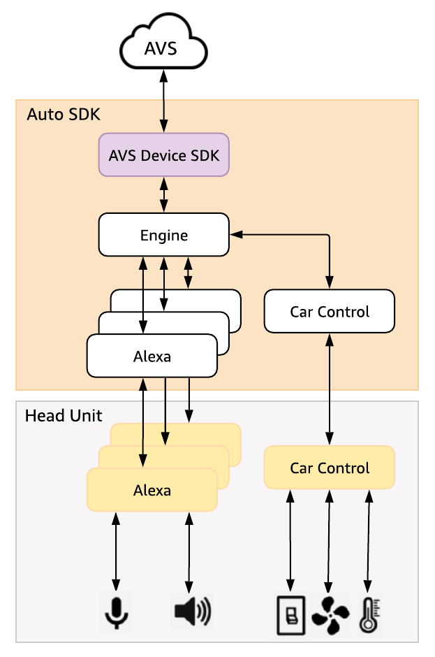

# Car Control Module

The Alexa Auto SDK Car Control module enables you to build a custom experience that allows users to use Alexa to voice-control vehicle features.

**Table of Contents:**

* [Conceptual Overview](#conceptual-overview)
    * [Endpoints](#endpoints-overview)
    * [Capabilities](#capabilities-overview)
    * [Zones](#zones-overview)
    * [Assets](#assets-overview)
* [Configuring the Car Control Module](#configuring-the-car-control-module)
    * [Configuration Schema Overview](#config-schema)
    * [Power Controller Capability Configuration](#power-controller-config)
    * [Toggle Controller Capability Configuration](#toggle-controller-config)
    * [Mode Controller Capability Configuration](#mode-controller-config)
    * [Range Controller Capability Configuration](#range-controller-config)
    * [Additional Notes about Assets](#additional-notes-assets)
    * [Sample Configuration](#sample-config)
* [Implementing the Car Control Platform Interface](#implementing-platform-interface)

## Conceptual Overview <a id ="conceptual-overview"></a>

### Endpoints <a id ="endpoints-overview"></a>

The head unit device acting as an Alexa Auto SDK client is an "endpoint" that connects to the Alexa service. Other Auto SDK modules, such as [Alexa](../alexa/README.md), configure capabilities on this "root" or "default" endpoint because the capabilities pertain to the head unit itself. The Car Control module enables the default Auto SDK client endpoint to act as a proxy to receive events and directives on behalf of connected endpoints. You can configure a separate endpoint for every vehicle component that the head unit can control through device-level connections. This enables the user to target individual vehicle components directly with utterances like "Alexa, turn on the AC" or "Alexa, set the temperature to 65."

### Capabilities <a id ="capabilities-overview"></a>

In the utterance "Alexa, turn on the AC", "turn on" corresponds to a specific capability configured for the "AC" endpoint. Defining an endpoint declares a vehicle feature to be controllable, and defining capabilities on the endpoint declares *how* the endpoint can be controlled. 

Car Control supports four capability interfaces that can be declared alone or in combination for a particular endpoint to model its individual control experience:

* **Power Controller** controls the overall power state of an endpoint. For example, configuring an "AC" endpoint with a Power Controller capability enables utterances such as "Alexa, turn on the AC" and "Alexa, power off the AC".
* **Toggle Controller** controls a particular named property of an endpoint that can be turned on and off. For example, configuring a "windshield" endpoint with a "defroster" Toggle Controller capability instance enables utterances such as "Alexa, turn on the windshield defroster." 
* **Mode Controller** controls a particular named property of an endpoint that can be set to a discrete value from a defined set of values. For example, if an ambient light endpoint has red and green color settings, configuring an "ambient light" endpoint with a "color" Mode Controller capability instance enables utterances such as "Alexa, set the ambient light color to red" and "Alexa, change the ambient light to green."
* **Range Controller** controls a particular named property of an endpoint that can be set to a numeric value within a range. For example, if a fan endpoint has a speed property with settings 1 through 3, configuring a "fan" endpoint with a "speed" Range Controller capability instance enables utterances such as "Alexa, set the fan speed to 2." You can configure names, such as "medium", for a range value to enable additional utterances such as "Alexa, set the fan to medium" to set the fan speed setting to 2. 

#### Capability Primitives and Semantic Annotations <a id ="primitives-semantics"></a>
Toggle Controller, Mode Controller, and Range Controller are known as "capability primitives." You can use multiple instances of the same capability primitive interface on an endpoint under different instance names. For example, a heater endpoint might have intensity and position properties that are both best modeled as modes. You can declare an "intensity" Mode Controller instance and a "position" Mode Controller instance on the same "heater" endpoint so the user can target each property separately. 

To provide intuitive experiences for users, capability primitives offer "semantic annotations" for the devices to map specific utterances to the behaviors of capability instances. For example, if the vehicle uses a Range Controller to control a window, a user would prefer to say "Alexa, open the window" over the default utterances of the Range Controller such as "Alexa, set the window height to 0". For any endpoint to which the "open", "close", "raise", or "lower" concepts apply, you can configure the capability primitive instances of the endpoint with a "semantics" object that maps user utterances for these actions to the appropriate capability directives. Each action (e.g., "open") is allowed only once per endpoint since the action expresses intent to control the endpoint as a whole.

The actions specified in configuration are action IDs rather than literal strings, which ensures Alexa recognizes all synonyms and translations for the action in the user utterance. The supported actions are "Alexa.Actions.Open", "Alexa.Actions.Close", "Alexa.Actions.Raise", and "Alexa.Actions.Lower."
    
### Zones <a id ="zones-overview"></a>

Each endpoint can belong to zero, one, or many "zones." Zones, configured with member endpoints, define named regions of the vehicle and allow users to target endpoints by location. Zones are essential for unambiguous targeting of endpoints that have friendly names that overlap with other endpoints. For example, defining "driver" and "passenger" zones and assigning distinct "seat" endpoints to each allows proper control of the "driver seat" and the "passenger seat" independently. 

Assigning one zone in particular as the "default" enables endpoints in this zone to take precedence over endpoints sharing the same friendly name but not in the default zone when the user does not specify a zone in the utterance. This is useful for distinguishing "zoneless" endpoints from "zoned" endpoints with the same name when it is most likely that the user intends to target the "zoneless" one. For example, consider a vehicle with zone IDs "zone.all", "zone.rear", and "zone.left" with a distinct fan endpoint in each zone. If the user says "Alexa, turn on the fan", it is most likely that he wants to turn on the fan that refers to the vehicle as a whole because there is no natural way to specify its location. You can ensure that Alexa will resolve this utterance to the fan in the "all" zone by assigning "zone.all" as the default zone.

Additionally, the default zone is useful for cases in which you have zoned endpoints with overlapping names, but one of the endpoints is a clear "default" to the user. For example, consider a vehicle with zones "zone.all" (assigned as default), "zone.driver", and "zone.passenger". The vehicle has a "driver window" in "zone.driver" and a "passenger window" in "zone.passenger", but Alexa cannot resolve which endpoint is the intended target of the user utterance "Alexa, open the window." However, the user probably means "Alexa, open the *driver* window". You can ensure that Alexa considers the "driver window" as the "default" window by assigning it to "zone.all" as well.

### Assets <a id ="assets-overview"></a>

The definitions of endpoints, capabilities, and zones include "assets." Assets, identified by unique IDs, group a voice-accessible friendly name like "air conditioner" into a named group of synonyms and translations for all supported languages. For example, using the asset with ID "Alexa.Automotive.DeviceName.AirConditioner" in your car control module configuration for an AC endpoint not only enables the user to target the air conditioner with the default phrase "air conditioner", but also with phrases like "air con" and "AC" in English as well as synonyms in other supported locales.

Using assets allows decoupling the many ways of identifying components from the core configuration of the components and enables de-duplication across different components that have overlapping ways to be identified.

The Alexa Auto SDK provides a list of IDs for the "default assets." The default assets comprise an automotive-specific catalog of asset definitions for supported features (including endpoint names, zone names, and capability settings) for car control. The automotive catalog of assets uses IDs with prefix "Alexa.Automotive." You can use these asset IDs in your car control module configuration without the corresponding definitions of friendly names, synonyms, and translations because the definitions are specified internally.

### Summary 

By combining these elements, you can build a [Car Control module configuration](#configuring-the-car-control-module), which the Auto SDK Engine uses to advertise the features available in the vehicle to Alexa, and implement the corresponding [platform interface](#implementing-platform-interface) to map the directives from a user's voice request to the intended target feature.


### Car Control Module Architecture <a id ="car-control-architecture"></a>

The following diagram illustrates the high-level Car Control module architecture:

<p align="center">

</p>

* The Auto SDK Car Control module uses the Car Control configuration and assets to build the infrastructure necessary to operate.
* Car control directives are sent to the Car Control module from the Alexa cloud.

### Car Control Sequence Diagram

The following diagram illustrates a sample car control sequence based on the utterance "Alexa, set the temperature to 70":

<p align="center">

</p>


## Configuring the Car Control Module <a id="configuring-the-car-control-module"></a>
Car control module configuration is vehicle-specific and tells the Auto SDK Engine which vehicle features to advertise to Alexa for control by the user. You must configure the Auto SDK Engine with an `EngineConfiguration` object that describes the vehicle. Like all Auto SDK Engine configuration, you can either define the JSON in a file and construct an `EngineConfiguration` from that file, or you can use the provided `CarControlConfiguration` class to programmatically construct the `EngineConfiguration` in the proper format. The following subsections describe the JSON schema. See the [aace::carControl::config::CarControlConfiguration](../car-control/platform/include/AACE/CarControl/CarControlConfiguration.h) class for details on how to build configuration programmatically.

### Configuration Schema Overview <a id="config-schema"></a>
The `EngineConfiguration` for the Car Control module includes definitions of endpoints with their capabilities, zones with their member endpoints, and an optional path to a JSON file defining additional assets.

**Sample JSON Object**

```jsonc
{
    "aace.carControl": {
        "endpoints": [
            {
                "endpointId": "{{STRING}}",
                "endpointResources": {
                    "friendlyNames": [
                        {
                            "@type": "asset",
                            "value": {
                                "assetId": "{{STRING}}"
                            }
                        },
                        ...
                    ]
                },
                "capabilities": [
                    // list of capability definitions for this endpoint
                ]
            }
        ],
        "zones": [
            {
                "zoneID": "{{STRING}}",
                "zoneResources": {
                    "friendlyNames": [
                        {
                            "@type": "asset",
                            "value": {
                                "assetId": "{{STRING}}"
                            }
                        }
                    ]
                },
                "members": [
                    {
                        "endpointId": "{{STRING}}"
                    }
                ]
            }
        ],
        "defaultZoneID": "{{STRING}}",
        "assets": {
            "customAssetsPath": "{{STRING}}"
        },
    }
}
```

**Object Parameters**

| Property | Type | Required | Description |
|-|-|-|-|
| aace.carControl.<br>endpoints | list | Yes | The list of connected endpoints for which the device implements capabilities. Each endpoint describes one controllable vehicle component. |
| aace.carControl.<br>endpoints[i].<br>endpointId | string | Yes | The identifier for the endpoint, unique amongst all endpoints in the vehicle. The same `endpointId` is used in the [platform interface](#handling-car-control-functionality) to identify the endpoint targeted by a method invocation.<br>**Note:** Do not use this format for the `endpointId`: <br>\<clientId\>::\<productId\>::\<serialNumber\>::[-\<extEndpoint\>]<br><br>The Engine internally prepends the 3-part device prefix to your specified `endpointId` before sending the configuration to Alexa. Configuring the full ID directly results in duplication and excess characters. |
| aace.carControl.<br>endpoints[i].<br>endpointResources.<br>friendlyNames | list | Yes | A list of label objects that describe the possible friendly names for this endpoint.<br><br>**Note:** Only `“asset”` type labels are supported. |
| aace.carControl.<br>endpoints[i].<br>endpointResources.<br>friendlyNames[j].<br>assetId | string | Yes | The ID of an asset definition that includes the list of localized strings used to refer to the endpoint. <br>The asset ID must be a valid ID from the automotive catalog of default assets or a custom assets definition configured in the file at `aace.carControl.assets.customAssetsPath`. See the ["Additional Notes about Assets" section](#additional-notes-assets) for more details.|
| aace.carControl.<br>endpoints[i].<br>capabilities | list | Yes | A list of capability definitions, representing capabilities implemented by the device on behalf of the endpoint, that define how the endpoint can be controlled by the user. <br><br>Each object in this list must be a valid definition for one of the capabilities supported by the car control module:<br>[Alexa.PowerController](#power-controller-config), [Alexa.ToggleController](#toggle-controller-config), [Alexa.ModeController](#mode-controller-config), and [Alexa.RangeController](#range-controller-config) |
| aace.carControl.<br>zones | list | No, but recommended | A list of zone definitions for the named regions in the vehicle. |
| aace.carControl.<br>zones[i].<br>zoneId | string | Yes | The identifier for the zone, unique amongst all zones in the vehicle. |
| aace.carControl.<br>zones[i].<br>zoneResources.<br>friendlyNames | list | Yes | A list of label objects that describe the possible ways to refer to this zone.<br><br>**Note:** Only `“asset”` type labels are supported. |
| aace.carControl.<br>zones[i].<br>zoneResources.<br>friendlyNames[j].<br>assetId | string | Yes | The ID of an asset definition that includes the list of strings used to refer to the zone in all supported locales.<br>The asset ID must be a valid ID from the automotive catalog of default assets or a custom assets definition configured in the file at `aace.carControl.assets.customAssetsPath`. See the ["Additional Notes about Assets" section](#additional-notes-assets) for more details.  |
| aace.carControl.<br>zones[i].<br>members | list | Yes | A list of endpoints that belong to this zone. |
| aace.carControl.<br>zones[i].<br>members[j].<br>endpointId | string | Yes | The `endpointId` for an endpoint that belongs to this zone. |
| aace.carControl.<br>defaultZoneId | string | No, but recommended | The `zoneId` of the default zone. Endpoints in this zone take precedence when a user utterance does not specify a zone. <br> It is recommended to use a zone that describes the whole vehicle as the default rather than a zone describing a specific region. |
| aace.carControl.<br>assets.customAssetsPath | string<br>(file path) | No | Specifies the path to a JSON file defining additional assets. |


### Power Controller Capability Configuration <a id="power-controller-config"></a>

<details><summary>Click to expand or collapse description</summary>

See ["Alexa.PowerController" interface AVS documentation](https://developer.amazon.com/en-US/docs/alexa/alexa-voice-service/alexa-powercontroller.html) for additional details, but note that only features described in this document are supported for car control.

**Sample JSON Object**

```jsonc
{
    "type": "AlexaInterface",
    "interface": "Alexa.PowerController",
    "version": "3",
    "properties": {
        "supported": [
            {
                "name": "powerState"
            }
        ],
        "proactivelyReported": false,
        "retrievable": false
    }
}
```

**Object Parameters**

| Property | Type | Required | Description |
|-|-|-|-|
| properties.<br>proactivelyReported | boolean | Yes | Whether the reportable state properties for this capability (i.e., "powerState") can be proactively reported to Alexa via an event.<br><br>**Accepted values:**<br>`false` |
| properties.<br>retrievable | boolean | Yes | Whether the reportable state properties for this capability (i.e., "powerState") can be retrieved by Alexa.<br><br>**Accepted values:**<br>`false` |

</details>


### Toggle Controller Capability Configuration <a id="toggle-controller-config"></a>

<details><summary>Click to expand or collapse description</summary>

See ["Alexa.ToggleController" interface AVS documentation](https://developer.amazon.com/en-US/docs/alexa/alexa-voice-service/alexa-togglecontroller.html) for additional details, but note that only features described in this document are supported for car control.

**Sample JSON Object**

```jsonc
{
    "type": "AlexaInterface",
    "interface": "Alexa.ToggleController",
    "version": "3",
    "instance": "{{STRING}}",
    "capabilityResources": {
        "friendlyNames": [
            {
                "@type": "asset",
                "value": {
                    "assetId": "{{STRING}}"
                }
            },
            ...
        ]
    },
    "properties": {
        "proactivelyReported": false,
        "retrievable": false,
        "supported": [
            {
                "name": "toggleState"
            }
        ]
    },
    "semantics": {
        "actionMappings": [
            {
                "@type": "ActionsToDirective",
                "actions": ["{{STRING}}", ...],
                "directive": {
                    "name": "{{STRING}}",
                    "payload": {}
                }
            },
            ...
        ]
    }
}
```

**Object Parameters**

| Property | Type | Required | Description |
|-|-|-|-|
| instance | string | Yes | The identifier of this instance of Alexa.ToggleController on this endpoint. |
| capabilityResources.<br>friendlyNames | list | Yes | A list of label objects that describe the possible friendly names for this instance of this capability on this endpoint. <br><br>**Note:** Only `“asset”` type labels are supported. |
| capabilityResources.<br>friendlyNames[i].<br>assetId | string | Yes | The ID of an asset definition that includes the list of localized strings used to refer to this capability instance. The asset ID must be a valid ID from the automotive catalog of default assets or a custom assets definition configured in the file at `aace.carControl.assets.customAssetsPath`. See the ["Additional Notes about Assets" section](#additional-notes-assets) for more details.  |
| properties.<br>proactivelyReported | boolean | Yes | Whether the reportable state properties for this capability (i.e., "toggleState") can be proactively reported to Alexa via an event.<br><br>**Accepted values:**<br>`false` |
| properties.<br>retrievable | boolean | Yes | Whether the reportable state properties for this capability (i.e., "powerState") can be retrieved by Alexa.<br><br>**Accepted values:**<br>`false` |
| semantics | object | No | Semantic annotations that enable mapping user utterances with directives targeting this capability instance.<br><br>**Note:** `semantics.stateMappings` is not supported. |
| semantics.<br>actionMappings[i].<br>actions[j] | string | Yes, if `semantics` is present | The identifiers of the utterances that should trigger the specified directive.<br><br>**Accepted values:** <ul> <li>`"Alexa.Actions.Open"`: "open {endpoint}"</li> <li>`"Alexa.Actions.Close"`: "close {endpoint}"</li> <li>`"Alexa.Actions.Raise"`: "raise {endpoint}"</li> <li>`"Alexa.Actions.Lower"`: "lower {endpoint}"</li> </ul> |
| semantics.<br>actionMappings[i].<br>directive.<br>name | string | Yes, if `semantics` is present | **Accepted values:** <ul> <li>`"TurnOn"`: The specified `actions` will trigger the "TurnOn" directive, which will invoke `aace::carControl::CarControl::turnToggleControllerOn()`.</li> <li>`"TurnOff"`: The specified `actions` will trigger the "TurnOff" directive, which will invoke `aace::carControl::CarControl::turnToggleControllerOff()`.</li> </ul> |

</details>

### Mode Controller Capability Configuration <a id="mode-controller-config"></a>

<details><summary>Click to expand or collapse description</summary>

See ["Alexa.ModeController" interface AVS documentation](https://developer.amazon.com/en-US/docs/alexa/alexa-voice-service/alexa-modecontroller.html) for additional details, but note that only features described in this document are supported for car control.

**Sample JSON Object**

```jsonc
{
    "type": "AlexaInterface",
    "interface": "Alexa.ModeController",
    "version": "3",
    "instance": "{{STRING}}",
    "capabilityResources": {
        "friendlyNames": [
            {
                "@type": "asset",
                "value": {
                    "assetId": "{{STRING}}"
                }
            },
            ...
        ]
    },
    "properties": {
        "supported": [
            {
                "name": "mode"
            }
        ],
        "proactivelyReported": false,
        "retrievable": false
    },
    "configuration": {
        "ordered": {{BOOLEAN}},
        "supportedModes": [
            {
                "value": "{{STRING}}",
                "modeResources": {
                    "friendlyNames": [
                        {
                            "@type": "asset",
                            "value": {
                                "assetId": "{{STRING}}"
                            }
                        }
                    ]
                }
            },
            ...
        ]
    },
    "semantics": {
        "actionMappings": [
            {
                "@type": "ActionsToDirective",
                "actions": ["{{STRING}}", ...],
                "directive": {
                    "name": "{{STRING}}",
                    "payload": {{OBJECT}}
                }
            },
            ...
        ]
    }
}
```

**Object Parameters**

| Property | Type | Required | Description |
|-|-|-|-|
| instance | string | Yes | The identifier of this instance of Alexa.ModeController on this endpoint. |
| capabilityResources.<br>friendlyNames | list | Yes | A list of label objects that describe the possible friendly names for this instance of this capability on this endpoint. <br><br>**Note:** Only `“asset”` type labels are supported. |
| capabilityResources.<br>friendlyNames[i].<br>assetId | string | Yes | The ID of an asset definition that includes the list of localized strings used to refer to this capability instance. The asset ID must be a valid ID from the automotive catalog of default assets or a custom assets definition configured in the file at `aace.carControl.assets.customAssetsPath`. See the ["Additional Notes about Assets" section](#additional-notes-assets) for more details.  |
| properties.<br>proactivelyReported | boolean | Yes | Whether the reportable state properties for this capability (i.e., "mode") can be proactively reported to Alexa via an event.<br><br>**Accepted values:**<br>`false` |
| properties.<br>retrievable | boolean | Yes | Whether the reportable state properties for this capability (i.e., "mode") can be retrieved by Alexa.<br><br>**Accepted values:**<br>`false` |
| configuration.<br>ordered | boolean | Yes | Whether the modes of this capability instance are ordered, enabling iteration through them using the "AdjustMode" directive. |
| configuration.<br>supportedModes | list | Yes | A list of objects describing the available modes of this capability instance. If `ordered` is true, the order of the objects in this list implies the ordering of the modes. |
| configuration.<br>supportedModes[i].<br>value | string | Yes | The identifier of this mode on this capability instance. |
| configuration.<br>supportedModes[i].<br>modeResources.<br>friendlyNames | list | Yes | A list of label objects that describe the possible friendly names for this mode.<br><br>**Note:** Only `“asset”` type labels are supported. |
| semantics | object | No | Semantic annotations that enable mapping user utterances with directives targeting this capability instance.<br><br>**Note:** `semantics.stateMappings` is not supported. |
| semantics.<br>actionMappings[i].<br>actions[j] | string | Yes, if `semantics` is present | The identifiers of the utterances that should trigger the specified directive.<br><br>**Accepted values:** <ul><br><li>`"Alexa.Actions.Open"`: "open {endpoint}"</li><li>`"Alexa.Actions.Close"`: "close {endpoint}"</li><li>`"Alexa.Actions.Raise"`: "raise {endpoint}"</li><li>`"Alexa.Actions.Lower"`: "lower {endpoint}"</li></ul> |
| semantics.<br>actionMappings[i].<br>directive.<br>name | string | Yes, if `semantics` is present | **Accepted values:**<br><ul><br><li>`"SetMode`: The specified actions will trigger the "SetMode" directive with the specified `payload`. The directive will invoke `aace::carControl::CarControl::setModeControllerValue()`.</li><li>`"AdjustMode`: The specified actions will trigger the "AdjustMode" directive with the specified `payload`. The directive will invoke `aace::carControl::CarControl::adjustModeControllerValue()`. "AdjustMode" is accepted only if this capability instance is `ordered`. </li></ul> |
| semantics.<br>actionMappings[i].<br>directive.<br>payload | object | Yes, if `semantics` is present | If `name` is “SetMode”, this is the “SetMode” directive payload object that contains the “mode” property and the corresponding value from `configuration.supportedModes[].value`.<br><br>If `name` is “AdjustMode”, this is the “AdjustMode” directive payload object that contains the “modeDelta” field and the corresponding number of modes to advance. |

</details>

### Range Controller Capability Configuration <a id="range-controller-config"></a>

<details><summary>Click to expand or collapse description</summary>

See ["Alexa.RangeController" interface AVS documentation](https://developer.amazon.com/en-US/docs/alexa/alexa-voice-service/alexa-rangecontroller.html) for additional details, but note that only features described in this document are supported for car control.

**Sample JSON Object**

```jsonc
{
    "type": "AlexaInterface",
    "interface": "Alexa.RangeController",
    "version": "3",
    "instance": "{{STRING}}",
    "capabilityResources": {
        "friendlyNames": [
            {
                "@type": "asset",
                "value": {
                    "assetId": "{{STRING}}"
                }
            },
            ...
        ]
    },
    "properties": {
        "supported": [
            {
                "name": "rangeValue"
            }
        ],
        "proactivelyReported": false,
        "retrievable": false
    },
    "configuration": {
        "supportedRange": {
            "minimumValue": {{LONG}},
            "maximumValue": {{LONG}},
            "precision": {{LONG}}
        },
        "unitOfMeasure": "{{STRING}}",
        "presets": [
            {
                "rangeValue": {{LONG}},
                "presetResources": {
                    "friendlyNames": [
                        {
                            "@type": "asset",
                            "value": {
                                "assetId": "{{STRING}}"
                            }
                        },
                        ...
                    ]
                }
            },
            ...
        ],
        "semantics": {
            "actionMappings": [
                {
                    "@type": "ActionsToDirective",
                    "actions": ["{{STRING}}", ...],
                    "directive": {
                        "name": "{{STRING}}",
                        "payload": {{OBJECT}}
                    }
                },
                ...
            ]
        }
    }
}
```

**Object Parameters**

| Property | Type | Required | Description |
|-|-|-|-|
| instance | string | Yes | The identifier of this instance of Alexa.RangeController on this endpoint. |
| capabilityResources.<br>friendlyNames | list | Yes | A list of label objects that describe the possible friendly names for this instance of this capability on this endpoint. <br><br>**Note:** Only `“asset”` type labels are supported. |
| capabilityResources.<br>friendlyNames[i].<br>assetId | string | Yes | The ID of an asset definition that includes the list of localized strings used to refer to this capability instance. The asset ID must be a valid ID from the automotive catalog of default assets or a custom assets definition configured in the file at `aace.carControl.assets.customAssetsPath`. See the ["Additional Notes about Assets" section](#additional-notes-assets) for more details.  |
| properties.<br>proactivelyReported | boolean | Yes | Whether the reportable state properties for this capability (i.e., "rangeValue") can be proactively reported to Alexa via an event.<br><br>**Accepted values:**<br>`false` |
| properties.<br>retrievable | boolean | Yes | Whether the reportable state properties for this capability (i.e., "rangeValue") can be retrieved by Alexa.<br><br>**Accepted values:**<br>`false` |
| configuration.<br>supportedRange.<br>minimumValue | long | Yes | The minimum value of the range this capability instance supports. |
| configuration.<br>supportedRange.<br>maximumValue | long | Yes | The maximum value of the range this capability instance supports. |
| configuration.<br>supportedRange.<br>precision | long | Yes | The amount by which the set value changes when iterating through the range. For example, if a user asks Alexa to increase the value but doesn't specify by how much, this value will be used. |
| configuration.<br>unitOfMeasure | string | No | The unit of measure for the range. |
| configuration.<br>presets | list | Yes | A list of objects describing values that can be invoked by name. For example, a `rangeValue` of 10 might be configured as the "high" preset. |
| configuration.<br>presets[i].<br>rangeValue | long | Yes | The value within the `supportedRange` that has an associated named preset. |
| configuration.<br>presets[i].<br>presetResources.<br>friendlyNames | list | Yes | A list of label objects that describe the possible friendly names for this preset.<br><br>**Note:** Only `“asset”` type labels are supported. |
| semantics | object | No | Semantic annotations that enable mapping user utterances with directives targeting this capability instance.<br><br>**Note:** `semantics.stateMappings` is not supported. |
| semantics.<br>actionMappings[i].<br>actions[j] | string | Yes, if `semantics` is present | The identifiers of the utterances that should trigger the specified directive.<br><br>**Accepted values:** <ul><li>`"Alexa.Actions.Open"`: "open {endpoint}"</li><li>`"Alexa.Actions.Close"`: "close {endpoint}"</li><li>`"Alexa.Actions.Raise"`: "raise {endpoint}"</li><li>`"Alexa.Actions.Lower"`: "lower {endpoint}"</li></ul> |
| semantics.<br>actionMappings[i].<br>directive.<br>name | string | Yes, if `semantics` is present | **Accepted values:**<br><ul><li>`"SetRangeValue`: The specified actions will trigger the "SetRangeValue" directive with the specified `payload`. The directive will invoke `aace::carControl::CarControl::setRangeControllerValue()`.</li><li>`"AdjustRangeValue`: The specified actions will trigger the "AdjustRangeValue" directive with the specified `payload`. The directive will invoke `aace::carControl::CarControl::adjustRangeControllerValue()`.</li></ul> |
| semantics.<br>actionMappings[i].<br>directive.<br>payload | object | Yes, if `semantics` is present | If `name` is “SetRangeValue”, this is the “SetRangeValue” directive payload object that contains the "rangeValue" property and the corresponding value between `configuration.supportedRange.minumumValue` and `configuration.supportedRange.maximumValue`.<br><br>If `name` is “AdjustRangeValue”, this is the “AdjustRangeValue” directive payload object that contains the “rangeValueDelta” field. |

</details>

### Additional Notes about Assets <a id="additional-notes-assets"></a>

The Car Control module provides the full list of asset IDs available in the default automotive catalog of assets in the [CarControlAssets.h](../car-control/platform/include/AACE/CarControl/CarControlAssets.h) header file, which defines string constants for these asset IDs to be used when constructing configuration programmatically. The values of the constants are the same asset IDs that you should use if you construct your configuration in a JSON file.

This module also provides the definitions of the assets in the automotive catalog in a [JSON file](../car-control/assets/assets-1P.json) for reference. Your implementation does not need to duplicate these asset definitions or specify the path to this file since the definitions also exist internally. This copy of the file is a reference for you to see the synonyms and translations for the available assets.

The automotive catalog of assets defines assets for every feature officially supported by car control. The majority of your configuration will use these asset IDs, and it is not recommended to redefine new, custom assets for any of the features that already exist in the default catalog. However, if your vehicle has a feature that cannot be described using the default assets (e.g., an endpoint with a proprietary name), you can define an additional JSON file defining a complementary set of assets to use alongside the default catalog. The format of this file must follow the same schema as the [default assets JSON](../car-control/assets/assets-1P.json), and the definitions must include entries for each of the locales supported in the default catalog. Prefix every `assetId` in this file with `"My."`, and specify the path to the file in the optional `aace.carControl.assets.customAssetsPath` field of configuration.

>**Note for hybrid systems with LVC:** The default LVC configuration for Linux expects any custom assets to be defined in a file called `assets.json` located at `/opt/LVC/data/led-service/assets/assets.json`. Use this path when you configure the `aace.carControl.assets.customAssetsPath` field in the Car Control module configuration.


### Sample Configuration <a id="sample-config"></a>

The Car Control module provides a [sample JSON file](../car-control/assets/CarControlConfig.json) to configure the Auto SDK Engine with a vehicle fully equipped for every use case officially supported for car control. This file models each supported endpoint with a configuration of capabilities and zones that ensures all supported utterances for that endpoint work as expected. It is recommended that you construct your configuration by selecting the parts of this sample that describe features supported by your vehicle. Make adjustments to the endpoints, such as modifying modes and range settings, as needed.

If your implementation constructs the Car Control module `EngineConfiguration` programmatically rather than with a JSON file, see the following example usage of the [aace::carControl::config::CarControlConfiguration](../car-control/platform/include/AACE/CarControl/CarControlConfiguration.h) builder class that produces the same fully-equipped vehicle as the sample file:

<details><summary>Click to expand sample code</summary>

```c++
using namespace aace::carControl::config;
using namespace aace::carControl::assets;

// Auto SDK Engine configuration
std::vector<std::shared_ptr<aace::core::config::EngineConfiguration>> configuration;

auto config = aace::carControl::config::CarControlConfiguration::create();

config
    ->createZone("zone.default")
        .addAssetId(alexa::location::ALL)
        .addMembers({
            "climatecontrol",
            "default.ac",
            "default.fan",
            "default.vent",
            "default.heater",
            "default.light",
            "default.reading.light",
            "driver.cupholder",
            "driver.armrest",
            "driver.seat",
            "driver.window",
            "front.windshield",
            "front.foglight",
            "front.wipers"
        })
    .createZone("zone.driver")
        .addAssetId(alexa::location::DRIVER)
        .addAssetId(alexa::location::FRONT_LEFT)
        .addMembers({
            "driver.fan",
            "driver.vent",
            "driver.heater",
            "driver.light",
            "driver.reading.light",
            "driver.cupholder",
            "driver.armrest",
            "driver.seat",
            "driver.window"
        })
    .createZone("zone.passenger")
        .addAssetId(alexa::location::PASSENGER)
        .addAssetId(alexa::location::FRONT_RIGHT)
        .addMembers({
            "passenger.fan",
            "passenger.vent",
            "passenger.heater",
            "passenger.light",
            "passenger.reading.light",
            "passenger.cupholder",
            "passenger.armrest",
            "passenger.seat",
            "passenger.window" 
        })
    .createZone("zone.front")
        .addAssetId(alexa::location::FRONT)
        .addMembers({
            "front.ac",
            "front.fan",
            "front.vent",
            "front.light",
            "front.reading.light",
            "front.cupholder",
            "front.armrest",
            "front.seat",
            "front.windshield",
            "front.foglight",
            "front.wipers",
            "front.window"
        })
    .createZone("zone.rear")
        .addAssetId(alexa::location::REAR)
        .addMembers({
            "rear.ac",
            "rear.fan",
            "rear.vent",
            "rear.light",
            "rear.reading.light",
            "rear.cupholder",
            "rear.armrest",
            "rear.seat",
            "rear.windshield",
            "rear.foglight",
            "rear.wipers",
            "rear.window"
        })
    .createZone("zone.left")
        .addAssetId(alexa::location::LEFT)
        .addMembers({
            "left.heater",
            "driver.seat",
            "driver.vent"
        })
    .createZone("zone.right")
        .addAssetId(alexa::location::RIGHT)
        .addMembers({
            "right.heater",
            "passenger.seat",
            "passenger.vent"
        })
    .createZone("zone.rear.driver")
        .addAssetId(alexa::location::REAR_DRIVER)
        .addAssetId(alexa::location::REAR_LEFT)
        .addMembers({
            "rear.driver.fan",
            "rear.driver.vent",
            "rear.driver.light",
            "rear.driver.reading.light",
            "rear.driver.cupholder",
            "rear.driver.armrest",
            "rear.driver.seat",
            "rear.driver.window"  
        })
    .createZone("zone.rear.passenger")
        .addAssetId(alexa::location::REAR_PASSENGER)
        .addAssetId(alexa::location::REAR_RIGHT)
        .addMembers({
            "rear.passenger.fan",
            "rear.passenger.vent",
            "rear.passenger.light",
            "rear.passenger.reading.light",
            "rear.passenger.cupholder",
            "rear.passenger.armrest",
            "rear.passenger.seat",
            "rear.passenger.window"
        })
    .createZone("zone.secondRow")
        .addAssetId(alexa::location::SECOND_ROW)
        .addMembers({
            "secondRow.fan",
            "secondRow.vent",
            "secondRow.light",
            "secondRow.reading.light",
            "secondRow.cupholder",
            "secondRow.armrest",
            "secondRow.seat",
            "secondRow.window",
            "secondRow.heater"
        })
    .createZone("zone.thirdRow")
        .addAssetId(alexa::location::THIRD_ROW)
        .addMembers({
            "thirdRow.fan",
            "thirdRow.vent",
            "thirdRow.light",
            "thirdRow.reading.light",
            "thirdRow.cupholder",
            "thirdRow.armrest",
            "thirdRow.seat",
            "thirdRow.window",
            "thirdRow.heater"
        })
    .setDefaultZone("zone.default")

    // "Car" 
    .createEndpoint("car")
        .addAssetId(alexa::device::CAR)
        .addToggleController("recirculate", false)
            .addAssetId(alexa::setting::AIR_RECIRCULATION)
        .addModeController("recirculatemode", false, false)
            .addAssetId(alexa::setting::AIR_RECIRCULATION)
            .addValue("INSIDE")
                .addAssetId(alexa::value::INSIDE_AIR)
            .addValue("OUTSIDE")
                .addAssetId(alexa::value::OUTSIDE_AIR)
            .addValue("AUTO")
                .addAssetId(alexa::setting::AUTO)
        .addToggleController("climate.sync", false)
            .addAssetId(alexa::setting::CLIMATE_SYNC)
        .addModeController("driveMode", false, false)
            .addAssetId(alexa::setting::DRIVE_MODE)
            .addValue("ECO")
                .addAssetId(alexa::setting::ECONOMY)
            .addValue("COMFORT")
                .addAssetId(alexa::value::COMFORT)
            .addValue("SPORT")
                .addAssetId(alexa::value::SPORT)
            .addValue("SPORTPLUS")
                .addAssetId(alexa::value::SPORT_PLUS)
        .addToggleController("towingMode", false)
            .addAssetId(alexa::setting::TOWING_MODE)
        .addToggleController("hillAssist", false)
            .addAssetId(alexa::setting::HILL_ASSIST)
        .addToggleController("windowLock", false)
            .addAssetId(alexa::setting::WINDOW_LOCK)
        .addToggleController("autoBrakeHold", false)
            .addAssetId(alexa::setting::AUTO_BRAKE_HOLD)
    
    // Ambient Light
    .createEndpoint("ambient.light")
        .addAssetId(alexa::device::AMBIENT_LIGHT)
        .addPowerController(false)
        .addModeController("color", false, false)
            .addAssetId(alexa::setting::COLOR)
            .addAssetId(alexa::setting::MODE)
            .addValue("RED")
                .addAssetId(alexa::color::RED)
            .addValue("BLUE")
                .addAssetId(alexa::color::BLUE)
            .addValue("GREEN")
                .addAssetId(alexa::color::GREEN)
            .addValue("WHITE")
                .addAssetId(alexa::color::WHITE)
            .addValue("ORANGE")
                .addAssetId(alexa::color::ORANGE)
            .addValue("YELLOW")
                .addAssetId(alexa::color::YELLOW)
            .addValue("INDIGO")
                .addAssetId(alexa::color::INDIGO)
            .addValue("VIOLET")
                .addAssetId(alexa::color::VIOLET)

    // Air Conditioner
    .createEndpoint("default.ac")
        .addAssetId(alexa::device::AIR_CONDITIONER)
        .addPowerController(false)
        .addModeController("mode", false, false)
            .addAssetId(alexa::setting::MODE)
            .addValue("ECONOMY")
                .addAssetId(alexa::setting::ECONOMY)
            .addValue("AUTOMATIC")
                .addAssetId(alexa::setting::AUTO)
            .addValue("MANUAL")
                .addAssetId(alexa::setting::MANUAL)
        .addModeController("intensity", false, true)
            .addAssetId(alexa::setting::INTENSITY)
            .addValue("LOW")
                .addAssetId(alexa::value::LOW)
                .addAssetId(alexa::value::MINIMUM)
            .addValue("MEDIUM")
                .addAssetId(alexa::value::MEDIUM)
            .addValue("HIGH")
                .addAssetId(alexa::value::HIGH)
                .addAssetId(alexa::value::MAXIMUM)
    
    // Front Air Conditioner
    .createEndpoint("front.ac")
        .addAssetId(alexa::device::AIR_CONDITIONER)
        .addPowerController(false)
        .addModeController("mode", false, false)
            .addAssetId(alexa::setting::MODE)
            .addValue("ECONOMY")
                .addAssetId(alexa::setting::ECONOMY)
            .addValue("AUTOMATIC")
                .addAssetId(alexa::setting::AUTO)
            .addValue("MANUAL")
                .addAssetId(alexa::setting::MANUAL)
        .addModeController("intensity", false, true)
            .addAssetId(alexa::setting::INTENSITY)
            .addValue("LOW")
                .addAssetId(alexa::value::LOW)
                .addAssetId(alexa::value::MINIMUM)
            .addValue("MEDIUM")
                .addAssetId(alexa::value::MEDIUM)
            .addValue("HIGH")
                .addAssetId(alexa::value::HIGH)
                .addAssetId(alexa::value::MAXIMUM)
    
    // Rear Air Conditioner
    .createEndpoint("rear.ac")
        .addAssetId(alexa::device::AIR_CONDITIONER)
        .addPowerController(false)
        .addModeController("mode", false, false)
            .addAssetId(alexa::setting::MODE)
            .addValue("ECONOMY")
                .addAssetId(alexa::setting::ECONOMY)
            .addValue("AUTOMATIC")
                .addAssetId(alexa::setting::AUTO)
            .addValue("MANUAL")
                .addAssetId(alexa::setting::MANUAL)
        .addModeController("intensity", false, true)
            .addAssetId(alexa::setting::INTENSITY)
            .addValue("LOW")
                .addAssetId(alexa::value::LOW)
                .addAssetId(alexa::value::MINIMUM)
            .addValue("MEDIUM")
                .addAssetId(alexa::value::MEDIUM)
            .addValue("HIGH")
                .addAssetId(alexa::value::HIGH)
                .addAssetId(alexa::value::MAXIMUM)

    // Fan
    .createEndpoint("default.fan")
        .addAssetId(alexa::device::FAN)
        .addPowerController(false)
        .addRangeController("speed", false, 1, 10, 1)
            .addAssetId(alexa::setting::FAN_SPEED)
            .addAssetId(alexa::setting::SPEED)
            .addPreset(1)
                .addAssetId(alexa::value::LOW)
                .addAssetId(alexa::value::MINIMUM)
            .addPreset(5)
                .addAssetId(alexa::value::MEDIUM)
            .addPreset(10)
                .addAssetId(alexa::value::HIGH)
                .addAssetId(alexa::value::MAXIMUM)
    
    // Driver Fan
    .createEndpoint("driver.fan")
        .addAssetId(alexa::device::FAN)
        .addPowerController(false)
        .addRangeController("speed", false, 1, 10, 1)
            .addAssetId(alexa::setting::FAN_SPEED)
            .addAssetId(alexa::setting::SPEED)
            .addPreset(1)
                .addAssetId(alexa::value::LOW)
                .addAssetId(alexa::value::MINIMUM)
            .addPreset(5)
                .addAssetId(alexa::value::MEDIUM)
            .addPreset(10)
                .addAssetId(alexa::value::HIGH)
                .addAssetId(alexa::value::MAXIMUM)
    
    // Passenger Fan
    .createEndpoint("passenger.fan")
        .addAssetId(alexa::device::FAN)
        .addPowerController(false)
        .addRangeController("speed", false, 1, 10, 1)
            .addAssetId(alexa::setting::FAN_SPEED)
            .addAssetId(alexa::setting::SPEED)
            .addPreset(1)
                .addAssetId(alexa::value::LOW)
                .addAssetId(alexa::value::MINIMUM)
            .addPreset(5)
                .addAssetId(alexa::value::MEDIUM)
            .addPreset(10)
                .addAssetId(alexa::value::HIGH)
                .addAssetId(alexa::value::MAXIMUM)

    // Front Fan
    .createEndpoint("front.fan")
        .addAssetId(alexa::device::FAN)
        .addPowerController(false)
        .addRangeController("speed", false, 1, 10, 1)
            .addAssetId(alexa::setting::FAN_SPEED)
            .addAssetId(alexa::setting::SPEED)
            .addPreset(1)
                .addAssetId(alexa::value::LOW)
                .addAssetId(alexa::value::MINIMUM)
            .addPreset(5)
                .addAssetId(alexa::value::MEDIUM)
            .addPreset(10)
                .addAssetId(alexa::value::HIGH)
                .addAssetId(alexa::value::MAXIMUM)
    
    // Rear Fan
    .createEndpoint("rear.fan")
        .addAssetId(alexa::device::FAN)
        .addPowerController(false)
        .addRangeController("speed", false, 1, 10, 1)
            .addAssetId(alexa::setting::FAN_SPEED)
            .addAssetId(alexa::setting::SPEED)
            .addPreset(1)
                .addAssetId(alexa::value::LOW)
                .addAssetId(alexa::value::MINIMUM)
            .addPreset(5)
                .addAssetId(alexa::value::MEDIUM)
            .addPreset(10)
                .addAssetId(alexa::value::HIGH)
                .addAssetId(alexa::value::MAXIMUM)

    // Rear Driver Fan
    .createEndpoint("rear.driver.fan")
        .addAssetId(alexa::device::FAN)
        .addPowerController(false)
        .addRangeController("speed", false, 1, 10, 1)
            .addAssetId(alexa::setting::FAN_SPEED)
            .addAssetId(alexa::setting::SPEED)
            .addPreset(1)
                .addAssetId(alexa::value::LOW)
                .addAssetId(alexa::value::MINIMUM)
            .addPreset(5)
                .addAssetId(alexa::value::MEDIUM)
            .addPreset(10)
                .addAssetId(alexa::value::HIGH)
                .addAssetId(alexa::value::MAXIMUM)

    // Rear Passenger Fan
    .createEndpoint("rear.passenger.fan")
        .addAssetId(alexa::device::FAN)
        .addPowerController(false)
        .addRangeController("speed", false, 1, 10, 1)
            .addAssetId(alexa::setting::FAN_SPEED)
            .addAssetId(alexa::setting::SPEED)
            .addPreset(1)
                .addAssetId(alexa::value::LOW)
                .addAssetId(alexa::value::MINIMUM)
            .addPreset(5)
                .addAssetId(alexa::value::MEDIUM)
            .addPreset(10)
                .addAssetId(alexa::value::HIGH)
                .addAssetId(alexa::value::MAXIMUM)

    // Second Row Fan
    .createEndpoint("secondRow.fan")
        .addAssetId(alexa::device::FAN)
        .addPowerController(false)
        .addRangeController("speed", false, 1, 10, 1)
            .addAssetId(alexa::setting::FAN_SPEED)
            .addAssetId(alexa::setting::SPEED)
            .addPreset(1)
                .addAssetId(alexa::value::LOW)
                .addAssetId(alexa::value::MINIMUM)
            .addPreset(5)
                .addAssetId(alexa::value::MEDIUM)
            .addPreset(10)
                .addAssetId(alexa::value::HIGH)
                .addAssetId(alexa::value::MAXIMUM)

    // Third Row Fan
    .createEndpoint("thirdRow.fan")
        .addAssetId(alexa::device::FAN)
        .addPowerController(false)
        .addRangeController("speed", false, 1, 10, 1)
            .addAssetId(alexa::setting::FAN_SPEED)
            .addAssetId(alexa::setting::SPEED)
            .addPreset(1)
                .addAssetId(alexa::value::LOW)
                .addAssetId(alexa::value::MINIMUM)
            .addPreset(5)
                .addAssetId(alexa::value::MEDIUM)
            .addPreset(10)
                .addAssetId(alexa::value::HIGH)
                .addAssetId(alexa::value::MAXIMUM)

    // Vent
    .createEndpoint("default.vent")
        .addAssetId(alexa::device::VENT)
        .addPowerController(false)
        .addModeController("position", false, false)
            .addAssetId(alexa::setting::POSITION)
            .addValue("BODY")
                .addAssetId(alexa::setting::BODY_VENTS)
            .addValue("FLOOR")
                .addAssetId(alexa::setting::FLOOR_VENTS)
            .addValue("WINDSHIELD")
                .addAssetId(alexa::setting::WINDSHIELD_VENTS)
            .addValue("MIX")
                .addAssetId(alexa::setting::MIX_VENTS)
    
    // Driver Vent
    .createEndpoint("driver.vent")
        .addAssetId(alexa::device::VENT)
        .addPowerController(false)
        .addModeController("position", false, false)
            .addAssetId(alexa::setting::POSITION)
            .addValue("BODY")
                .addAssetId(alexa::setting::BODY_VENTS)
            .addValue("FLOOR")
                .addAssetId(alexa::setting::FLOOR_VENTS)
            .addValue("WINDSHIELD")
                .addAssetId(alexa::setting::WINDSHIELD_VENTS)
            .addValue("MIX")
                .addAssetId(alexa::setting::MIX_VENTS)

    // Passenger Vent
    .createEndpoint("passenger.vent")
        .addAssetId(alexa::device::VENT)
        .addPowerController(false)
        .addModeController("position", false, false)
            .addAssetId(alexa::setting::POSITION)
            .addValue("BODY")
                .addAssetId(alexa::setting::BODY_VENTS)
            .addValue("FLOOR")
                .addAssetId(alexa::setting::FLOOR_VENTS)
            .addValue("WINDSHIELD")
                .addAssetId(alexa::setting::WINDSHIELD_VENTS)
            .addValue("MIX")
                .addAssetId(alexa::setting::MIX_VENTS)

    // Front Vent
    .createEndpoint("front.vent")
        .addAssetId(alexa::device::VENT)
        .addPowerController(false)
        .addModeController("position", false, false)
            .addAssetId(alexa::setting::POSITION)
            .addValue("BODY")
                .addAssetId(alexa::setting::BODY_VENTS)
            .addValue("FLOOR")
                .addAssetId(alexa::setting::FLOOR_VENTS)
            .addValue("WINDSHIELD")
                .addAssetId(alexa::setting::WINDSHIELD_VENTS)
            .addValue("MIX")
                .addAssetId(alexa::setting::MIX_VENTS)

    // Rear Vent
    .createEndpoint("rear.vent")
        .addAssetId(alexa::device::VENT)
        .addPowerController(false)
        .addModeController("position", false, false)
            .addAssetId(alexa::setting::POSITION)
            .addValue("BODY")
                .addAssetId(alexa::setting::BODY_VENTS)
            .addValue("FLOOR")
                .addAssetId(alexa::setting::FLOOR_VENTS)
            .addValue("WINDSHIELD")
                .addAssetId(alexa::setting::WINDSHIELD_VENTS)
            .addValue("MIX")
                .addAssetId(alexa::setting::MIX_VENTS)

    // Rear Driver Vent
    .createEndpoint("rear.driver.vent")
        .addAssetId(alexa::device::VENT)
        .addPowerController(false)
        .addModeController("position", false, false)
            .addAssetId(alexa::setting::POSITION)
            .addValue("BODY")
                .addAssetId(alexa::setting::BODY_VENTS)
            .addValue("FLOOR")
                .addAssetId(alexa::setting::FLOOR_VENTS)
            .addValue("WINDSHIELD")
                .addAssetId(alexa::setting::WINDSHIELD_VENTS)
            .addValue("MIX")
                .addAssetId(alexa::setting::MIX_VENTS)
        
    // Rear Passenger Vent
    .createEndpoint("rear.passenger.vent")
        .addAssetId(alexa::device::VENT)
        .addPowerController(false)
        .addModeController("position", false, false)
            .addAssetId(alexa::setting::POSITION)
            .addValue("BODY")
                .addAssetId(alexa::setting::BODY_VENTS)
            .addValue("FLOOR")
                .addAssetId(alexa::setting::FLOOR_VENTS)
            .addValue("WINDSHIELD")
                .addAssetId(alexa::setting::WINDSHIELD_VENTS)
            .addValue("MIX")
                .addAssetId(alexa::setting::MIX_VENTS)

    // Second Row Vent
    .createEndpoint("secondRow.vent")
        .addAssetId(alexa::device::VENT)
        .addPowerController(false)
        .addModeController("position", false, false)
            .addAssetId(alexa::setting::POSITION)
            .addValue("BODY")
                .addAssetId(alexa::setting::BODY_VENTS)
            .addValue("FLOOR")
                .addAssetId(alexa::setting::FLOOR_VENTS)
            .addValue("WINDSHIELD")
                .addAssetId(alexa::setting::WINDSHIELD_VENTS)
            .addValue("MIX")
                .addAssetId(alexa::setting::MIX_VENTS)

    // Third Row Vent
    .createEndpoint("thirdRow.vent")
        .addAssetId(alexa::device::VENT)
        .addPowerController(false)
        .addModeController("position", false, false)
            .addAssetId(alexa::setting::POSITION)
            .addValue("BODY")
                .addAssetId(alexa::setting::BODY_VENTS)
            .addValue("FLOOR")
                .addAssetId(alexa::setting::FLOOR_VENTS)
            .addValue("WINDSHIELD")
                .addAssetId(alexa::setting::WINDSHIELD_VENTS)
            .addValue("MIX")
                .addAssetId(alexa::setting::MIX_VENTS)
    
    // Climate Control
    .createEndpoint("climatecontrol")
        .addAssetId(alexa::device::CLIMATE_CONTROL)
        .addAssetId(alexa::setting::AUTO)
        .addPowerController(false)

    // Heater
    .createEndpoint("default.heater")
        .addAssetId(alexa::device::HEATER)
        .addAssetId(alexa::device::COOLER)
        .addPowerController(false)
        .addRangeController("temperature", false, 60, 90, 1, alexa::unit::FAHRENHEIT)
            .addAssetId(alexa::setting::TEMPERATURE)
            .addAssetId(alexa::setting::HEAT)
            .addPreset(60)
                .addAssetId(alexa::value::LOW)
                .addAssetId(alexa::value::MINIMUM)
            .addPreset(75)
                .addAssetId(alexa::value::MEDIUM)
            .addPreset(90)
                .addAssetId(alexa::value::HIGH)
                .addAssetId(alexa::value::MAXIMUM)

    // Driver Heater
    .createEndpoint("driver.heater")
        .addAssetId(alexa::device::HEATER)
        .addAssetId(alexa::device::COOLER)
        .addPowerController(false)
        .addRangeController("temperature", false, 60, 90, 1, alexa::unit::FAHRENHEIT)
            .addAssetId(alexa::setting::TEMPERATURE)
            .addAssetId(alexa::setting::HEAT)
            .addPreset(60)
                .addAssetId(alexa::value::LOW)
                .addAssetId(alexa::value::MINIMUM)
            .addPreset(75)
                .addAssetId(alexa::value::MEDIUM)
            .addPreset(90)
                .addAssetId(alexa::value::HIGH)
                .addAssetId(alexa::value::MAXIMUM)
    
    // Passenger Heater
    .createEndpoint("passenger.heater")
        .addAssetId(alexa::device::HEATER)
        .addAssetId(alexa::device::COOLER)
        .addPowerController(false)
        .addRangeController("temperature", false, 60, 90, 1, alexa::unit::FAHRENHEIT)
            .addAssetId(alexa::setting::TEMPERATURE)
            .addAssetId(alexa::setting::HEAT)
            .addPreset(60)
                .addAssetId(alexa::value::LOW)
                .addAssetId(alexa::value::MINIMUM)
            .addPreset(75)
                .addAssetId(alexa::value::MEDIUM)
            .addPreset(90)
                .addAssetId(alexa::value::HIGH)
                .addAssetId(alexa::value::MAXIMUM)

    // Left Heater
    .createEndpoint("left.heater")
        .addAssetId(alexa::device::HEATER)
        .addAssetId(alexa::device::COOLER)
        .addPowerController(false)
        .addRangeController("temperature", false, 60, 90, 1, alexa::unit::FAHRENHEIT)
            .addAssetId(alexa::setting::TEMPERATURE)
            .addAssetId(alexa::setting::HEAT)
            .addPreset(60)
                .addAssetId(alexa::value::LOW)
                .addAssetId(alexa::value::MINIMUM)
            .addPreset(75)
                .addAssetId(alexa::value::MEDIUM)
            .addPreset(90)
                .addAssetId(alexa::value::HIGH)
                .addAssetId(alexa::value::MAXIMUM)

    // Right Heater
    .createEndpoint("right.heater")
        .addAssetId(alexa::device::HEATER)
        .addAssetId(alexa::device::COOLER)
        .addPowerController(false)
        .addRangeController("temperature", false, 60, 90, 1, alexa::unit::FAHRENHEIT)
            .addAssetId(alexa::setting::TEMPERATURE)
            .addAssetId(alexa::setting::HEAT)
            .addPreset(60)
                .addAssetId(alexa::value::LOW)
                .addAssetId(alexa::value::MINIMUM)
            .addPreset(75)
                .addAssetId(alexa::value::MEDIUM)
            .addPreset(90)
                .addAssetId(alexa::value::HIGH)
                .addAssetId(alexa::value::MAXIMUM)

    // Second Row Heater
    .createEndpoint("secondRow.heater")
        .addAssetId(alexa::device::HEATER)
        .addAssetId(alexa::device::COOLER)
        .addPowerController(false)
        .addRangeController("temperature", false, 60, 90, 1, alexa::unit::FAHRENHEIT)
            .addAssetId(alexa::setting::TEMPERATURE)
            .addAssetId(alexa::setting::HEAT)
            .addPreset(60)
                .addAssetId(alexa::value::LOW)
                .addAssetId(alexa::value::MINIMUM)
            .addPreset(75)
                .addAssetId(alexa::value::MEDIUM)
            .addPreset(90)
                .addAssetId(alexa::value::HIGH)
                .addAssetId(alexa::value::MAXIMUM)

    // Third Row Heater
    .createEndpoint("thirdRow.heater")
        .addAssetId(alexa::device::HEATER)
        .addAssetId(alexa::device::COOLER)
        .addPowerController(false)
        .addRangeController("temperature", false, 60, 90, 1, alexa::unit::FAHRENHEIT)
            .addAssetId(alexa::setting::TEMPERATURE)
            .addAssetId(alexa::setting::HEAT)
            .addPreset(60)
                .addAssetId(alexa::value::LOW)
                .addAssetId(alexa::value::MINIMUM)
            .addPreset(75)
                .addAssetId(alexa::value::MEDIUM)
            .addPreset(90)
                .addAssetId(alexa::value::HIGH)
                .addAssetId(alexa::value::MAXIMUM)

    // Light
    .createEndpoint("default.light")
        .addAssetId(alexa::device::LIGHT)
        .addAssetId(alexa::device::DOME_LIGHT)
        .addAssetId(alexa::device::CABIN_LIGHT)
        .addPowerController(false)

    // Driver Light
    .createEndpoint("driver.light")
        .addAssetId(alexa::device::LIGHT)
        .addAssetId(alexa::device::DOME_LIGHT)
        .addAssetId(alexa::device::CABIN_LIGHT)
        .addPowerController(false)

    // Passenger Light
    .createEndpoint("passenger.light")
        .addAssetId(alexa::device::LIGHT)
        .addAssetId(alexa::device::DOME_LIGHT)
        .addAssetId(alexa::device::CABIN_LIGHT)
        .addPowerController(false)

    // Front Light
    .createEndpoint("front.light")
        .addAssetId(alexa::device::LIGHT)
        .addAssetId(alexa::device::DOME_LIGHT)
        .addAssetId(alexa::device::CABIN_LIGHT)
        .addPowerController(false)

    // Rear Light
    .createEndpoint("rear.light")
        .addAssetId(alexa::device::LIGHT)
        .addAssetId(alexa::device::DOME_LIGHT)
        .addAssetId(alexa::device::CABIN_LIGHT)
        .addPowerController(false)

    // Rear Driver Light
    .createEndpoint("rear.driver.light")
        .addAssetId(alexa::device::LIGHT)
        .addAssetId(alexa::device::DOME_LIGHT)
        .addAssetId(alexa::device::CABIN_LIGHT)
        .addPowerController(false)

    // Rear Passenger Light
    .createEndpoint("rear.passenger.light")
        .addAssetId(alexa::device::LIGHT)
        .addAssetId(alexa::device::DOME_LIGHT)
        .addAssetId(alexa::device::CABIN_LIGHT)
        .addPowerController(false)

    // Second Row Light
    .createEndpoint("secondRow.light")
        .addAssetId(alexa::device::LIGHT)
        .addAssetId(alexa::device::DOME_LIGHT)
        .addAssetId(alexa::device::CABIN_LIGHT)
        .addPowerController(false)

    // Third Row Light
    .createEndpoint("thirdRow.light")
        .addAssetId(alexa::device::LIGHT)
        .addAssetId(alexa::device::DOME_LIGHT)
        .addAssetId(alexa::device::CABIN_LIGHT)
        .addPowerController(false)

    // Reading Light
    .createEndpoint("default.reading.light")
        .addAssetId(alexa::device::READING_LIGHT)
        .addPowerController(false)

    // Driver Reading Light
    .createEndpoint("driver.reading.light")
        .addAssetId(alexa::device::READING_LIGHT)
        .addPowerController(false)

    // Passenger Reading Light
    .createEndpoint("passenger.reading.light")
        .addAssetId(alexa::device::READING_LIGHT)
        .addPowerController(false)

    // Front Reading Light
    .createEndpoint("front.reading.light")
        .addAssetId(alexa::device::READING_LIGHT)
        .addPowerController(false)

    // Rear Reading Light
    .createEndpoint("rear.reading.light")
        .addAssetId(alexa::device::READING_LIGHT)
        .addPowerController(false)

    // Rear Driver Reading Light
    .createEndpoint("rear.driver.reading.light")
        .addAssetId(alexa::device::READING_LIGHT)
        .addPowerController(false)

    // Rear Passenger Reading Light
    .createEndpoint("rear.passenger.reading.light")
        .addAssetId(alexa::device::READING_LIGHT)
        .addPowerController(false)

    // Second Row Reading Light
    .createEndpoint("secondRow.reading.light")
        .addAssetId(alexa::device::READING_LIGHT)
        .addPowerController(false)

    // Third Row Reading Light
    .createEndpoint("thirdRow.reading.light")
        .addAssetId(alexa::device::READING_LIGHT)
        .addPowerController(false)

    // Driver Cupholder
    .createEndpoint("driver.cupholder")
        .addAssetId(alexa::device::CUP_HOLDER)
        .addToggleController("heater", false)
            .addAssetId(alexa::device::HEATER)
            .addAssetId(alexa::setting::HEAT)
        .addToggleController("cooler", false)
            .addAssetId(alexa::device::COOLER)
            .addAssetId(alexa::setting::COOLING)

    // Passenger Cupholder
    .createEndpoint("passenger.cupholder")
        .addAssetId(alexa::device::CUP_HOLDER)
        .addToggleController("heater", false)
            .addAssetId(alexa::device::HEATER)
            .addAssetId(alexa::setting::HEAT)
        .addToggleController("cooler", false)
            .addAssetId(alexa::device::COOLER)
            .addAssetId(alexa::setting::COOLING)

    // Front Cupholder
    .createEndpoint("front.cupholder")
        .addAssetId(alexa::device::CUP_HOLDER)
        .addToggleController("heater", false)
            .addAssetId(alexa::device::HEATER)
            .addAssetId(alexa::setting::HEAT)
        .addToggleController("cooler", false)
            .addAssetId(alexa::device::COOLER)
            .addAssetId(alexa::setting::COOLING)

    // Rear Cupholder
    .createEndpoint("rear.cupholder")
        .addAssetId(alexa::device::CUP_HOLDER)
        .addToggleController("heater", false)
            .addAssetId(alexa::device::HEATER)
            .addAssetId(alexa::setting::HEAT)
        .addToggleController("cooler", false)
            .addAssetId(alexa::device::COOLER)
            .addAssetId(alexa::setting::COOLING)

    // Rear Driver Cupholder
    .createEndpoint("rear.driver.cupholder")
        .addAssetId(alexa::device::CUP_HOLDER)
        .addToggleController("heater", false)
            .addAssetId(alexa::device::HEATER)
            .addAssetId(alexa::setting::HEAT)
        .addToggleController("cooler", false)
            .addAssetId(alexa::device::COOLER)
            .addAssetId(alexa::setting::COOLING)

    // Rear Passenger Cupholder
    .createEndpoint("rear.passenger.cupholder")
        .addAssetId(alexa::device::CUP_HOLDER)
        .addToggleController("heater", false)
            .addAssetId(alexa::device::HEATER)
            .addAssetId(alexa::setting::HEAT)
        .addToggleController("cooler", false)
            .addAssetId(alexa::device::COOLER)
            .addAssetId(alexa::setting::COOLING)

    // Second Row Cupholder
    .createEndpoint("secondRow.cupholder")
        .addAssetId(alexa::device::CUP_HOLDER)
        .addToggleController("heater", false)
            .addAssetId(alexa::device::HEATER)
            .addAssetId(alexa::setting::HEAT)
        .addToggleController("cooler", false)
            .addAssetId(alexa::device::COOLER)
            .addAssetId(alexa::setting::COOLING)

    // Third Row Cupholder
    .createEndpoint("thirdRow.cupholder")
        .addAssetId(alexa::device::CUP_HOLDER)
        .addToggleController("heater", false)
            .addAssetId(alexa::device::HEATER)
            .addAssetId(alexa::setting::HEAT)
        .addToggleController("cooler", false)
            .addAssetId(alexa::device::COOLER)
            .addAssetId(alexa::setting::COOLING)

    // Driver Armrest
    .createEndpoint("driver.armrest")
        .addAssetId(alexa::device::ARMREST)
        .addToggleController("heater", false)
            .addAssetId(alexa::device::HEATER)
            .addAssetId(alexa::setting::HEAT)

    // Passenger Armrest
    .createEndpoint("passenger.armrest")
        .addAssetId(alexa::device::ARMREST)
        .addToggleController("heater", false)
            .addAssetId(alexa::device::HEATER)
            .addAssetId(alexa::setting::HEAT)

    // Front Armrest
    .createEndpoint("front.armrest")
        .addAssetId(alexa::device::ARMREST)
        .addToggleController("heater", false)
            .addAssetId(alexa::device::HEATER)
            .addAssetId(alexa::setting::HEAT)

    // Rear Armrest
    .createEndpoint("rear.armrest")
        .addAssetId(alexa::device::ARMREST)
        .addToggleController("heater", false)
            .addAssetId(alexa::device::HEATER)
            .addAssetId(alexa::setting::HEAT)

    // Rear Driver Armrest
    .createEndpoint("rear.driver.armrest")
        .addAssetId(alexa::device::ARMREST)
        .addToggleController("heater", false)
            .addAssetId(alexa::device::HEATER)
            .addAssetId(alexa::setting::HEAT)

    // Rear Passenger Armrest
    .createEndpoint("rear.passenger.armrest")
        .addAssetId(alexa::device::ARMREST)
        .addToggleController("heater", false)
            .addAssetId(alexa::device::HEATER)
            .addAssetId(alexa::setting::HEAT)

    // Second Row Armrest
    .createEndpoint("secondRow.armrest")
        .addAssetId(alexa::device::ARMREST)
        .addToggleController("heater", false)
            .addAssetId(alexa::device::HEATER)
            .addAssetId(alexa::setting::HEAT)

    // Third Row Armrest
    .createEndpoint("thirdRow.armrest")
        .addAssetId(alexa::device::ARMREST)
        .addToggleController("heater", false)
            .addAssetId(alexa::device::HEATER)
            .addAssetId(alexa::setting::HEAT)

    // Driver Seat
    .createEndpoint("driver.seat")
        .addAssetId(alexa::device::SEAT)
        .addToggleController("heater", false)
            .addAssetId(alexa::device::HEATER)
            .addAssetId(alexa::setting::HEAT)
            .addAssetId(alexa::device::SEAT_HEATER)
        .addRangeController("heaterintensity", false, 1, 3, 1)
            .addAssetId(alexa::device::HEATER)
            .addAssetId(alexa::setting::HEAT)
            .addAssetId(alexa::device::SEAT_HEATER)
            .addPreset(1)
                .addAssetId(alexa::value::LOW)
                .addAssetId(alexa::value::MINIMUM)
            .addPreset(2)
                .addAssetId(alexa::value::MEDIUM)
            .addPreset(3)
                .addAssetId(alexa::value::HIGH)
                .addAssetId(alexa::value::MAXIMUM)
        .addToggleController("vent", false)
            .addAssetId(alexa::device::VENT)
        .addModeController("position", false, true)
            .addAssetId(alexa::setting::STORED_POSITION)
            .addValue("ONE")
                .addAssetId(alexa::value::POSITION_ONE)
            .addValue("TWO")
                .addAssetId(alexa::value::POSITION_TWO)
            .addValue("THREE")
                .addAssetId(alexa::value::POSITION_THREE)

    // Passenger Seat
    .createEndpoint("passenger.seat")
        .addAssetId(alexa::device::SEAT)
        .addToggleController("heater", false)
            .addAssetId(alexa::device::HEATER)
            .addAssetId(alexa::setting::HEAT)
            .addAssetId(alexa::device::SEAT_HEATER)
        .addRangeController("heaterintensity", false, 1, 3, 1)
            .addAssetId(alexa::device::HEATER)
            .addAssetId(alexa::setting::HEAT)
            .addAssetId(alexa::device::SEAT_HEATER)
            .addPreset(1)
                .addAssetId(alexa::value::LOW)
                .addAssetId(alexa::value::MINIMUM)
            .addPreset(2)
                .addAssetId(alexa::value::MEDIUM)
            .addPreset(3)
                .addAssetId(alexa::value::HIGH)
                .addAssetId(alexa::value::MAXIMUM)
        .addToggleController("vent", false)
            .addAssetId(alexa::device::VENT)
        .addModeController("position", false, true)
            .addAssetId(alexa::setting::STORED_POSITION)
            .addValue("ONE")
                .addAssetId(alexa::value::POSITION_ONE)
            .addValue("TWO")
                .addAssetId(alexa::value::POSITION_TWO)
            .addValue("THREE")
                .addAssetId(alexa::value::POSITION_THREE)

    // Front Seat
    .createEndpoint("front.seat")
        .addAssetId(alexa::device::SEAT)
        .addToggleController("heater", false)
            .addAssetId(alexa::device::HEATER)
            .addAssetId(alexa::setting::HEAT)
            .addAssetId(alexa::device::SEAT_HEATER)
        .addRangeController("heaterintensity", false, 1, 3, 1)
            .addAssetId(alexa::device::HEATER)
            .addAssetId(alexa::setting::HEAT)
            .addAssetId(alexa::device::SEAT_HEATER)
            .addPreset(1)
                .addAssetId(alexa::value::LOW)
                .addAssetId(alexa::value::MINIMUM)
            .addPreset(2)
                .addAssetId(alexa::value::MEDIUM)
            .addPreset(3)
                .addAssetId(alexa::value::HIGH)
                .addAssetId(alexa::value::MAXIMUM)
        .addToggleController("vent", false)
            .addAssetId(alexa::device::VENT)
        .addModeController("position", false, true)
            .addAssetId(alexa::setting::STORED_POSITION)
            .addValue("ONE")
                .addAssetId(alexa::value::POSITION_ONE)
            .addValue("TWO")
                .addAssetId(alexa::value::POSITION_TWO)
            .addValue("THREE")
                .addAssetId(alexa::value::POSITION_THREE)
    
    // Rear Seat
    .createEndpoint("rear.seat")
        .addAssetId(alexa::device::SEAT)
        .addToggleController("heater", false)
            .addAssetId(alexa::device::HEATER)
            .addAssetId(alexa::setting::HEAT)
            .addAssetId(alexa::device::SEAT_HEATER)
        .addRangeController("heaterintensity", false, 1, 3, 1)
            .addAssetId(alexa::device::HEATER)
            .addAssetId(alexa::setting::HEAT)
            .addAssetId(alexa::device::SEAT_HEATER)
            .addPreset(1)
                .addAssetId(alexa::value::LOW)
                .addAssetId(alexa::value::MINIMUM)
            .addPreset(2)
                .addAssetId(alexa::value::MEDIUM)
            .addPreset(3)
                .addAssetId(alexa::value::HIGH)
                .addAssetId(alexa::value::MAXIMUM)
        .addToggleController("vent", false)
            .addAssetId(alexa::device::VENT)
        .addModeController("position", false, true)
            .addAssetId(alexa::setting::STORED_POSITION)
            .addValue("ONE")
                .addAssetId(alexa::value::POSITION_ONE)
            .addValue("TWO")
                .addAssetId(alexa::value::POSITION_TWO)
            .addValue("THREE")
                .addAssetId(alexa::value::POSITION_THREE)

    // Rear Driver Seat
    .createEndpoint("rear.driver.seat")
        .addAssetId(alexa::device::SEAT)
        .addToggleController("heater", false)
            .addAssetId(alexa::device::HEATER)
            .addAssetId(alexa::setting::HEAT)
            .addAssetId(alexa::device::SEAT_HEATER)
        .addRangeController("heaterintensity", false, 1, 3, 1)
            .addAssetId(alexa::device::HEATER)
            .addAssetId(alexa::setting::HEAT)
            .addAssetId(alexa::device::SEAT_HEATER)
            .addPreset(1)
                .addAssetId(alexa::value::LOW)
                .addAssetId(alexa::value::MINIMUM)
            .addPreset(2)
                .addAssetId(alexa::value::MEDIUM)
            .addPreset(3)
                .addAssetId(alexa::value::HIGH)
                .addAssetId(alexa::value::MAXIMUM)
        .addToggleController("vent", false)
            .addAssetId(alexa::device::VENT)
        .addModeController("position", false, true)
            .addAssetId(alexa::setting::STORED_POSITION)
            .addValue("ONE")
                .addAssetId(alexa::value::POSITION_ONE)
            .addValue("TWO")
                .addAssetId(alexa::value::POSITION_TWO)
            .addValue("THREE")
                .addAssetId(alexa::value::POSITION_THREE)

    // Rear Passenger Seat
    .createEndpoint("rear.passenger.seat")
        .addAssetId(alexa::device::SEAT)
        .addToggleController("heater", false)
            .addAssetId(alexa::device::HEATER)
            .addAssetId(alexa::setting::HEAT)
            .addAssetId(alexa::device::SEAT_HEATER)
        .addRangeController("heaterintensity", false, 1, 3, 1)
            .addAssetId(alexa::device::HEATER)
            .addAssetId(alexa::setting::HEAT)
            .addAssetId(alexa::device::SEAT_HEATER)
            .addPreset(1)
                .addAssetId(alexa::value::LOW)
                .addAssetId(alexa::value::MINIMUM)
            .addPreset(2)
                .addAssetId(alexa::value::MEDIUM)
            .addPreset(3)
                .addAssetId(alexa::value::HIGH)
                .addAssetId(alexa::value::MAXIMUM)
        .addToggleController("vent", false)
            .addAssetId(alexa::device::VENT)
        .addModeController("position", false, true)
            .addAssetId(alexa::setting::STORED_POSITION)
            .addValue("ONE")
                .addAssetId(alexa::value::POSITION_ONE)
            .addValue("TWO")
                .addAssetId(alexa::value::POSITION_TWO)
            .addValue("THREE")
                .addAssetId(alexa::value::POSITION_THREE)

    // Second Row Seat
    .createEndpoint("secondRow.seat")
        .addAssetId(alexa::device::SEAT)
        .addToggleController("heater", false)
            .addAssetId(alexa::device::HEATER)
            .addAssetId(alexa::setting::HEAT)
            .addAssetId(alexa::device::SEAT_HEATER)
        .addRangeController("heaterintensity", false, 1, 3, 1)
            .addAssetId(alexa::device::HEATER)
            .addAssetId(alexa::setting::HEAT)
            .addAssetId(alexa::device::SEAT_HEATER)
            .addPreset(1)
                .addAssetId(alexa::value::LOW)
                .addAssetId(alexa::value::MINIMUM)
            .addPreset(2)
                .addAssetId(alexa::value::MEDIUM)
            .addPreset(3)
                .addAssetId(alexa::value::HIGH)
                .addAssetId(alexa::value::MAXIMUM)
        .addToggleController("vent", false)
            .addAssetId(alexa::device::VENT)
        .addModeController("position", false, true)
            .addAssetId(alexa::setting::STORED_POSITION)
            .addValue("ONE")
                .addAssetId(alexa::value::POSITION_ONE)
            .addValue("TWO")
                .addAssetId(alexa::value::POSITION_TWO)
            .addValue("THREE")
                .addAssetId(alexa::value::POSITION_THREE)

    // Third Row Seat
    .createEndpoint("thirdRow.seat")
        .addAssetId(alexa::device::SEAT)
        .addToggleController("heater", false)
            .addAssetId(alexa::device::HEATER)
            .addAssetId(alexa::setting::HEAT)
            .addAssetId(alexa::device::SEAT_HEATER)
        .addRangeController("heaterintensity", false, 1, 3, 1)
            .addAssetId(alexa::device::HEATER)
            .addAssetId(alexa::setting::HEAT)
            .addAssetId(alexa::device::SEAT_HEATER)
            .addPreset(1)
                .addAssetId(alexa::value::LOW)
                .addAssetId(alexa::value::MINIMUM)
            .addPreset(2)
                .addAssetId(alexa::value::MEDIUM)
            .addPreset(3)
                .addAssetId(alexa::value::HIGH)
                .addAssetId(alexa::value::MAXIMUM)
        .addToggleController("vent", false)
            .addAssetId(alexa::device::VENT)
        .addModeController("position", false, true)
            .addAssetId(alexa::setting::STORED_POSITION)
            .addValue("ONE")
                .addAssetId(alexa::value::POSITION_ONE)
            .addValue("TWO")
                .addAssetId(alexa::value::POSITION_TWO)
            .addValue("THREE")
                .addAssetId(alexa::value::POSITION_THREE)

    // Front Window
    .createEndpoint("front.window")
        .addAssetId(alexa::device::WINDOW)
        .addRangeController("height", false, 0, 10, 1)
            .addAssetId(alexa::setting::HEIGHT)
            .addPreset(10)
                .addAssetId(alexa::value::FULL)
            .addPreset(5)
                .addAssetId(alexa::value::MEDIUM)
                .addAssetId(alexa::value::HALF)
            .addActionSetRange({action::CLOSE, action::RAISE}, 10)
            .addActionSetRange({action::OPEN, action::LOWER}, 0)

    // Rear Window
    .createEndpoint("rear.window")
        .addAssetId(alexa::device::WINDOW)
        .addRangeController("height", false, 0, 10, 1)
            .addAssetId(alexa::setting::HEIGHT)
            .addPreset(10)
                .addAssetId(alexa::value::FULL)
            .addPreset(5)
                .addAssetId(alexa::value::MEDIUM)
                .addAssetId(alexa::value::HALF)
            .addActionSetRange({action::CLOSE, action::RAISE}, 10)
            .addActionSetRange({action::OPEN, action::LOWER}, 0)

    // Driver Window
    .createEndpoint("driver.window")
        .addAssetId(alexa::device::WINDOW)
        .addRangeController("height", false, 0, 10, 1)
            .addAssetId(alexa::setting::HEIGHT)
            .addPreset(10)
                .addAssetId(alexa::value::FULL)
            .addPreset(5)
                .addAssetId(alexa::value::MEDIUM)
                .addAssetId(alexa::value::HALF)
            .addActionSetRange({action::CLOSE, action::RAISE}, 10)
            .addActionSetRange({action::OPEN, action::LOWER}, 0)

    // Passenger Window
    .createEndpoint("passenger.window")
        .addAssetId(alexa::device::WINDOW)
        .addRangeController("height", false, 0, 10, 1)
            .addAssetId(alexa::setting::HEIGHT)
            .addPreset(10)
                .addAssetId(alexa::value::FULL)
            .addPreset(5)
                .addAssetId(alexa::value::MEDIUM)
                .addAssetId(alexa::value::HALF)
            .addActionSetRange({action::CLOSE, action::RAISE}, 10)
            .addActionSetRange({action::OPEN, action::LOWER}, 0)

    // Rear Driver Window
    .createEndpoint("rear.driver.window")
        .addAssetId(alexa::device::WINDOW)
        .addRangeController("height", false, 0, 10, 1)
            .addAssetId(alexa::setting::HEIGHT)
            .addPreset(10)
                .addAssetId(alexa::value::FULL)
            .addPreset(5)
                .addAssetId(alexa::value::MEDIUM)
                .addAssetId(alexa::value::HALF)
            .addActionSetRange({action::CLOSE, action::RAISE}, 10)
            .addActionSetRange({action::OPEN, action::LOWER}, 0)

    // Rear Passenger Window
    .createEndpoint("rear.passenger.window")
        .addAssetId(alexa::device::WINDOW)
        .addRangeController("height", false, 0, 10, 1)
            .addAssetId(alexa::setting::HEIGHT)
            .addPreset(10)
                .addAssetId(alexa::value::FULL)
            .addPreset(5)
                .addAssetId(alexa::value::MEDIUM)
                .addAssetId(alexa::value::HALF)
            .addActionSetRange({action::CLOSE, action::RAISE}, 10)
            .addActionSetRange({action::OPEN, action::LOWER}, 0)

    // Second Row Window
    .createEndpoint("secondRow.window")
        .addAssetId(alexa::device::WINDOW)
        .addRangeController("height", false, 0, 10, 1)
            .addAssetId(alexa::setting::HEIGHT)
            .addPreset(10)
                .addAssetId(alexa::value::FULL)
            .addPreset(5)
                .addAssetId(alexa::value::MEDIUM)
                .addAssetId(alexa::value::HALF)
            .addActionSetRange({action::CLOSE, action::RAISE}, 10)
            .addActionSetRange({action::OPEN, action::LOWER}, 0)

    // Third Row Window
    .createEndpoint("thirdRow.window")
        .addAssetId(alexa::device::WINDOW)
        .addRangeController("height", false, 0, 10, 1)
            .addAssetId(alexa::setting::HEIGHT)
            .addPreset(10)
                .addAssetId(alexa::value::FULL)
            .addPreset(5)
                .addAssetId(alexa::value::MEDIUM)
                .addAssetId(alexa::value::HALF)
            .addActionSetRange({action::CLOSE, action::RAISE}, 10)
            .addActionSetRange({action::OPEN, action::LOWER}, 0)

    // Front Windshield
    .createEndpoint("front.windshield")
        .addAssetId(alexa::device::WINDOW)
        .addAssetId(alexa::device::WINDSHIELD)
        .addToggleController("defroster", false)
            .addAssetId(alexa::setting::DEFROST)
            .addAssetId(alexa::setting::WINDSHIELD_VENTS)

    // Rear Windshield
    .createEndpoint("rear.windshield")
        .addAssetId(alexa::device::WINDOW)
        .addAssetId(alexa::device::WINDSHIELD)
        .addToggleController("defroster", false)
            .addAssetId(alexa::setting::DEFROST)
            .addAssetId(alexa::setting::WINDSHIELD_VENTS)

    // Front Foglight
    .createEndpoint("front.foglight")
        .addAssetId(alexa::device::FOG_LIGHT)
        .addPowerController(false)

    // Rear Foglight
    .createEndpoint("rear.foglight")
        .addAssetId(alexa::device::FOG_LIGHT)
        .addPowerController(false)

    // Hazard Light
    .createEndpoint("hazardlight")
        .addAssetId(alexa::device::HAZARD_LIGHTS)
        .addAssetId(alexa::device::PARKING_LIGHTS)
        .addPowerController(false)

    // Front Wipers
    .createEndpoint("front.wipers")
        .addAssetId(alexa::device::WINDSHIELD_WIPERS)
        .addPowerController(false)
        .addModeController("speed", false, true)
            .addAssetId(alexa::setting::SPEED)
            .addValue("LOW")
                .addAssetId(alexa::value::LOW)
                .addAssetId(alexa::value::MINIMUM)
            .addValue("MEDIUM")
                .addAssetId(alexa::value::MEDIUM)
            .addValue("HIGH")
                .addAssetId(alexa::value::HIGH)
                .addAssetId(alexa::value::MAXIMUM)

    // Rear Wipers
    .createEndpoint("rear.wipers")
        .addAssetId(alexa::device::WINDSHIELD_WIPERS)
        .addPowerController(false)
        .addModeController("speed", false, true)
            .addAssetId(alexa::setting::SPEED)
            .addValue("LOW")
                .addAssetId(alexa::value::LOW)
                .addAssetId(alexa::value::MINIMUM)
            .addValue("MEDIUM")
                .addAssetId(alexa::value::MEDIUM)
            .addValue("HIGH")
                .addAssetId(alexa::value::HIGH)
                .addAssetId(alexa::value::MAXIMUM)

    // Sunroof
    .createEndpoint("sunroof")
        .addAssetId(alexa::device::SUNROOF)
        .addAssetId(alexa::device::MOONROOF)
        .addRangeController("sunroof.position", false, 0, 10, 1)
            .addAssetId(alexa::setting::POSITION)
            .addPreset(10)
                .addAssetId(alexa::value::FULL)
            .addPreset(5)
                .addAssetId(alexa::value::MEDIUM)
                .addAssetId(alexa::value::HALF)
            .addActionSetRange({action::OPEN, action::LOWER}, 0)
            .addActionSetRange({action::CLOSE, action::RAISE}, 10)

    // Sunshade
    .createEndpoint("sunshade")
        .addAssetId(alexa::device::SUNSHADE)
        .addRangeController("position", false, 0, 10, 1)
            .addAssetId(alexa::setting::POSITION)
            .addPreset(10)
                .addAssetId(alexa::value::FULL)
            .addPreset(5)
                .addAssetId(alexa::value::MEDIUM)
                .addAssetId(alexa::value::HALF)
            .addActionSetRange({action::OPEN, action::LOWER}, 0)
            .addActionSetRange({action::CLOSE, action::RAISE}, 10)

    // HUD
    .createEndpoint("hud")
        .addAssetId(alexa::device::HUD)
        .addToggleController("power", false)
            .addAssetId(alexa::device::HUD)
            .addActionTurnOff({action::CLOSE})
            .addActionTurnOn({action::OPEN})
        .addRangeController("brightness", false, 1, 10, 1)
            .addAssetId(alexa::setting::BRIGHTNESS)
            .addPreset(1)
                .addAssetId(alexa::value::LOW)
                .addAssetId(alexa::value::MINIMUM)
            .addPreset(5)
                .addAssetId(alexa::value::MEDIUM)
            .addPreset(10)
                .addAssetId(alexa::value::HIGH)
                .addAssetId(alexa::value::MAXIMUM)

    // IVI
    .createEndpoint("ivi")
        .addAssetId(alexa::device::DISPLAY_SCREEN)
        .addAssetId(alexa::device::INFO_SCREEN)
        .addToggleController("power", false)
            .addAssetId(alexa::device::DISPLAY_SCREEN)
            .addAssetId(alexa::device::INFO_SCREEN)
            .addActionTurnOff({action::CLOSE})
            .addActionTurnOn({action::OPEN})
        .addRangeController("brightness", false, 1, 10, 1)
            .addAssetId(alexa::setting::BRIGHTNESS)
            .addPreset(1)
                .addAssetId(alexa::value::LOW)
                .addAssetId(alexa::value::MINIMUM)
            .addPreset(5)
                .addAssetId(alexa::value::MEDIUM)
            .addPreset(10)
                .addAssetId(alexa::value::HIGH)
                .addAssetId(alexa::value::MAXIMUM)
        .addModeController("autobrightness", false, false)
            .addAssetId(alexa::setting::BRIGHTNESS)
            .addValue("OPTIMAL")
                .addAssetId(alexa::value::OPTIMAL)
            .addValue("AUTO")
                .addAssetId(alexa::setting::AUTO)

    // Dynamics Coordinator Page
    .createEndpoint("dynamicsCoordinatorPage")
        .addAssetId(alexa::value::DYNAMIC_COORDINATOR_PAGE)
        .addToggleController("dynamicsCoordinator.screen", false)
            .addAssetId(alexa::value::DYNAMIC_COORDINATOR_PAGE)
            .addActionTurnOff({action::CLOSE})
            .addActionTurnOn({action::OPEN})

    // Performance Page
    .createEndpoint("performancePage")
        .addAssetId(alexa::value::PERFORMANCE_PAGE)
        .addToggleController("performance.screen", false)
            .addAssetId(alexa::value::PERFORMANCE_PAGE)
            .addActionTurnOff({action::CLOSE})
            .addActionTurnOn({action::OPEN})

    // Home Page
    .createEndpoint("homepage")
        .addAssetId(alexa::value::HOME_PAGE)
        .addToggleController("home.screen", false)
            .addAssetId(alexa::value::HOME_PAGE)
            .addActionTurnOff({action::CLOSE})
            .addActionTurnOn({action::OPEN})

    // Bluetooth Page
    .createEndpoint("bluetoothPage")
        .addAssetId(alexa::value::BLUETOOTH_PAGE)
        .addToggleController("bluetooth.screen", false)
            .addAssetId(alexa::value::BLUETOOTH_PAGE)
            .addActionTurnOff({action::CLOSE})
            .addActionTurnOn({action::OPEN})

    // Radio Page
    .createEndpoint("radioPage")
        .addAssetId(alexa::value::RADIO_PAGE)
        .addToggleController("radio.screen", false)
            .addAssetId(alexa::value::RADIO_PAGE)
            .addActionTurnOff({action::CLOSE})
            .addActionTurnOn({action::OPEN})

    // Settings Page
    .createEndpoint("settingsPage")
        .addAssetId(alexa::value::SETTINGS_PAGE)
        .addToggleController("settings.screen", false)
            .addAssetId(alexa::value::SETTINGS_PAGE)
            .addActionTurnOff({action::CLOSE})
            .addActionTurnOn({action::OPEN})

    // Controls Page
    .createEndpoint("controlsPage")
        .addAssetId(alexa::value::CONTROLS_PAGE)
        .addToggleController("controls.screen", false)
            .addAssetId(alexa::value::CONTROLS_PAGE)
            .addActionTurnOff({action::CLOSE})
            .addActionTurnOn({action::OPEN})

    // Navigation Page
    .createEndpoint("navigationPage")
        .addAssetId(alexa::value::NAVIGATION_PAGE)
        .addToggleController("navigation.screen", false)
            .addAssetId(alexa::value::NAVIGATION_PAGE)
            .addActionTurnOff({action::CLOSE})
            .addActionTurnOn({action::OPEN})

    // GPS Page
    .createEndpoint("gpsPage")
        .addAssetId(alexa::value::GPS_PAGE)
        .addToggleController("gps.screen", false)
            .addAssetId(alexa::value::GPS_PAGE)
            .addActionTurnOff({action::CLOSE})
            .addActionTurnOn({action::OPEN})

    // Service Page
    .createEndpoint("servicePage")
        .addAssetId(alexa::value::SERVICE_PAGE)
        .addToggleController("service.screen", false)
            .addAssetId(alexa::value::SERVICE_PAGE)
            .addActionTurnOff({action::CLOSE})
            .addActionTurnOn({action::OPEN})

    // Satellite Radio Page
    .createEndpoint("satelliteRadioPage")
        .addAssetId(alexa::value::SATELLITE_RADIO_PAGE)
        .addToggleController("satelliteRadio.screen", false)
            .addAssetId(alexa::value::SATELLITE_RADIO_PAGE)
            .addActionTurnOff({action::CLOSE})
            .addActionTurnOn({action::OPEN})

    // Information Page
    .createEndpoint("informationPage")
        .addAssetId(alexa::value::INFORMATION_PAGE)
        .addToggleController("information.screen", false)
            .addAssetId(alexa::value::INFORMATION_PAGE)
            .addActionTurnOff({action::CLOSE})
            .addActionTurnOn({action::OPEN})

    // Vehicle Status Page
    .createEndpoint("vehicleStatusPage")
        .addAssetId(alexa::value::VEHICLE_STATUS_PAGE)
        .addToggleController("vehicleStatus.screen", false)
            .addAssetId(alexa::value::VEHICLE_STATUS_PAGE)
            .addActionTurnOff({action::CLOSE})
            .addActionTurnOn({action::OPEN})

    // Multimedia Page
    .createEndpoint("multimediaPage")
        .addAssetId(alexa::value::MULTIMEDIA_PAGE)
        .addAssetId(alexa::value::MUSIC_PAGE)
        .addToggleController("multimedia.screen", false)
            .addAssetId(alexa::value::MULTIMEDIA_PAGE)
            .addActionTurnOff({action::CLOSE})
            .addActionTurnOn({action::OPEN})

    // Telephone Page
    .createEndpoint("telephonePage")
        .addAssetId(alexa::value::TELEPHONE_PAGE)
        .addToggleController("telephone.screen", false)
            .addAssetId(alexa::value::TELEPHONE_PAGE)
            .addActionTurnOff({action::CLOSE})
            .addActionTurnOn({action::OPEN})

    // Contacts Page
    .createEndpoint("contactsPage")
        .addAssetId(alexa::value::CONTACTS_PAGE)
        .addToggleController("contacts.screen", false)
            .addAssetId(alexa::value::CONTACTS_PAGE)
            .addActionTurnOff({action::CLOSE})
            .addActionTurnOn({action::OPEN})

    // Alerts Page
    .createEndpoint("alertsPage")
        .addAssetId(alexa::value::ALERTS_PAGE)
        .addToggleController("alerts.screen", false)
            .addAssetId(alexa::value::ALERTS_PAGE)
            .addActionTurnOff({action::CLOSE})
            .addActionTurnOn({action::OPEN})

    // Notifications Page
    .createEndpoint("notificationsPage")
        .addAssetId(alexa::value::NOTIFICATIONS_PAGE)
        .addToggleController("notifications.screen", false)
            .addAssetId(alexa::value::NOTIFICATIONS_PAGE)
            .addActionTurnOff({action::CLOSE})
            .addActionTurnOn({action::OPEN})
    
    // 360 Camera
    .createEndpoint("360Camera")
        .addAssetId(alexa::device::CAMERA_360)
        .addAssetId(alexa::device::AVM_CAMERA)
        .addPowerController(false)
        .addModeController("direction", false, true)
            .addAssetId(alexa::setting::DIRECTION)
            .addValue("FRONT")
                .addAssetId(alexa::location::FRONT)
            .addValue("REAR")
                .addAssetId(alexa::location::REAR)
            .addValue("DRIVER")
                .addAssetId(alexa::location::DRIVER)
            .addValue("PASSENGER")
                .addAssetId(alexa::location::PASSENGER)
            .addValue("AUTO")
                .addAssetId(alexa::setting::AUTO)

    // Steering Wheel
    .createEndpoint("steeringWheel")
        .addAssetId(alexa::device::STEERING_WHEEL)
        .addToggleController("heater", false)
            .addAssetId(alexa::device::HEATER)
            .addAssetId(alexa::setting::HEAT)

    // Hood
    .createEndpoint("hood")
        .addAssetId(alexa::device::HOOD)
        .addModeController("position", false, false)
            .addAssetId(alexa::setting::POSITION)
            .addValue("OPEN")
                .addAssetId(alexa::value::OPEN)
            .addValue("CLOSED")
                .addAssetId(alexa::value::CLOSED)
            .addActionSetMode({action::CLOSE}, "CLOSED")
            .addActionSetMode({action::OPEN}, "OPEN")

    // Trunk
    .createEndpoint("trunk")
        .addAssetId(alexa::device::TRUNK)
        .addModeController("position", false, false)
            .addAssetId(alexa::setting::POSITION)
            .addValue("OPEN")
                .addAssetId(alexa::value::OPEN)
            .addValue("CLOSED")
                .addAssetId(alexa::value::CLOSED)
            .addActionSetMode({action::CLOSE}, "CLOSED")
            .addActionSetMode({action::OPEN}, "OPEN")

    // Charge Door
    .createEndpoint("chargedoor")
        .addAssetId(alexa::device::CHARGE_DOOR)
        .addModeController("position", false, false)
            .addAssetId(alexa::setting::POSITION)
            .addValue("OPEN")
                .addAssetId(alexa::value::OPEN)
            .addValue("CLOSED")
                .addAssetId(alexa::value::CLOSED)
            .addActionSetMode({action::CLOSE}, "CLOSED")
            .addActionSetMode({action::OPEN}, "OPEN")

    // Gas Door
    .createEndpoint("gasdoor")
        .addAssetId(alexa::device::GAS_DOOR)
        .addModeController("position", false, false)
            .addAssetId(alexa::setting::POSITION)
            .addValue("OPEN")
                .addAssetId(alexa::value::OPEN)
            .addValue("CLOSED")
                .addAssetId(alexa::value::CLOSED)
            .addActionSetMode({action::CLOSE}, "CLOSED")
            .addActionSetMode({action::OPEN}, "OPEN");

configuration.push_back(config);
```
</details>


## Implementing the Car Control Platform Interface <a id="implementing-platform-interface"></a>

The Auto SDK Engine manages internal state information for your configured car control endpoints and provides a simple interface for you to handle the car control directives from Alexa. To implement the required platform interface handler for car control, extend the [`aace::carControl::CarControl`](../car-control/platform/include/AACE/CarControl/CarControl.h) class.

The methods in the `CarControl` platform interface include an `endpointId` to identify the connected endpoint that Alexa identified to match the user's intent. For directives targeting primitive capability instances, the method includes the `controllerId` as well. The `endpointId` and `controllerId` match the configured IDs from `aace.carControl.endpoints[i].endpointId` and `aace.carControl.endpoints[i].capabilities[j].instance`, respectively.

Implement the virtual methods of `CarControl` to interface with the endpoint capabilities specified as arguments in the method invocations:

```c++
#include <AACE/CarControl/CarControl.h>

class CarControlHandler : public aace::carControl::CarControl {
    public:

    /// PowerController

    bool turnPowerControllerOn(const std::string& endpointId) override {
        // Turn on the endpoint identified by "endpointId" and return "true". Return "false" if the device cannot perform the requested action.
    }
    bool turnPowerControllerOff(const std::string& endpointId) override {
        /// Turn off the endpoint identified by "endpointId" and return "true". Return "false" if the device cannot perform the requested action.
    }
    bool isPowerControllerOn(const std::string& endpointId, bool& isOn) override {
        // For the endpoint identified by "endpointId", update reference "isOn" to reflect the power state of the endpoint and return "true". Return "false" if the "isOn" reference could not be updated.
    }

    /// ToggleController

    bool turnToggleControllerOn(const std::string& endpointId, const std::string& controllerId) override {
        // For the endpoint identified by "endpointId", turn on the property instance identified by "controllerId" and return "true". Return "false" if the device cannot perform the requested action.
    }
    bool turnToggleControllerOff(const std::string& endpointId, const std::string& controllerId) override {
        // For the endpoint identified by "endpointId", turn off the property instance identified by "controllerId" and return "true". Return "false" if the device cannot perform the requested action.
    }
    bool isToggleControllerOn(const std::string& endpointId, const std::string& controllerId, bool& isOn) override {
        // For the endpoint identified by "endpointId", update reference "isOn" to reflect the state of the property instance identified by "controllerId" and return "true". Return "false" if the "isOn" reference could not be updated.
    }

    /// RangeController

    bool setRangeControllerValue(const std::string& endpointId, const std::string& controllerId, double value) override {
        // For the endpoint identified by "endpointId", set the property instance identified by "controllerId" to the specified "value" and return "true". Return "false" if the device cannot perform the requested action.
    }
    bool adjustRangeControllerValue(const std::string& endpointId, const std::string& controllerId, double delta) override {
        // For the endpoint identified by "endpointId", adjust the property instance identified by "controllerId" by the specified "delta" value and return "true". Return "false" if the device cannot perform the requested action.
    }
    bool getRangeControllerValue(const std::string& endpointId, const std::string& controllerId, double& value) override {
        // For the endpoint identified by "endpointId", update reference "value" to reflect the current setting of the property instance identified by "controllerId" and return "true". Return "false" if the "value" reference could not be updated.
    }

    /// ModeController

    bool setModeControllerValue(const std::string& endpointId, const std::string& controllerId, const std::string& value) override {
        // For the endpoint identified by "endpointId", set the property instance identified by "controllerId" to the specified "value" and return "true". Return "false" if the device cannot perform the requested action.
    }
    bool adjustModeControllerValue(const std::string& endpointId, const std::string& controllerId, int delta) override {
        // For the endpoint identified by "endpointId", adjust the property instance identified by "controllerId" by the specified "delta" and return "true". Return "false" if the device cannot perform the requested action.
    }
    bool getModeControllerValue(const std::string& endpointId, const std::string& controllerId, std::string& value) override {
        // For the endpoint identified by "endpointId", update reference "value" to reflect the current mode setting of the property instance identified by "controllerId" and return "true". Return "false" if the "value" reference could not be updated.
    }
};

...

// Register the platform interface implementation with the Engine
engine->registerPlatformInterface(std::make_shared<CarControlHandler>());

```
