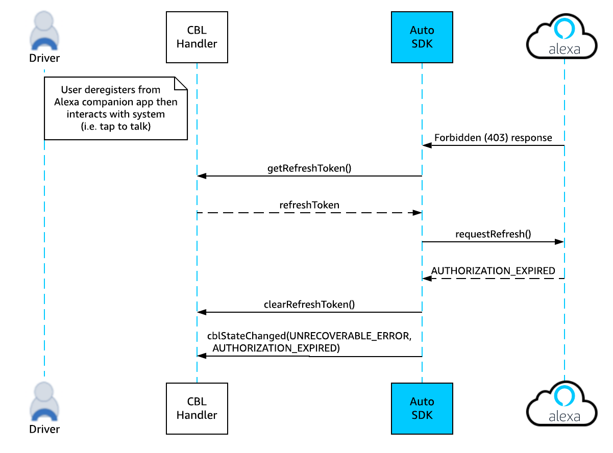

# Code-Based Linking (CBL) Module

The Code-Based Linking (CBL) module implements the CBL mechanism of acquiring Login with Amazon (LWA) access tokens.

<!-- omit in toc -->
## Table of Contents

- [Overview](#overview)
- [Using the Authorization Platform Interface to Carry out CBL Authorization](#using-the-authorization-platform-interface-to-carry-out-cbl-authorization)
  - [Starting Authorization](#starting-authorization)
  - [Receiving Events from Engine](#receiving-events-from-engine)
  - [Setting Authorization Data](#setting-authorization-data)
  - [Getting Authorization Data](#getting-authorization-data)
  - [Canceling Authorization](#canceling-authorization)
  - [Logging Out](#logging-out)
  - [Handling Errors](#handling-errors)
- [Sequence Diagrams for CBL](#sequence-diagrams-for-cbl)
- [(Deprecated) Implementing the CBL Platform Interface](#deprecated-implementing-the-cbl-platform-interface)
  - [CBL States and State Change Reasons](#cbl-states-and-state-change-reasons)
  - [CBL Sequence Diagrams](#cbl-sequence-diagrams)
  - [Switching User Account](#switching-user-account)

## Overview

Every request to Alexa Voice Service (AVS) requires a Login with Amazon (LWA) access token. The Alexa Auto SDK CBL module implements the [CBL mechanism](https://developer.amazon.com/en-US/docs/alexa/alexa-voice-service/code-based-linking-other-platforms.html) of acquiring such tokens.
Starting with Auto SDK v3.1.0, use the `Authorization` platform interface to start, cancel, and log out of CBL authorization. The Auto SDK continues to support the CBL platform interface, but it is on the deprecation path. For more information about how the Engine manages authorization, see the Core module [README](../core/README.md). 

>**Note**: CBL and other authorization methods, such as [Auth Provider](../alexa/README.md#handling-authentication), are mutually exclusive. For example, if the device is already registered with Auth Provider, starting CBL authorization logs out the device from the previous authorization.

## Using the Authorization Platform Interface to Carry out CBL Authorization

This section describes how an application uses the `Authorization` platform interface to carry out CBL authorization.
The service name used by `Authorization` for CBL authorization is `alexa:cbl`.

### Starting Authorization

This section describes how the `startAuthorization` API is used for starting authorization.
The data parameter in the request has the following JSON structure:

~~~
{
    "refreshToken":"{STRING}"
}
~~~

The following list describes what value to pass for the data parameter:
* If the application is starting a new CBL authorization session, pass an empty string as the data parameter. The following syntax shows how to start a new authorization:

~~~
  startAuthorization( "alexa:cbl", "")
~~~

* If the application is starting a CBL authorization session with an existing refresh token, it provides the refresh token obtained previously from `setAuthorizationData()`, with the key as `refreshToken`. The following example shows how to start authorization and pass the refresh token:

~~~
  startAuthorization( “alexa:cbl”, "{"refreshToken":“Atzr|IQEBLzAtAhRP”}")
~~~

>**Note:** With the Authorization platform interface, it is the responsibility of the application to start authorization at every Engine start. Each time the Engine is restarted, it does not automatically start the authorization that was previously in effect before the Engine restart.

### Receiving Events from Engine
This section describes the protocol for getting the code pair and user profile data by using the `eventReceived` API.

The Engine passes the code pair to the application by using the event parameter, which contains the following JSON structure:

~~~
{
    "type": "cbl-code",
    "payload": {
        "code":"{STRING}",
        "url":"{STRING}"
    }
}
~~~

The following example provides the application with the CBL code and URL:

~~~
eventReceived( "alexa:cbl", "{"type":"cbl-code", "payload":{"code":"OC2EFA","url":"some-url"}}" )
~~~

The Engine passes the user profile data to the application by using the event parameter, which contains the following JSON structure:

~~~
{
    "type": "user-profile",
    "payload": {
        "name": "{STRING}",
        "email": "{STRING}"
    }
}
~~~

The following example provides the user profile data for an application to use the logged-in user's name and email:

~~~
eventReceived( "alexa:cbl", "{"type":"user-profile","payload":{"name":"some-name","email":"some-email"}}" )
~~~

### Setting Authorization Data
This section describes the protocol for storing the refresh token by using the `setAuthorizationData` API.

The Engine passes the refresh token to the application by using the `refreshToken` parameter, as shown in the following example:

~~~
setAuthorizationData( "alexa:cbl", "refreshToken", "{"refreshToken":"Atzr|IQEBLzAtAhRP"}" );
~~~

>**Note**: It is the responsibility of the application to securely store authorization data, such as the refresh token, on the device.

### Getting Authorization Data

This section describes the protocol for the Engine to get the refresh token from the application using the `getAuthorizationData` API.

The Engine asks the application to provide the refresh token previously obtained from `setAuthorizationData`. If this is the first time the application tries to authorize the device, pass an empty string. 

The string returned for this API has the following JSON structure:

~~~
{
    "refreshToken":"{STRING}"
}
~~~

The Engine calls the `getAuthorizationData` method as follows:

~~~
getAuthorizationData("alexa:cbl","refreshToken")
~~~

The application returns the refresh token as in the following example:

~~~
"{"refreshToken":"Atzr|IQEBLzAtAhRP"}"
~~~

### Canceling Authorization

This section describes how the application cancels an authorization.

The API to use is `cancelAuthorization`, which can cancel the authorization and stop the CBL work flow at any time. For example, cancellation can happen when the application is waiting for the user to enter the code pair or when the access token is being refreshed. If the device is already authorized, the API cancels the token refreshing process. Canceling authorization does not affect the device authorization state.

### Logging Out

The API to use is `logout`. The application makes this API call to the Engine to log out.

### Handling Errors
This section describes the errors reported by the Engine.

The following list describes possible errors during authorization:

* `UNKNOWN_ERROR` is an unrecoverable error in the authorization process.
* `TIMEOUT` happens when the application's attempt to get the code pair from the LWA Service times out.
* `CODE_PAIR_EXPIRED` is caused by an expired code pair. The application must restart the authorization process and request a new code pair.
* `AUTHORIZATION_EXPIRED` is caused by an expired or a revoked refresh token.
* `LOGOUT_FAILED` happens when a logout attempt fails.
* `START_AUTHORIZATION_FAILED` happens when the authorization flow cannot start.

The Engine notifies the application about any error during authorization. The following example shows how the Engine notifies the application when a code pair expires:

~~~
authorizationError( "alexa:cbl", "CODE_PAIR_EXPIRED", "" )
~~~

## Sequence Diagrams for CBL
The following diagram illustrates the flow when authorization starts.


The following diagram illustrates how the Authorization platform interface handles a refresh token.


The following diagram illustrates the flow when authorization is canceled.


The following diagram illustrates the flow when the application logs out of the authorization.


## (Deprecated) Implementing the CBL Platform Interface
>**Note**: The information starting from this section is not applicable if you use the `Authorization` platform interface. The CBL platform interface is deprecated.

To implement a custom CBL handler, extend the `CBL` class:

```
#include <AACE/CBL/CBL.h>

class MyCBLHandler : public aace::cbl::CBL {

    // Notify the platform about an authentication flow
    void cblStateChanged( CBLState state, CBLStateChangedReason reason, const std::string& url, const std::string& code ) {
        // The state describes the state of the authentication flow
        // The reason provides the reason for the state change
        // The user visits the URL, logs in with their Amazon account and enters the code to link the device to their account. Your implementation is responsible for displaying this information to the user. URL and code will only be provided in the relevant CBL state; otherwise they are empty strings.
    }

    void clearRefreshToken() {
        // Remove refresh token from platform application
    }

    void setRefreshToken( const std::string& refreshToken ) {
        // Set refresh token
        // The Auto SDK Engine refreshes your access token when necessary; however, it doesn't store the refresh token. Your platform implementation stores the refresh token but does not refresh it. 
    }

    std::string getRefreshToken() {
        // Return the refresh token that was most recently provided with CBL::setRefreshToken(). If no token is available, return an empty string.
    }

    void setUserProfile( const std::string& name, const std::string& email ) {
        // Provides information about the user who logged in with their Amazon credential during the authentication flow. This is not enabled by default and won't be called unless you enable a user profile in your Engine configuration.
    }
    // Begin authentication flow
    start();
    ...

    // Cancel authentication flow
    cancel();
    ...

    // Reset authentication state
    reset();
    ...
        
 };
```
```
/* Configure the Engine
 CBL configuration is optional.
 To configure user profile, for example, provide this block in your Engine configuration;

{
    "aace.cbl": {
        "enableUserProfile": true
    }
}
*/

//If you want to generate this configuration programmatically:

auto userProfileConfig = aace::cbl::config::CBLConfiguration::createCBLUserProfileConfig( true );
engine->configure( { //other config objects..., userProfileConfig, ... } );

...

// Register the platform interface with the Engine
auto m_cblHandler = std::make_shared<MyCBLHandler>();
engine->registerPlatformInterface( m_cblHandler );
```

```
// Your platform implementation is responsible for starting and ending the CBL flow.

// To start the authentication process:
m_cblHandler->start();
// At this point, your implementation will be notified to provide the URL and code to the user.

...

// To cancel the authentication process:
m_cblHandler->cancel();

...

// To reset the authentication process:
m_cblHandler->reset();
```

### CBL States and State Change Reasons
The Engine uses the `cblStateChanged()` method to notify your platform implementation about CBL authentication flow and state change reasons, as described in this section.

#### CBL States 

When a state change in the CBL authentication flow occurs, the Engine passes the new state to your CBL platform interface implementation via the `CBLState` argument in the `cblStateChanged()` method. `CBLState` can have the following values:

* `STARTING` - The CBL authentication process is starting.

* `REQUESTING_CODE_PAIR` -  The Engine is requesting a code pair to authenticate a  user. The following events cause the CBL state to change to `REQUESTING_CODE_PAIR`:
 
    * Your implementation does not store a refresh token after the `REQUESTING_TOKEN` phase, and the Engine does not get a refresh token when CBL is in the `STARTING` state.
    * The LWA service sends an `INVALID_CODE_PAIR` response to the Engine's request for an access token.
    * The LWA service sends an `INVALID_CODE_PAIR` response to the Engine's request for a refresh of the access token.

* `CODE_PAIR_RECEIVED` - The code pair was received successfully from the LWA service. 

* `REQUESTING_TOKEN` -  The Engine is requesting an access token from the LWA service.
The CBL state  changes to `REQUESTING_TOKEN` when, after the `CODE_PAIR_RECEIVED` phase, the Engine has received the code pair and the user has been authenticated successfully using this code pair.

* `REFRESHING_TOKEN` -  The access token is currently being refreshed. The following events cause the CBL state changes to `REFRESHING_TOKEN`:
    
    * Your implementation stores a refresh token which can be used to refresh the access token after the `STARTING` phase.
    * The Engine successfully receives the access token from the LWA service after the `REQUESTING_TOKEN` phase.

    After the CBL state transitions to `REFRESHING_TOKEN`, it remains in that state until the user resets or cancels the CBL authentication or the access token is refreshed. The access token is refreshed only when one of the following events take place:

    * The current access token expires.
    * An authorization failure (a "Forbidden 403" response from AVS) occurs because an invalid access token is used to make a request to AVS.

* `STOPPING` - The CBL process is stopping. The following events cause the CBL state to change to `STOPPING`:
    * The user resets or cancels the CBL authentication.
    * In the `REQUESTING_CODE_PAIR` state, the request for a code pair returns an `INVALID_CBL_CLIENT_ID`.
    * In the `REQUESTING_TOKEN` state, the code pair has expired and the user is no longer authenticated or the request for an access token returns an `AUTHORIZATION_EXPIRED` or `INVALID_CBL_CLIENT_ID`response.
    * In the `REFRESHING_TOKEN` state, the request to refresh the access token returns an `AUTHORIZATION_EXPIRED` or `INVALID_CBL_CLIENT_ID` response.

#### CBL State Change Reasons

When a state change in the CBL authentication flow occurs, the Engine passes the reason for the state change to your CBL platform interface implementation via the `CBLStateChangedReason` argument in the `cblStateChanged()` method. `CBLStateChangedReason` can have the following values:

* `SUCCESS` - The CBL state was changed successfully. The `SUCCESS` reason also indicates that any request that AVS made to the LWA service in any of the [CBL authentication flow states](#cbl-states) was successful.

* `ERROR` - An error occurred in the CBL process. A request that AVS made to the LWA service in one of the [CBL authentication flow states](#cbl-states) resulted in an unknown error.

* `TIMEOUT` - A request that AVS made to the LWA service in one of the [CBL authentication flow states](#cbl-states) resulted in a request timeout.

* `CODE_PAIR_EXPIRED` - The code pair required for user authentication has expired. The user must request another code pair.

* `AUTHORIZATION_EXPIRED` - The authorization has expired. The LWA service sends this response when the user deregisters the device from the Alexa Companion App, which in turn invalidates the refresh and access tokens. Any subsequent requests made to AVS (either by the user or due to default polling after a specified time interval) result in a "Forbidden 403" response. This triggers a refresh of the access token to the LWA service which returns  an `AUTHORIZATION_EXPIRED` response since the refresh token has been invalidated.

* `NONE` - The reason for the CBL state change is unknown.

### CBL Sequence Diagrams

The following sequence diagrams provide an overview of the CBL authentication flow, the process of refreshing the authentication when the application provides a valid refresh token, and the flow when the user deregisters from the Alexa companion application and the device is notified either via user interaction or inactivity.

#### Initial Authentication Flow Sequence Diagram

This diagram illustrates the initial CBL authentication flow.


#### Authentication Refresh Sequence Diagram

This diagram illustrates the flow when CBL refreshes the CBL authentication on startup.


#### User Deregistration

This diagram illustrates the flow when the user deregisters from the Alexa companion application and the device is notified when the user interacts with the system after deregistering from the Alexa companion application.



This diagram illustrates the flow when the user deregisters from the Alexa companion application and the device is notified when the getRefreshToken() request loop times out.


### Switching User Account

When switching from one authorized user account to another, you must call the `reset` API before starting an authorization session for the second user.

>**NOTE:** Starting with Auto SDK 3.1, you don't have to restart the Engine after you log out. Immediately after the `reset` API returns, you may start a fresh CBL authorization by calling the `start` API.
