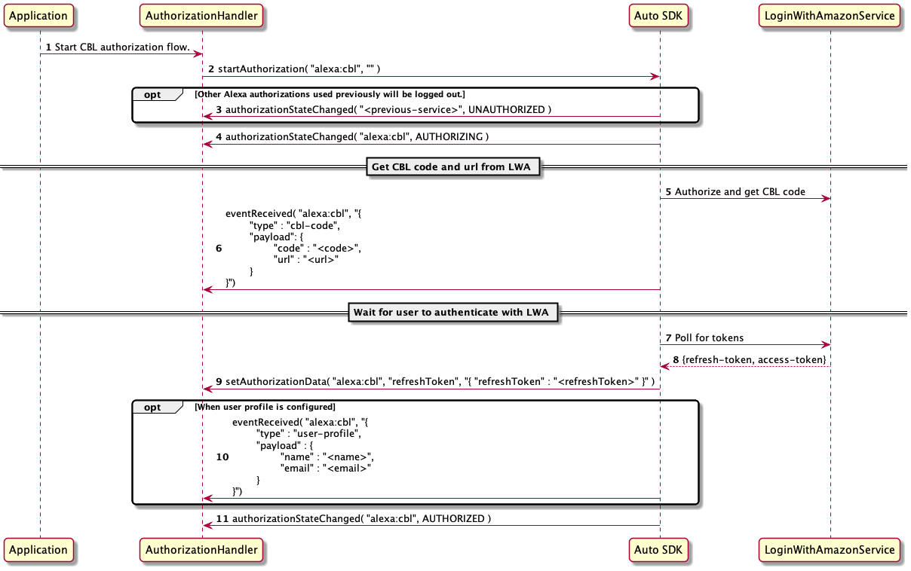
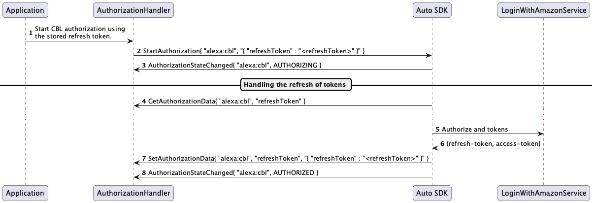
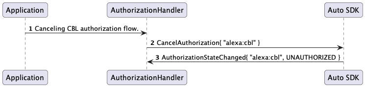
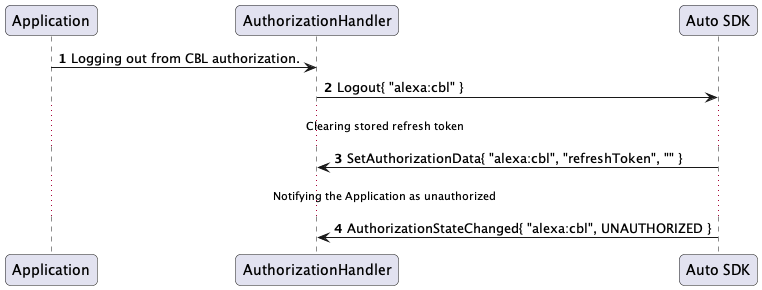

# Code-Based Linking (CBL) Module

## Overview

Every request to Alexa Voice Service (AVS) requires a Login with Amazon (LWA) access token. The Alexa Auto SDK CBL module implements the [CBL mechanism](https://developer.amazon.com/en-US/docs/alexa/alexa-voice-service/authorize-cbl.html) of acquiring such tokens.
Use the `Authorization` AASB message interface to start, cancel, and log out of CBL authorization. For more information about how the Engine manages authorization, see the `Authorization` interface documentation.

> **Important!:** This document is not yet updated is updated to reflect the Auto SDK 4.0 MessageBroker message API. Some sections still include text, code samples, or diagrams that show the deprecated `Authorization` platform interface of Auto SDK 3.3. Instead of the platform interface, your application will use the analogous `Authorization` AASB messages with the MessageBroker. The concepts are the same between the two interfaces. This document will be fully updated in the next Auto SDK version. 

## Using the Authorization Platform Interface to Carry out CBL Authorization

This section describes how an application uses the `Authorization` platform interface to carry out CBL authorization.
The service name used by `Authorization` for CBL authorization is `alexa:cbl`.

### Starting Authorization

This section describes how the `startAuthorization` API is used for starting authorization.
The data parameter in the request has the following JSON structure:

~~~
{
    "refreshToken":"{STRING}"
}
~~~

The following list describes what value to pass for the data parameter:

* If the application is starting a new CBL authorization session, pass an empty string as the data parameter. The following syntax shows how to start a new authorization:

~~~
  startAuthorization( "alexa:cbl", "")
~~~

* If the application is starting a CBL authorization session with an existing refresh token, it provides the refresh token obtained previously from `setAuthorizationData()`, with the key as `refreshToken`. The following example shows how to start authorization and pass the refresh token:

~~~
  startAuthorization( “alexa:cbl”, "{"refreshToken":“Atzr|IQEBLzAtAhRP”}")
~~~

>**Note:** With the Authorization platform interface, it is the responsibility of the application to start authorization at every Engine start. Each time the Engine is restarted, it does not automatically start the authorization that was previously in effect before the Engine restart.

### Receiving Events from Engine
This section describes the protocol for getting the code pair and user profile data by using the `eventReceived` API.

The Engine passes the code pair to the application by using the event parameter, which contains the following JSON structure:

~~~
{
    "type": "cbl-code",
    "payload": {
        "code":"{STRING}",
        "url":"{STRING}"
    }
}
~~~

The following example provides the application with the CBL code and URL:

~~~
eventReceived( "alexa:cbl", "{"type":"cbl-code", "payload":{"code":"OC2EFA","url":"some-url"}}" )
~~~

The Engine passes the user profile data to the application by using the event parameter, which contains the following JSON structure:

~~~
{
    "type": "user-profile",
    "payload": {
        "name": "{STRING}",
        "email": "{STRING}"
    }
}
~~~

The following example provides the user profile data for an application to use the logged-in user's name and email:

~~~
eventReceived( "alexa:cbl", "{"type":"user-profile","payload":{"name":"some-name","email":"some-email"}}" )
~~~

### Setting Authorization Data
This section describes the protocol for storing the refresh token by using the `setAuthorizationData` API.

The Engine passes the refresh token to the application by using the `refreshToken` parameter, as shown in the following example:

~~~
setAuthorizationData( "alexa:cbl", "refreshToken", "{"refreshToken":"Atzr|IQEBLzAtAhRP"}" );
~~~

>**Note**: It is the responsibility of the application to securely store authorization data, such as the refresh token, on the device.

### Getting Authorization Data

This section describes the protocol for the Engine to get the refresh token from the application using the `getAuthorizationData` API.

The Engine asks the application to provide the refresh token previously obtained from `setAuthorizationData`. If this is the first time the application tries to authorize the device, pass an empty string. 

The string returned for this API has the following JSON structure:

~~~
{
    "refreshToken":"{STRING}"
}
~~~

The Engine calls the `getAuthorizationData` method as follows:

~~~
getAuthorizationData("alexa:cbl","refreshToken")
~~~

The application returns the refresh token as in the following example:

~~~
"{"refreshToken":"Atzr|IQEBLzAtAhRP"}"
~~~

### Canceling Authorization

This section describes how the application cancels an authorization.

The API to use is `cancelAuthorization`, which can cancel the authorization and stop the CBL work flow at any time. For example, cancellation can happen when the application is waiting for the user to enter the code pair or when the access token is being refreshed. If the device is already authorized, the API cancels the token refreshing process. Canceling authorization does not affect the device authorization state.

### Logging Out

The API to use is `logout`. The application makes this API call to the Engine to log out.

### Handling Errors
This section describes the errors reported by the Engine.

The following list describes possible errors during authorization:

* `UNKNOWN_ERROR` is an unrecoverable error in the authorization process.
* `TIMEOUT` happens when the application's attempt to get the code pair from the LWA Service times out.
* `CODE_PAIR_EXPIRED` is caused by an expired code pair. The application must restart the authorization process and request a new code pair.
* `AUTHORIZATION_EXPIRED` is caused by an expired or a revoked refresh token.
* `LOGOUT_FAILED` happens when a logout attempt fails.
* `START_AUTHORIZATION_FAILED` happens when the authorization flow cannot start.

The Engine notifies the application about any error during authorization. The following example shows how the Engine notifies the application when a code pair expires:

~~~
authorizationError( "alexa:cbl", "CODE_PAIR_EXPIRED", "" )
~~~

## Enabling User Profile
If you want the Engine to pass information about logged-in users to the application, include the following code in the Engine configuration:
```
{
    "aace.cbl": {
        "enableUserProfile": true
    }
}
```

You can also generate the configuration programmatically by using the following method:

```cpp
auto userProfileConfig = aace::cbl::config::CBLConfiguration::createCBLUserProfileConfig( true );
engine->configure( { //other config objects..., userProfileConfig, ... } );
```

The user profile is passed via the `eventReceived` API as described in [this section](#receiving-events-from-engine).

## Sequence Diagrams for CBL
The following diagram illustrates the flow when authorization starts.



The following diagram illustrates how the Authorization platform interface handles a refresh token.



The following diagram illustrates the flow when authorization is canceled.



The following diagram illustrates the flow when the application logs out of the authorization.

