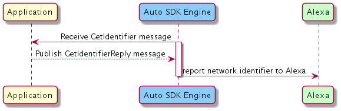

# Connectivity Module

## Overview

The `Connectivity` module for the Alexa Auto SDK creates a lower data consumption mode for Alexa, allowing automakers to offer tiered functionality based on the status of their connectivity plans. By using this module, you can send the customer's connectivity status from the vehicle to Alexa, which determines whether the customer can enjoy a full or partial set of Alexa features. This module allows the automaker to create tiered access to Alexa for customers and offer up-sell opportunities to subscribe to a full connectivity plan.  

A customer who purchases an Alexa-enabled vehicle typically has to subscribe to the automaker’s connectivity plans and accept the automaker's and network provider's terms and conditions to access Alexa. Without the `Connectivity` module, if the customer declines the terms and conditions, or does not have a data plan (for example, due to plan expiration), the customer loses access to Alexa. The `Connectivity` module, however, provides an option that allows the automaker to offer a reduced set of Alexa functionality and limited bandwidth consumption for little or no cost. In this low data consumption mode, utterances sent to the cloud are filtered by feature, because the `Connectivity` module offers a restricted set of features. For example, when a user accesses Alexa through the `Connectivity` module, an utterance requesting music streaming does not start the streaming but turns on the FM radio station that was last played. Features such as weather and traffic remain accessible.  

Your application's `Connectivity` module integration is responsible for:

* Providing the network identifier for Alexa to send to the mobile network operator (MNO)
* Providing the vehicle's connection properties and configurations to Alexa


## Configuring the Connectivity Module

The `Connectivity` module does not require Engine configuration.


## Using the Connectivity AASB Messages

### Providing the Network Identifier

The network identifier is agnostic of the data plan and is assigned when initially integrated into the vehicle. It links the device with the network provider and enables the network provider to identify and provide device connectivity. Examples of the network identifier are the Embedded SIM ID (eSIM ID) and a globally unique ID (GUID). Which ID to use depends on the implementation determined in agreement with Amazon, OEM, and MNO.

> **Note:** The network identifier is optional. If it is missing, the Engine will use `vehicleIdentifier` in the Engine configuration as the network identifier. To learn more about vehicle information in the Engine configuration, see the `Core` module documentation. 

During device discovery the Engine publishes the [`GetIdentifier` message](https://alexa.github.io/alexa-auto-sdk/docs/aasb/connectivity/AlexaConnectivity/index.html#getidentifier). To report the network identifier to Alexa, publish the [`GetIdentifierReply` message](https://alexa.github.io/alexa-auto-sdk/docs/aasb/connectivity/AlexaConnectivity/index.html#getidentifier#getidentifierreply).

<details markdown="1"><summary>Click to expand or collapse sequence diagram: Providing the Network Identifier</summary>
<br></br>



</details>
</br>

### Providing the Connectivity Status

When a client application initiates connection with Alexa or when Alexa requests a report of the current connectivity state, publish the [`ConnectivityStateChange` message](https://alexa.github.io/alexa-auto-sdk/docs/aasb/connectivity/AlexaConnectivity/index.html#connectivitystatechange). In response, the Engine will publish the [`GetConnectivityState` message](https://alexa.github.io/alexa-auto-sdk/docs/aasb/connectivity/AlexaConnectivity/index.html#getconnectivitystate) to which your application must publish the [`GetConnectivityStateReply` message](https://alexa.github.io/alexa-auto-sdk/docs/aasb/connectivity/AlexaConnectivity/index.html#getconnectivitystatereply) containing the connectivity state. The Engine will then publish the [`ConnectivityStateChangeReply` message](https://alexa.github.io/alexa-auto-sdk/docs/aasb/connectivity/AlexaConnectivity/index.html#connectivitystatechangereply) to indicate if the connectivity state was processed successfully.

Alexa parses the internet connectivity information from the vehicle and determines whether the customer is eligible for the full or partial Alexa experience. The *connectivityState* obtained in the `GetConnectivityState` reply payload has the following schema:

```
 {
    "managedProvider": {
        "type": "{{STRING_ENUM}}",
        "id": "{{STRING}}"
    },
    "termStatus": "{{STRING_ENUM}}",
    "termsVersion": "{{STRING}}",
    "dataPlan": {
        "type": "{{STRING_ENUM}}",
        "endDate": "{{STRING}}"
    },
    "dataPlansAvailable": ["{{STRING}}", "{{STRING}}", ...]
}
```

<details markdown="1"><summary>Click to expand or collapse details about the objects in the payload</summary>

| Property | Type | Description | Required
|-|-|-|-|
| `dataPlan` | Object | It provides the active data plan type and end date. | Yes (only when `managedProvider.type` is `MANAGED`) 
| `dataPlan.type` | String | **Accepted values:** <ul><li>`PAID` indicates that the device has an active data plan paid for by the customer.<li>`TRIAL` indicates that the device has an active data plan which has been provided to the customer as a promotional event.<li>`AMAZON_SPONSORED` indicates that the customer has not paid for a data plan or signed up for a free trial. The customer can connect to the internet via a plan sponsored by Amazon and can access a limited number of Alexa features.</ul> A customer with either of `PAID` or `TRIAL` data plan has unrestricted access to all Alexa features. | Yes
| `dataPlan.endDate` | String | It specifies the date on which the trial data plan ends. If it is not set, there is no end date for the plan. The value is in the RFC 3339 format. | Yes (only when `dataPlan.type` is `TRIAL`)
| `termsStatus` | String | It indicates whether the customer has accepted the terms and conditions of the OEM and MNO. If it is not set, the behavior is the same as when it is set to `DECLINED`. <br><br>**Accepted values**:<br><ul><li>`ACCEPTED` means that the customer has agreed to receive voice messages from Alexa, which enable the customer to use voice to purchase a data plan.<li>`DECLINED` means that the customer does not accept the terms and conditions, and will not receive reminders from Alexa for a data plan upgrade.<li>`DEFERRED` means that the customer does not accept the terms and conditions, and will not receive reminders from Alexa for a data plan upgrade. However, Alexa might remind the user to respond to the terms and conditions again.</ul> | No, but recommended
| `termsVersion` | String | It indicates the version of the terms and conditions presented to the user. Do not use `termsVersion` if you do not use `termsStatus`. Maximum length is 250 characters. <br><br>**Note:** If you implemented Auto SDK 3.1 with the Connectivity module, a default value is automatically assigned to `termsVersion`. For Auto SDK 3.2 or later, be sure to specify `termsVersion`. Otherwise, the MNO is not notified of the correct version of the terms and conditions presented to the user. | Yes (only when `termsStatus` is provided)
| `dataPlansAvailable` | String array | It indicates the data plans that can be activated. Accepted values are `PAID`, `AMAZON_SPONSORED`, and `TRIAL`. For example, if the array is `["TRIAL", "AMAZON_SPONSORED", "PAID"]`, Alexa encourages the user to upgrade from an AMAZON_SPONSORED plan to a TRIAL plan or from a TRIAL plan to a PAID plan. | No
| `managedProvider` | Object | It provides information about the type of network connectivity that the device has. | Yes
| `managedProvider.type` | String | **Accepted Values:**<br><ul><li>`MANAGED` means the device's internet connectivity is managed by a provider. The only possible provider that manages connectivity is Amazon. The Alexa experience is affected by the current connectivity state in the following ways:<ul><li>If the customer is on a paid or trial data plan, `MANAGED` has no effect on the customer's Alexa experience. <li>If the customer does not have a paid or trial data plan, the customer, through the AlexaConnectivity platform interface, can access a limited number of Alexa features.</ul><li>`NOT_MANAGED` means the device's internet connectivity is not managed by a provider. For example, assign this value if the customer accesses the internet via a WiFi network or mobile hotspot. The customer can access all Alexa features, regardless of the current connectivity state.</ul> | Yes
| `managedProvider.id` | String | It specifies the name of the provider that manages connectivity. The only accepted value is `AMAZON`. | Yes (only when `managedProvider.type` is `MANAGED`)

</details>
</br>

<details markdown="1"><summary>Click to expand or collapse sequence diagram: Connectivity Report</summary>
<br></br>


</details>
</br>

### Activating Voice Up-Sell Conversation

To activate the voice up-sell conversation with Alexa (e.g., to activate the trial or paid plan subscription), publish the [`SendConnectivityEvent` message](https://alexa.github.io/alexa-auto-sdk/docs/aasb/connectivity/AlexaConnectivity/index.html#sendconnectivityevent). The Engine publishes the [`SendConnectivityEventReply` message](https://alexa.github.io/alexa-auto-sdk/docs/aasb/connectivity/AlexaConnectivity/index.html#sendconnectivityeventreply) specifying the delivery status of the event. The *event* sent in the `SendConnectivityEvent` message payload has the following schema:

```
  {
    "type": "{{STRING}}"
  }
```

>**Note:** Alexa requires the customer to have accepted the OEM and network provider's terms and conditions before starting the voice conversation.

<details markdown="1"><summary>Click to expand or collapse details about the objects in the payload</summary>

| Property | Type | Description | Required
|-|-|-|-|
| `type` | String | Represents the type of the connectivity event to Alexa. <br><br>**Accepted Values**:<br><ul><li>`ACTIVATE_TRIAL` for Alexa to begin the trial data plan activation (if available). Alexa, upon receiving this event, may perform some validations and eligibility checks before starting the voice conversation. <br> **Note:** If the platform implementation cannot determine the data plan type, use this event type. Alexa would first check the trial eligibility. If the customer is not eligible, Alexa begins the paid plan voice conversation. <li> `ACTIVATE_PAID_PLAN` for Alexa to begin the paid data plan activation. Alexa, upon receiving this event, may perform some validations and eligibility checks before starting the voice conversation.| Yes 

</details>
</br>

<details markdown="1"><summary>Click to expand or collapse sequence diagram: Send Connectivity Event</summary>
<br></br>


</details>
</br>

## Integrating the Connectivity Module Into Your Application

### C++ MessageBroker Integration

Use the Engine's `MessageBroker` to publish *"Connectivity"* AASB messages and subscribe to their replies.

<details markdown="1"><summary>Click to expand or collapse C++ sample code</summary>

<br></br>

```cpp
#include <AACE/Core/MessageBroker.h>

#include <AASB/Message/Connectivity/AlexaConnectivity/StatusCode.h>

#include <AASB/Message/Connectivity/AlexaConnectivity/ConnectivityStateChangeMessage.h>
#include <AASB/Message/Connectivity/AlexaConnectivity/GetConnectivityStateMessage.h>
#include <AASB/Message/Connectivity/AlexaConnectivity/GetIdentifierMessage.h>
#include <AASB/Message/Connectivity/AlexaConnectivity/SendConnectivityEventMessage.h>

#include <nlohmann/json.hpp>
using json = nlohmann::json;

class MyAlexaConnectivityHandler {

  // Subscribe to messages from the Engine
  void MyAlexaConnectivityHandler::subscribeToAASBMessages() {
    m_messageBroker->subscribe(
        [=](const std::string& message) { handleGetConnectivityStateMessage(message); },
        GetConnectivityStateMessage::topic(),
        GetConnectivityStateMessage::action());
    m_messageBroker->subscribe(
        [=](const std::string& message) { handleGetIdentifierMessage(message); },
        GetIdentifierMessage::topic(),
        GetIdentifierMessage::action());
    m_messageBroker->subscribe(
        [=](const std::string& message) { handleConnectivityStateChangeReplyMessage(message); },
        ConnectivityStateChangeMessageReply::topic(),
        ConnectivityStateChangeMessageReply::action());
    m_messageBroker->subscribe(
        [=](const std::string& message) { handleSendConnectivityEventReplyMessage(message); },
        SendConnectivityEventMessageReply::topic(),
        SendConnectivityEventMessageReply::action());
    }

  // Handle the ConnectivityStateChange reply message from the Engine
  void MyAlexaConnectivityHandler::handleConnectivityStateChangeReplyMessage(const std::string& message) {
      ConnectivityStateChangeMessageReply msg = json::parse(message);
      std::string messageId = msg.header.messageDescription.replyToId;

        // ...Handle change in the connectivity state...
  }

  // Handle the SendConnectivityEvent reply message from the Engine
  void MyAlexaConnectivityHandler::handleSendConnectivityEventReplyMessage(const std::string& message) {
      SendConnectivityEventMessageReply msg = json::parse(message);

      std::string messageId = msg.header.messageDescription.replyToId;
      StatusCode statusCode = msg.payload.statusCode;

      // ...Handle delivery status of the event...
  }

  // Handle the GetConnectivityState message from the Engine and publish the reply message to the Engine 
  void MyAlexaConnectivityHandler::handleGetConnectivityStateMessage(const std::string& message) {
      GetConnectivityStateMessage msg = json::parse(message);
      GetConnectivityStateMessageReply replyMsg;
      replyMsg.header.messageDescription.replyToId = msg.header.id;
      replyMsg.payload.connectivityState = getConnectivityState();
      m_messageBroker->publish(replyMsg.toString());
  }

  // Handle the GetIdentifier message from the Engine and publish the reply message to the Engine
  void MyAlexaConnectivityHandler::handleGetIdentifierMessage(const std::string& message) {
      GetIdentifierMessage msg = json::parse(message);
      GetIdentifierMessageReply replyMsg;
      replyMsg.header.messageDescription.replyToId = msg.header.id;
      replyMsg.payload.identifier = getIdentifier();
      m_messageBroker->publish(replyMsg.toString());
  }

  // To report a connectivity status change to Alexa, publish a ConnectivityStateChange message to the Engine
  bool MyAlexaConnectivityHandler::connectivityStateChange() {
    ConnectivityStateChangeMessage msg;
    m_messageBroker->publish(msg.toString());

    // The Engine will send the ConnectivityStateChangeReply message
    // Return the success status from reply message payload
  }

  // To activate a voice up-sell conversation with Alexa, publish a SendConnectivityEvent message to the Engine
  StatusCode MyAlexaConnectivityHandler::sendConnectivityEvent(const std::string& event) {
      SendConnectivityEventMessage msg;
      msg.payload.event = event;
      m_messageBroker->publish(msg.toString());

    // The Engine will send the SendConnectivityEventReply message
    // Return the statusCode from reply message payload
  }

  // Implement to retrieve the connectivity state
  std::string MyAlexaConnectivityHandler::getConnectivityState();

  // Implement to retrieve the identifier
  std::string MyAlexaConnectivityHandler::getIdentifier();

};

```

</details>
</br>

### Android Integration

This lower data consumption mode for Alexa is not available in the Alexa Auto Client Service (AACS). If you are interested in creating tiered access to Alexa for customers you are required to implement it independently using AASB Messages.