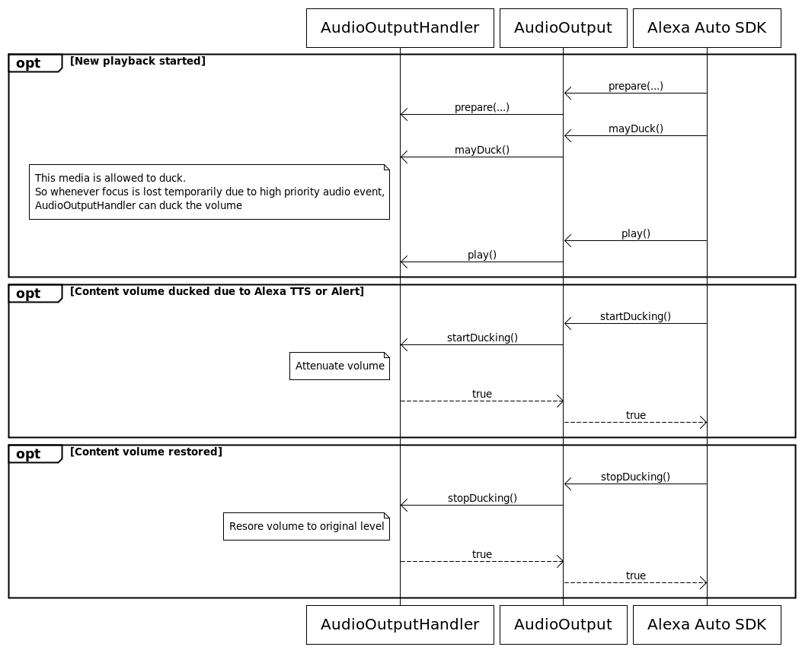

# Alexa Auto SDK Audio Channels <!-- omit in toc -->

**Table of Contents** <!-- omit in toc -->

- [Overview](#overview)
  - [Understand audio input channels](#understand-audio-input-channels)
  - [Understand audio output channels](#understand-audio-output-channels)
- [Access the audio stream for stream-based input and output](#access-the-audio-stream-for-stream-based-input-and-output)
- [Provide audio input](#provide-audio-input)
- [Provide audio output](#provide-audio-output)
  - [Enable music ducking](#enable-music-ducking)

## Overview

The core audio Engine service provides a mechanism for Engine components of any module to open audio input and output channels in your application. Each Engine component that requests an audio channel specifies its audio channel type so your application can provide microphone and media player implementations specific to each channel type. The core audio Engine service provides audio I/O AASB message interfaces that are generic enough for your application to decide how to produce or play the audio.

### Understand audio input channels

Your application uses the [`AudioInput`](https://alexa.github.io/alexa-auto-sdk/docs/sdk-docs/modules/core/aasb-docs/AudioInput/index.html) AASB message interface to provide audio data to the Engine. The Engine defines the following audio input types to use with the `AudioInput` interface:

- **VOICE—** This audio input type provides user speech audio data.

- **COMMUNICATION—** This audio input type provides user speech audio data specific to Alexa-to-Alexa calling. For example, the `Alexa Comms` module Engine components request audio input with this type.

- **LOOPBACK—** This audio input type provides audio data recorded from the device's own speakers. For example, the `Loopback Detector` module Engine components request audio input with this type to detect Alexa saying her own name in the audio output.

The audio input part of the core audio Engine service enables Engine components to share single producer, multi-consumer audio input in two key ways:

-  Multiple Engine components might request audio input of the same type. For example, the `Alexa` module and `Amazonlite` module Engine components both want `VOICE` audio input. When the second component requests to open `VOICE` channel, the Engine won't ask your application for `VOICE` audio again because your application is already providing it. The Engine takes care of providing the same audio data to both consumers.

- Multiple Engine components might request audio input of "different" types that your application considers the same. For example, the `Alexa` module and `Alexa Comms` module want `VOICE` and `COMMUNICATION` audio input, respectively. Your application's specific integration might have one implementation for producing the user speech audio data. In this case, your application takes care of providing the same audio data to both consumers.

### Understand audio output channels

The Engine uses the [`AudioOnput`](https://alexa.github.io/alexa-auto-sdk/docs/sdk-docs/modules/core/aasb-docs/AudioOuput/index.html) AASB message interface to request your application to play or perform other operations on audio output data. The Engine defines the following audio output types to use with the `AudioOutput` interface:

- **TTS—** This audio output type plays speech audio data. For example, Alexa's speech responses from the `SpeechSynthesizer` interface
- **MUSIC** This audio output type plays media. For example, Amazon Music from the `AudioPlayer` interface
- **NOTIFICATION** This audio output type plays notification audio cues. For example, short cues from the `Notifications` interface
- **ALARM** This audio output type plays alarms. For example, repeating alarm audio from the `Alerts` interface
- **EARCON** This audio output type plays Alexa attention state audio cues. For example, the audio cue to indicate Alexa started listening
- **COMMUNICATION** This audio output type plays the audio for Alexa-to-Alexa calling. For example, the "other side" of the user's Alexa-to-Alexa call placed using the `Alexa Comms` module.
- **RINGTONE** This audio output type plays ringtones. For example, the inbound or outbound ringing tone of the user's Alexa-to-Alexa call placed using the `Alexa Comms` module.

Your application determines how to handle each different audio type. The simplest integration, for example, might play all audio output types with the same underlying media player implementation. A more sophisticated integration might provide different media player implementations depending on the audio type— for example, using a low-level audio implementation for `NOTIFICATION` and `EARCON` types, and a high-level implementation for `TTS` and `MUSIC`. The best approach depends on your system-specific use cases.

> **Important!** Even though your application might use the same media player implementation for multiple audio output types, the actual integration must be able to handle the Engine having multiple channels open at the same time; for example, there might be music buffered in the `MUSIC` channel media player while the user makes a quick Alexa-to-Alexa call using the `RINGTONE` and `COMMUNICATION` channels. The Engine is agnostic to how you buffer and control the audio, but it does require your integration to be capable of keeping the right state of all channels that are active at the same time.

## Access the audio stream for stream-based input and output

Both the `AudioInput` and `AudioOutput` AASB message interfaces require your application to read from or write to a stream. These messages include an ID to identify the stream in the `streamId` field of the message payload. When your application receives a message with a `streamId`, use the MessageBroker `openStream()` function with `streamId` to get a reference to a `MessageStream` object wrapping the stream. Specify the operation mode (i.e., read or write) when opening the stream using the `MessageStream::Mode` enumerated types. If the MessageBroker cannot open the stream for the specified operation, the `openStream()` call will fail and return a null object.

The following example demonstrates how your application would open an input stream after receiving the `StartAudioInput` message, and write data to the stream until it receives a `StopAudioInput` message for the same stream ID.

```c++
#include <AASB/Message/Audio/AudioInput/StartAudioInputMessage.h>
#include <AASB/Message/Audio/AudioInput/StopAudioInputMessage.h>

// subscribe to the StartAudioInput message
messageBroker->subscribe([=](const std::string& msg) {
        // parse the json message
        StartAudioInputMessage _msg = json::parse(msg);
        // open the stream for writing
        auto streamId = _msg.payload.streamId;
        auto stream = messageBroker->openStream(
            streamId,
            MessageStream::Mode::WRITE);
        startAudioInput(streamId, stream)
    }),
    StartAudioInputMessage::topic(),
    StartAudioInputMessage::action());

// subscribe to the StopAudioInput message
messageBroker->subscribe([=](const std::string& msg) {
        // parse the json message
        StopAudioInputMessage _msg = json::parse(msg);
        auto streamId = _msg.payload.streamId;
        stopAudioInput(streamId);
    }),
    StopAudioInputMessage::topic(),
    StopAudioInputMessage::action());    


void startAudioInput(const std::string& streamId, std::shared_ptr<MessageStream> stream) {
    // On another thread, write data to the stream until
    // you receive a StopAudioInput message with the same streamId
    // ...
    // Return quickly to avoid blocking the MessageBroker's outgoing thread!
} 

void stopAudioInput(const std::string& streamId) {
    // Stop writing audio data to the stream
    // ...
    // Return quickly to avoid blocking the MessageBroker's outgoing thread!
}

```

## Provide audio input

Your application subscribes to the `AudioInput` AASB messages published by the Engine. When some Engine component requests audio input (for example, when the user presses the tap-to-talk button from `SpeechRecognizer`), the Engine publishes a `StartAudioInput` message that specifies the `AudioInputType` and stream ID. Your implementation must start writing audio data until the Engine publishes a `StopAudioInput` message for the stream ID.

If two Engine components request audio from the same channel, your application will only receive a `StartAudioInput` message when the first component requests the audio. All of the Engine components that have requested audio from the same input channel will receive a callback internally when audio data is written to the interface. Your application will only receive a `StopAudioInput` message after the last Engine component has canceled its request to receive audio from the channel.

Your application must provide audio input in the following format:

* 16bit Linear PCM
* 16kHz sample rate
* Single channel
* Signed, little endian byte order

<details markdown="1"><summary>
Click to expand or collapse C++ example code</summary>

```cpp
#include <AACE/Core/MessageBroker.h>

#include <AASB/Message/Audio/AudioInput/StopAudioInputMessage.h>
#include <AASB/Message/Audio/AudioInput/StartAudioInputMessage.h>

class MyAudioInputHandler {

    // Subscribe to messages from the engine
    void MyAudioInputHandler::subscribeToAASBMessages() {
        m_messageBroker->subscribe(
            [=](const std::string& message) { handleStartAudioInputMessage(message); },
            StartAudioInputMessage::topic(),
            StartAudioInputMessage::action());
        m_messageBroker->subscribe(
            [=](const std::string& message) { handleStopAudioInputMessage(message); },
            StopAudioInputMessage::topic(),
            StopAudioInputMessage::action());
    }

    void MyAudioInputHandler::handleStartAudioInputMessage(const std::string& message) {
        StartAudioInputMessage msg = json::parse(message);
        auto stream = m_messageBroker->openStream(msg.payload.streamId, MessageStream::Mode::WRITE);
        
        // ...Handle starting audio input...
    }

    void MyAudioInputHandler::handleStopAudioInputMessage(const std::string& message) {
        // ...Handle stopping audio input...
    }
}
```
</details>

## Provide audio output

Your application subscribes to the `AudioOutput` AASB messages published by the Engine. The Engine publishes either a `PrepareStream` message or a `PrepareURL` message to notify your application to create an audio stream or URL for playback. The characteristics of the audio that will be played on the channel are specified by the `AudioOutputType` in the payload. The Engine will perform actions on the audio output by publishing additional `AudioOutput` messages. See the `AudioOutput` AASB message documentation for details.

<details markdown="1"><summary>
Click to expand or collapse C++ sample code</summary>

```cpp
#include <AACE/Core/MessageBroker.h>

#include <AASB/Message/Audio/AudioOutput/GetDurationMessage.h>
#include <AASB/Message/Audio/AudioOutput/GetNumBytesBufferedMessage.h>
#include <AASB/Message/Audio/AudioOutput/GetPositionMessage.h>
#include <AASB/Message/Audio/AudioOutput/MayDuckMessage.h>
#include <AASB/Message/Audio/AudioOutput/MediaErrorMessage.h>
#include <AASB/Message/Audio/AudioOutput/MediaStateChangedMessage.h>
#include <AASB/Message/Audio/AudioOutput/MutedStateChangedMessage.h>
#include <AASB/Message/Audio/AudioOutput/PauseMessage.h>
#include <AASB/Message/Audio/AudioOutput/PlayMessage.h>
#include <AASB/Message/Audio/AudioOutput/PrepareStreamMessage.h>
#include <AASB/Message/Audio/AudioOutput/PrepareURLMessage.h>
#include <AASB/Message/Audio/AudioOutput/ResumeMessage.h>
#include <AASB/Message/Audio/AudioOutput/SetPositionMessage.h>
#include <AASB/Message/Audio/AudioOutput/StartDuckingMessage.h>
#include <AASB/Message/Audio/AudioOutput/StopDuckingMessage.h>
#include <AASB/Message/Audio/AudioOutput/StopMessage.h>
#include <AASB/Message/Audio/AudioOutput/VolumeChangedMessage.h>

class MyAudioOutputHandler {

    // Subscribe to messages from the engine
    void MyAudioOutputHandler::subscribeToAASBMessages() {
        m_messageBroker->subscribe(
            [=](const std::string& message) { handleMutedStateChangedMessage(message); },
            MutedStateChangedMessage::topic(),
            MutedStateChangedMessage::action());
        m_messageBroker->subscribe(
            [=](const std::string& message) { handlePauseMessage(message); },
            PauseMessage::topic(),
            PauseMessage::action());
        m_messageBroker->subscribe(
            [=](const std::string& message) { handlePlayMessage(message); }, PlayMessage::topic(), PlayMessage::action());
        m_messageBroker->subscribe(
            [=](const std::string& message) { handlePrepareStreamMessage(message); },
            PrepareStreamMessage::topic(),
            PrepareStreamMessage::action());
        m_messageBroker->subscribe(
            [=](const std::string& message) { handlePrepareURLMessage(message); },
            PrepareURLMessage::topic(),
            PrepareURLMessage::action());
        m_messageBroker->subscribe(
            [=](const std::string& message) { handleMayDuckMessage(message); },
            MayDuckMessage::topic(),
            MayDuckMessage::action());
        m_messageBroker->subscribe(
            [=](const std::string& message) { handleResumeMessage(message); },
            ResumeMessage::topic(),
            ResumeMessage::action());
        m_messageBroker->subscribe(
            [=](const std::string& message) { handleSetPositionMessage(message); },
            SetPositionMessage::topic(),
            SetPositionMessage::action());
        m_messageBroker->subscribe(
            [=](const std::string& message) { handleStopMessage(message); }, StopMessage::topic(), StopMessage::action());
        m_messageBroker->subscribe(
            [=](const std::string& message) { handleVolumeChangedMessage(message); },
            VolumeChangedMessage::topic(),
            VolumeChangedMessage::action());
        m_messageBroker->subscribe(
            [=](const std::string& message) { handleStartDuckingMessage(message); },
            StartDuckingMessage::topic(),
            StartDuckingMessage::action());
        m_messageBroker->subscribe(
            [=](const std::string& message) { handleStopDuckingMessage(message); },
            StopDuckingMessage::topic(),
            StopDuckingMessage::action());
        m_messageBroker->subscribe(
            [=](const std::string& message) { handleGetDurationMessage(message); },
            GetDurationMessage::topic(),
            GetDurationMessage::action());
        m_messageBroker->subscribe(
            [=](const std::string& message) { handleGetNumBytesBufferedMessage(message); },
            GetNumBytesBufferedMessage::topic(),
            GetNumBytesBufferedMessage::action());
        m_messageBroker->subscribe(
            [=](const std::string& message) { handleGetPositionMessage(message); },
            GetPositionMessage::topic(),
            GetPositionMessage::action());
    }

    void MyAudioOutputHandler::handleMutedStateChangedMessage(const std::string& message) {
        // ...Handle muted state changed...
    }

    void MyAudioOutputHandler::handlePauseMessage(const std::string& message) {
        // ...Handle pause...
    }

    void MyAudioOutputHandler::handlePlayMessage(const std::string& message) {
        // ...Handle play...
    }

    void MyAudioOutputHandler::handlePrepareStreamMessage(const std::string& message) {
        PrepareStreamMessage msg = json::parse(message);
        auto stream = m_messageBroker->openStream(msg.payload.streamId, MessageStream::Mode::READ);
        
        // ...Handle prepare stream...
    }

    void MyAudioOutputHandler::handlePrepareURLMessage(const std::string& message) {
        // ...Handle prepare URL...
    }

    void MyAudioOutputHandler::handleMayDuckMessage(const std::string& message) {
        // ...Handle may duck...
    }

    void MyAudioOutputHandler::handleResumeMessage(const std::string& message) {
        // ...Handle resume...
    }

    void MyAudioOutputHandler::handleSetPositionMessage(const std::string& message) {
        // ...Handle set position...
    }

    void MyAudioOutputHandler::handleStopMessage(const std::string& message) {
        // ...Handle stop...
    }

    void MyAudioOutputHandler::handleVolumeChangedMessage(const std::string& message) {
        // ...Handle volume changed...
    }

    void MyAudioOutputHandler::handleStartDuckingMessage(const std::string& message) {
        // ...Handle start ducking - reduce current media volume...
    }

    void MyAudioOutputHandler::handleStopDuckingMessage(const std::string& message) {
        // ...Handle stop ducking - restore current media volume...
    }

    void MyAudioOutputHandler::handleGetDurationMessage(const std::string& message) {
        GetDurationMessage msg = json::parse(message);

        // Publish the reply message for GetDuration message.
        GetDurationMessageReply replyMsg;
        replyMsg.header.messageDescription.replyToId = msg.header.id;
        
        // ...Handle getting duration...
    }

    void MyAudioOutputHandler::handleGetNumBytesBufferedMessage(const std::string& message) {
        GetNumBytesBufferedMessage msg = json::parse(message);

        // Publish the reply message for GetNumBytesBuffered message.
        GetNumBytesBufferedMessageReply replyMsg;
        replyMsg.header.messageDescription.replyToId = msg.header.id;
        
        // ...Handle getting number of bytes buffered...
    }

    void MyAudioOutputHandler::handleGetPositionMessage(const std::string& message) {
        GetPositionMessage msg = json::parse(message);

        // Publish the reply message for GetPosition message.
        GetPositionMessageReply replyMsg;
        replyMsg.header.messageDescription.replyToId = msg.header.id;
        
        // ...Handle getting position...
    }

    // To notify the Engine of an error during audio playback,
    // publish a MediaError message to the Engine
    void MyAudioOutputHandler::mediaError(
        const std::string& token,
        MediaError error,
        const std::string& description) {
        MediaErrorMessage msg;
        msg.payload.token = token;
        msg.payload.error = error;
        msg.payload.description = description;

        m_messageBroker->publish(msg.toString());
    }

    // To notify the Engine of an audio playback state change,
    // publish a MediaStateChanged message to the Engine
    void MyAudioOutputHandler::mediaStateChanged(
        const std::string& channel,
        const std::string& token,
        MediaState state) {
        MediaStateChangedMessage msg;
        msg.payload.channel = channel;
        msg.payload.token = token;
        msg.payload.state = state;

        m_messageBroker->publish(msg.toString());
    }
}
```
</details>


### Enable music ducking

The `AudioOutput` interfaces supports ducking the MUSIC channel. Your implementation can duck playing music when a high priority channel is in the focus or when any external application's audio channel is in focus.

The Engine will publish a `MayDuck` message if the prepared media allows the application to duck the volume if any high priority audio stream is in focus. If this message is not published, your application can assume that media is not allowed to duck. The Engine will publish a `StartDucking` message to notify your application to reduce the playing volume and a `StopDucking` message to notify your application to restore the playing volume to its original level.

If your application is handling an audio focus action due to audio events from other applications, your application must publish an `AudioFocusEvent` message with the right focus action. For example, if Alexa music is ducked because of navigation turn-by-turn instructions, your application is expected to report this to the Engine by publishing the `AudioFocusEvent` message with focus action `REPORT_DUCKING_STARTED` and publish the `AudioFocusEvent` message with focus action `REPORT_DUCKING_STOPPED` once volume is restored.

> **Note:** The following diagrams show sequences using the deprecated `AudioOutput` platform interface of Auto SDK 3.3. Instead of the platform interface, your application will use the analagous `AudioOutput` AASB messages with the MessageBroker. The concepts are the same between the two interfaces.

<details><summary>Click to expand or collapse sequence diagram: Duck volume when Alexa dialog or alert is in focus</summary>

This diagram illustrates the sequence for your application to duck volume when Alexa dialog or alert is in focus.



</details>

<details><summary>Click to expand or collapse sequence diagram: Duck volume when 3rd party high priority audio acitivity in focus</summary>

This diagram illustrates the sequence for your application to duck volume when a 3rd party high priority audio activity is in focus.


</details>

The Engine reqires configuration for your application to use the audio ducking feature. Provide the following JSON in your Engine configuration:

```json
{
    "aace.alexa" : {
        "audioOutputType.music": {
            "ducking": {
                "enabled" : true
            }
        }
    }
}
```
Alternativly, use the `AlexaConfiguration::createDuckingConfig()` factory function to generate the `EngineConfiguration` object.

```cpp
auto audioDuckingConfig = aace::alexa::config::AlexaConfiguration::createDuckingConfig(true);
```
