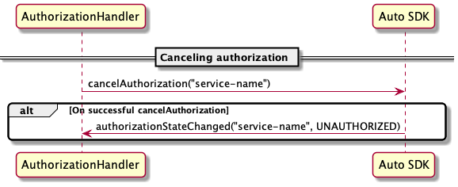
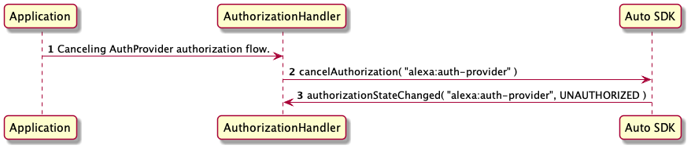

# Alexa Auto SDK Authorization <!-- omit in toc -->

**Table of Contents** <!-- omit in toc -->

- [Overview](#overview)
- [Authorization interface specification](#authorization-interface-specification)
  - [Generic Authorization sequence diagrams](#generic-authorization-sequence-diagrams)
    - [Start authorization](#start-authorization)
    - [Cancel authorization](#cancel-authorization)
    - [Log out](#log-out)
- [Authorize for Alexa with the CBL module](#authorize-for-alexa-with-the-cbl-module)
- [Authorize for Alexa with an application-provided method](#authorize-for-alexa-with-an-application-provided-method)
  - [Start authorization](#start-authorization-1)
  - [Receive events from the Engine](#receive-events-from-the-engine)
  - [Send events to the Engine](#send-events-to-the-engine)
  - [Provide an access token](#provide-an-access-token)
  - [Cancel authorization](#cancel-authorization-1)
  - [Log out](#log-out-1)
  - [Handle errors](#handle-errors)
  - [Optional Auth Provider Engine configuration](#optional-auth-provider-engine-configuration)

## Overview

To make requests to services such as Alexa, the Auto SDK Engine requires authorization. For example, the Engine includes a Login with Amazon (LWA) access token in every request to Alexa. The access token authorizes the Engine to interact with Alexa on behalf of the user. For each service that requires authorization, there may be more than one method of performing the authorization; for instance, there are multiple methods of acquiring an LWA token that authorizes access to Alexa. See the [Authorize an AVS Device](https://developer.amazon.com/en-US/docs/alexa/alexa-voice-service/authorize-overview.html) for details of each method.

The Auto SDK `Core` module provides an Engine service for managing the authorization with any arbitrary authorization provider. The [`Authorization`](https://alexa.github.io/alexa-auto-sdk/docs/sdk-docs/modules/core/aasb-docs/Authorization/index.html) interface specifies generic messages for your Auto SDK client application to initiate an authorization method, terminate an authorization method, or give provider-specific authorization data to the Engine. The actions the Engine takes in response to an `Authorization` message depend on which provider the message corresponds to as well as which software component is responsible for performing the authorization method.

This following sections describe the Auto SDK `Authorization` interface followed by details to use the `Authorization` interface for LWA Alexa authorization in your application. To simplify your Alexa authorization implementation, the Engine provides an implementation of the code-based linking (CBL) LWA authorization method, which you can use in your application by [integrating with the CBL module](#authorize-for-alexa-with-the-cbl-module). Alternatively, your application can provide the implementation to fetch access tokens through [any method you choose](#authorize-for-alexa-with-an-application-provided-method). 

> **Note:** All diagrams in the following sections show sequences using the deprecated `Authorization` platform interface of Auto SDK 3.3. Instead of the platform interface, your application will use the analagous `Authorization` AASB messages with the MessageBroker. The concepts are the same between the two interfaces.

> **Important!:** Logging out from [CBL module](#authorize-for-alexa-with-the-cbl-module) or [application-provided](##authorize-for-alexa-with-an-application-provided-method) authorization clears the Auto SDK databases that store user data, such as alerts and settings. For example, when the user logs out, the Alexa module Engine components clear pending alerts in the alerts database to ensure that the next user who logs in does not receive any pending alerts. However, the Alexa module Engine components also clear the locale setting at log out and reset the setting to the default value from the Engine configuration. Therefore, if the device locale setting is different from the default locale when the next user signs in, you must set the locale before starting an authorization flow.

## Authorization interface specification

The `Authorization` interface is generic enough to support authorization with any authorization provider and provide the Engine with any type of data relevant to that authorization provider. It is also generic enough to support different components owning the authorization process depending on the method. For example, your application might use the method in which *the Engine* acquires LWA Alexa access tokens, or it might use the method in which *your application* provides its own implementation to acquire LWA Alexa access tokens. In either case, your application interacts with the same `Authorization` API; only the protocol in the payload varies.

The Engine supports a fixed set of providers, and each provider corresponds to a protcol your application uses in `Authorization` message payloads. See the [`Authorization`](https://alexa.github.io/alexa-auto-sdk/docs/sdk-docs/modules/core/aasb-docs/Authorization/index.html) message reference for details.

Regardless of the authorizaton method you choose, your application will do the following general steps:

* Subscribe to the `SetAuthorizationData` message. The Engine publishes this message to tell your application to store provider-specific data.

* Subscribe to the `GetAuthorizationData` message. The Engine publishes this message to retrieve provider-specific data from your application. Your application publishes the synchronous-style reply message in response.

* Subscribe to the `AuthorizationStateChanged` message. The Engine publishes this message to notify your application of status changes during the authorization flow.

* Subscribe to the `EventReceived` message. The Engine publishes this message to notify your application of provider-specific events during the authorization flow.

* Subscribe to the `AuthorizationError` message. The Engine publishes this message to notify your application of errors in the authorization flow.

* Publish the `StartAuthorization` message to start the authorization flow. You must publish this message every time you start the Engine. The Engine does not persist the state across reboots.

* Publish the `CancelAuthorization` message to cancel the authorization flow.

* Publish the `SendEvent` message to notify the Engine about a provider-specifc event.

* Publish the `Logout` message to notify the Engine that the user signed out of your application.

### Generic Authorization sequence diagrams

The following sequence diagrams show typical data flow when your application uses the `Authorization` interface.

#### Start authorization


#### Cancel authorization



#### Log out


## Authorize for Alexa with the CBL module

The Engine provides an implementation of the code-based linking method of acquiring LWA access tokens. To use the implementation, build the Auto SDK with the `CBL` module, link the library in your application, and follow the `Authorization` protocol specified in the [`CBL` module documentation](../cbl/README.md). 

## Authorize for Alexa with an application-provided method

This section uses the term "Auth Provider authorization" to refer to any general method through which your application aquires an Alexa access token to provide to the Engine.

>**Note:** Auth Provider authorization and other authorization methods, such as [using the CBL module](#authorize-for-alexa-with-the-cbl-module), are mutually exclusive. For example, if the application is already registered with CBL, starting Auth Provider authorization logs out the application from the previous authorization.

The `service` name used with the `Authorization` interface for Auth Provider authorization is `alexa:auth-provider`.

### Start authorization

To start authorization, publish the `StartAuthorization` message. The `data` parameter is empty. 

<p>

</p>

### Receive events from the Engine

The application receives an event from the Engine via `EventReceived` in the following scenarios:

* when the Engine requests the application to start authorization
* when the application needs to log out of the authorization

To request the application to start authorization, the Engine passes the request to the application by using the `event` parameter. The parameter is a string containing JSON with the following structure:

~~~
{
    "type": "requestAuthorization"
}
~~~

To log out, the `event` parameter is a string containing JSON with the following structure:

~~~
{
    "type": "logout"
}
~~~

### Send events to the Engine

To notify the Engine of an authorization state change, the application uses the `event` parameter of the `SendEvent` message. The parameter is a string containing JSON with the following structure:

~~~
{
    "type":"authStateChangeEvent",
    "payload": {
        "state": {{STRING}}
    }
}
~~~

The accepted `state` strings are `AUTHORIZED` and `UNAUTHORIZED`.

The application needs to notify the Engine of an authorization state change for either of the following scenarios:
* There is a request from Engine via `EventReceived` with `type` set to `requestAuthorization`.
* The application transitions to a new state, e.g., from `UNAUTHORIZED` to `AUTHORIZED`.


### Provide an access token

The Engine requests the application to get the access token by specifying `accessToken` as the `key` in the `GetAuthorizationData` message as follows. The application replies with the `GetAuthorizationData` reply message with the `data` parameter set to a string containing JSON, formatted like the following example:  

~~~
{
    "accessToken":"Atza|AAAAAABBBBBBCCCCCC"
}
~~~

### Cancel authorization

To cancel authorization, publish the `CancelAuthorization` message. Publish this message to cancel the authorization flow before publishing `SendEvent`. Canceling authorization does not affect the device authorization state.

<p>

</p>

### Log out

To log out, publish the `Logout` message.

<p>

</p>

> **Note:** Your application must delete access and refresh tokens when the user signs out of their Amazon account. When the user wants to use Alexa again, and your application has no tokens, the user must sign in again.

> **Note:** Your application should stop the audio player if the user logs out of the application while music is playing.

### Handle errors

The Engine notifies the application about any error during the authorization flow.

The following list describes possible errors during authorization:

* `UNKNOWN_ERROR`: An unrecoverable error happens in the authorization flow.
* `AUTH_FAILURE`: An invalid or expired access token was provided.
* `LOGOUT_FAILED`: The Engine cannot complete the logout flow.
* `START_AUTHORIZATION_FAILED`: The Engine cannot start the authorization flow.

In any of these scenarios, the Engine publishes `AuthorizationError` with `error` set to one of the values enumerated above.

### Optional Auth Provider Engine configuration
By default, the Engine supports one Auth Provider authorization. However, if your application supports more than one, include the following JSON object in your Engine configuration:

```
{
    "aace.alexa" : {
        "authProvider" : {
           "providers" : [<LIST_OF_PROVIDER_NAME_STRINGS>]
        }
    }
}
```

For example, if your application supports two Auth Provider authorizations, named "serviceA" and "serviceB," provide the following configuration:


```
{
    "aace.alexa" : {
        "authProvider" : {
           "providers" : ["serviceA" , "serviceB"]
        }
    }
}
```

With this configuration, the Engine uses the `service` names "serviceA" and "serviceB" with the `Authorization` messages interface instead of using the default Auth Provider `service` name `alexa:auth-provider`. The rest of the sequence is the same.


