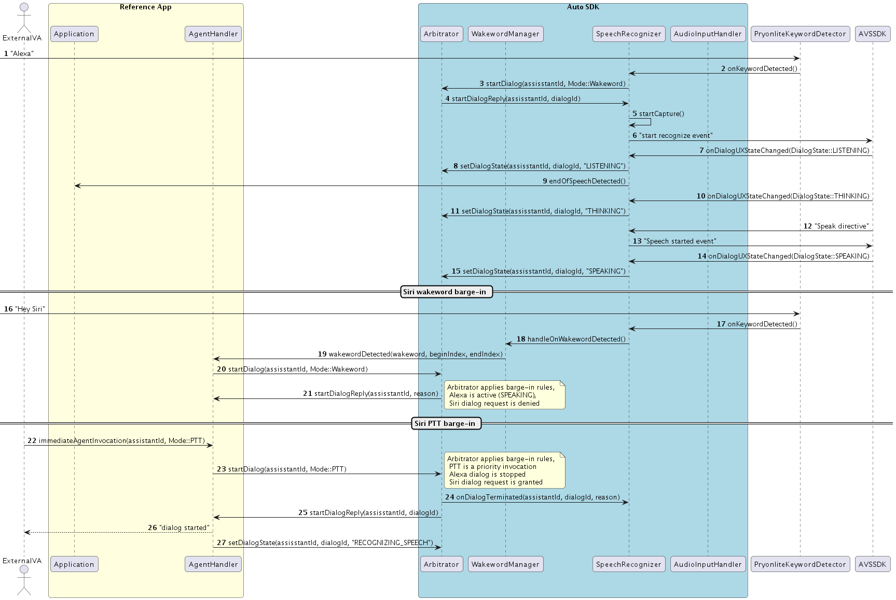
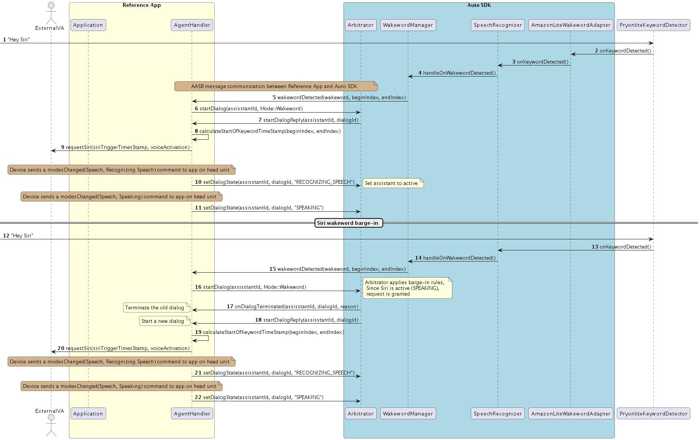

# Arbitrator Module

## Overview

The Arbitrator module has interfaces to manage multiple agents (aka voice assistants like Alexa, Siri, etc) and their dialog states. This module is responsible for determining if an agent’s request for dialog is granted or denied, and if an active agent’s dialog can be interrupted. This arbitration between agents is done based on rules configured both at the system level, and when registering the agent with the Arbitrator. 

The [Arbitrator interface](https://alexa.github.io/alexa-auto-sdk/docs/aasb/core/Arbitrator/) provides messages to
* Register agents - both Alexa and external 3rd Party
* Allow registered agents to request dialog to become the active agent
* Allow registered agents to update their dialog state
* Enforce wakeword interruption (barge-in) rules
* Enforce gesture interruption for immediate agent invocation (Push-To-Talk/Tap-To-Talk) rules

## Configuration the Arbitrator Module

The following changes are added in config.json for the Arbitrator module to specify system-level wake word barge-in settings across all agents. 

    "aace.arbitrator": {
        "Arbitrator": {
            "WakewordInterruption": "ACTIVE_AGENT_ONLY" 
            "GestureInterruption": "ANY_AGENT" 
            }
    }

**For WakewordInterruption**

* **ACTIVE_AGENT_ONLY**: Barge-in via only the speaking agent's wake word,
* **ANY_AGENT**: Barge-in via any agent's wake word

This setting depends on the 3rd Party VA platform - (For example the OEM can set this value to `ACTIVE_AGENT_ONLY` to satisfy CarPlay Enahnced Siri Requrement"*)*

**For GestureInterruption**

For example "Button Down" in ESR.

* **ACTIVE_AGENT_ONLY**: Interruption via only the active agent's PTT/TTT,
* **ANY_AGENT**: Interruption via any agent's PTT/TTT

This setting depends on the 3rd Party VA platform -  (For example the OEM can set this value to `AGENT_ONLY` to satisfy CarPlay Enahnced Siri Requrement"*)*

**NOTE:** If no configuration is provided for this module at Engine start, the default values for both the settings are **ACTIVE_AGENT_ONLY**

# Sequence Diagrams

Click to expand or collapse AgentRegistration sequence diagram. 

Click to expand or collapse AlexaInvocation sequence diagram. 

An example of Alexa Invocation when no agent is active

Click to expand or collapse 3rd Party Invocation with no agent is active sequence diagram.

Example of 3rd Party Invocation when no agent is active

Click to expand or collapse Barge-in of non-active agent sequence diagram 

Example of Barge-in of non-active agent when Alexa is active

Click to expand or collapse Barge-in of active agent sequence diagram.

Example of Barge-in of active agent when agent is speaking

