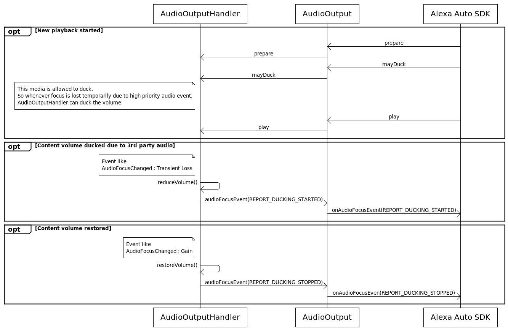

# AudioOutput Interface <!-- omit in toc -->

## Overview

The core audio Engine service provides a mechanism for Engine components of any module to open audio output channels in your application. Each Engine component that requests an audio channel specifies its audio channel type so your application can provide a media player implementation specific to the channel type. The [`AudioOutput`](https://alexa.github.io/alexa-auto-sdk/docs/aasb/core/AudioOutput/index.html) interface provides AASB messages for the Engine to request your application to play or perform other operations on audio output data.

## Understand AudioOutput

Your application subscribes to the outgoing `AudioOutput` AASB messages published by the Engine. When some Engine component needs to play audio, the Engine publishes `AudioOutput` messages that specify content to play with a `token` uniquely identifying the content. 

To set up content for playback, the Engine includes an `audioType` in an `AudioOutput.Prepare` message. The Engine defines the following audio types for which it requests playback via `AudioOutput`:

- **TTS—** This audio output type plays speech audio data. For example, Alexa's speech responses from the `SpeechSynthesizer` interface

- **MUSIC—** This audio output type plays media. For example, Amazon Music or other streaming content from the `AudioPlayer` interface

- **NOTIFICATION—** This audio output type plays notification audio cues. For example, short cues from the `Notifications` interface

- **ALARM—** This audio output type plays alarms. For example, repeating alarm audio from the `Alerts` interface

- **EARCON—** This audio output type plays Alexa attention state audio cues. For example, the audio cue to indicate Alexa started listening

- **COMMUNICATION—** This audio output type plays the audio for Alexa-to-Alexa calling. For example, the "other side" of the user's Alexa-to-Alexa call placed using the `Alexa Comms` module.

- **RINGTONE—** This audio output type plays ringtones. For example, the inbound or outbound ringing tone of the user's Alexa-to-Alexa call placed using the `Alexa Comms` module.

Your application determines how to handle each different audio type. The simplest integration, for example, might play all audio output types with multiple instances of the same underlying media player implementation. A more sophisticated integration might provide different media player implementations depending on the audio type— for example, using a low-level audio implementation for `NOTIFICATION` and `EARCON` types, and a high-level implementation for `TTS` and `MUSIC`. The best approach depends on your system-specific use cases.

> **Important!** Even though your application might use the same media player implementation for multiple audio output types, the actual integration must be able to handle the Engine having multiple channels open at the same time; for example, there might be music buffered in the `MUSIC` channel media player while the user makes a quick Alexa-to-Alexa call using the `RINGTONE` and `COMMUNICATION` channels. The Engine is agnostic to how you buffer and control the audio, but it does require your integration to be capable of keeping the right state of all channels that are active at the same time. I.e., starting `RINGTONE` audio playback is not allowed to override your active `MUSIC` playback buffer.

After preparing an appropriate media player implementation with content specified in a `Prepare` message, the Engine will publish additional messages with the same `token` instructing your application to perform additional operations on the content, such as starting playback, pausing, stopping, or querying data about the content. Messages that request data require your application to publish a synchronous-style reply message, and messages that request playback operations require your application to asynchronously respond with a message when the media state has changed. See the [AudioOutput AASB message reference](https://alexa.github.io/alexa-auto-sdk/docs/aasb/core/AudioOutput/index.html) for complete details about which messages require which responses.

## Enable music ducking

The `AudioOutput` interface allows audio ducking for the `MUSIC` audio type. Your application can duck music playback when a higher priority Alexa audio channel acquires foreground focus or when any external application's audio channel acquires foreground focus. To enable music audio ducking, provide the following JSON in your Engine configuration:

```json
{
    "aace.alexa" : {
        "audio": {
            "audioOutputType.music": {
                "ducking": {
                    "enabled" : true
                }
            }
        }
    }
}
```
Alternatively, use the `AlexaConfiguration::createDuckingConfig()` factory function to generate the `EngineConfiguration` object.

```cpp
auto audioDuckingConfig = aace::alexa::config::AlexaConfiguration::createDuckingConfig(true);
```

This Engine configuration is required in order for you to use the [`AudioFocusEvent`](https://alexa.github.io/alexa-auto-sdk/docs/aasb/core/AudioOutput/#audiofocusevent) message to report externally-initiated audio ducking events on the music channel. The configuration is also required to enable the Engine to publish [`StartDucking`](https://alexa.github.io/alexa-auto-sdk/docs/aasb/core/AudioOutput/#startducking) and [`StopDucking`](https://alexa.github.io/alexa-auto-sdk/docs/aasb/core/AudioOutput/#stopducking) messages to your application. See [Duck audio](#duck-audio) for additional details about using these messages.

## Use the AudioOutput interface in a native C++ application

This section describes how to integrate the AudioOutput AASB messages in your application.

### Prepare content for playback

When your application receives a `Prepare` message, use the `audioType` value in the payload to determine which of your media player implementations will handle the content (if your application manages multiple player types). There are two flavors of content that a `Prepare` message might use:

1. If the [`Prepare`](https://alexa.github.io/alexa-auto-sdk/docs/aasb/core/AudioOutput/#prepare) message includes a `url` in its payload, begin downloading the content at the URL and preparing your media player for playback when the Engine requests it. URL-based content is used by the Alexa module's `AudioPlayer` interface, for example, to specify content provided by Amazon Music, Flash Briefing, Audible, TuneIn, and other media streaming skills.

2. If the [`Prepare`](https://alexa.github.io/alexa-auto-sdk/docs/aasb/core/AudioOutput/#prepare_1) message includes a `streamId`, the Engine will write the audio data directly to a `MessageStream` object that you retrieve through `MessageBroker`. Call `MessageBroker::openStream()`, specifying the `streamId` from the `Prepare` message and the operation mode `MessageStream::Mode::READ`. To retrieve the audio data for your buffer, repeatedly call `MessageStream::read()` on the stream object until `MessageStream::isClosed()` returns true, indicating the Engine has no more data to add to the stream. 
   
   > **Important!:** Your application should use a separate thread to read the content from the stream into your media player's buffer. For some types of audio, the Engine can continuously write data to the stream for a long time and may request operations on the content playback in parallel. Your application may not block MessageBroker's outgoing thread or block operations on the content (such as play or pause) from happening immediately when requested.

Keep track of the `token` and `channel` from the `Prepare` message since these values are used in further messages to and from the Engine for the content. 

After publishing a `Prepare` message, the Engine can optionally publish a [`MayDuck`](https://alexa.github.io/alexa-auto-sdk/docs/aasb/core/AudioOutput/#mayduck) message to indicate if your application is allowed to duck this particular audio item during its playback (for example, when an external application temporarily takes foreground audio focus but allows your Alexa app audio to play at a ducked volume). If you receive this message, your player is allowed to duck the audio during its playback any time the system requests it and report the ducking as outlined in [Duck audio](#duck-audio). If you do not receive a `MayDuck` message before receiving a `Play` message for the audio item, your application is not allowed to duck this audio content.

### Start playback

Begin playback of the buffered content only after you receive a [`Play`](https://alexa.github.io/alexa-auto-sdk/docs/aasb/core/AudioOutput/#play) message with matching `token`. Your media player might take a moment to start playback (for instance, if there is not enough content buffered), so publish the asynchronous [`MediaStateChanged`](https://alexa.github.io/alexa-auto-sdk/docs/aasb/core/AudioOutput/#mediastatechanged) message with `state` set to `PLAYING` when your player begins to play. Specify the cached `token` and `channel` for the content in this message.

Unless you receive another message with matching `token`, such as a request from the Engine to pause or stop the playback, your player should continue to play back all of the content for this audio item until there is no more content to play. Publish the `MediaStateChanged` message with `state` set to `STOPPED` to tell the Engine when the content is finished. The Engine will not send any further AASB messages for this particular audio item (identified by the `token`), and it may or may not tell your player to prepare new content (such as another track in a playlist) with a fresh `Prepare` message.

### Set the playback position

If the Engine needs your player to seek to a particular position in the media stream, your application receives a [`SetPosition`](https://alexa.github.io/alexa-auto-sdk/docs/aasb/core/AudioOutput/#setposition) message. Your player must update its playback position to the offset specified in the `position` parameter.

### Respond to queries about the playback

The Engine might need to query your implementation for information about the active playback. Publish the reply messages quickly so you don't delay the user's interactions with Alexa.

If you receive a [`GetPosition`](https://alexa.github.io/alexa-auto-sdk/docs/aasb/core/AudioOutput/#getposition) message, use the synchronous-style [reply message](https://alexa.github.io/alexa-auto-sdk/docs/aasb/core/AudioOutput/#getpositionreply) to notify the Engine of the current playback offset in the media stream (or the most recent offset if the stream isn't currently playing). The Engine will query the position any time the user makes a request to Alexa as well as various other times during playback.

If you receive a [`GetNumBytesBuffered`](https://alexa.github.io/alexa-auto-sdk/docs/aasb/core/AudioOutput/#getnumbytesbuffered) message, use the synchronous-style [reply message](https://alexa.github.io/alexa-auto-sdk/docs/aasb/core/AudioOutput/#getnumbytesbufferedreply) to notify the Engine how many bytes your player has buffered for the current audio item.

If you receive a [`GetDuration`](https://alexa.github.io/alexa-auto-sdk/docs/aasb/core/AudioOutput/#getduration) message, use the synchronous-style [reply message](https://alexa.github.io/alexa-auto-sdk/docs/aasb/core/AudioOutput/#getdurationreply) to notify the Engine of the duration of the current audio item

### Handle a buffer underrun during playback
    
If your player encounters a buffer underrun during playback (i.e., your playback buffer has run out and is refilling slower than the rate needed for playback), you can notify the Engine by publishing a [`MediaStateChanged`](https://alexa.github.io/alexa-auto-sdk/docs/aasb/core/AudioOutput/#mediastatechanged) message with `state` set to `BUFFERING`. Publish another `MediaStateChanged` message with `state` set to `PLAYING` when the buffer is refilled.

### Handle an error during playback

If your player encounters an error during playback, notify the Engine by publishing a [`MediaError`](https://alexa.github.io/alexa-auto-sdk/docs/aasb/core/AudioOutput/#mediaerror) message. Publishing this message indicates to the Engine that the player has stopped playback due to an error and cannot resume, so ensure you do not begin playback for this audio item after publishing a `MediaError` message. 

After receiving `MediaError` for an audio item, the Engine will not request any more playback operations, such as play, pause, or resume, for this audio item. However, it is possible that the Engine can still query data about the audio item (see [Respond to queries about the playback](#respond-to-queries-about-the-playback)). The Engine expects the most recently known state of the audio in this case, so cache any retrievable data until the Engine prepares a new audio item with the same audio type.

### Pause and resume playback

The Engine can request your player to pause the content playback by publishing a [`Pause`](https://alexa.github.io/alexa-auto-sdk/docs/aasb/core/AudioOutput/#pause) message. When you receive this message, you must pause playback and preserve the state of the audio in the buffer. Publish a [`MediaStateChanged`](https://alexa.github.io/alexa-auto-sdk/docs/aasb/core/AudioOutput/#mediastatechanged) message with `state` set to `STOPPED` to indicate to the Engine that your player has paused as requested. Your player will remain paused until you receive a [`Resume`](https://alexa.github.io/alexa-auto-sdk/docs/aasb/core/AudioOutput/#resume) message for the same audio item. Publish a [`MediaStateChanged`](https://alexa.github.io/alexa-auto-sdk/docs/aasb/core/AudioOutput/#mediastatechanged) message with `state` set to `PLAYING` to indicate to the Engine that your player has resumed as requested.

> **Note:** The Engine uses the `Pause` and `Resume` messages for temporary operations, typically related to higher priority Alexa channels taking over. For example, the Engine will temporarily pause audio playing from the `AudioPlayer` channel when the `SpeechSynthesizer` channel needs to play Alexa speech. The Engine resumes the `AudioPlayer` audio when the `SpeechSynthesizer` audio is finished. For cases in which a user presses a pause button or makes a voice request to pause `AudioPlayer` streaming content, the Engine typically uses the `Stop` message for this sort of pause operation. When the user resumes the playback with the button or voice, the Engine will `Prepare` and `Play` a new audio item even though the content is the same.

> **Important!** Do not publish a [`MediaStateChanged`](https://alexa.github.io/alexa-auto-sdk/docs/aasb/core/AudioOutput/#mediastatechanged) message with `state` set to `STOPPED` in an attempt to notify the Engine of some locally-initiated pause or stop operation. The `STOPPED` state has three interpretations in the Engine, and which one the Engine uses depends on its state prior to receiving the `STOPPED` state from your application. 
> 
>   1. If you publish the `STOPPED` state after the Engine published `Pause` for the audio item, the Engine interprets the `STOPPED` as a successful pause. The Engine will `Resume` the audio when it needs to.
> 
>   2. If you publish the `STOPPED` state after the Engine published `Stop` for the audio item, the Engine interprets the `STOPPED` as a successful stop. The Engine considers this media item complete and flushed from the buffer. The audio item is not resumable any more.
> 
>   3. If you publish the `STOPPED` state proactively (i.e., not after a `Pause` or `Stop` request from the Engine), the Engine interprets this as meaning that the content is finished playing. If the Engine has more content in its queue, such as a subsequent track in a playlist, the Engine will continue to `Prepare` and `Play` the next item automatically.
>
> If you need to pause or stop audio playback for the `MUSIC` audio type due to a user button press or some system audio focus event, you must use the `PlaybackController` interface from the Alexa module to request the Engine to halt the playback. There is no AASB message to pause other audio types.

### Stop playback

The Engine can request your player to stop the content playback by publishing a [`Stop`](https://alexa.github.io/alexa-auto-sdk/docs/aasb/core/AudioOutput/#stop) message. When you receive this message, you must stop playback and publish a [`MediaStateChanged`](https://alexa.github.io/alexa-auto-sdk/docs/aasb/core/AudioOutput/#mediastatechanged) message with `state` set to `STOPPED` to indicate to the Engine that your player has stopped as requested. The Engine considers this media item complete and non-operable any more, so you will not receive further requests for playback operations, such as play, pause, or resume, for this audio item. However, it is possible that the Engine can still query data about the audio item (see [Respond to queries about the playback](#respond-to-queries-about-the-playback)). The Engine expects the most recently known state of the audio in this case, so cache any retrievable data until the Engine prepares a new audio item with the same audio type.

### Duck audio

#### Engine-initiated

If your application has [enabled audio ducking for the music channel](#enable-music-ducking), the Engine can request your application to duck audio playback when a higher priority Alexa audio source temporarily needs the foreground audio focus rather than using the default behavior in which the Engine [pauses and resumes](#pause-and-resume-playback) the content. 

For example, sometimes the `AudioPlayer` channel is streaming media when the user interrupts to ask Alexa a question. Without ducking enabled, the Engine requests your application to pause the active audio output on the music channel. When the user and Alexa finish their interaction, the Engine requests your application to resume the audio. With ducking enabled, the Engine requests your application to start ducking the music channel content for the duration of the user's interaction with Alexa and then restores the original volume of the music when the interaction is over.

When the Engine needs your application to duck the volume of the music content, the Engine publishes the [`StartDucking`](https://alexa.github.io/alexa-auto-sdk/docs/aasb/core/AudioOutput/#startducking) message. When you receive this message, you must reduce the playback volume, preserve the state of the audio, and continue playback. When you receive a [`StopDucking`](https://alexa.github.io/alexa-auto-sdk/docs/aasb/core/AudioOutput/#stopducking) message, restore the audio playback to its original volume prior to ducking and continue playback.

#### Externally-initiated

If audio is active on the music channel *and* the Engine permitted the audio source to duck with the `MayDuck` message (see [Prepare content for playback](#prepare-content-for-playback)), your application is allowed to duck audio when external audio sources on the system overtake foreground audio focus. If this happens, you must report to the Engine that your media player implementation proactively ducked its own audio by publishing an [`AudioFocusEvent`](https://alexa.github.io/alexa-auto-sdk/docs/aasb/core/AudioOutput/#audiofocusevent) message with `focusAction` set to `REPORT_DUCKING_STARTED`. When your implementation regains foreground audio focus on the system and restores the volume to the original level, publish another [`AudioFocusEvent`](https://alexa.github.io/alexa-auto-sdk/docs/aasb/core/AudioOutput/#audiofocusevent) message with `focusAction` set to `REPORT_DUCKING_STOPPED`.

### Mute audio

The Engine can request your player to mute or unmute the content playback by publishing a [`MutedStateChanged`](https://alexa.github.io/alexa-auto-sdk/docs/aasb/core/AudioOutput/#mutedstatechanged) message. When you receive a `MutedStateChanged` message with `state` set to `MUTED`, you must mute the playback volume, preserving the state of the audio and continuing playback. When you receive a `MutedStateChanged` message with `state` set to `UNMUTED`, you must restore the playback volume, preserving the state of the audio and continuing playback. 

### Change audio volume

The Engine can request your player to change the volume of the content playback by publishing a [`VolumeChanged`](https://alexa.github.io/alexa-auto-sdk/docs/aasb/core/AudioOutput/#volumechanged) message. When you receive a `VolumeChanged` message, use the value of the `volume` parameter to adjust the volume of the audio source. The volume is a float in the range 0-1, so you can use it as a scaling factor for the actual volume range used by your media player.

### Example code

The following example code demonstrates how your application subscribes to the `AudioOutput` AASB messages.

<details markdown="1"><summary>
Click to expand or collapse C++ sample code</summary>

```cpp
#include <AACE/Core/MessageBroker.h>
#include <AASB/Message/Audio/AudioOutput/GetDurationMessage.h>
#include <AASB/Message/Audio/AudioOutput/GetNumBytesBufferedMessage.h>
#include <AASB/Message/Audio/AudioOutput/GetPositionMessage.h>
#include <AASB/Message/Audio/AudioOutput/MayDuckMessage.h>
#include <AASB/Message/Audio/AudioOutput/MediaErrorMessage.h>
#include <AASB/Message/Audio/AudioOutput/MediaStateChangedMessage.h>
#include <AASB/Message/Audio/AudioOutput/MutedStateChangedMessage.h>
#include <AASB/Message/Audio/AudioOutput/PauseMessage.h>
#include <AASB/Message/Audio/AudioOutput/PlayMessage.h>
#include <AASB/Message/Audio/AudioOutput/PrepareStreamMessage.h>
#include <AASB/Message/Audio/AudioOutput/PrepareURLMessage.h>
#include <AASB/Message/Audio/AudioOutput/ResumeMessage.h>
#include <AASB/Message/Audio/AudioOutput/SetPositionMessage.h>
#include <AASB/Message/Audio/AudioOutput/StartDuckingMessage.h>
#include <AASB/Message/Audio/AudioOutput/StopDuckingMessage.h>
#include <AASB/Message/Audio/AudioOutput/StopMessage.h>
#include <AASB/Message/Audio/AudioOutput/VolumeChangedMessage.h>

class MyAudioOutputHandler {

    // Call this during the "subscribe to AASB messages" phase of the Engine lifecycle
    void MyAudioOutputHandler::subscribeToAASBMessages() {
        m_messageBroker->subscribe(
            [=](const std::string& message) { handleMutedStateChangedMessage(message); },
            MutedStateChangedMessage::topic(),
            MutedStateChangedMessage::action());
        m_messageBroker->subscribe(
            [=](const std::string& message) { handlePauseMessage(message); },
            PauseMessage::topic(),
            PauseMessage::action());
        m_messageBroker->subscribe(
            [=](const std::string& message) { handlePlayMessage(message); },
            PlayMessage::topic(), PlayMessage::action());
        m_messageBroker->subscribe(
            [=](const std::string& message) { handlePrepareStreamMessage(message); },
            PrepareStreamMessage::topic(),
            PrepareStreamMessage::action());
        m_messageBroker->subscribe(
            [=](const std::string& message) { handlePrepareURLMessage(message); },
            PrepareURLMessage::topic(),
            PrepareURLMessage::action());
        m_messageBroker->subscribe(
            [=](const std::string& message) { handleMayDuckMessage(message); },
            MayDuckMessage::topic(),
            MayDuckMessage::action());
        m_messageBroker->subscribe(
            [=](const std::string& message) { handleResumeMessage(message); },
            ResumeMessage::topic(),
            ResumeMessage::action());
        m_messageBroker->subscribe(
            [=](const std::string& message) { handleSetPositionMessage(message); },
            SetPositionMessage::topic(),
            SetPositionMessage::action());
        m_messageBroker->subscribe(
            [=](const std::string& message) { handleStopMessage(message); },
            StopMessage::topic(),
            StopMessage::action());
        m_messageBroker->subscribe(
            [=](const std::string& message) { handleVolumeChangedMessage(message); },
            VolumeChangedMessage::topic(),
            VolumeChangedMessage::action());
        m_messageBroker->subscribe(
            [=](const std::string& message) { handleStartDuckingMessage(message); },
            StartDuckingMessage::topic(),
            StartDuckingMessage::action());
        m_messageBroker->subscribe(
            [=](const std::string& message) { handleStopDuckingMessage(message); },
            StopDuckingMessage::topic(),
            StopDuckingMessage::action());
        m_messageBroker->subscribe(
            [=](const std::string& message) { handleGetDurationMessage(message); },
            GetDurationMessage::topic(),
            GetDurationMessage::action());
        m_messageBroker->subscribe(
            [=](const std::string& message) { handleGetNumBytesBufferedMessage(message); },
            GetNumBytesBufferedMessage::topic(),
            GetNumBytesBufferedMessage::action());
        m_messageBroker->subscribe(
            [=](const std::string& message) { handleGetPositionMessage(message); },
            GetPositionMessage::topic(),
            GetPositionMessage::action());
    }

    void MyAudioOutputHandler::handleMutedStateChangedMessage(const std::string& message) {
        // Implement this stub to mute the audio
    }

    void MyAudioOutputHandler::handlePauseMessage(const std::string& message) {
        // Implement this stub to pause the audio
    }

    void MyAudioOutputHandler::handlePlayMessage(const std::string& message) {
        // Implement this stub to play the audio
    }

    void MyAudioOutputHandler::handlePrepareStreamMessage(const std::string& message) {
        PrepareStreamMessage msg = json::parse(message);
        auto stream = m_messageBroker->openStream(msg.payload.streamId, MessageStream::Mode::READ);
        
        // Implement this stub to read the stream content into the media player buffer 
        // Use a separate thread!
    }

    void MyAudioOutputHandler::handlePrepareURLMessage(const std::string& message) {
        // Implement this stub to download the URL contents into the media player buffer 
        // Use a separate thread!
    }

    void MyAudioOutputHandler::handleMayDuckMessage(const std::string& message) {
        // Implement this stub to set the prepared content as duck-able
    }

    void MyAudioOutputHandler::handleResumeMessage(const std::string& message) {
        // Implement this stub to resume the audio
    }

    void MyAudioOutputHandler::handleSetPositionMessage(const std::string& message) {
        // Implement this stub to set the audio playback position
    }

    void MyAudioOutputHandler::handleStopMessage(const std::string& message) {
        // Implement this stub to stop the audio playback
    }

    void MyAudioOutputHandler::handleVolumeChangedMessage(const std::string& message) {
        // Implement this stub to change the volume of the audio stream
    }

    void MyAudioOutputHandler::handleStartDuckingMessage(const std::string& message) {
        // Implement this stub to duck the audio stream volume
        // Alternatively, you can pause the audio stream if more suitable - just don't publish MediaStateChanged in this case
    }

    void MyAudioOutputHandler::handleStopDuckingMessage(const std::string& message) {
        // Implement this stub to restore the audio stream volume from the ducked state
        // You can resume the playback if you paused instead of ducking - just don't publish MediaStateChanged in this case
    }

    void MyAudioOutputHandler::handleGetDurationMessage(const std::string& message) {
        GetDurationMessage msg = json::parse(message);

        // Implement this stub to get the duration
        // Perform this operation quickly and publish the sync-style reply message
    }

    void MyAudioOutputHandler::handleGetNumBytesBufferedMessage(const std::string& message) {
        GetNumBytesBufferedMessage msg = json::parse(message);

        // Implement this stub to get the number of bytes buffered
        // Perform this operation quickly and publish the sync-style reply message
    }

    void MyAudioOutputHandler::handleGetPositionMessage(const std::string& message) {
        GetPositionMessage msg = json::parse(message);

        // Implement this stub to get the current playback offset (or the most recent offset if nothing is playing)
        // Perform this operation quickly and publish the sync-style reply message
    }

    // Call this function when you need to publish a MediaError message
    void MyAudioOutputHandler::publishMediaError(
        const std::string& token,
        MediaError error,
        const std::string& description) {
        MediaErrorMessage msg;
        msg.payload.token = token;
        msg.payload.error = error;
        msg.payload.description = description;

        m_messageBroker->publish(msg.toString());
    }

    // Call this function when you need to publish a MediaStateChanged message
    void MyAudioOutputHandler::publishMediaStateChanged(
        const std::string& channel,
        const std::string& token,
        MediaState state) {
        MediaStateChangedMessage msg;
        msg.payload.channel = channel;
        msg.payload.token = token;
        msg.payload.state = state;

        m_messageBroker->publish(msg.toString());
    }
}
```
</details>

### Sequence diagrams

> **Note:** The following diagrams show sequences using the deprecated `AudioOutput` platform interface of Auto SDK 3.3. Instead of the platform interface, your application will use the analogous `AudioOutput` AASB messages with the MessageBroker. The concepts are the same between the two interfaces.

#### Duck music volume when Alexa dialog or alerts take foreground focus


#### Duck music volume when an external audio source takes foreground focus



## Use the AudioOutput interface in an Android application

Alexa Auto Client Service (AACS) provides a default implementation of `AudioOutput` for the audio types `TTS` and `MUSIC`. You can use the default implementation in your application instead of integrating directly with the `AudioInput` AASB messages yourself for these particular audio types. See the [Android documentation](https://alexa.github.io/alexa-auto-sdk/docs/android/) for details about using the default implementation. 

For the remaining audio types, integrate with the AACS intents corresponding to the `AudioOutput` AASB messages in a similar manner to the description in [Use the AudioOutput interface in a native C++ application](#use-the-audiooutput-interface-in-a-native-c-application).