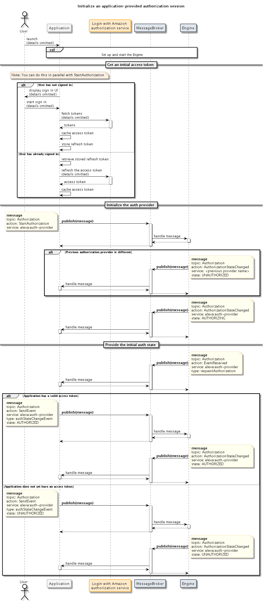
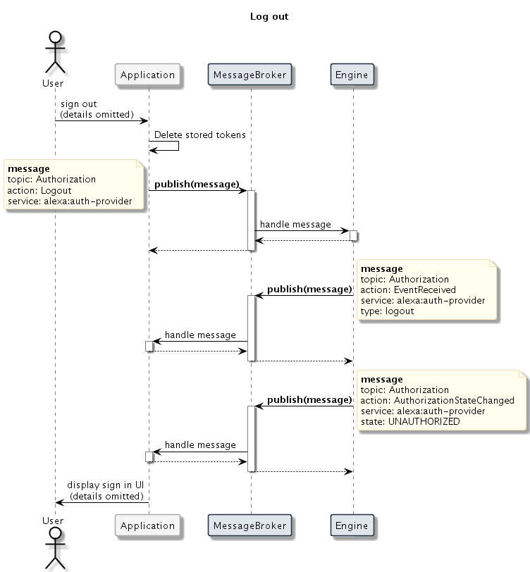

# Authorization Interface<!-- omit in toc -->

## Overview

To make requests to services such as Alexa, the Auto SDK Engine requires authorization. For example, the Engine includes a Login with Amazon (LWA) access token in every request to Alexa. The access token authorizes the Engine to interact with Alexa on behalf of the user. A service that requires authorization might have more than one method of performing the authorization; for instance, there are multiple methods to acquire an LWA token that authorizes access to Alexa. See the [Authorize an AVS Device](https://developer.amazon.com/en-US/docs/alexa/alexa-voice-service/authorize-overview.html) for details of each method.

The Auto SDK `Core` module provides an Engine service and [`Authorization`](https://alexa.github.io/alexa-auto-sdk/docs/aasb/core/Authorization/index.html) interface for your application to initiate, terminate, or provide data for an authorization session with an authorization provider. The following sections describe the Auto SDK `Authorization` interface and details to use the `Authorization` interface for LWA Alexa authorization in your application.

## Understand the Authorization interface

The [`Authorization`](https://alexa.github.io/alexa-auto-sdk/docs/aasb/core/Authorization/index.html) interface specifies generic messages to support authorization to any cloud service using any valid authorization method for that service. The actions the Engine takes in response to an `Authorization` message from your application depend on the provider to which the message corresponds, as well as the specific responsibilities of each software component involved in the authorization method. For example, in your Alexa integration, your application might use the method in which *the Engine* acquires LWA Alexa access tokens, so at first time user sign-in, your application requests the Engine to fetch a code for your application UI to display to the user. Alternatively, you might use the method in which *your application* provides its own implementation to acquire LWA Alexa access tokens, so at first time user sign-in, your application notifies the Engine that your application will will soon provide an access token that it acquires on its own. In either case, your application interacts with the same `Authorization` interface messages; only the protocol in the message payload varies.

Each authorization provider that the Engine supports corresponds to a protocol that your application uses in `Authorization` message payloads. See the [`Authorization`](https://alexa.github.io/alexa-auto-sdk/docs/aasb/core/Authorization/index.html) message reference for details about the messages and provider-specific documentation for details about the specific protocol to use with the messages. Regardless of the authorization provider you choose, your application does the following general steps:

Before starting the Engine, subscribe to the following messages:

- **[SetAuthorizationData](https://alexa.github.io/alexa-auto-sdk/docs/aasb/core/Authorization/index.html#setauthorizationdata)—** Requests your application to store provider-specific data.

- **[GetAuthorizationData](https://alexa.github.io/alexa-auto-sdk/docs/aasb/core/Authorization/index.html#getauthorizationdata)—** Requests your application to share provider-specific data. Your application publishes the synchronous-style [reply](https://alexa.github.io/alexa-auto-sdk/docs/aasb/core/Authorization/index.html#getauthorizationdatareply) message in response.

- **[EventReceived](https://alexa.github.io/alexa-auto-sdk/docs/aasb/core/Authorization/index.html#eventreceived)—** Notifies your application of provider-specific events during the authorization flow.
  
- **[AuthorizationStateChanged](https://alexa.github.io/alexa-auto-sdk/docs/aasb/core/Authorization/index.html#authorizationstatechanged)—** Notifies your application of status changes during the authorization flow.
  
- **[AuthorizationError](https://alexa.github.io/alexa-auto-sdk/docs/aasb/core/Authorization/index.html#authorizationerror)—** Notifies your application of errors during the authorization flow.

At runtime, publish the following messages:

- **[StartAuthorization](https://alexa.github.io/alexa-auto-sdk/docs/aasb/core/Authorization/index.html#startauthorization)—** Tells the Engine to start the authorization flow. Depending on the provider in use, this could be a request to the Engine to start fetching authorization data or a notification that your application is ready for authorization and will fetch or refresh authorization data on its own.

- **[SendEvent](https://alexa.github.io/alexa-auto-sdk/docs/aasb/core/Authorization/index.html#sendevent)—** Notifies the Engine about a provider-specific event.

- **[CancelAuthorization](https://alexa.github.io/alexa-auto-sdk/docs/aasb/core/Authorization/index.html#cancelauthorization)—** Tells the Engine to cancel the authorization flow. Depending on the provider in use, this could be a request to the Engine to cancel fetching authorization data while in progress or a notification that your application is canceling its own data fetching.
  
- **[Logout](https://alexa.github.io/alexa-auto-sdk/docs/aasb/core/Authorization/index.html#logout)—** Notifies the Engine that the user signed out of your application.

## Authorize for Alexa

To simplify your Alexa authorization implementation, the Engine provides an implementation of the code-based linking (CBL) LWA authorization method, which you can use in your application by [integrating with the CBL module](#use-the-cbl-module). Alternatively, your application can provide the implementation to fetch access tokens through [any method you choose](#use-an-application-provided-method). 

The different authorization providers for Alexa access tokens are mutually exclusive, so the Engine only allows one active provider session at a time. If your application has an active authorization session using the CBL module, for example, and switches to an application-provided authorization implementation, the Engine terminates the session with the CBL module provider prior to accepting further updates from the application-provided provider.

> **Important!:** Logging out from the [CBL module](#use-the-cbl-module) or [application-provided](#use-an-application-provided-method) authorization clears the Auto SDK databases that store user data, such as alerts and settings. For example, when the user logs out, the Alexa module Engine components clear pending alerts in the alerts database to ensure that the next user who logs in does not receive any alerts set by another user. However, the Alexa module Engine components also clear the locale setting at log out and reset the setting to the default value from the Engine configuration. Therefore, if the device locale setting is different from the default locale when the next user signs in, you must set the locale before starting an authorization flow.

### Use the CBL module

The Engine provides an implementation of the code-based linking method of acquiring LWA access tokens. To use the implementation, build the Auto SDK with the `CBL` module, link the library in your application, and follow the `Authorization` protocol specified in the [`CBL` module documentation](https://alexa.github.io/alexa-auto-sdk/docs/explore/features/cbl/). 

### Use an application-provided method

If you want your application to provide the implementation for fetching and refreshing Alexa access tokens, use the application-provided authorization method according to the following specification. Use `alexa:auth-provider` for the `service` parameter in `Authorization` messages.


#### Initialize the active authorization provider

When your application is ready to start an authorization session for `alexa:auth-provider`, publish the `StartAuthorization` message with empty `data` parameter. This `StartAuthorization` message notifies the Engine that your application-provided component is the active authorization provider. This allows the Engine to clear any previously active authorization provider sessions and ready itself to expect further state change notifications and access tokens from your application.

<details markdown="1">
<summary>Click to expand or collapse example StartAuthorization message</summary>

```
{
   "header": {
      "id": "7b388b36-6843-4f63-b3ad-ec69c16a518e",
      "messageDescription": {
         "topic": "Authorization",
         "action": "StartAuthorization"
      },
      "messageType": "Publish",
      "version": "4.0"
   },
   "payload": {
      "data": "",
      "service": "alexa:auth-provider"
   }
}
```

</details>

In response to the `StartAuthorization` message that requests to initialize `alexa:auth-provider`, the Engine will publish one or more `AuthorizationStateChanged` messages. The `state` parameter indicates the Engine's internal view of the authorization state for the provider specified in the `service` parameter. If a different provider was used more recently than `alexa:auth-provider`, the Engine un-initializes that provider and sets its state to `UNAUTHORIZED`.

<details markdown="1">
<summary>Click to expand or collapse example AuthorizationStateChanged message</summary>

```
{
   "header": {
      "id": "56f4fdb1-2174-44ba-850e-e46ae10488e6",
      "messageDescription": {
         "topic": "Authorization",
         "action": "AuthorizationStateChanged"
      },
      "messageType": "Publish",
      "version": "4.0"
   },
   "payload": {
      "service": "alexa:cbl",
      "state": "UNAUTHORIZED"
   }
}
```

</details>

Once any previously active authorization session is cleared, the Engine notifies your application that `alexa:auth-provider` is `AUTHORIZING`. The Engine does not consider your application-provided authorization component to be the active authorization provider until you receive this message.

<details markdown="1">
<summary>Click to expand or collapse example AuthorizationStateChanged message</summary>

```
{
   "header": {
      "id": "5d163203-2ebc-4169-ac45-e840fc125ad2",
      "messageDescription": {
         "topic": "Authorization",
         "action": "AuthorizationStateChanged"
      },
      "messageType": "Publish",
      "version": "4.0"
   },
   "payload": {
      "service": "alexa:auth-provider",
      "state": "AUTHORIZING"
   }
}
```

</details>

Once `alexa:auth-provider` reaches the `AUTHORIZING` state, the Engine needs to know whether there is an access token. It publishes the `EventReceived` message to request your application to publish its authorization state. The `data` parameter is a serialized JSON string with the following structure:

~~~
{
    "type": "requestAuthorization"
}
~~~

<details markdown="1">
<summary>Click to expand or collapse example EventReceived message</summary>

```
{
   "header": {
      "id": "9fac0f24-779b-4e69-91db-317c8988eedc",
      "messageDescription": {
         "topic": "Authorization",
         "action": "EventReceived"
      },
      "messageType": "Publish",
      "version": "4.0"
   },
   "payload": {
      "data": "{\"type\":\"requestAuthorization\"}",
      "service": "alexa:auth-provider"
   }
}
```

</details>

The Engine can also publish this `EventReceived` message at any point later in the application run time. Publish the `SendEvent` message in response to this `EventReceived` message. The `event` parameter is a serialized JSON string with the following structure:

~~~
{
    "type":"authStateChangeEvent",
    "payload": {
        "state": {{STRING}}
    }
}
~~~

The accepted values for `state` are `AUTHORIZED` and `UNAUTHORIZED`. Set `state` to `AUTHORIZED` if your application has an access token or `UNAUTHORIZED` if it does not have an access token yet.

<details markdown="1">
<summary>Click to expand or collapse example SendEvent message</summary>

```
{
   "header": {
      "id": "6f6baa3c-0de7-439d-aa67-c9b7ad858894",
      "messageDescription": {
         "topic": "Authorization",
         "action": "SendEvent"
      },
      "messageType": "Publish",
      "version": "4.0"
   },
   "payload": {
      "data": "{\"type\":\"authStateChangeEvent\",\"payload\":{\"state\":\"AUTHORIZED\"}}",
      "service": "alexa:auth-provider"
   }
}
```

</details>

Your application can also proactively publish this `SendEvent` message when its authorization state changes. For example, if the state was initially `AUTHORIZED` but later your application fails to refresh an expired token, publish `SendEvent` as specified above and use the state `UNAUTHORIZED`. If the application later recovers and acquires a new token, publish another `SendEvent`  message with state `AUTHORIZED`.

The Engine acknowledges the authorization state from your application by publishing an `AuthorizationStateChanged` message with its updated internal state.

<details markdown="1">
<summary>Click to expand or collapse example AuthorizationStateChanged message</summary>

```
{
   "header": {
      "id": "1a91c0ab-053e-4884-a275-ff5caf3207b8",
      "messageDescription": {
         "topic": "Authorization",
         "action": "AuthorizationStateChanged"
      },
      "messageType": "Publish",
      "version": "4.0"
   },
   "payload": {
      "service": "alexa:auth-provider",
      "state": "AUTHORIZED"
   }
}
```

</details>

The following diagram illustrates the sequence for your application to set the application-provided component as the active authorization provider.




#### Provide an access token

When your application is in the `AUTHORIZED` state, the Engine will request your application to provide the access token by publishing a `GetAuthorizationData` message with the `key` parameter set to `accessToken`. The Engine will publish `GetAuthorizationData` messages throughout the application run time, such as when the user invokes Alexa.

<details markdown="1">
<summary>Click to expand or collapse example GetAuthorizationData message</summary>

```
{
   "header": {
      "id": "5b6e905a-9def-411c-806d-7ef8fa1ad0a9",
      "messageDescription": {
         "topic": "Authorization",
         "action": "GetAuthorizationData"
      },
      "messageType": "Publish",
      "version": "4.0"
   },
   "payload": {
      "key": "accessToken",
      "service": "alexa:auth-provider"
   }
}
```

</details>

Your application includes the access token in the synchronous-style `GetAuthorizationData` reply message. The `data` parameter is a serialized JSON string with the following structure:
~~~
{
    "accessToken": {{STRING}}
}
~~~

<details markdown="1">
<summary>Click to expand or collapse example GetAuthorizationData reply message</summary>

```
{
   "header": {
      "id": "a680da01-8046-4401-9ab6-a8d6120f0814",
      "messageDescription": {
         "topic": "Authorization",
         "action": "GetAuthorizationData",
         "replyToId": "5b6e905a-9def-411c-806d-7ef8fa1ad0a9"  
      },
      "messageType": "Reply",
      "version": "4.0"
   },
   "payload": {
      "data": "{\"accessToken\":\"Atza|AAAAAABBBBBBCCCCCC\"}"      
    }
}
```

</details>

The following diagram illustrates an example sequence for your application to provide an access token to the Engine.


#### Cancel authorization

If your application needs to cancel an in-progress authorization initialization, you can publish a `CancelAuthorization` message prior to publishing `SendEvent` containing an access token. The Engine acknowledges this message from your application by publishing an `AuthorizationStateChanged` message with its updated internal state.

<details markdown="1">
<summary>Click to expand or collapse example CancelAuthorization message</summary>

```
{
   "header": {
      "id": "329ac412-82e2-46be-8c67-fd965dfe3dc6",
      "messageDescription": {
         "topic": "Authorization",
         "action": "CancelAuthorization"
      },
      "messageType": "Publish",
      "version": "4.0"
   },
   "payload": {
      "service": "alexa:auth-provider"
   }
}
```

</details>

> **Note:** If you need to terminate the authorization session when the auth state is `AUTHORIZED`, use the `Logout` message instead. 

The following diagram illustrates an example sequence for your application to cancel authorization.


#### Log out

When the user signs out of your application, publish a `Logout` message and delete any stored access or refresh tokens. The user must sign in to their Amazon account in order to use Alexa with your application again.

<details markdown="1">
<summary>Click to expand or collapse example Logout message</summary>

```
{
   "header": {
      "id": "a9e28b9a-6f9d-45b5-999a-19a421431af4",
      "messageDescription": {
         "topic": "Authorization",
         "action": "Logout"
      },
      "messageType": "Publish",
      "version": "4.0"
   },
   "payload": {
      "service": "alexa:auth-provider"
   }
}
```

</details>

The Engine acknowledges the `Logout` message from your application by publishing an `EventReceived` message with `type` set to `logout` and an `AuthorizationStateChanged` message with its updated internal state.

The following diagram illustrates an example sequence when the user signs out of your application.



#### Handle errors

If the Engine encounters an error during the authorization flow, it publishes an `AuthorizationError` message to your application. The `error` parameter specifies which issue the Engine encountered. The following list describes the values:

* `START_AUTHORIZATION_FAILED`: The Engine could not start the authorization flow.
* `LOGOUT_FAILED`: The Engine could not complete the logout flow.
* `AUTH_FAILURE`: The application provided an invalid or expired access token.
* `UNKNOWN_ERROR`: The Engine encountered any other type of unrecoverable error in the authorization flow.

<details markdown="1">
<summary>Click to expand or collapse example AuthorizationError message</summary>

```
{
   "header": {
      "id": "c7e93ab5-2509-4f0e-b421-32d0b5991279",
      "messageDescription": {
         "topic": "Authorization",
         "action": "AuthorizationError"
      },
      "messageType": "Publish",
      "version": "4.0"
   },
   "payload": {
      "service": "alexa:auth-provider",
      "error": "UNKNOWN_ERROR",
      "message": ""
   }
}
```

</details>

The following diagram illustrates an example error scenario in which the user de-registers their car from their Alexa account using the Alexa companion app while the car's Alexa application is running.


#### (Optional) Configure the Engine for multiple providers

By default, the Engine supports one application-provided authorization provider. However, if your application supports more than one, include the following JSON object in your Engine configuration:

```
{
    "aace.alexa" : {
        "authProvider" : {
           "providers" : [<LIST_OF_PROVIDER_NAME_STRINGS>]
        }
    }
}
```

For example, if your application supports providers "serviceA" and "serviceB," provide the following configuration:


```
{
    "aace.alexa" : {
        "authProvider" : {
           "providers" : ["serviceA" , "serviceB"]
        }
    }
}
```

With this configuration, the Engine uses the `service` names `serviceA` and `serviceB` with the `Authorization` interface messages instead of using the default `service` name `alexa:auth-provider`. The rest of the sequence is the same as `alexa:auth-provider`.
