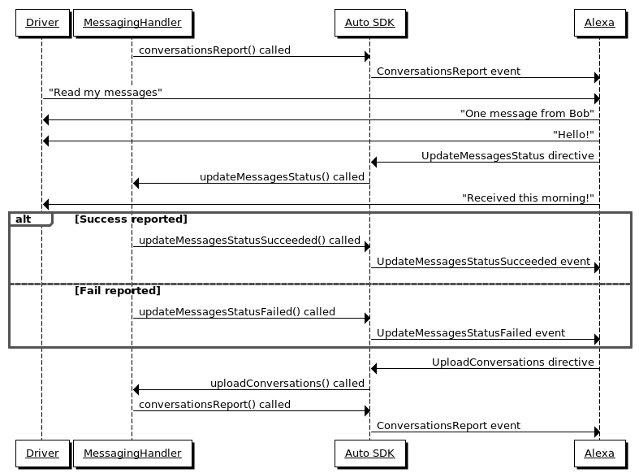

# Messaging Module

The Alexa Auto SDK Messaging module enables a platform implementation to use the Short Message Service (SMS) capabilities of Alexa, independent of the messaging device's connection mechanism. The SMS features of this module include reading messages, sending messages, and replying to messages as they are read. 

**Table of Contents**

- [Messaging Module](#messaging-module)
  - [Overview <a id="overview"></a>](#overview)
  - [Messaging Sequence Diagrams <a id="messaging-sequence-diagrams"></a>](#messaging-sequence-diagrams)
    - [Sending Messages](#sending-messages)
    - [Reading Messages and Reply](#reading-messages-and-reply)
    - [Reply to Message](#reply-to-message)
  - [Using the Messaging Module <a id = "using-the-messaging-module"></a>](#using-the-messaging-module)

## Overview <a id="overview"></a>

Registering a Messaging handler in your implementation enables the end user to interact with SMS features of the user's messaging device through Alexa. The user must consent to allow Alexa to read and send SMS messages through the messaging device. The Messaging feature can use phone numbers directly or use phone contacts uploaded via the [Address Book module](../address-book/README.md).

The platform implementation is responsible for managing the life cycle of the messaging session, including enhancing the end user experience by:

* Uploading unread SMS messages when the messaging device is connected, so they are ready for readout.
* Uploading new SMS messages when they are received on the messaging device.
* Updating the status of messages when notified to do so.
* Responding to messaging requests with appropriate successful or failure responses.

Alexa will not notify the user when new SMS messages are available. The platform implementation provides new message notifications.

For Alexa to read messages, the platform implementation must upload a conversation report containing all unread messages. The upload requires the messaging device be connected and Alexa be given read permission. Messages are grouped by conversation. Each message must be given a unique identifier. Conversations also have unique identifiers and contain the list of recipient phone numbers included in the conversation, but not the phone number of the messaging device. After Alexa reads a message, it notifies the platform implementation that the message was read. In the platform implementation, do not include read messages in subsequent conversation report uploads. The user can reply to a message while Alexa reads it. After Alexa reads all messages, or if message readout is interrupted, Alexa requests the upload of a new conversation report. In this way, Alexa stays in sync with unread messages on the messaging device. Unread messages are stored in the cloud for 12 hours before being deleted. By design Alexa will read a limited number of unread messages with a 'read messages' utterance. Therefore, it may be necessary to issue additional read messages requests to head all messages. 

When a user requests to send a message, Alexa asks the user for all the necessary information. Alexa then sends a request to the platform implementation to deliver the message. The message includes the text and a URL for the audio from which the message was created.

## Messaging Sequence Diagrams <a id="messaging-sequence-diagrams"></a>

The following sequence diagrams provide an overview of how the Alexa Auto SDK handles sending, reading, and replying to messages.

### Sending Messages

This diagram illustrates the sequence of sending messages using voice.


### Reading Messages and Reply

This diagram illustrates the sequence of reading messages using voice.



### Reply to Message

This diagram illustrates the sequence of replying to a read message using voice. Replying is always done within the context of the currently read message.


## Using the Messaging Module <a id = "using-the-messaging-module"></a>

To implement a custom `Messaging` handler, extend the `Messaging` class:

```cpp
#include <AACE/Messaging/Messaging.h>

class MessagingHandler : public aace::Messaging::Messaging {

    // The user asked Alexa to send a message.
    void sendMessage(const std::string& token, const std::string& message, const std::string& recipients) override { 
        // Parse list of recipients to extract the phone number(s)
        // Send message using the connected messaging device
        // Send response of the result using the received token
        // If message was sent successfully then call
        sendMessageSucceeded(token);
        // Otherwise, notify of error using code from @c ErrorCode enum and corresponding error message
        sendMessageFailed(token, ErrorCode::GENERIC_FAILURE, "Unable to send message");
    }

    // Alexa is requesting that a conversation report is uploaded so it can sync up the status of messages on the cloud. This may happen if messages are interrupted while Alexa is reading them.
    void uploadConversations(const std::string& token) override {
        conversationsReport(token, storedConversations);
    }

    // Alexa is notifying that messages have been read so they should be marked as such on the messaging device.
    void updateMessagesStatus(const std::string& token, const std::string& conversationId, const std::string& status) override {
        // Remove unread messages specified in the JSON array 'status' from the conversation that matches the identifier 'conversationId'
        // Send response of the result using the received token
        // If messages status was updated successfully then call
        updateMessagesStatusSucceeded(token);
        // Use appropriate error code from @c ErrorCode enum
        updateMessagesStatusFailed(token, ErrorCode::GENERIC_FAILURE, "Unable to update message status");
    }

    // Note: Return quickly, as handling in sendMessage, updateMessagesStatus, and uploadMessages should not block the caller. 
 
    ...

    // Connection to a calling device is established or broken.
    ConnectionState state = ...  // CONNECTED, DISCONNECTED
    // User granted/denied permissions to read and send messages
    PermissionState sendPermission = ... // ON, OFF
    PermissionState readPermission = ... // ON, OFF
    // Update Alexa with the state of messaging device
    updateMessagingEndpointState(state, sendPermission, readPermission);
    ...
    
    // Upload unread conversations and messages after a messaging device is connected and read permission is granted. The token should be empty as we are not responding to an @c updateConversations request. The conversations will be a JSON string following the documented format.
    conversationsReport("", storedConversations);
    ...
};
...

// Register a Messaging handler with the Engine.
std::shared_ptr<Messaging> messagingHandler = std::make_shared<MessagingHandler>();
engine->registerPlatformInterface(messagingHandler);
```
