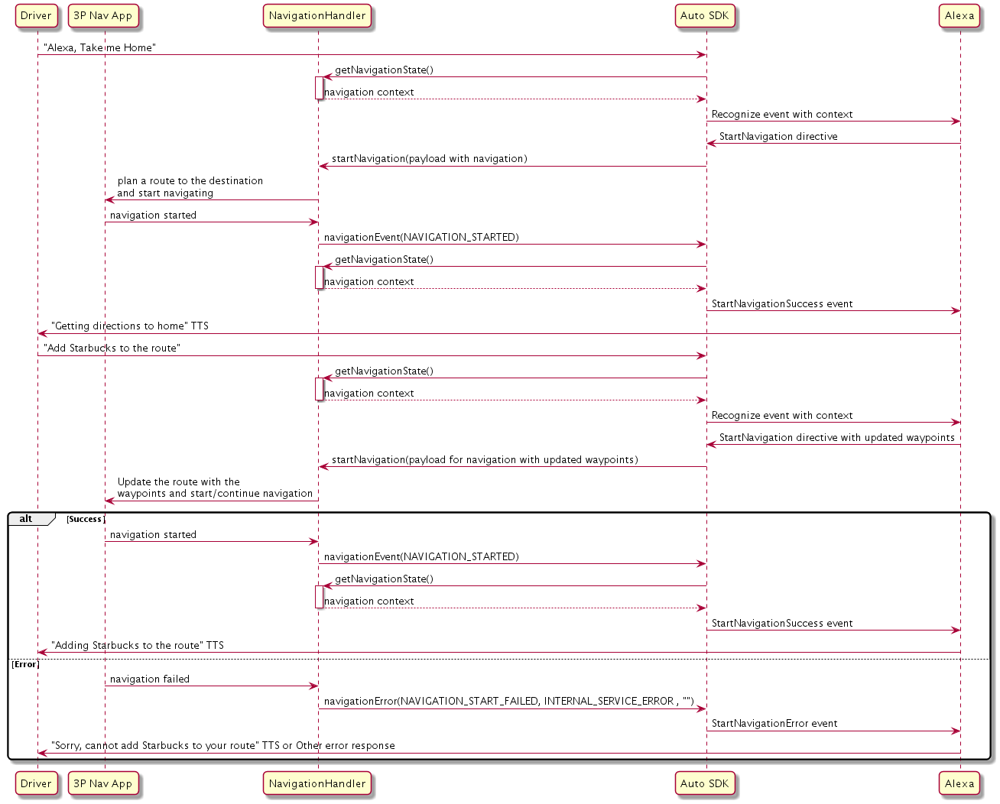
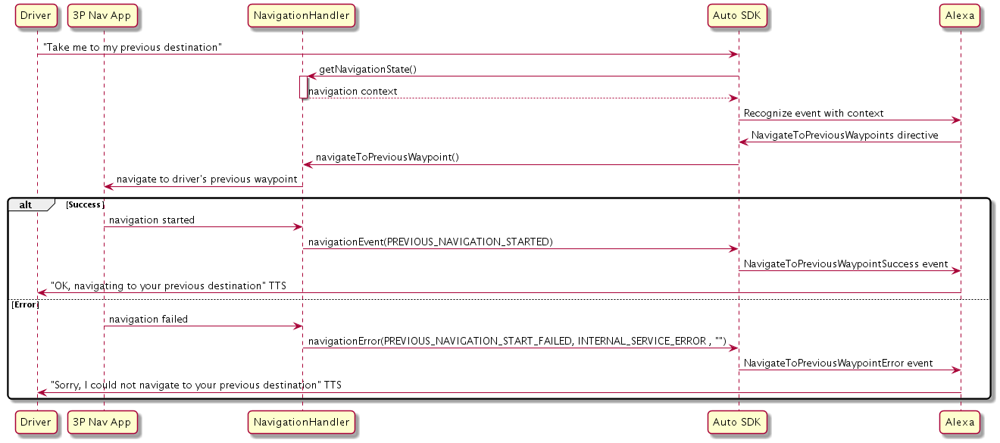
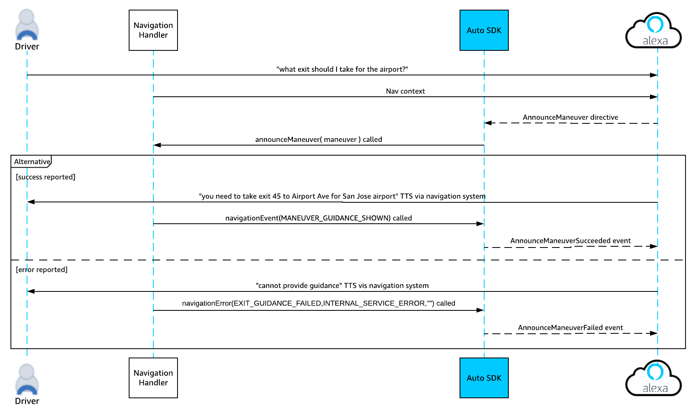
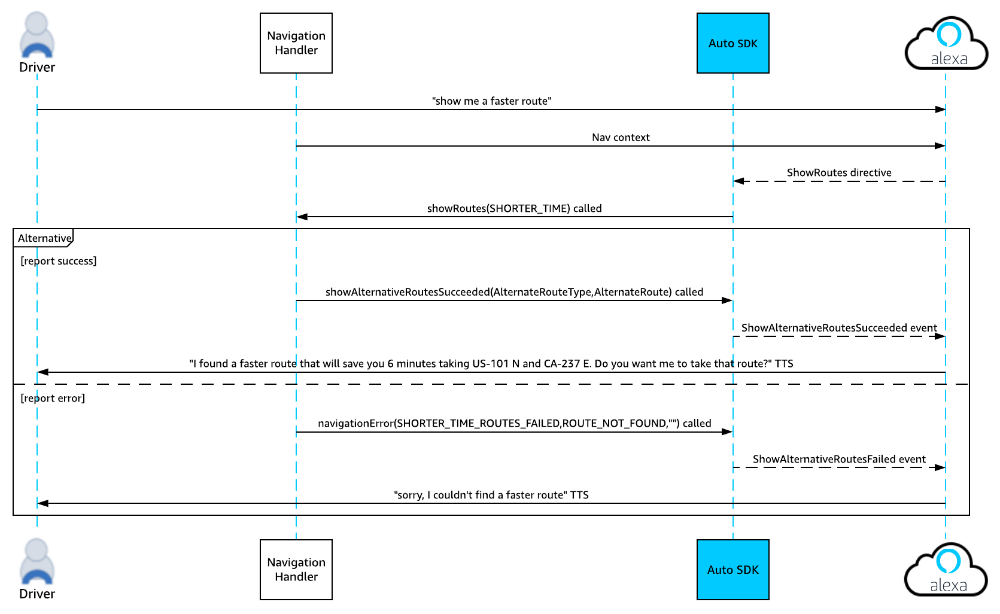

# Navigation Module

The Alexa Auto SDK Navigation module provides the interfaces required by your platform implementation to interface with the navigation capabilities of Alexa.

>**Note:** Beginning with Auto SDK v2.1.0, the `startNavigation()` method supersedes the `setDestination()` method. The payload included in the corresponding `startNavigation()` method is altered as well. Instead of a destination and metadata fields, it includes a waypoints field with all waypoint information for each waypoint/final destination included in the waypoint sub-objects.

**Table of Contents**

* [Overview](#overview)
* [Configuring the Navigation module](#configuring-the-navigation-module)
* [Navigation Sequence Diagrams](#navigation-sequence-diagrams)
* [Implementing a Navigation Handler](#implementing-a-navigation-handler)
* [Handling Events and Errors](#handling-events-and-errors)


## Overview<a id ="overview"></a>

Your platform implementation must implement handlers to handle navigation actions (such as starting and stopping navigation) when notified to do so by the Engine and to play any necessary navigation instructions using the onboard navigation system. How your implementation handles these requests is based on your navigation provider.

The Auto SDK Navigation module provides platform interfaces to support these features:

* **Start navigation** - Enables users to start navigation as well as set destinations and waypoints.
* **Stop navigation** - Enables users to stop the current navigation.
* **Add a waypoint** - Enables users to search and add waypoints to their current route along the way or start a new route with a given set of waypoints.
* **Cancel a waypoint** - Enables users to cancel a waypoint. 

    >**Note:** Setting destinations and waypoints and adding and removing waypoints are all handled by the `startNavigation()` method. `cancelNavigation()` still handles stopping navigation. 

* **Show/Navigate to previous waypoints** - Enables users to view previous waypoints (`showPreviousWaypoints()`) and navigate to any of their previous waypoints (`navigateToPreviousWaypoint()`).
    >**Note:** It is the responsibility of the navigation provider to store and provide the previous destination list to the user. The Auto SDK sample apps store a `previousDestinations()` list, which updates upon receipt of a `startNavigation` directive and is displayed for the corresponding directives.
* **Turn and Lane Guidance** - Enables users to ask Alexa for details about their next navigation instruction. This includes requesting information about a specific or generic route instruction (`announceManeuver()`) or road regulation information (`announceRoadRegulation`).
* **Control Display** - Enables users to interact with their onscreen map application using voice (`controlDisplay()`), including scrolling the display in different directions and displaying alternative routes (`showAlternativeRoutes()`).

You can also choose to enable some additional voice features (including navigating to favorite locations and asking for estimated time and distance to arrival) by [providing the current navigation state](#providing-the-current-navigation-state) in the `getNavigationState` callback.

## Navigation Sequence Diagrams <a id = "navigation-sequence-diagrams"></a>

>**Note:** The `navigationEvent`, `showAlternativeRoutesSucceeded` and `navigationError` events depicted in the diagrams below have been implemented in the Auto SDK in advance of the cloud implementation. Sending the events will not affect navigation functionality, but the Alexa cloud will return an `INVALID_REQUEST_EXCEPTION`/`INVALID_SERVICE_EXCEPTION`.

### Adding a Waypoint/Destination
This sequence diagram illustrates a possible flow for setting a waypoint or destination.

>**Note:** This diagram illustrates the sequence that will occur when the `navigationEvent` and `navigationError` events are implemented in the Alexa cloud. Until this implementation is complete, the cloud will send the success/error TTS with the `StartNavigation` directive rather than in response to the `navigationEvent` or `navigationError` event.



### Canceling a Waypoint/Destination
This sequence diagram illustrates a possible flow for cancelling a waypoint or destination.


This sequence diagram illustrates a possible multi-turn flow for cancelling a waypoint or destination.

>**Note:** The success/fail loop is omitted in this diagram for simplicity.


### Showing/Navigating to a Previous Destination

This sequence diagram illustrates a possible flow for showing a previous destination.

>**Note:** This diagram illustrates the sequence that will occur when the `navigationEvent` and `navigationError` events are implemented in the Alexa cloud. Until this implementation is complete, the cloud will send the success/error TTS with the `ShowPreviousWaypoints` directive rather than in response to the `navigationEvent` or `navigationError` event.


This sequence diagram illustrates a possible flow for navigating to a previous destination.

>**Note:** This diagram illustrates the sequence that will occur when the `navigationEvent` and `navigationError` events are implemented in the Alexa cloud. Until this implementation is complete, the cloud will send the success/error TTS with the `NavigateToPreviousWaypoints` directive rather than in response to the `navigationEvent` or `navigationError` event.



### Turn and Lane Guidance
This sequence diagram illustrates a possible flow for a use case in which the user requests turn or lane guidance. For this use case, we expect your platform implementation to handle conveying the success/failure information to the user.

>**Note:** This diagram illustrates the sequence that will occur when the `navigationEvent` and `navigationError` events are implemented in the Alexa cloud. Until this implementation is complete, the cloud will send the success/error TTS with the `AnnounceManeuver` directive rather than in response to the `navigationEvent` or `navigationError` event.



### Show Alternative Routes
This sequence diagram illustrates a possible flow for a use case in which the user requests alternative routes to a destination.

>**Note:** This diagram illustrates the sequence that will occur when the `showAlternativeRoutesSucceeded` and `navigationError` events are implemented in the Alexa cloud. Until this implementation is complete, the cloud will send the success/error TTS with the `ShowRoutes` directive rather than in response to the `showAlternativeRoutesSucceeded ` or `navigationError` event.



### Control Map Display
This sequence diagram illustrates a possible flow for a use case in which a user requests a map display adjustment.

>**Note:** This diagram illustrates the sequence that will occur when the `navigationEvent` and `navigationError` events are implemented in the Alexa cloud. Until this implementation is complete, the cloud will send the success/error TTS with the `ControlInterface` directive rather than in response to the `navigationEvent` or `navigationError` event.


## Configuring the Navigation Module <a id = "configuring-the-navigation-module"></a>
You can configure the Engine by defining "aace.navigation" configuration.

The following is an optional configuration to set the navigation provider name:

```
"aace.navigation": {
    "providerName": <PROVIDER_NAME> 
}
```

The `providerName` field specifies your navigation provider, which is used for matching search results in the Alexa cloud with the provider used on the device. The accepted values are "HERE", "TOMTOM", and "TELENAV". The default value is "HERE". Add the "aace.navigation" object to the same configuration file you use to configure the Engine.

You can alternatively use the `createNavigationConfig` method to configure the navigation provider programmatically. See [`aace.navigation.config.NavigationConfiguration.createNavigationConfig`](./platform/include/AACE/Navigation/NavigationConfiguration.h). for details.

```cpp
auto navigationConfig = aace::navigation::config::NavigationConfiguration::createNavigationConfig("HERE");
```

Refer to the [core module](../core/README.md) documentation for steps to specify configuration data programatically or through a JSON file.


## Implementing a Navigation Handler<a id = "implementing-navigation-handler"></a>

To implement a custom navigation handler to handle navigation requests from Alexa, extend the `Navigation` class:

```
#include <AACE/Navigation/Navigation.h>
class MyNavigation : public aace::navigation::Navigation {

    void showPreviousWaypoints() override {
        //call when receiving ShowPreviousWaypoints directive
        //handle showing information about previous waypoints
    }
    ... 
    
    void navigateToPreviousWaypoint() override {
        //call when receiving NavigateToPreviousWaypoint directive
        //handle navigation to previous waypoint
    }
    ...
    
    void showAlternativeRoutes() override {
        //call when receiving ShowAlternativeRoutes directive
        //pass AlternateRouteType enum
    }
    ...
    
    void controlDisplay() override {
        //call when receiving ControlDisplay directive
        //pass ControlDisplay enum
    }
    ...
    
    bool cancelNavigation() override {
        //handle cancel navigation request from Alexa
    }
    ...
    
    std::string getNavigationState() override {
        //return JSON string payload from NavigationState directive
        //return empty string to default payload to NOT_NAVIGATING
    }
    ...
    
    void startNavigation( const std::string& payload  ) override {
        //pass JSON string payload from StartNavigation directive
    }
    ...
    
    void announceManeuver( const std::string& payload ) override {
        //pass the JSON string payload from AnnounceManeuver directive
    }
    ...
    
    void announceRoadRegulation( RoadRegulation roadRegulation )
        //call when receiving AnnounceRoadRegulation directive
        //pass RoadRegulation enum
    } 
}    
    
...

// Register the platform interface with the Engine
engine->registerPlatformInterface( std::make_shared<MyNavigation>());
```

Following is an example `startNavigation` JSON string payload:

```
{
    "transportationMode": "DRIVING",
    "waypoints":[
       {
          "type":"{{STRING}}",
          "estimatedTimeOfArrival":{
             "ideal":"{{STRING}}",
             "predicted":"{{STRING}}"
          },
          "address": {
               "addressLine1": "{{STRING}}", //Address line 1
               "addressLine2": "{{STRING}}", //Address line 2
               "addressLine3": "{{STRING}}", //Address line 3
               "city": "{{STRING}}", //city
               "districtOrCounty": "{{STRING}}", //district or county
               "stateOrRegion": "{{STRING}}", // state or region
               "countryCode": "{{STRING}}", //3 letter country code
               "postalCode": "{{STRING}}", // postal code
          },
          "coordinate":[
             "{{LATITUDE_DOUBLE}}",
             "{{LONGITUDE_DOUBLE}}"
          ],
          "name":"{{STRING}}"
       },
       {
          "type":"{{STRING}}",
          "estimatedTimeOfArrival":{
             "ideal":"{{STRING}}",
             "predicted":"{{STRING}}"
          },
          "address":"{{STRING}}",
          "coordinate":[
             "{{LATITUDE_DOUBLE}}",
             "{{LONGITUDE_DOUBLE}}"
          ],
          "name":"{{STRING}}"
          "poiOfInterest":{
             "id":"{{STRING}}",
             "hoursOfOperation":[
                {
                   "dayOfWeek":"{{STRING}}",
                   "hours":[
                      {
                         "open":"{{STRING}}",
                         "close":"{{STRING}}"
                      }
                   ],
                   "type":"{{STRING}}"
                }
             ],
             "phoneNumber":"{{STRING}}"
        }
      }
    ]
  }      
}
```

### Providing the Current Navigation State <a id = "providing-the-current-navigation-state"></a>

Providing the full Navigation state is optional, but sending a navigation state payload from the `getNavigationState()` callback will enable the user to access additional features including:

* Add/remove waypoints
* Ask for Estimated Time of Arrival (ETA)
* Ask for Distance To Arrival (DTA)

To disable navigation state, you can return an empty string from the `getNavigationState()` callback. However, this will also disable the ability to cancel navigation using Alexa. 

If you are unable to provide full navigation state information, but would still like to provide the ability for the user to cancel navigation, you can pass a minimal payload to inform the Engine that the client is currently navigating. 

Here is an example minimal navigation state payload to send from the `getNavigationState()` callback:

```
{
  "state": "NAVIGATING",
  "waypoints": [],
  "shapes": []
}    
``` 

To enable the full navigation state capabilities, the platform must pass a JSON string payload as formatted in the example below. The accepted value for `state` is a string with value `NAVIGATING` or `NOT_NAVIGATING`. The `waypoints` field is an array of waypoint objects. The accepted values for the waypoint `type` is a string called `SOURCE`, `DESTINATION` or `INTERIM`. The time fields in the object should be in ISO 8601 UTC format. The `shapes` field is an array of route shape coordinates; only the first 100 will be sent to AVS. 

Here is an example NavigationState payload to send from the `getNavigationState()` callback:

```
{
  "state": "NAVIGATING",
  "waypoints": [
    {
      "type": "SOURCE",
      "estimatedTimeOfArrival": {
        "ideal": " "2019-12-09T16:35:57-08:00"
        "predicted": "2019-00-20T16:39:57-08:00"
      },
      "address": {
             ++ "addressLine1": 2795 Augustine Drive,
             ++ "addressLine2": "",
             ++ "addressLine3": "",
             ++ "city": Santa Clara
             ++ "districtOrCounty": "",
             ++ "stateOrRegion": "CA",
             ++ "countryCode": "",
             ++ "postalCode": "95054", 
    },
   ++ "name": "work",
    "coordinate": [37.380946, -121.9794846]
},  
{
      "type": "DESTINATION",
      "estimatedTimeOfArrival": {
        "ideal": "2019-12-09T17:00:00-08:00",
        "predicted": "2019-12-09T17:10:00-08:00"
      },
      "address": {
             ++ "addressLine1": 750 Castro Street,
             ++ "addressLine2": "",
             ++ "addressLine3": "",
             ++ "city": Mountain View
             ++ "districtOrCounty": "",
             ++ "stateOrRegion": "CA",
             ++ "countryCode": "",
             ++ "postalCode": "94041", 
      },
   ++ "name": "Starbucks",
    "coordinate": [37.380946, -121.9794846]
    "pointOfInterest": {
        "id": "POI Lookup Id",
        "phoneNumber": "+14084968523"
      }
    }
  ],
  "shapes": [
    [
      "37.380946",
      "-121.9794846"
    ],
    [
      "37.380946",
      "-121.9794846"
    ],
    ...
	]
}    
```  
## Handling Events and Errors <a id = "handling-events-and-errors"></a>

The Auto SDK bundles all navigation success events into two platform interface methods (`navigationEvent()` and `showAlternativeRoutesSucceeded()`), and it bundles all navigation error events into the `navigationError()` platform interface method. Your application should send a `navigationEvent()` or `navigationError()` only from a defined `EventName` or `EventType`.

>**Note:** Your application must send a `navigationError()`, even if it cannot handle a platform interface call. 

To handle events and errors, extend the `Navigation` class using these methods:

```
#include <AACE/Navigation/Navigation.h>
class MyNavigation : public aace::navigation::Navigation {
...
    
    void navigationEvent(EventName event )  override {
        //call to report the completion of a navigation event
        //event is an enum that associates event names with corresponding success events
        //ShowAlternativeRoutesSucceeded events are handled by a separate interface method
    }
    ...
    
    void navigationError( ErrorType type, ErrorCode code, const std::string& description ) override {
        //call when your application does not support the navigation feature or to report a problem handling the corresponding API
        //type is an enum with each type name corresponding to the event with which it is associated
        //code is an enum that maps to error codes sent in each event from Alexa.
        //description is an optional parameter
    }
    ...
    
    void showAlternativeRoutesSucceeded( const std::string& payload ) override {
        //call after receiving the ShowAlternativeRoutes directive and handling it successfully
        //pass a JSON payload string with information about the alternative route
    }
    ...
}    
    
``` 

Here is an example AlternativeRoutes payload to send with the `showAlternativeRoutesSucceeded()` event call:

```
{
    "inquiryType": "{{STRING}}" // DEFAULT, SHORTER_TIME, SHORTER_DISTANCE
    "alternateRoute":
    {
        "labels": ["{{STRING}}"],
        "savings": [
            {
                "type": "{{STRING}}", // DISTANCE, TIME
                "amount": "{{FLOAT}}",
                "unit": "{{STRING}}" // MINUTE, HOUR, YARD, FOOT, MILE, METER, KILOMETER
            }
        ]             
    }
}
```
