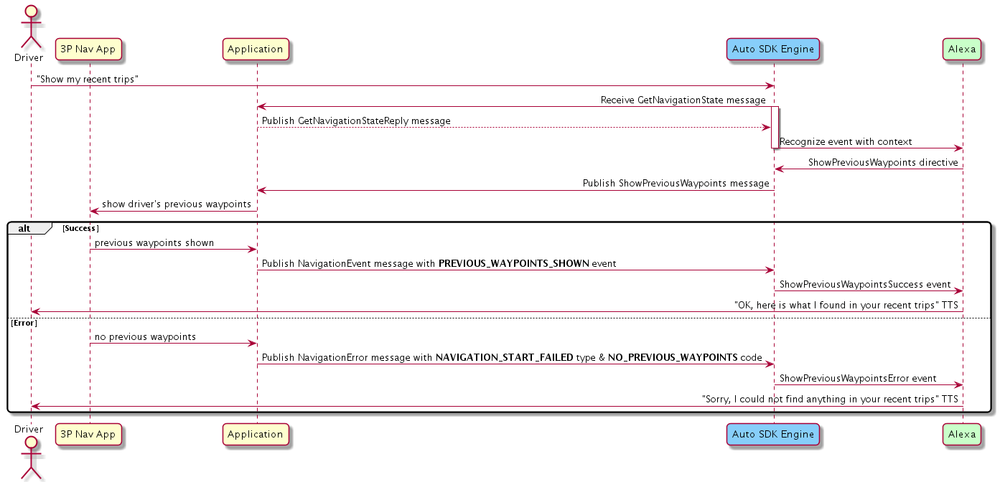
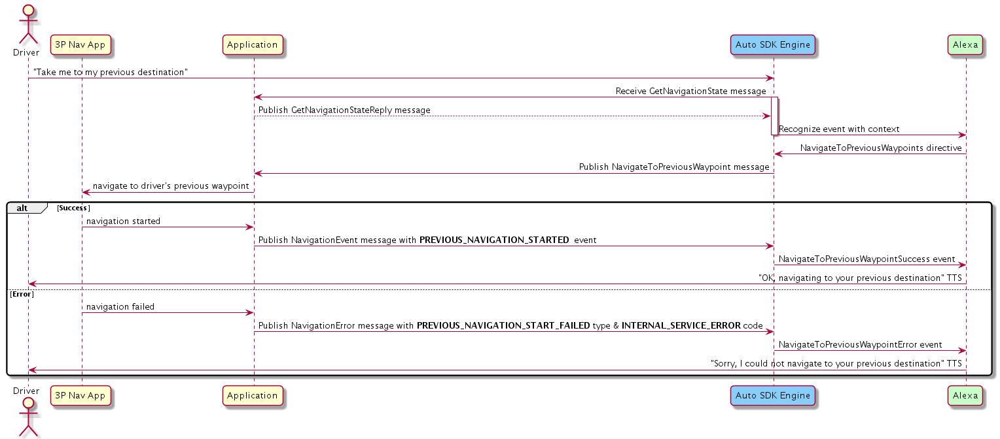
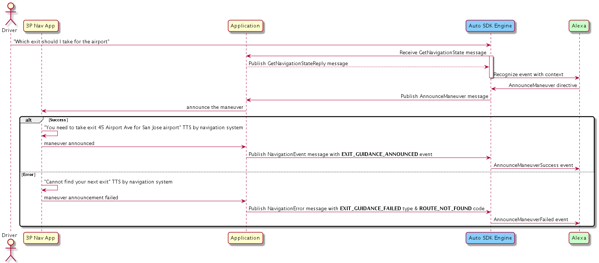
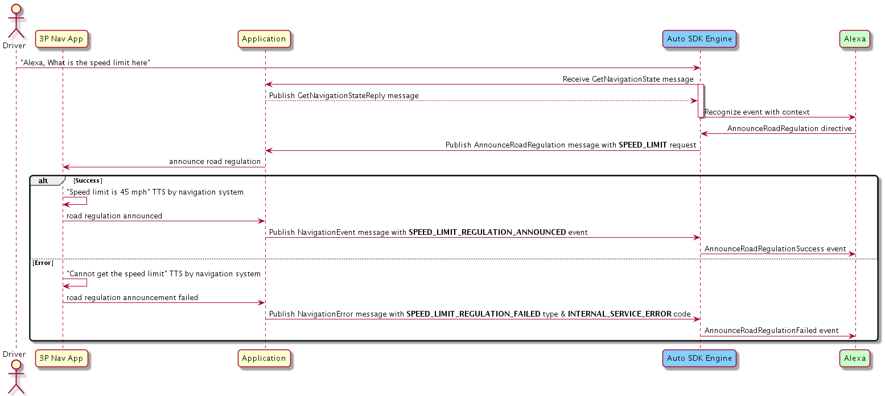

# Navigation Module

## Overview

The `Navigation` module enables your Alexa Auto SDK client application to use the navigation capabilities of Alexa and provides support for Alexa to interface with the onboard navigation system.

Your integration is responsible for handling navigation actions when notified to do so by the Engine. How these requests are handled is based on your navigation provider.


## Configuring the Navigation Module

To inform Alexa which navigation provider is used on the head unit, configure the `Navigation` module. Sometimes Alexa needs to query a cloud navigation provider API to fulfill a user request. Knowing which provider is used on the device allows for better customer experience because Alexa's results can more closely match what the user sees on the screen in the navigation app.

To configure the `Navigation` module, use the *"aace.navigation"* JSON object specified below in your Engine configuration:

```
{
    "aace.navigation": {
        "providerName": "{{STRING}}"
    }
}
```

| Property | Type | Required | Description | Example
|-|-|-|-|-|
| aace.navigation.providerName | string | No | The navigation service provider name. <br><br> **Accepted values:** <ul> <li> `"HERE"` (default) </li> <li> `"TOMTOM"`</li> <li> `"TELENAV"` </li> </ul>| `"HERE"`

Like all Auto SDK Engine configurations, you can either define this JSON in a file and construct an `EngineConfiguration` from that file, or you can use the provided configuration factory function [`aace::navigation::config::NavigationConfiguration::createNavigationConfig`](https://alexa.github.io/alexa-auto-sdk/docs/native/api/classes/classaace_1_1navigation_1_1config_1_1_navigation_configuration.html#ab984104f14947c042b67c8ed17b55364) to programmatically construct the `EngineConfiguration` in the proper format.

<details markdown="1"><summary>Click to expand or collapse NavigationConfiguration C++ sample code</summary>

```cpp
#include <AACE/Navigation/NavigationConfiguration.h>

std::vector<std::shared_ptr<aace::core::config::EngineConfiguration>> configurations;

auto navigationConfig = aace::navigation::config::NavigationConfiguration::createNavigationConfig("HERE");
configurations.push_back(navigationConfig);

// ... create other EngineConfiguration objects and add them to configurations...

m_engine->configure(configurations);

```

</details>
<br/>

### Android Integration

To use the `Navigation` module Engine configuration with AACS, use *"aacs.navigation"* instead of *"aace.navigation"* in your AACS configuration file:

```
{
    "aacs.navigation": {
        "providerName": "{{STRING}}"
    }
}
```

## Using the Navigation AASB Messages

### Providing the Current Navigation State

The navigation state context informs Alexa whether the device is navigating and provides Alexa with the user's routing information or the destination set by the user. Such information is necessary for Alexa to respond to route-based utterances, allowing the user to use the following features:

* Adding or removing waypoints
* Obtaining Estimated Time of Arrival (ETA)
* Obtaining Distance To Arrival (DTA)

When the user requests navigation information based on the current route, the Engine publishes the [`GetNavigationState` message](https://alexa.github.io/alexa-auto-sdk/docs/aasb/navigation/Navigation/index.html#getnavigationstate). The implementation should respond with the [`GetNavigationStateReply` message](https://alexa.github.io/alexa-auto-sdk/docs/aasb/navigation/Navigation/index.html#getnavigationstatereply) containing the navigation state passed as a JSON string payload.

> **Note:** Returning the navigation state must be quick. If querying the navigation provider for state information takes significant time, Amazon recommends that the application periodically query the provider to update the state in a cache. Then the application can obtain the information each time the Engine requests the navigation state.

The following table explains the properties in the JSON.

| Property | Type | Required | Description |
|-|-|-|-|
| state | String | Yes | The navigation device state. <br><br>**Accepted values:** <ul><li>`"NAVIGATING"`: Navigation engine is navigating to a predefined destination set. </li> <li>`"NOT_NAVIGATING"`: Navigation is not in progress.</li></ul> |
| shapes | Array of double arrays | Yes | The array contains an ordered list of coordinates depicting the route from the source to the destination. The coordinate is a latitude-longitude pair (in that order) specified as an array of doubles. The array can be empty. The maximum number of coordinates is 100.<br><br> **Special considerations:** <ul><li>The set of coordinates might not represent the complete route.</li><li>Shapes are provider specific. The shape of a route can correspond to one of these versions: a complete route, a route for a viewport, or a route defined for a certain distance.</li><li>One mile spacing between each coordinate in the shapes array is recommended.</li><li>The coordinates in the array are ordered in the same direction as the user is driving.</li></ul>
| waypoints | Array | Yes | List of objects, each representing a waypoint that is a stop on the route. Expand the section below for more information. <br><br> **Note:** Can be empty except when `state` is `"NAVIGATING"`.   

<details markdown="1"><summary>Click to expand or collapse the properties of <code>waypoints</code> object</summary>

</br>

| Property | Type | Required | Description |
|-|-|-|-|
| type | String | Yes | Type of the location on the route. <br><br>**Accepted values:** <ul><li>`SOURCE`: The location from which the user starts driving.</li><li>`DESTINATION`: Final location to which the user wants to navigate to.</li><li>`INTERIM`: Intermediate stop where the user wants to navigate to before reaching the destination.</ul>
| estimatedTimeOfArrival | Object | Yes (Applicable only if `type` is `"DESTINATION"` or `"INTERIM"`.) | Time of arrival at the waypoint, specified in the ISO-8601 time format. 
| estimatedTimeOfArrival.ideal | String | No | Expected arrival time without considering traffic, diversions, etc.
| estimatedTimeOfArrival.predicted | String | Yes | Expected arrival time, after considering traffic conditions. If the ideal ETA and predicted ETA match, only the predicted ETA will be populated.
| address | Object | No | Address of the waypoint specified in multiple string fields, such as `addressLine1`, `city`, etc. <br><br>**Note:** `countryCode` is a 3-letter country code in ISO 3166-1 alpha-3 format.
| name | String | No | Name of the waypoint (e.g., "work" or "Starbucks").
| coordinate | Array | Yes | An array consisting of the waypoint's latitude and longitude (in that order). The data type of latitude and longitude is double.
| pointOfInterest | Object | No | Information about the waypoint if the waypoint is also a point of interest (POI). Expand the section below for more information.

</details>

<details markdown="1"><summary>Click to expand or collapse the properties of <code>pointOfInterest</code> object</summary> 

</br>

| Property | Type | Required | Description |
|-|-|-|-|
| id | String | No (recommended if available) | ID for the POI known to Alexa. If `id` is provided, you can omit other properties of `pointOfInterest`. If the waypoint is added by the user via the navigation app, omit `id` because Alexa cannot recognize any ID assigned by the app. You can specify the ID if the waypoint is added by Alexa (e.g., by the utterance "Alexa, navigate to Whole Foods along the way"). It is specified in the `StartNavigation` message payload received from Alexa.
| hoursOfOperation | Array | No | Hours of operation for the POI.
| hoursOfOperation.dayOfWeek | String | Y | Day of week for this day. <br><br>**Accepted values:** `"MONDAY"`, `"TUESDAY"`, `"WEDNESDAY"`, `"THURSDAY"`, `"FRIDAY"`, `"SATURDAY"`, `"SUNDAY"`.
| hoursOfOperation.hours | Array | Yes | List of times when the POI is open or closed for the day, specified in ISO 8601 format with the timezone offset (time difference from UTC). <br></br>Properties in the array are:<ul><li>`open`: Time at which the POI is open.</li><li>`close`: Time at which the POI is closed.</li></ul>Timezone considerations:<ul><li>If the user and the POI are in different timezones, hours are converted to the timezone of the POI.</li><li>If timezone offset is omitted, the time is assumed to be a UTC time and then converted to the POI's timezone.</li></ul>**Note:** Hours for the next 7 days are provided by the data provider.
| hoursOfOperation.type | String | Yes | Status of the current operation. <br><br>**Accepted values:** `"OPEN_DURING_HOURS"`, `"OPEN_24_HOURS"`, `"CLOSED"`, `"UNKNOWN"`, `"HOLIDAY"`.
| phoneNumber | String | No | Phone number of the POI in E.164 format. 	

</details>

</br>

#### Examples of Navigation State Payload

<details markdown="1"><summary>Click to expand or collapse example Navigation State payload when navigation is in progress</summary>

</br>

```json
{
  "state": "NAVIGATING",
  "waypoints": [
    {
      "type": "SOURCE",
      "address": {
        "addressLine1": "2795 Augustine Drive",
        "addressLine2": "",
        "addressLine3": "",
        "city": "Santa Clara",
        "districtOrCounty": "",
        "stateOrRegion": "CA",
        "countryCode": "USA",
        "postalCode": "95054"
      },
      "name": "work",
      "coordinate": [
        37.3809462,
        -121.9794846
      ]
    },
    {
      "type": "INTERIM",
      "estimatedTimeOfArrival": {
        "ideal": "2019-12-09T17:00:00-08:00",
        "predicted": "2019-12-09T17:10:00-08:00"
      },
      "address": {
        "addressLine1": "750 Castro Street",
        "addressLine2": "",
        "addressLine3": "",
        "city": "Mountain View",
        "districtOrCounty": "",
        "stateOrRegion": "CA",
        "countryCode": "USA",
        "postalCode": "94041"
      },
      "name": "Starbucks",
      "coordinate": [
        37.3809461,
        -122.0830221
      ],
      "pointOfInterest": {
        "id": "AlexaLocalSearch:eyJpZCI6InllbHA6OnRGV01ySS1VWERGa09FcnZ6eXJ0clEiLCJjb3ZlcnMiOnsiUExBQ0VTX1JFUE8iOiJ5ZWxwOjp0RldNckktVVhERmtPRXJ2enlydHJRIn0sInF1ZXJ5SWQiOiItNjYxMzI1NTYxIiwiZGRiVGFibGVOYW1lIjoiZXMtbHNzLTIwMjEwNjE2Iiwid2VibGFiQWxsb2NhdGlvbnMiOnsiQUxTU19XRUJMQUJfT05CT0FSRF9URVNUSU5HXzI4MDI4NiI6IlQxIiwiQUxFWEFfTE9DQUxTRUFSQ0hfUExBQ0VUWVBFX0NMQVNTSUZJRVJfMzA4MTY5IjoiQyIsIkFMRVhBX0xPQ0FMX1NFQVJDSF9MMlJfRU5USVRZX1NIQURPV18yOTA5MDUiOiJDIiwiQUxFWEFfTE9DQUxfU0VBUkNIX1RSSUdHRVJfQU1CSUdVT1VTX1FVRVJZX0lERU5USUZJQ0FUSU9OXzMyNjMxNSI6IlQxIn19",
        "phoneNumber": "+14084968523"
      }
    },
    {
      "type": "DESTINATION",
      "estimatedTimeOfArrival": {
        "ideal": "2019-12-09T17:30:00-08:00",
        "predicted": "2019-12-09T17:40:00-08:00"
      },
      "address": {
        "addressLine1": "4800 El Camino Real",
        "addressLine2": "",
        "addressLine3": "",
        "city": "Los Altos",
        "districtOrCounty": "",
        "stateOrRegion": "CA",
        "countryCode": "",
        "postalCode": "94022"
      },
      "name": "Whole Foods Market",
      "coordinate": [
        37.3991897,
        -122.1106268
      ],
      "pointOfInterest": {
        "hoursOfOperation": [
          {
            "dayOfWeek": "MONDAY",
            "hours": [
              {
                "open": "08:00:00-08:00",
                "close": "22:00:00-08:00"
              }
            ],
            "type": "OPEN_DURING_HOURS"
          }
        ]
      }
    }
  ],
  "shapes": [
    [
      37.380946,
      -121.9794846
    ],
    [
      37.380545,
      -122.073252
    ],
    ...
  ]
}   
```
</details>

<details markdown="1"><summary>Click to expand or collapse example Navigation State payload when navigation no navigation is in progress</summary>

</br>

```json
{
  "state": "NOT_NAVIGATING",
  "waypoints":[],
  "shapes":[]
}
```
</details>

</br>

### Starting Navigation

To start navigation, the Engine publishes the [`StartNavigation` message](https://alexa.github.io/alexa-auto-sdk/docs/aasb/navigation/Navigation/index.html#startnavigation) passing a JSON string payload containing the destination information.

The following table explains the properties in the JSON.

| Property | Type | Required | Description |
|-|-|-|-|
| transportationMode |String | No | The mode of transportation. <br><br> **Accepted Values:** <ul> <li>`"BIKING"`</li> <li>`"DRIVING"`</li> <li>`"TRANSIT"`</li> <li>`"WALKING"`</li> </ul>|
| waypoints | Array | Yes | List of objects, each representing a waypoint that is a stop on the route. <br></br>The properties use the same schema used for state reporting. See the [Providing the Current Navigation State](#providing-the-current-navigation-state) section. |

<details markdown="1"><summary>Click to expand or collapse the <code>StartNavigation</code> message payload schema</summary>

</br>

```
{
    "transportationMode": "DRIVING",
    "waypoints":[
       {
          "type":"{{STRING}}",
          "estimatedTimeOfArrival":{
             "ideal":"{{STRING}}",
             "predicted":"{{STRING}}"
          },
          "address": {
               "addressLine1": "{{STRING}}",
               "addressLine2": "{{STRING}}",
               "addressLine3": "{{STRING}}",
               "city": "{{STRING}}",
               "districtOrCounty": "{{STRING}}",
               "stateOrRegion": "{{STRING}}",
               "countryCode": "{{STRING}}", 
               "postalCode": "{{STRING}}"
          },
          "coordinate":[
             {{LATITUDE_DOUBLE}},
             {{LONGITUDE_DOUBLE}}
          ],
          "name":"{{STRING}}"
       },
       {
          "type":"{{STRING}}",
          "estimatedTimeOfArrival":{
             "ideal":"{{STRING}}",
             "predicted":"{{STRING}}"
          },
          "address":"{{STRING}}",
          "coordinate":[
             {{LATITUDE_DOUBLE}},
             {{LONGITUDE_DOUBLE}}
          ],
          "name":"{{STRING}}",
          "pointOfInterest":{
             "id":"{{STRING}}",
             "hoursOfOperation":[
                {
                   "dayOfWeek":"{{STRING}}",
                   "hours":[
                      {
                         "open":"{{STRING}}",
                         "close":"{{STRING}}"
                      }
                   ],
                   "type":"{{STRING}}"
                }
             ],
             "phoneNumber":"{{STRING}}"
        }
      }
    ]
  }      
}
```

</details>
</br>

> **Note:** The waypoints in the route are determined by Alexa either through a proximity search or by resolving the user's uploaded navigation favorite name to its location. Your implementation should calculate the route from the `SOURCE` waypoint to the `DESTINATION` waypoint, with stops along the way at `INTERIM` waypoints in the order in which they appear in the payload. If there are multiple routes, your implementation should either pick the fastest route if no user interaction is possible, or let the user choose the route. After the route is chosen, your implementation should start navigation.

If navigation starts successfully, your implementation should publish the [`NavigationEvent` message](https://alexa.github.io/alexa-auto-sdk/docs/aasb/navigation/Navigation/index.html#navigationevent) with a `NAVIGATION_STARTED` event. Otherwise, it should publish the [`NavigationError` message](https://alexa.github.io/alexa-auto-sdk/docs/aasb/navigation/Navigation/index.html#navigationerror) with the  `NAVIGATION_START_FAILED` type, and `INTERNAL_SERVICE_ERROR` or `ROUTE_NOT_FOUND` code.

<details markdown="1"><summary>Click to expand or collapse sequence diagram: Starting Navigation</summary>
<br></br>


</details>
</br>

### Stopping Navigation

To stop navigation, the Engine publishes the [`CancelNavigation` message](https://alexa.github.io/alexa-auto-sdk/docs/aasb/navigation/Navigation/index.html#cancelnavigation). Consequently, when the Engine publishes the next [`GetNavigationState` message](https://alexa.github.io/alexa-auto-sdk/docs/aasb/navigation/Navigation/index.html#getnavigationstate) the state should be `NOT_NAVIGATING`.

<details markdown="1"><summary>Click to expand or collapse sequence diagram: Stopping Navigation</summary>
<br></br>


</details>
</br>

### Adding a Waypoint

If the user wants to add a waypoint, the Engine publishes the [`StartNavigation` message](https://alexa.github.io/alexa-auto-sdk/docs/aasb/navigation/Navigation/index.html#startnavigation). 

If navigation is in progress or route is present, the route to the final destination is changed by including the additional waypoint. Your implementation should calculate or re-calculate the route with the information of the waypoint.

If the waypoint is added successfully, your implementation should publish the [`NavigationEvent` message](https://alexa.github.io/alexa-auto-sdk/docs/aasb/navigation/Navigation/index.html#navigationevent) with a `NAVIGATION_STARTED` event. Otherwise, it should publish the [`NavigationError` message](https://alexa.github.io/alexa-auto-sdk/docs/aasb/navigation/Navigation/index.html#navigationerror) with the  `NAVIGATION_START_FAILED` type, and `INTERNAL_SERVICE_ERROR` or  `ROUTE_NOT_FOUND` code.

<details markdown="1"><summary>Click to expand or collapse sequence diagram: Adding a Waypoint</summary>
<br></br>


</details>
</br>

### Canceling a Waypoint

If the user wants to cancel a waypoint, the Engine publishes the [`StartNavigation` message](https://alexa.github.io/alexa-auto-sdk/docs/aasb/navigation/Navigation/index.html#startnavigation) after receiving the directive from Alexa with the updated waypoints. Your implementation should start navigation using the updated waypoints.

If navigation is started successfully, your implementation should publish the [`NavigationEvent` message](https://alexa.github.io/alexa-auto-sdk/docs/aasb/navigation/Navigation/index.html#navigationevent) with a `NAVIGATION_STARTED` event. Otherwise, it should publish the [`NavigationError` message](https://alexa.github.io/alexa-auto-sdk/docs/aasb/navigation/Navigation/index.html#navigationerror) with the  `NAVIGATION_START_FAILED` type, and `INTERNAL_SERVICE_ERROR` or  `ROUTE_NOT_FOUND` code.

<details markdown="1"><summary>Click to expand or collapse sequence diagram: Canceling a Waypoint</summary>
<br></br>


</details>
</br>

### Showing Previous Waypoints

If the user wants to display previous waypoints, the Engine publishes the [`ShowPreviousWaypoints` message](https://alexa.github.io/alexa-auto-sdk/docs/aasb/navigation/Navigation/index.html#showpreviouswaypoints). Each waypoint displayed includes at least the address.

If the device can successfully display the previous waypoints, your implementation should publish the [`NavigationEvent` message](https://alexa.github.io/alexa-auto-sdk/docs/aasb/navigation/Navigation/index.html#navigationevent) with a  `PREVIOUS_WAYPOINTS_SHOWN` event. Otherwise, it should publish the [`NavigationError` message](https://alexa.github.io/alexa-auto-sdk/docs/aasb/navigation/Navigation/index.html#navigationerror) with the `SHOW_PREVIOUS_WAYPOINTS_FAILED` type, and `INTERNAL_SERVICE_ERROR` or `NO_PREVIOUS_WAYPOINTS` code.

>**Note:** It is the responsibility of the navigation provider to store and provide the previous destination list to the user.

<details markdown="1"><summary>Click to expand or collapse sequence diagram: Showing Previous Waypoints</summary>
<br></br>



</details>
</br>

### Navigating to a Previous Waypoint

If the user wants to  navigate to a previous waypoint, the Engine publishes the [`NavigateToPreviousWaypoint` message](https://alexa.github.io/alexa-auto-sdk/docs/aasb/navigation/Navigation/index.html#navigatetopreviouswaypoint).

 The navigation app retrieves the most recently used destination, calculates a route from the current location, selects the fastest route or a route preferred by the user, and starts navigation.

If the device can successfully display the previous waypoints, your implementation should publish the [`NavigationEvent` message](https://alexa.github.io/alexa-auto-sdk/docs/aasb/navigation/Navigation/index.html#navigationevent) with a `PREVIOUS_NAVIGATION_STARTED` event. Otherwise, it should publish the [`NavigationError` message](https://alexa.github.io/alexa-auto-sdk/docs/aasb/navigation/Navigation/index.html#navigationerror) with the `PREVIOUS_NAVIGATION_START_FAILED` type, and `INTERNAL_SERVICE_ERROR` or `NO_PREVIOUS_WAYPOINTS` code.

<details markdown="1"><summary>Click to expand or collapse sequence diagram: Navigating to a Previous Waypoint</summary>
<br></br>



</details>
</br>

### Getting Turn and Lane Guidance Information

If the user wants to get turn and lane guidance, the Engine publishes the [`AnnounceManeuver` message](https://alexa.github.io/alexa-auto-sdk/docs/aasb/navigation/Navigation/index.html#announcemaneuver), passing a JSON string payload containing the manueuver information.

The following table explains the properties in the JSON.

| Property | Type | Required | Description |
|-|-|-|-|
| type | String | Yes | Specifies the type of information requested. <br><br>**Accepted values:** <ul><li>`"TURN"`:  The user asks about a turn. (e.g., "What's my next turn?")</li><li>`"EXIT"`: The user asks about a freeway exit. (e.g., "What's my next exit?")</li><li>`"ENTER"`: The user asks about how to get onto a street. (e.g., "Which lane should I be to get onto the US-101?")</li><li>`"MERGE"`: The user asks about the merge onto a street. (e.g., "Alexa, which lane do i need to merge onto the highway?")</li><li>`"LANE"`: The user asks for lane guidance. (e.g., "Alexa, which lane to take?")</li></ul>
| targetLocation | Object | No | Describes the location for which maneuver information is requested. If the target location is a POI, user place, or street address, Alexa provides at least one field in this object. If the utterance does not include a location (e.g., "Alexa, what's my next turn?"), `targetLocation` is omitted.  
| targetLocation.name | String | No | Specifies the name of the location (e.g., "HOME" or "WORK") for which the user requests the maneuver instruction.
| targetLocation.address | Object | No | Specifies the address for which the user requests the maneuver instruction. The object contains multiple string fields, which together form the complete address.
| targetLocation.coordinate | Array | No | The array value specifies the latitude and longitude of the target location. Data type for the values in the array is double.

<details markdown="1"><summary>Click to expand or collapse the <code>AnnounceManeuver</code> message schema</summary> 

</br>

```
{
  "type": "{{STRING}}",
  "targetLocation" : {
        "name": "{{STRING}}",
        "address": { 
            "addressLine1": "{{STRING}}", 
            "addressLine2": "{{STRING}}", 
            "addressLine3": "{{STRING}}", 
            "city": "{{STRING}}",
            "districtOrCounty": "{{STRING}}",
            "stateOrRegion": "{{STRING}}",
            "countryCode": "{{STRING}}",
            "postalCode": "{{STRING}}"
        },
        "coordinate": [
            {{LATITUDE_DOUBLE}},
            {{LONGITUDE_DOUBLE}}
        ]
  }
}
```

</details>
</br>

Your implementation should provide the navigation instruction as follows:

* If `targetLocation` is omitted, announce the next maneuver along the route.
* If `targetLocation` is specified and the location is along the route, announce the maneuver about the location. If `targetLocation` is specified but the location is not along the route, calculate the route to the location, announce maneuver from the user's current location to the target location, and inform the user the target location is NOT along the current route.
 
If the device can provide the maneuver instruction successfully, your implementation should publish the [`NavigationEvent` message](https://alexa.github.io/alexa-auto-sdk/docs/aasb/navigation/Navigation/index.html#navigationevent) with one of the following events:

> **events:** `TURN_GUIDANCE_ANNOUNCED`, `EXIT_GUIDANCE_ANNOUNCED`, `ENTER_GUIDANCE_ANNOUNCED`, `MERGE_GUIDANCE_ANNOUNCED`, `LANE_GUIDANCE_ANNOUNCED`
  
Otherwise, your implementation should publish the [`NavigationError` message](https://alexa.github.io/alexa-auto-sdk/docs/aasb/navigation/Navigation/index.html#navigationerror) with a type and code from the following:

> **types:** `TURN_GUIDANCE_FAILED`, `EXIT_GUIDANCE_FAILED`, `ENTER_GUIDANCE_FAILED`, `MERGE_GUIDANCE_FAILED`, `LANE_GUIDANCE_FAILED`

> **codes:** `INTERNAL_SERVICE_ERROR`, `ROUTE_NOT_FOUND`, `NOT_SUPPORTED`, `NOT_NAVIGATING`

<details markdown="1"><summary>Click to expand or collapse sequence diagram: Getting Turn and Lane Guidance Information</summary>
<br></br>



</details>
</br>

### Getting Road Regulation Information

If the user wants to get road regulation information, the Engine publishes the [`AnnounceRoadRegulation` message](https://alexa.github.io/alexa-auto-sdk/docs/aasb/navigation/Navigation/index.html#announceroadregulation), which passes a payload with the following schema:

```
{
  "type": "{{STRING}}"
}
```

| Property | Type | Required | Description |
|-|-|-|-|
| type | String | Yes | Type of road regulation requested. <br><br> **Accepted values:** <ul> <li>`"SPEED_LIMIT"` specifies the speed limit at the current position (e.g., when the user asks, "Alexa, what is the speed limit?").</li> <li>`"CARPOOL_RULES"` specifies the carpool regulations on the current highway (e.g., when the user asks, "Alexa, is carpool free now?").</li> </ul>|

If the device can provide the road regulation information successfully, your implementation should publish the [`NavigationEvent` message](https://alexa.github.io/alexa-auto-sdk/docs/aasb/navigation/Navigation/index.html#navigationevent) with a `SPEED_LIMIT_REGULATION_ANNOUNCED` or `CARPOOL_RULES_REGULATION_ANNOUNCED` event. Otherwise, it should publish the [`NavigationError` message](https://alexa.github.io/alexa-auto-sdk/docs/aasb/navigation/Navigation/index.html#navigationerror) with a type and code from the following:

> **types:** `SPEED_LIMIT_REGULATION_FAILED`, `CARPOOL_RULES_REGULATION_FAILED`

> **codes:** `INTERNAL_SERVICE_ERROR`, `ROUTE_NOT_FOUND`, `NOT_SUPPORTED`, `NOT_NAVIGATING`

<details markdown="1"><summary>Click to expand or collapse sequence diagram: Getting Road Regulation Information</summary>
<br></br>



</details>
</br>

### Controlling the Display

If the user wants to control the map display on the screen, the Engine publishes the [`ControlDisplay` message](https://alexa.github.io/alexa-auto-sdk/docs/aasb/navigation/Navigation/index.html#controldisplay).

If the device can adjust the display successfully, your implementation should publish the [`NavigationEvent` message](https://alexa.github.io/alexa-auto-sdk/docs/aasb/navigation/Navigation/index.html#navigationevent) with one of the following event:

> **events:** `ROUTE_OVERVIEW_SHOWN`, `DIRECTIONS_LIST_SHOWN`, `ZOOMED_IN`, `ZOOMED_OUT`, `MAP_CENTERED`, `ORIENTED_NORTH`, `SCROLLED_NORTH`, `SCROLLED_UP`, `SCROLLED_EAST`, `SCROLLED_RIGHT`, `SCROLLED_SOUTH`, `SCROLLED_DOWN`, `SCROLLED_WEST`, `SCROLLED_LEFT`, `ROUTE_GUIDANCE_MUTED`, `ROUTE_GUIDANCE_UNMUTED`

Otherwise, your implementation should publish the [`NavigationError` message](https://alexa.github.io/alexa-auto-sdk/docs/aasb/navigation/Navigation/index.html#navigationerror) with a type and code from the following:

> **types:** `ROUTE_OVERVIEW_FAILED`, `DIRECTIONS_LIST_FAILED`, `ZOOMED_IN_FAILED`, `ZOOMED_OUT_FAILED`, `MAP_CENTERED_FAILED`, `ORIENTED_NORTH_FAILED`, `SCROLLED_NORTH_FAILED`, `SCROLLED_UP_FAILED`, `SCROLLED_EAST_FAILED`, `SCROLLED_RIGHT_FAILED`, `SCROLLED_SOUTH_FAILED`, `SCROLLED_DOWN_FAILED`, `SCROLLED_WEST_FAILED`, `SCROLLED_LEFT_FAILED`, `ROUTE_GUIDANCE_MUTED_FAILED`, `ROUTE_GUIDANCE_UNMUTED_FAILED`

> **codes:** `INTERNAL_SERVICE_ERROR`, `NOT_NAVIGATING`, `NOT_SUPPORTED`, `NOT_ALLOWED`

<details markdown="1"><summary>Click to expand or collapse sequence diagram: Controlling the Display</summary>
<br></br>


</details>
</br>

### Showing Alternative Routes

If the user wants to display alternative routes, the Engine publishes the [`ShowAlternativeRoutes` message](https://alexa.github.io/alexa-auto-sdk/docs/aasb/navigation/Navigation/index.html#showalternativeroutes), which passes the type of alternate route to be displayed.

If the device can display the alternative route successfully, your implementation should publish the [`ShowAlternativeRoutesSucceeded` message](https://alexa.github.io/alexa-auto-sdk/docs/aasb/navigation/Navigation/index.html#showalternativeroutessucceeded) with a payload containing information about the alternative route.

The following table explains the properties in the JSON.

| Property | Type | Required | Description |
|-|-|-|-|
| inquiryType | String | Yes | The type of alternative routes based on the user's preference. <br><br>**Accepted values:** <ul><li>`"DEFAULT"`, which means there is no preference as to whether the alternate route saves time or distance.</li><li>`"SHORTER_TIME"`, which means the alternate route saves time.</li><li>`"SHORTER_DISTANCE"`, which means the alternate route saves distance.</li></ul>
| alternateRoute | Object | Yes | Information about the best route that matches the preference specified by `inquiryType`.
| alternateRoute.labels | Array of strings |Yes | Unique names within a route (e.g., names of highways) used to distinguish between alternative routes. Each label might contain the direction of the route.
| alternateRoute.savings | Array | No | List of savings achieved by the route. 
| alternateRoute.savings.type | String | Yes | The type of savings. <br><br>**Accepted values:** `"DISTANCE"` or `"TIME"`.
| alternateRoute.savings.amount | Float | Yes | The amount of savings achieved by the route. Alexa uses prescribed unit to convert the amount of savings to improve user experience, if needed.
| alternateRoute.savings.unit | String | Yes | Measurement unit of the savings. <br><br>**Accepted values:** `"MINUTE"`, `"HOUR"`, `"YARD"`, `"FOOT"`, `"MILE"`, `"METER"`, or `"KILOMETER"`.

<details markdown="1"><summary>Click to expand or collapse the <code>ShowAlternativeRoutesSucceeded</code> message schema</summary> 

</br>

```
{
  "inquiryType": "{{STRING}}",
  "alternateRoute":
  {
      "labels": ["{{STRING}}"],
      "savings": [
          {
              "type": "{{STRING}}",
              "amount": {{FLOAT}},
              "unit": "{{STRING}}"
          }
      ]              
  }
}
```

</details>
</br>

Otherwise, your implementation should publish the [`NavigationError` message](https://alexa.github.io/alexa-auto-sdk/docs/aasb/navigation/Navigation/index.html#navigationerror) with a type and code from the following:

> **types:** `DEFAULT_ALTERNATE_ROUTES_FAILED`, `SHORTER_TIME_ROUTES_FAILED`, `SHORTER_DISTANCE_ROUTES_FAILED`

> **codes:** `INTERNAL_SERVICE_ERROR`, `ROUTE_NOT_FOUND`, `NOT_SUPPORTED`, `NOT_NAVIGATING`

<details markdown="1"><summary>Click to expand or collapse sequence diagram: Showing Alternative Routes</summary>
<br></br>


</details>
</br>

## Integrating the Navigation Module Into Your Application <a id="integrating-the-navigation-module-into-your-application"></a>

### C++ MessageBroker Integration

Use the Engine's `MessageBroker` to subscribe to and publish *"Navigation"* AASB messages.

<details markdown="1"><summary>Click to expand or collapse C++ sample code</summary>

<br></br>

```cpp
#include <AACE/Core/MessageBroker.h>

#include <AASB/Message/Navigation/Navigation/AlternateRouteType.h>
#include <AASB/Message/Navigation/Navigation/ControlDisplay.h>
#include <AASB/Message/Navigation/Navigation/ErrorCode.h>
#include <AASB/Message/Navigation/Navigation/ErrorType.h>
#include <AASB/Message/Navigation/Navigation/EventName.h>
#include <AASB/Message/Navigation/Navigation/RoadRegulation.h>

#include <AASB/Message/Navigation/Navigation/AnnounceManeuverMessage.h>
#include <AASB/Message/Navigation/Navigation/AnnounceRoadRegulationMessage.h>
#include <AASB/Message/Navigation/Navigation/CancelNavigationMessage.h>
#include <AASB/Message/Navigation/Navigation/ControlDisplayMessage.h>
#include <AASB/Message/Navigation/Navigation/GetNavigationStateMessage.h>
#include <AASB/Message/Navigation/Navigation/NavigationErrorMessage.h>
#include <AASB/Message/Navigation/Navigation/NavigationEventMessage.h>
#include <AASB/Message/Navigation/Navigation/NavigateToPreviousWaypointMessage.h>
#include <AASB/Message/Navigation/Navigation/ShowAlternativeRoutesMessage.h>
#include <AASB/Message/Navigation/Navigation/ShowAlternativeRoutesSucceededMessage.h>
#include <AASB/Message/Navigation/Navigation/ShowPreviousWaypointsMessage.h>
#include <AASB/Message/Navigation/Navigation/StartNavigationMessage.h>

#include <nlohmann/json.hpp>
using json = nlohmann::json;

class MyNavigationHandler {

void MyNavigationHandler::subscribeToAASBMessages() {
    m_messageBroker->subscribe(
        [=](const std::string& message) { handleAnnounceManeuverMessage(message); },
        AnnounceManeuverMessage::topic(),
        AnnounceManeuverMessage::action());
    m_messageBroker->subscribe(
        [=](const std::string& message) { handleAnnounceRoadRegulationMessage(message); },
        AnnounceRoadRegulationMessage::topic(),
        AnnounceRoadRegulationMessage::action());
    m_messageBroker->subscribe(
        [=](const std::string& message) { handleCancelNavigationMessage(message); },
        CancelNavigationMessage::topic(),
        CancelNavigationMessage::action());
    m_messageBroker->subscribe(
        [=](const std::string& message) { handleControlDisplayMessage(message); },
        ControlDisplayMessage::topic(),
        ControlDisplayMessage::action());
    m_messageBroker->subscribe(
        [=](const std::string& message) { handleGetNavigationStateMessage(message); },
        GetNavigationStateMessage::topic(),
        GetNavigationStateMessage::action());
    m_messageBroker->subscribe(
        [=](const std::string& message) { handleNavigateToPreviousWaypointMessage(message); },
        NavigateToPreviousWaypointMessage::topic(),
        NavigateToPreviousWaypointMessage::action());
    m_messageBroker->subscribe(
        [=](const std::string& message) { handleShowAlternativeRoutesMessage(message); },
        ShowAlternativeRoutesMessage::topic(),
        ShowAlternativeRoutesMessage::action());
    m_messageBroker->subscribe(
        [=](const std::string& message) { handleShowPreviousWaypointsMessage(message); },
        ShowPreviousWaypointsMessage::topic(),
        ShowPreviousWaypointsMessage::action());
    m_messageBroker->subscribe(
        [=](const std::string& message) { handleStartNavigationMessage(message); },
        StartNavigationMessage::topic(),
        StartNavigationMessage::action());
  }

  // Handle the AnnounceManeuver message from the Engine
  void MyNavigationHandler::handleAnnounceManeuverMessage(const std::string& message) {
    AnnounceManeuverMessage msg = json::parse(message);
    announceManeuver(msg.payload.payload);
  }

  // Handle the AnnounceRoadRegulation message from the Engine
  void MyNavigationHandler::handleAnnounceRoadRegulationMessage(const std::string& message) {
    AnnounceRoadRegulationMessage msg = json::parse(message);
    announceRoadRegulation(msg.payload.roadRegulation);
  }

  // Handle the CancelNavigation message from the Engine
  void MyNavigationHandler::handleCancelNavigationMessage(const std::string& message) {
    cancelNavigation();
  }

  // Handle the ControlDisplay message from the Engine
  void MyNavigationHandler::handleControlDisplayMessage(const std::string& message) {
    ControlDisplayMessage msg = json::parse(message);
    controlDisplay(msg.payload.controlDisplay);
  }

  // Handle the GetNavigationState message from the Engine and publish the
  // reply message containing the current navigation state
  void MyNavigationHandler::handleGetNavigationStateMessage(const std::string& message) {
    GetNavigationStateMessage msg = json::parse(message);
    GetNavigationStateMessageReply replyMsg;
    replyMsg.header.messageDescription.replyToId = msg.header.id;
    replyMsg.payload.navigationState = getNavigationState();
    m_messageBroker->publish(replyMsg.toString());
  }

  // Handle the NavigateToPreviousWaypoint message from the Engine
  void MyNavigationHandler::handleNavigateToPreviousWaypointMessage(const std::string& message) {
    navigateToPreviousWaypoint();
  }

  // Handle the ShowAlternativeRoutes message from the Engine
  void MyNavigationHandler::handleShowAlternativeRoutesMessage(const std::string& message) {
    ShowAlternativeRoutesMessage msg = json::parse(message);
    showAlternativeRoutes(msg.payload.alternateRouteType);
  }

  // Handle the ShowPreviousWaypoints message from the Engine
  void MyNavigationHandler::handleShowPreviousWaypointsMessage(const std::string& message) {
    showPreviousWaypoints();
  }

  // Handle the StartNavigation message from the Engine
  void MyNavigationHandler::handleStartNavigationMessage(const std::string& message) {
    StartNavigationMessage msg = json::parse(message);
    startNavigation(msg.payload.payload);
  }

  void MyNavigationHandler::navigationError(
    ErrorType type,
    ErrorCode code,
    const std::string& description) {
    NavigationErrorMessage msg;
    msg.payload.type = type;
    msg.payload.code = code;
    msg.payload.description = description;
    m_messageBroker->publish(msg.toString());
  }

  void MyNavigationHandler::navigationEvent(EventName event) {
    NavigationEventMessage msg;
    msg.payload.event = event;
    m_messageBroker->publish(msg.toString());
  }

  void MyNavigationHandler::showAlternativeRoutesSucceeded(const std::string& payload) {
    ShowAlternativeRoutesSucceededMessage msg;
    msg.payload.payload = payload;
    m_messageBroker->publish(msg.toString());
  }

  void MyNavigationHandler::startNavigation(const std::string& payload) {
    // Update the previous destinations list

    // Call navigationEvent(EventName::NAVIGATION_STARTED)
    // If error occurs call navigationError() with ErrorType::NAVIGATION_START_FAILED and the ErrorCode describing the type of failure
  }

  void MyNavigationHandler::navigateToPreviousWaypoint() {
    // Call navigationEvent(EventName::PREVIOUS_NAVIGATION_STARTED)
    // If any error occurs call navigationError() with ErrorType::PREVIOUS_NAVIGATION_START_FAILED and the ErrorCode describing the type of failure
  }

  void NavigationHandler::showPreviousWaypoints() {
    // Call navigationEvent(EventName::PREVIOUS_WAYPOINTS_SHOWN)
    // If error occurs call navigationError() with ErrorType::SHOW_PREVIOUS_WAYPOINTS_FAILED and the ErrorCode describing the type of failure
  }

  void NavigationHandler::showAlternativeRoutes(AlternateRouteType alternateRouteType) {
    // Based on the AlternativeRouteType obtain the alternative route information

    // Call showAlternativeRoutesSucceeded()
    // If error occurs call navigationError() with ErrorType and ErrorCode describing failure
  }

  void NavigationHandler::controlDisplay(ControlDisplay controlDisplay) {
    // Call navigationEvent() for the requested map control request
    // If error occurs call navigationError() with ErrorType and ErrorCode describing failure
  }

  void NavigationHandler::announceManeuver(const std::string& payload) {
    // Call navigationEvent() for the requested manueuver instruction
    // If error occurs call navigationError() with ErrorType and ErrorCode describing failure
  }

  void NavigationHandler::announceRoadRegulation(RoadRegulation roadRegulation) {
    // Call navigationEvent() for the requested road regulation
    // If error occurs call navigationError() with ErrorType and ErrorCode describing failure
  }

  bool NavigationHandler::cancelNavigation() {
    // Clear the navigation state 
  }

  std::string NavigationHandler::getNavigationState() {
    // Return current navigation state
  }

};
```
 
 </details>
 </br>

### Android Integration

The Alexa Auto Client Service (AACS) provides the `Navigation App Component` to integrate the Auto SDK `Navigation` module on Android. See the [AACS Navigation App Component](https://alexa.github.io/alexa-auto-sdk/docs/android/aacs/app-components/alexa-auto-navigation/) documentation for more information.
