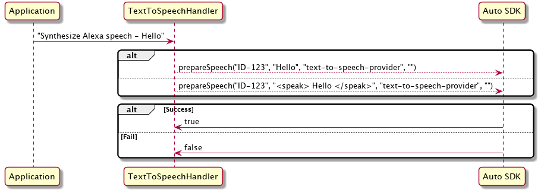

# Text To Speech (TTS) Module
The TTS module enables a platform implementation to synthesize Alexa speech on demand from a text or Speech Synthesis Markup Language (SSML) string. The module does not play the synthesized Alexa speech, which is played by the platform implementation. To synthesize speech, the module uses the Text To Speech provider. See the Text To Speech Provider [README](../text-to-speech-provider/README.md) for information on how the TTS provider works with this module.

>**Note:** This feature may only be used with voice-guided turn-by-turn navigation.

<!-- omit in toc -->
## Table of Contents
- [Overview](#overview)
- [Features of the Text To Speech Module](#features-of-the-text-to-speech-module)
- [Sequence Diagrams](#sequence-diagrams)
  - [Prepare Speech](#prepare-speech)
  - [Prepare Speech Completed](#prepare-speech-completed)
  - [Prepare Speech Failed](#prepare-speech-failed)
  - [Get Capabilities](#get-capabilities)
  - [Capabilities Received](#capabilities-received)
- [Implementing the TTS Platform Interface](#implementing-the-tts-platform-interface)
- [Errors](#errors)

## Overview

The platform implementation is responsible for registering the Text To Speech Handler for the Engine to use the text to speech functionality. The platform implementation also plays the synthesized speech, delivering a unified Alexa experience to enhance the user experience. Not being responsible for playing the speech, the Auto SDK does not provide any speech-playing APIs.

>**Important!** The TTS module requires the Local Voice Control extension.

## Features of the Text To Speech Module

The following list describes the APIs for supporting the text to speech features:
​
* The `prepareSpeech` API enables the platform implementation to request a speech synthesis.
* The `prepareSpeechCompleted` callback API notifies the platform implementation of a successful speech synthesis request.
* The `preparedSpeechFailed` callback API notifies the platform implementation of a failed speech synthesis request.
* The `gettingCapabilities` API enables the platform implementation to request the capabilities of the TTS provider being used.
* The `prepareSpeechCompleted` callback API notifies the platform implementation of a successful speech synthesis request.

## Sequence Diagrams
​The following sequence diagrams illustrate the flows involved in the text to speech feature.  

### Prepare Speech
The following diagram describes the flow for speech preparation.
<p align="center">

</p>

### Prepare Speech Completed
The following diagram describes the flow for completing the speech preparation.
<p align="center">

</p>

### Prepare Speech Failed
The following diagram describes the flow for reporting failed speech preparation.
<p align="center">

</p>

### Get Capabilities
The following diagram describes the flow for getting capabilities from the TTS provider.
<p align="center">

</p>

### Capabilities Received
​The following diagram describes the flow for reporting the receipt of capabilities from the TTS provider.
<p align="center">

</p>

## Implementing the TTS Platform Interface
To implement a custom Text To Speech handler, extend the `TextToSpeech` class as follows:
​
```cpp
#include <AACE/TextToSpeech/TextToSpeech.h>
​
class TextToSpeechHandler : public aace::textToSpeech::TextToSpeech {
​
    // The platform implementation sent a request for speech synthesis using TextToSpeech::prepareSpeech() and received a successful callback.
    void prepareSpeechCompleted(const std::string& speechId, std::shared_ptr<AudioStream> preparedAudio, const std::string& metadata) override { 
        // Use the speechId to correlate the synthesis request to the result. 
        // The synthesized speech resource is available in the preparedAudio parameter and can be played immediately or later
        // Metadata is additional information ( if any ) about the prepared audio resource. 
    }
​
    // The platform implementation sent a request for speech synthesis using TextToSpeech::prepareSpeech() and received a failed callback.
    void prepareSpeechFailed(const std::string& speechId, const std::string& reason) override { 
        // Use the speechId to correlate the synthesis request to the result. 
        // The reason contains the failure reason string as defined by the TTS provider. Refer to the Local TTS provider for more details on strings passed in the reason parameter.
    }
​
    // The platform implementation sent a request for capabilities of the TTS provider using TextToSpeech::getCapabilities() and received a callback.
    void capabilitiesReceived(const std::string& requestId, const std::string& capabilities) override {
        // Use the requestId to correlate the result to the request. 
        // Access the capabilities payload of the requested TTS provider from the capabilities parameter. An empty payload denotes an error in retrieving the capabilities of the TTS provider.
    }
 
    ...
    // Register a TextToSpeech handler with the Engine.
    std::shared_ptr<TextToSpeech> m_textToSpeechHandler = std::make_shared<TextToSpeechHandler>();
    engine->registerPlatformInterface(textToSpeechHandler);
​
    // The platform implementation can send a speech synthesis request by calling the TextToSpeech::prepareSpeech() API.
    auto speechId = ... // A unique identifier for the speech request
    auto text = ... // The input text or SSML string
    // Refer to Local TTS provider for the provider identification string.
    auto provider = ... // The identifier for the provider.
    auto options = ... // No need to specify if using Alexa voice
    auto requestResult = m_textToSpeechHandler->prepareSpeech(speechId, text, provider);
​
    // The platform implementation can send a capabilities request by calling the TextToSpeech::getCapabilities() API.
    auto requestId = ... // A unique identifier for the request
    // Refer to Local TTS provider for the provider identification string.
    auto provider = ... // The identifier for the provider.
    auto capabilitiesRequestResult = m_textToSpeechHandler->getCapabilities(requestId, provider);
    ...
};
...
```

## Errors
The `prepareSpeechFailed()` API contains the `reason` parameter that specifies the error string for failure. Refer to the [TTS provider errors](../text-to-speech-provider/README.md#errors) for more information on errors defined by the TTS provider. The TTS module also defines its own errors as shown below:

The `REQUEST_TIMED_OUT` error occurs when the TTS provider sends no response, causing the speech request to time out. The timeout value is 1000 milliseconds.
