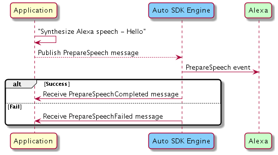

# Text-To-Speech (TTS) Module

## Overview

The `Text-To-Speech` module enables your Alexa Auto SDK client application to synthesize Alexa speech on demand from a text or Speech Synthesis Markup Language (SSML) string. To synthesize speech, this module uses the `Text-To-Speech-Provider` module. The Auto SDK does not provide any speech-playing APIs. Your application's TTS module integration is responsible for playing the synthesized speech to deliver a unified Alexa experience to the user.

>**Note:** This feature may only be used with voice-guided turn-by-turn navigation.

>**Important!** The `Text-To-Speech` module requires the Local Voice Control extension.

## Configuring the Text-To Speech-Module

The `Text-To-Speech` module does not require Engine configuration.

## Using the Text-To-Speech AASB Messages

### Prepare Speech

To request speech synthesis from a text or SSML input, your application must publish the [`PrepareSpeech` message](https://alexa.github.io/alexa-auto-sdk/docs/aasb/text-to-speech/TextToSpeech/index.html#preparespeech). The Engine publishes either the [`PrepareSpeechCompleted` message](https://alexa.github.io/alexa-auto-sdk/docs/aasb/text-to-speech/TextToSpeech/index.html#preparespeechcompleted) or [`PrepareSpeechFailed` message](https://alexa.github.io/alexa-auto-sdk/docs/aasb/text-to-speech/TextToSpeech/index.html#preparespeechfailed) to indicate success or failure, respectively.

<details markdown="1"><summary>Click to expand or collapse sequence diagram: Prepare Speech</summary>
<br></br>



> **Note:** The `prepareSpeechFailed` API contains the `reason` parameter that specifies the error string for failure. Refer to the [TTS provider errors](https://alexa.github.io/alexa-auto-sdk/docs/explore/features/text-to-speech-provider#errors) for more information on errors defined by the TTS provider.
>
> TThe TTS module defines the `REQUEST_TIMED_OUT` error that occurs when the TTS provider sends no response, causing the speech request to time out. The timeout value is 1000 milliseconds.

</details>
</br>

### Get Capabilities

To request the capabilities of the TTS provider being used, your application must publish the [`GetCapabilities` message](https://alexa.github.io/alexa-auto-sdk/docs/aasb/text-to-speech/TextToSpeech/index.html#getcapabilities). The Engine publishes the [`GetCapabilitiesReply` message](https://alexa.github.io/alexa-auto-sdk/docs/aasb/text-to-speech/TextToSpeech/index.html#getcapabilitiesreply) reply with the capabilities of the TTS provider.

<details markdown="1"><summary>Click to expand or collapse sequence diagram: Get Capabilities</summary>
<br></br>


</details>
</br>

## Integrating the Text-To-Speech Module Into Your Application

### C++ MessageBroker Integration

Use the `MessageBroker` to subscribe to and publish `TextToSpeech` AASB messages.

<details markdown="1"><summary>Click to expand or collapse C++ sample code</summary>

```cpp
#include <AACE/Core/MessageBroker.h>

#include <AASB/Message/TextToSpeech/TextToSpeech/GetCapabilitiesMessage.h>
#include <AASB/Message/TextToSpeech/TextToSpeech/PrepareSpeechCompletedMessage.h>
#include <AASB/Message/TextToSpeech/TextToSpeech/PrepareSpeechFailedMessage.h>
#include <AASB/Message/TextToSpeech/TextToSpeech/PrepareSpeechMessage.h>

#include <nlohmann/json.hpp>
using json = nlohmann::json;

class MyTextToSpeechHandler {

    // Subscribe to messages from the Engine
    void MyTextToSpeechHandler::subscribeToAASBMessages() {
        m_messageBroker->subscribe(
            [=](const std::string& message) { handlePrepareSpeechCompletedMessage(message); },
            PrepareSpeechCompletedMessage::topic(),
            PrepareSpeechCompletedMessage::action());
        m_messageBroker->subscribe(
            [=](const std::string& message) { handlePrepareSpeechFailedMessage(message); },
            PrepareSpeechFailedMessage::topic(),
            PrepareSpeechFailedMessage::action());
        m_messageBroker->subscribe(
            [=](const std::string& message) { handleGetCapabilitiesReplyMessage(message); },
            GetCapabilitiesMessageReply::topic(),
            GetCapabilitiesMessageReply::action());
    }

    // Handle the PrepareSpeechCompleted message from the Engine
    void MyTextToSpeechHandler::handlePrepareSpeechCompletedMessage(const std::string& message) {
        PrepareSpeechCompletedMessage msg = json::parse(message);
        std::string speechId = msg.payload.speechId;
        std::string streamId = msg.payload.streamId;
        std::string metadata = msg.payload.metadata;

        prepareSpeechCompleted(speechId, streamId, metadata);
    }

    // Handle the PrepareSpeechFailed message from the Engine
    void MyTextToSpeechHandler::handlePrepareSpeechFailedMessage(const std::string& message) {
        PrepareSpeechFailedMessage msg = json::parse(message);
        std::string speechId = msg.payload.speechId;
        std::string reason = msg.payload.reason;
        
        prepareSpeechFailed(speechId, reason);
    }

    // Handle the GetCapabilities reply message from the Engine
    void MyTextToSpeechHandler::handleGetCapabilitiesReplyMessage(const std::string& message) {
        GetCapabilitiesMessageReply msg = json::parse(message);
        std::string messageId = msg.header.messageDescription.replyToId;
        std::string capabilities = msg.payload.capabilities;

        // ...Handle capabilities of the TTS provider...
    }

    // To prepare speech, publish the PrepareSpeech message to the Engine
    void MyTextToSpeechHandler::prepareSpeech(
        const std::string& speechId,
        const std::string& text,
        const std::string& provider,
        const std::string& options) {
        PrepareSpeechMessage msg;
        msg.payload.speechId = speechId;
        msg.payload.text = text;
        msg.payload.provider = provider;
        msg.payload.options = options;
        m_messageBroker->publish(msg.toString());
    }

    // To get capabilities, publish the GetCapabilities message to the Engine
    std::string MyTextToSpeechHandler::getCapabilities(
        const std::string& requestId,
        const std::string& provider) {
        GetCapabilitiesMessage msg;
        msg.header.id = requestId;
        msg.payload.provider = provider;
        m_messageBroker->publish(msg.toString());

        // The Engine will send the GetCapabilitiesReply message
        // Return the capabilities from reply message payload
    }

    void MyTextToSpeechHandler::prepareSpeechCompleted(
        const std::string& speechId,
        const std::string& streamId,
        const std::string& metadata) {
        // Use MessageBroker openStream API to get the MessageStream
        std::shared_ptr<MessageStream> preparedAudio = 
                            m_messageBroker->openStream(msg.payload.streamId, MessageStream::Mode::READ);

        // Follow the UX guidelines in order to play the audio stream
    }

    // Notification of a failed speech synthesis
    void TextToSpeechHandler::prepareSpeechFailed(
        const std::string& speechId,
        const std::string& reason) {
        // Use the speechId to correlate the synthesis request to the result
        // Access the reason for failure
    }

};

```

</details>

### Android Integration

The Alexa Auto Client Service (AACS) provides the AACS Text-To-Speech Service to integrate the Auto SDK `Text-To-Speech` module on Android. See the AACS Text-To-Speech Service documentation for more information.