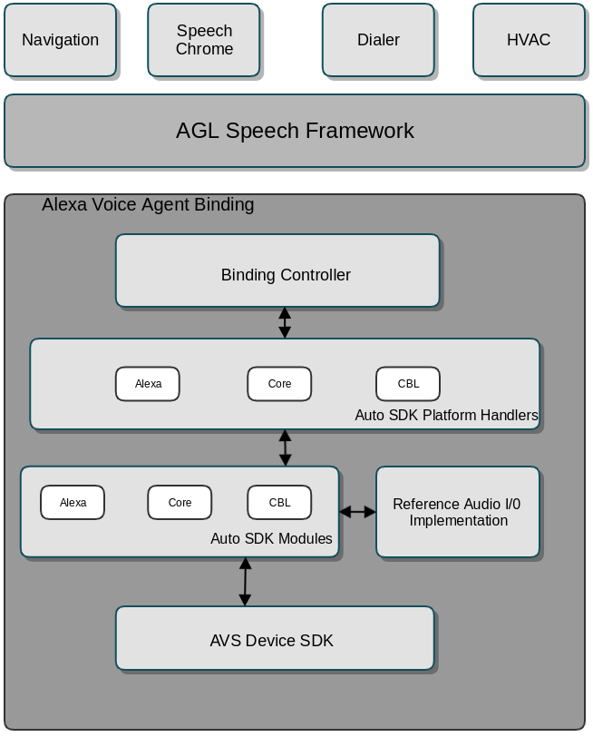

# Automotive Grade Linux Alexa Voice Agent Binding

## Overview
AGL Alexa Voice Agent is an Alexa client software that gets plugged into the AGL speech framework to voice enable applications as described in the speech [architecture](https://confluence.automotivelinux.org/display/SPE/Speech+EG+Architecture). It is implemented as a standard AGL [binding](http://docs.automotivelinux.org/master/docs/apis_services/en/dev/reference/af-binder/afb-daemon-vocabulary.html#binding) that exposes API for
* Speech recognition start and cancel.
* Subscription to events containing Alexa's dialog, authentication, and connection states.
* Subscription to events containing Alexa's capability messages or directives.
* User authentication and authorization using Amazon's [Login with Amazon (LWA) Code-Based Linking](https://developer.amazon.com/docs/login-with-amazon/minitoc-lwa-other-devices.html).

[Alexa Auto SDK](https://gitlab.automotive.alexa.a2z.com/alexa-auto-hut/aac-sdk) is the underlying technology that powers the speech recognition capabilities of this binding.

## Architecture

### Binding Controller
The [Binding controller](./src/plugins/AlexaVoiceAgentApi.cpp) is the entry point of the binding. It does initialization and dependency injection and also handles the requests for methods/verbs exposed by the binding.

### Auto SDK Platform Handlers
This component hosts the C++ platform API implementation handlers of Alexa Auto SDK. Audio related APIs like SpeechRecognizer, MediaPlayer and Speaker are implemented by our [reference audio implementation library](../../../samples/audio/README.md). For other platform APIs like Navigation, PhoneControl etc., the implementation converts the C++ methods into JSON response messages with payloads that it passes back to the Controller.

### Reference Audio I/O Implementation
This component is hosted in the ${AAC_SDK_HOME}/samples/audio folder. It is a GStreamer based audio reference implementation of the MediaPlayer and Speaker platform APIs. It also provides an interface for reading audio input from the microphone. Please refer to [its document](../../../samples/audio/README.md) for supported platforms and known issues.

## License Information
During the build time, the following dependencies are fetched and run by the build system.
1. [Google Test v1.8.0](https://github.com/google/googletest) when compiled with ENABLE_AASB_UNIT_TESTS option.

## Setup
### Register a Product
After registering for an Amazon developer account, you'll need to create an Alexa device and security profile. Make note of the following parameters as you go through setup: Product ID, Client ID, and Client Secret.

1. Log in to the [Amazon Developer portal](https://developer.amazon.com) and navigate to the [My Products](https://developer.amazon.com/avs/home.html#/avs/home) view of the AVS Console.
2. Click **Create Product** and fill in the registration form for your application. (The device registration details can be useful in certain development workflows but will not actually be used for this example.)
3. Make note of the **Product ID**.
4. Click **Next**.
5. Click **Create New Profile**.
6. Enter a name and description for your security profile.
7. Click **Next**.
8. Click on the **Other devices and platforms** tab.
9. Enter the **Client Id Name** and click **GENERATE ID**.
8. Make note of the **Client ID**.
9. Agree to the license terms in the Developer Portal and click **Finished**.

### Alexa Auto SDK Build Dependencies
Alexa Voice Agent depends on Auto SDK. See the [Alexa Auto SDK Builder](../../../builder/README.md) instructions to build the Alexa Auto SDK binaries for your AGL target. Currently, only the *ARM64* target is supported, and the binding is tested on the [R-CAR M3 board](https://www.renesas.com/us/en/solutions/automotive/soc/r-car-m3.html)

For example, to build Alexa Auto SDK modules and needed dependencies for an *AGL ARM64* target, run the following commands:
```
$ git clone https://github.com/alexa/aac-sdk.git
$ ${AAC_SDK_HOME}/builder/build.sh oe -t aglarm64 ${AAC_SDK_HOME}/samples/audio
$ pushd ${AAC_SDK_HOME}/builder/deploy/aglarm64/
$ tar -xvf aac-image-minimal-aglarm64.tar.gz
$ export AAC_INSTALL_ROOT=${AAC_SDK_HOME}/builder/deploy/aglarm64/opt/AAC

```
**Note**: Always compile Auto SDK with [samples/audio](../../../samples/audio/README.md). It is a reference implementation of audio input and playback using GStreamer.

### Enabling Device Capabilities
In order to use the certain Alexa Auto SDK functionality, your product needs to be whitelisted by Amazon. Copy the product's **Amazon ID** from the Developer Console and follow the whitelisting directions on the [Need Help?](../../../NEED_HELP.md) page.

## Configuration
Alexa Voice Agent binding supports configuration JSON that needs to be populated before compiling the software.
Open `${AAC_SDK_HOME}/platforms/agl/alexa-voiceagent-service/src/plugins/data/config/AlexaAutoCoreConfig.json` and
1. Populate the **deviceInfo** section. This information will be used for authorizing the device with AVS during the LWA Code-Based Linking process.
2. Update the **aace.vehicle** section with your vehicle information if necessary.
3. Update the **aace.audio** section's **speechRecognizer** with Audio4a input role, **speechSynthesizer** and **audioPlayer** with Audio4a output roles if necessary. Otherwise use the default values in the config file. The **speechRecognizer** role *hw:ep812ch* maps to Microchip's mic array.

## Build Instructions
**Prerequisite**: Install the AGL SDK, preferably the latest stable release from [AGL artifacts](https://download.automotivelinux.org/AGL/release/). The AGL SDK contains [application framework libraries](http://docs.automotivelinux.org/master/docs/apis_services/en/dev/reference/af-binder/reference-v3/func-api.html) that we depend on for making inter-binding calls and publishing AGL events.
1. Go to the ${AAC_SDK_HOME}/platform/agl/alexa-voiceagent-service directory
2. git submodule add https://gerrit.automotivelinux.org/gerrit/apps/app-afb-helpers-submodule afb-helpers
3. git submodule add https://gerrit.automotivelinux.org/gerrit/apps/app-controller-submodule app-controller
4. mkdir build
5. pushd build
6. source /opt/agl-sdk/\<sdk-version>/environment-setup-aarch64-agl-linux
7. cmake .. -DAAC_HOME=${AAC_INSTALL_ROOT}
8. make autobuild
9. popd
10. ./autobuild/agl/autobuild package

This should generate the **alexa-voiceagent-service.wgt** in the build folder successfully.

## Install and Run
1. Copy the **alexa-voiceagent-service.wgt** into the target device.
2. In the shell of the target device, **afm-util install alexa-voiceagent-service.wgt** for installing.
3. Reboot the target device.

## Authorization with AVS
To access the Alexa Voice Service (AVS) it is required to acquire [Login with Amazon (LWA)](https://developer.amazon.com/login-with-amazon) access tokens. The Alexa Voice Agent binding has an implentation of **Code-Based Linking (CBL)** that can be used to acquire such tokens and authorize.

**Code-Based Linking (CBL)**: The user is provided with a short alphanumeric code and a URL in which to enter the code on any web browser-enabled device. [Read more about CBL](https://developer.amazon.com/docs/alexa-voice-service/code-based-linking-other-platforms.html), if desired.

1. On your desktop browser, load *${AAC_SDK_HOME}/platform/agl/alexa-voiceagent-service/htdocs/index.html*
2. In the input text field, enter the socket address of the Alexa Voice Agent binding running on the target device. For example: **\<IP Address>:\<Port>**
3. Click the "Subscribe to CBL Events" button, upon which you will see an event with a URL and code displayed in the event box of the page.
4. Load the aforementioned URL, enter the code, and agree to authorize your product. This will move the Alexa Voice Agent binding to the CONNECTED and AUTHORIZED state, and it will be ready to accept user utterances.

## Supported Features

* TTS Responses
* Alexa cards
* Phone call control
* Navigation
* Online Music Playback
* Playback Controller

## Known Issues

* There is no way to log out after authorizing with AVS. Restart the Alexa Voice Agent to authorize again.