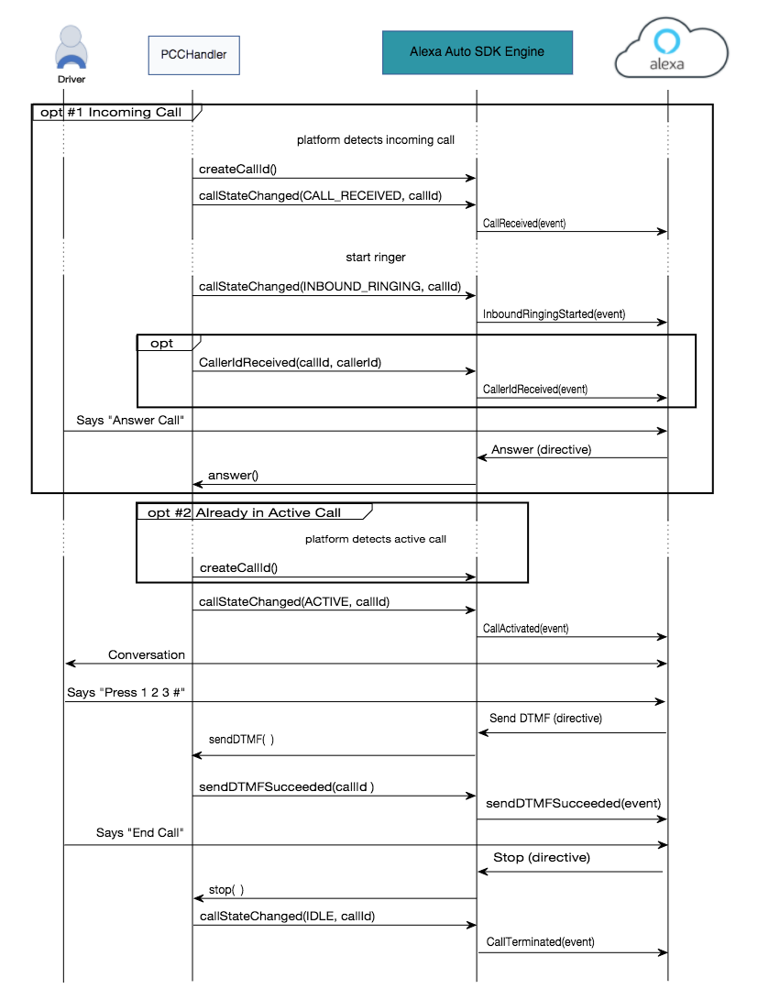
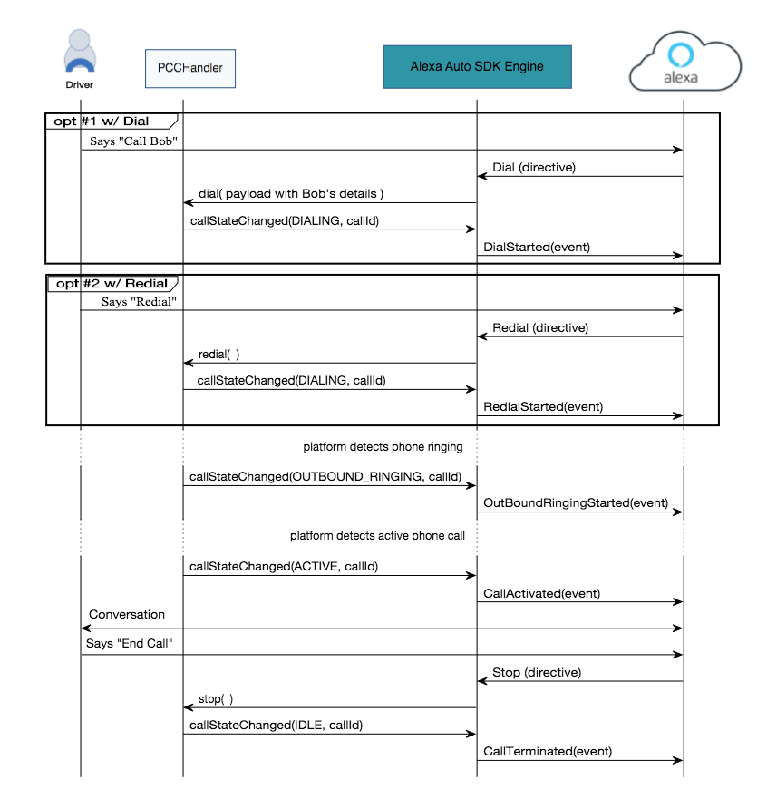

# Phone Call Controller API

## Overview

The Alexa Auto SDK Phone Call Controller API provides the features required by a platform implementation to use the phone call control capabilities of Alexa, independent of the connection mechanism to the calling device. Registering a Phone Call Controller allows the end user to use Alexa to interact with new or ongoing calls, and provide Alexa with the state of the calling device on the platform. The platform implementation is responsible for managing the lifecycle of the call session, including the end user experience.

### Sequence Diagrams

The following sequence diagrams provide and overview of how inbound and outbound phone call control is handled.

#### Inbound Calling

This diagram provides an overview of inbound phone call control using voice.



#### Outbound Calling

This diagram provides an overview of outbound phone call control using voice.



## Using PhoneCallController

To implement a custom phone control handler, the `PhoneCallController` class should be extended:

```
public class PhoneCallControllerHandler extends PhoneCallController
{
	// The user asked Alexa to make an outbound call.
	@Override
	public boolean dial( String payload )
	{
		// Initiate an outbound call.
		return true;
	}

	// The user asked Alexa to redial a call.
	@Override
	public boolean redial( String payload )
	{
		// Initiate an outbound call.
		// It is the platform's responsibility to maintain the last dialed number.
		return true;
	}

	// The user asked Alexa to answer the inbound call.
	@Override
	public void answer( String payload )
	{
		// Answer the inbound call.
	}

	// The user asked Alexa to hang up a call, cancel a call setup, or decline an incoming call.
	@Override
	public void stop( String payload ) {
		// Stop the call.
	}

	// The user asked Alexa to press the keypad.
	@Override
	public void sendDTMF( String payload ) {
		// Send a DTMF signal.
	}

	// Return quickly, as handling in dial, redial, answer, stop, and sendDTMF should not block the caller.

	// Alexa acts on the most recently used callId.

	// Connection to a calling device is established or broken.
	ConnectionState state = .. // CONNECTED, DISCONNECTED
	connectionStatusChanged( state );
	...

	// Setting up an outgoing call.
	String callId = ... // The identifier for the call.
	callStateChanged( State.DIALING, callId );
	...

	// Outgoing call setup is complete, and outbound ringing has started.
	String callId = ... // The identifier for the call.
	callStateChanged( CallState.OUTBOUND_RINGING, callId );
	...

	// The call is answered and in progress.
	String callId = ... // The identifier for the call.
	callStateChanged( CallState.ACTIVE, callId );
	...

	// The active call ended, the outbound call setup was cancelled, or the inbound call was declined.
	String callId = ... // The identifier for the call.
	callStateChanged( CallState.IDLE, callId );
	...

	// An inbound call alert was received.
	String callId = ... // The identifier for the call.
	callStateChanged( CallState.CALL_RECEIVED, callId );
	...

	// The inbound call is ringing.
	String callId = ... // The identifier for the call.
	callStateChanged( CallState.INBOUNDING_RINGING, callId );
	...

	// Generate an identifier for a call initiated outside of the scope of Alexa.
	String callId = createCallId();
	...

	// A feature of the calling device changed.
	HashMap<CallingDeviceConfigurationProperty, Boolean> deviceConfiguration = new HashMap<>();
	deviceConfiguration.put( CallingDeviceConfigurationProperty.DTMF_SUPPORTED, true ); // update the configuration
	deviceConfigurationUpdated( deviceConfiguration );
	...

	// An error occurred during an active call or call setup.
	String callId = ... // The identifier for the call.
	CallError code = ... // error type
	String message = ... // error description
	callFailed( callId, code, message );
	...

	// The DTMF signal was delivered.
	String callId = ... // The identifier for the call.
	sendDTMFSucceeded( callId );
	...

	// Sending the DTMF signal failed.
	String callId = ... // The identifier for the call.
	DTMFError code = ... // error type
	String message = ... // error description
	sendDTMFFailed( callId, code, message );
	...

	// Register a phone call controller handler with the Engine.
	PhoneCallController phoneCallController = new PhoneCallControllerHandler();
	engine.registerPlatformInterface( phoneCallController );
}

```

## Whitelisting

Please see the [Need Help?](../../NEED_HELP.md) page for how to whitelist your device for using PhoneCallController APIs.
