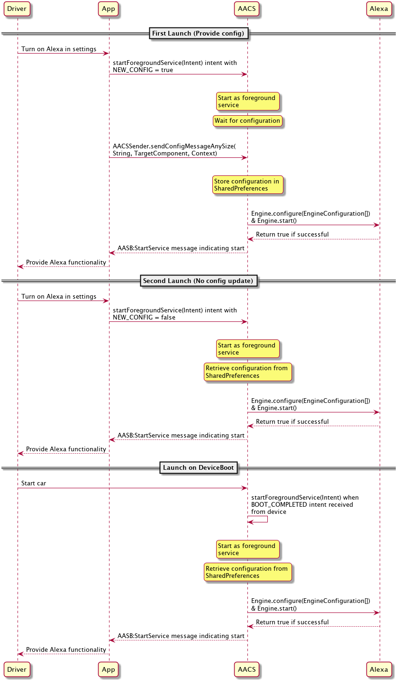
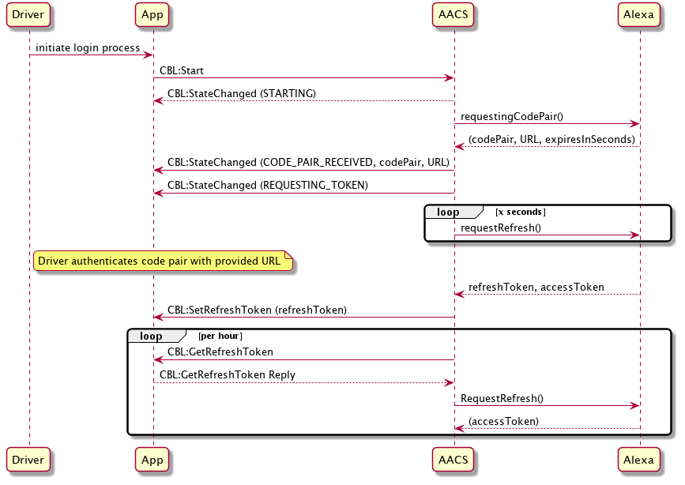
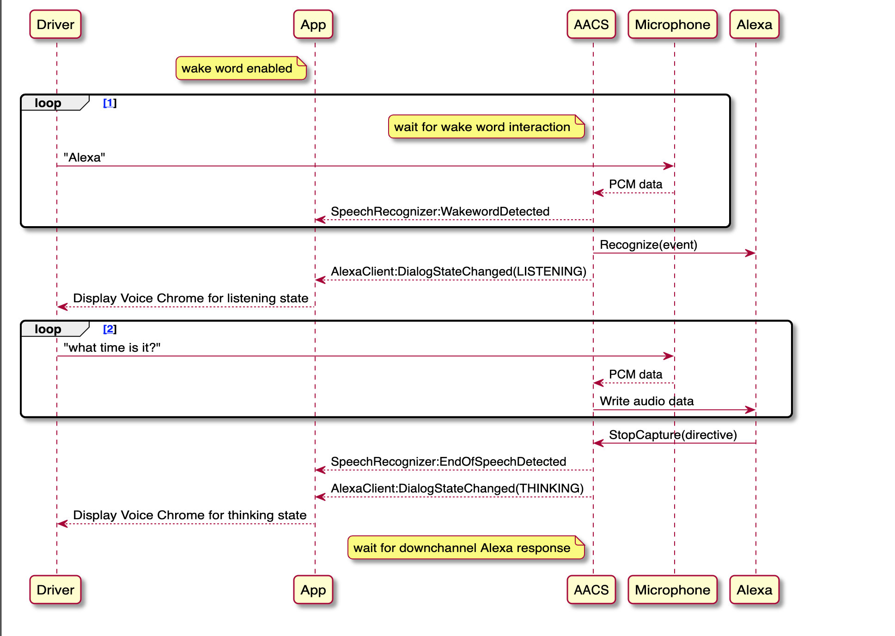

#  Alexa Auto Client Service (AACS)
Alexa Auto Client Service (AACS) is an Alexa Auto SDK feature packaged in an Android application package (APK). By providing a common service framework, AACS simplifies the integration of the Auto SDK with your Android device and supports all the Auto SDK extensions.

Your application communicates with AACS through an intent, which is a messaging object on an Android device. AACS provides the platform implementation for certain interfaces, which speeds up Alexa integration for in-vehicle infotainment (IVI). Without AACS, typical integration of the Auto SDK in the IVI involves the implementation of abstract interfaces provided by each Auto SDK module to handle platform-specific functionality. To implement all required platform interfaces, the Auto SDK is integrated to an event-based system that converts from direct method APIs to an event-based architecture.

This document assumes that you understand how the Auto SDK and Alexa Auto Service Bridge (AASB) extension work, as described in the [Auto SDK README](../../../README.md) and [AASB README](../../../extensions/aasb/README.md). When this document uses the term "application," it refers to the application you develop on the Android platform, not the AACS application, unless noted otherwise. Information for your application in this document also applies to your Android service.

<!-- omit in toc -->
## Table of Contents
- [AACS Architecture](#aacs-architecture)
- [Obtaining the AACS APK](#obtaining-the-aacs-apk)
- [Using AACS with Your Application](#using-aacs-with-your-application)
  - [AACS as Foreground Service or System Application](#aacs-as-foreground-service-or-system-application)
  - [AACS Initialization and Configuration](#aacs-initialization-and-configuration)
- [Default Platform Implementation](#default-platform-implementation)
- [Specifying the App Targets for Handling Messages](#specifying-the-app-targets-for-handling-messages)
- [Platform Implementation in Your Application](#platform-implementation-in-your-application)
  - [Initial Authentication Sequence Diagram](#initial-authentication-sequence-diagram)
  - [Wake Word Enabled Sequence Diagram](#wake-word-enabled-sequence-diagram)
- [Client Utility Library](#client-utility-library)
- [Device Settings Required for AACS](#device-settings-required-for-aacs)

## AACS Architecture
The following diagram shows the high-level architecture of AACS on the Android platform. The shaded boxes in the diagram represent components developed by Amazon that are packaged in AACS. The `MessagingImplementation`, `MessageBroker`, and `MessageHandler` services make up the Alexa Auto Service Bridge (AASB) extension. 

The following list describes the components in the AACS service layer, as illustrated in the diagram, and how they interact with one another and with the Auto SDK:

1) **AlexaAutoClientService** is a persistent service that can start automatically after device boot-up or be manually started by an application through a `startService()` call. The service performs the following functions:
   
   * Instantiating the Auto SDK Engine.
   * Creating and registering the AASB message handler with the AASB MessageBroker. 
   * Setting the required Engine configuration.
   * Managing the notifications displayed in the system notification area.
  
2) **PhoneControlMessagingImpl** and **NavigationMessagingImpl** are messaging implementations that serialize direct API calls into a standardized message format. The `PhoneControlMessagingImpl` or `NavigationMessagingImpl` converts platform interface
method parameters into the message payload of the respective messaging implementation. The message is then sent to the service layer by using the AASB `MessageBroker` with a specific message topic and action. The messaging implementation also subscribes to message topics that are sent from the human-machine interface (HMI) application to the Auto SDK.
3) **AudioInputImpl**, **AudioOutputImpl**, **ExternalMediaPlayerImpl**, and **AdditionalPlatformImpl** are the direct implementations of Auto SDK platform interfaces. You can enable or disable the implementations in the AACS APK through the configuration file. If an implementation is disabled, the platform message handler must be provided by a client APK.
4) **AASB MessageBroker** is an abstraction built on top of the Auto SDK core. `MessageBroker` routes messages between the application and the Auto SDK core. When the 
application responds to `MessageBroker` with an event, the event is routed back through the platform interface implementation.
5) **AASB MessageHandler** implements the platform-specific logic to send and receive AASB messages.
6) **Mediaplayer** handles the default AudioOutput actions, such as prepare, play, and pause for a TTS channel.
7) **IPCLibrary** defines the protocol for the communication between the HMI application and AACS.
It provides the APIs for sending and receiving AASB Messages over the Android Intent/Binder interface and
supports streaming audio data to and from an external application. It builds into an Android archive (AAR) file, which you can include in other apps that need to communicate with AACS.  For more information about the IPC, see this [README](./ipc/README.md).
1) **LVCInteractionProvider** implements APIs defined by the `ILVCClient` Android Interface Definition Language (AIDL) file to connect with  `ILVCService`, which is implemented by the Local Voice Control (LVC) application. This connection also enables the LVC APK to provide the configuration for LVC.
2) The core of the **HMI application** that holds the business logic need not change with
`AlexaAutoClientService`. However, you must modify the application so that it can interface with the APIs defined by AACS.

## Obtaining the AACS APK
You can obtain the AACS APK in one of two ways:

* To obtain the pre-built AACS APK with supported extensions, contact your Amazon Solutions Architect (SA) or Partner Manager for more information.

* To build the AACS APK from source code, 
use the SDK build script. It takes a single option, `--aacs-android`, to build all needed dependencies (such as AASB and IPC) and the AACS application. It also generates AAR files that are used for communicating with AACS from your application. For more information about building AACS, see the [Builder README](../../../builder/README.md).

## Using AACS with Your Application
This section provides information about how AACS works with your application.

>**Note:** The AACS APK provides the IPC and constants for you to include in your applications so that they can communicate with AACS. For information about the AACS APK, see the [Builder README](../../../builder/README.md).

### AACS as Foreground Service or System Application
AACS runs as a started service on Android. The [Initialization](#initialization) section describes how it is started; this section describes what you do to run AACS as a foreground service or a system application. 

#### As Foreground Service
Typically, AACS is started as a foreground service, which has higher priority and continues running unless it is under memory constraints. In addition, the service displays notifications to alert the user that it is running. 

To run AACS as a foreground service, in the AACS configuration, set `persistentSystemService` under `aacs.general` to
`false`. Then your application can use the `startForegroundService()` function to initialize AACS. If AACS is started properly, a notification is displayed.

Since Android 8.0 (API level 26), foreground services have had
some changes in how they are initialized. The following code checks the Android version and calls the correct API:
~~~
Intent intentStartService = new Intent();
intentStartService.setComponent(new ComponentName("com.amazon.alexaautoclientservice",
"com.amazon.alexaautoclientservice.AlexaAutoClientService"));
intentStartService.setAction(Action.LAUNCH_SERVICE);

if (android.os.Build.VERSION.SDK_INT >= android.os.Build.VERSION_CODES.O) {
    startForegroundService(intent);
} else {
    startService(intent);
}
~~~

#### As System Application
If you have root access on the device, you can configure AACS to run as a system application. In the AACS configuration, set `persistentSystemService` under `aacs.general` to `true`.
~~~
"aacs.general" : {
    "persistentSystemService": true,
    ...
}
~~~
This setting is equivalent to setting the 'persistent' flag to true within the `application` element of the Android Manifest file. This flag indicates that the service runs at all times, and should only be set to true by system applications. Your application no longer needs to start AACS in the foreground, and no notifications appear to show that the service is running. The following example shows an application starting AACS as a system application:
~~~
Intent intentStartService = new Intent();
intentStartService.setComponent(new ComponentName("com.amazon.alexaautoclientservice",
"com.amazon.alexaautoclientservice.AlexaAutoClientService"));
intentStartService.setAction(Action.LAUNCH_SERVICE);

startService(intent);
~~~

### AACS Initialization and Configuration
Initializing AACS means getting AACS ready to communicate with other applications. However, Alexa functionality is not available until AACS receives the configuration.

#### Initialization
There are two ways to initialize AACS:

* Start AACS from an application:
AACS includes a permission that determines whether an application can start or stop the service. For an application to start or stop AACS, specify the permission name in the application's `AndroidManifest.xml` file as follows:

  `<uses-permission android:name="com.amazon.alexaautoclientservice"/>`

  For an example of starting AACS from an application, see [example for starting AACS as a system application](#as-system-application).

* Start AACS upon device boot: If you want AACS to start every time the user turns on the device, set `startOnDeviceBootEnabled` in `aacs.general` of your configuration to `true`. Due to this setting, AACS initiates a `startService()` call on itself when it receives the `BOOT_COMPLETED` intent, which the device broadcasts when it is finished booting. 

  >**Important!** The device considers AACS inactive until AACS is run at least once. AACS does not start automatically on device boot unless AACS is considered active. Simply run AACS at least once after installation, and AACS will start each time the device is restarted. 

Whether `startOnDeviceBootEnabled` is set to `true` or `false`, the application can always send a `startService()` or `stopService()` call to start or stop AACS.

#### Configuration Schema
This section describes the configuration schema, which includes Auto SDK engine configuration, general service behavioral settings, and definitions for how AACS interfaces with applications. For more information about AACS configuration, see [Configuration Reference documentation](./android-service/README.md).

  >**Important!** Some configuration fields may require you to provide filepaths. These filepaths must be absolute paths that are accessible to AACS. AACS will not accept filepaths to public locations (such as SD card) for security reasons.

The sample configuration JSON file in this section illustrates the AACS configuration structure. Be sure to fill out the following required sections under `deviceInfo` of `aacs.alexa`:
  * `clientId`
  * `productId`
  * `deviceSerialNumber` 
   
The following documents provide more information about configuration:

* [Auto SDK class list](https://alexa.github.io/alexa-auto-sdk/docs/cpp/annotated.html)
* [Complete configuration file](./assets/config.json)
~~~
{
  "aacs.alexa": {
    "deviceInfo": {
      "clientId": "",
      "productId": "",
      "deviceSerialNumber": "",
      "manufacturerName": "name",
      "description": "description"
    },
    "localMediaSource": {
      "types": []
    }
  },
  "aacs.vehicle": {
    "info": {
      "make": "Amazon",
      "model": "AACE",
      "year": "2020",
      "trim": "aac",
      "geography": "US",
      "version": "1.2.3",
      "os": "Sample OS 1.0",
      "arch": "Sample Arch 1.0",
      "language": "en-US",
      "microphone": "SingleArray",
      "countries": "US,GB,IE,CA,DE,AT,IN,JP,AU,NZ,FR",
      "vehicleIdentifier": "Sample Identifier ABC"
    },
    "operatingCountry": "US"
  },
  "aacs.cbl": {
    "enableUserProfile": false
  },
  "aacs.carControl": {
    "endpoints":[],
    "zones":[]
  },
  "aacs.aasb": {
    "version": "3.0"
  },
  "aacs.general" : {
    "version": "1.0",
    "persistentSystemService": false,
    "startServiceOnBootEnabled": true,
    "intentTargets" : {
      "AASB" : {
        "type": ["RECEIVER"],
        "package": [],
        "class": []
      },
      "APL" : {
        "type": ["RECEIVER"],
        "package": [],
        "class": []
      },
      ... (Other topics omitted)
    }
  },
  "aacs.defaultPlatformHandlers": {
      "useDefaultLocationProvider": true,
      "useDefaultNetworkInfoProvider": true,
      "useDefaultExternalMediaAdapter": true,
      "audioInput": {
        "audioType": {
          "VOICE": {
            "useDefault": true,
            "audioSource": "MediaRecorder.AudioSource.MIC"
          },
          "COMMUNICATION": {
            "useDefault": true,
            "audioSource": "MediaRecorder.AudioSource.MIC"
          }
        }
      },
      "audioOutput": {
        "audioType": {
          "TTS": {
            "useDefault": true
          },
          "ALARM": {
            "useDefault": true
          },
          "MUSIC": {
            "useDefault": false
          },
          "NOTIFICATION": {
            "useDefault": true
          },
          "EARCON": {
            "useDefault": true
          },
          "RINGTONE": {
            "useDefault": true
          },
          "COMMUNICATION": {
            "useDefault": true
          }
        }
      }
    }
 }
~~~

#### Sending a Configuration Message
Sending the configuration relies on the provided [IPC library](./ipc/README.md). This section describes the configuration's basic syntax. 

The message structure consists of two fields, `configFilepaths` and `configStrings`. `configFilepaths` is a String array containing paths to files which hold full or partial configuration JSON. `configStrings` is a String array containing full or partial configurations in the form of escaped JSON Strings. All partial configurations (from filepath or String) will be reconstructed by AACS to be a single, full configuration. We recommend using the `configStrings` option, see the **Important** note on filepaths in the beginning of the [Configuration](#configuration-schema) section. The following code shows an empty `configMessage`: 
~~~
{
    "configFilepaths: [],
    "configStrings": []
}
~~~
Using an instance of `AACSSender`, the `sendConfigMessageEmbedded()` or `sendConfigMessageAnySize()` method ensures that the configuration message can be sent to AACS. The following example shows how to construct and send the configuration message:

~~~
try {
    String config = "...";                           // configuration read from file
    JSONObject configJson = new JSONObject(config);
    JSONArray configStringsArray = new JSONArray();
    configStringsArray.put(configJson.toString());   // add escaped JSON string
    JSONObject configMessage = new JSONObject();
    configMessage.put("configFilepaths", new JSONArray());
    configMessage.put("configStrings", configStringsArray);
    aacsSender.sendConfigMessageAnySize(configMessage.toString(), target, getApplicationContext());
} catch (JSONException e) {
    ...
}
~~~

#### Protocol
Send the configuration after the initialization of AACS. That is, send the configuration immediately after you
send the `startService` intent. The configuration is not part of the `startService` intent because intents in Android have size limits, which the configuration might exceed. Using the provided IPC library allows for sending configuration of any size. 

Because AACS stores the last configuration received, the only requirement is that the configuration is sent the first time AACS is run
after installation. At any subsequent start, AACS uses the stored configuration.

However, updating the stored configuration (without uninstalling AACS) requires that the
`startService` intent include an `Extras` field called `newConfig`. `newConfig` holds a
boolean value that alerts AACS not to start running with the stored configuration, but wait for a new configuration message. 

**Note**: The old configuration is overwritten by the new configuration.

For your application to start AACS with a new configuration, make sure your intent includes `newConfig`, as shown in the following example:

~~~
Intent intentStartService = new Intent();
intentStartService.setComponent(new ComponentName("com.amazon.alexaautoclientservice",
"com.amazon.alexaautoclientservice.AlexaAutoClientService"));
intentStartService.setAction(Action.LAUNCH_SERVICE);
intentStartService.putExtra("newConfig", true);
~~~

Omitting `newConfig` is the same as setting it to `false`, which causes AACS to use the stored configuration. 

**Important**: Sending a new configuration is allowed only once per service run. After AACS is configured and
running, AACS ignores subsequent attempts to update the configuration, even if the `newConfig` field is `true`. To update an existing configuration, you must
stop the service and restart it with `newConfig` set to `true`.

#### Initialization Sequence Diagram
The following diagram shows an example of initializing AACS from an app used by a driver.

## Default Platform Implementation
Default platform implementations refer to implementations of Auto SDK platform interfaces that AACS provides to replace the normal protocol of using AASB messages. By enabling a default platform implementation in AACS, you no longer have to handle messages for a particular platform interface and can rely on AACS to provide the necessary functionality.

AACS provides a default implementation for these platform interfaces:
* AudioInput (audioType:VOICE, COMMS)
* AudioOutput (audioType: TTS, ALARM, NOTIFICATIONS, EARCON, RINGTONE)
* LocationProvider
* NetworkInfoProvider
* ExternalMediaAdapter for Media App Command and Control (MACC) 

The platform implementations for these interfaces are disabled by default; the AASB messages for these interfaces are routed to the [client app to be handled](#specifying-the-app-targets-for-handling-messages). For information about AASB messages, see the [AASB README](../../../extensions/aasb/README.md).

To enable the default platform implementation in AACS, you must set the `aacs.defaultPlatformHandlers`
configuration flags. In the following example, you use `aacs.defaultPlatformHandlers` in the
configuration file to instruct AACS to handle `LocationProvider` and `NetworkInfoProvider`, `AudioInput` for `VOICE`, and
`AudioOutput` for `TTS`. Specific apps handle the other messages.

~~~
"aacs.defaultPlatformHandlers": {
    "useDefaultLocationProvider": true,
    "useDefaultNetworkInfoProvider": true,
    "useDefaultExternalMediaAdapter": true,
    "audioInput": {
      "audioType": {
        "VOICE": {
          "useDefault": true,
          "audioSource": "MediaRecorder.AudioSource.MIC"
        },
      }
    },
    "audioOutput": {
      "audioType": {
        "TTS": {
          "useDefault": true
        },
        "MUSIC": {
          "useDefault": false
        },
      }
    }
  }
~~~

## Specifying the App Targets for Handling Messages

Use the AACS configuration file to specify the app that can handle AASB messages with a specific "topic."
Possible `intentTargets` are listed in the [Configuration Reference documentation](./android-service/README.md). The following sample configuration shows how to populate the `intentTargets` for each topic. The field `type` accepts `RECEIVER`, `ACTIVITY`, and `SERVICE`, depending on the target that handles the intents with the topic. The targets can be broadcast receiver, application activity, and service.

The format for a topic is as follows:
~~~
"<topic>" : {
    "type": [<target_1_type>, <target_2_type>, ...],
    "package": ["<target_1_package_name>", "<target_2_package_name>", ...], 
    "class": ["<target_1_class_name>", "<target_2_class_name>", ...]
},
~~~

The following example shows two topics, which are `AASB` and `APL`:
~~~
   "aacs.general" : {
      "intentTargets" : {
        "AASB" : {
           "type": ["ACTIVITY"],
            "package": ["com.amazon.aacstestapp"], 
            "class": ["com.amazon.aacstestapp.MainActivity"]      
        },
        "APL" : {
          "type": ["RECEIVER"],
            "package": ["com.amazon.aacstestapp"],          
            "class": [".IntentReceiver"]                  // short version of class name is also accepted.
        },                                                // In this case, the class must be in the package specified in "package".
        // ... other topics
      }     
    }
~~~

Alternatively, AACS also allows specifying the intent filters that can exactly match the intents' categories and actions through the Android Manifest as shown below.
To receive the message specified through the Android Manifest, the application must also have `com.amazon.alexaautoclientservice` permission in its Android Manifest. If a given "topic" is specified both in the configuration file and the
Android Manifest, the configuration file takes priority.

The following example shows an intent filter of all the CBL message intents for a broadcast receiver target:
~~~
<intent-filter>
    <action android:name="com.amazon.aacs.aasb.CBLStateChanged"/>
    <action android:name="com.amazon.aacs.aasb.CodepairReceived"/>
    <action android:name="com.amazon.aacs.aasb.CodepairExpired"/>
    <action android:name="com.amazon.aacs.aasb.SetProfileName"/>
    <action android:name="com.amazon.aacs.aasb.GetRefreshToken"/>
    <action android:name="com.amazon.aacs.aasb.SetRefreshToken"/>
    <action android:name="com.amazon.aacs.aasb.ClearRefreshToken"/>
    <category android:name="com.amazon.aacs.aasb.CBL" />
</intent-filter>
~~~
AACS first searches for targets for an intent with a topic in the configuration file. If nothing is found, the package manager scans the intent filters on the device to try to find a match.

**NOTE**: If the target is an activity, you must add `<category android:name="android.intent.category.DEFAULT" />` to the intent filter as explained [here](https://developer.android.com/guide/components/intents-filters).

## Platform Implementation in Your Application
Your applications can register for specific AASB messages and provide a platform implementation. For example, an application (“Login app") can register for CBL messages. The detailed description of the CBL module is provided here (https://gitlab.automotive.alexa.a2z.com/alexa-auto-hut/aac-sdk/-/tree/master/modules%2Fcbl#cbl-states-and-state-change-reasons).

### Initial Authentication Sequence Diagram
The following sequence diagram illustrates how an application (“Login app") exchanges messages with AACS over Android Intents to log in the user for Alexa.

### Wake Word Enabled Sequence Diagram
The sequence diagram illustrates the sequence for the user to access Alexa if you use the default implementation of AudioInput in AACS. In this diagram, the driver is logged in and wake word is enabled. The driver initiates the action by uttering the Alexa wake word.

1. Audio is processed locally by the wake word engine in AACS until the wake word is detected. Upon wake word detection, AACS notifies the application that the dialog state has changed to "listening" and initiates a Recognize event with Alexa.
   
2. While in the listening state, audio data is sent to Alexa. When the end of speech is detected, Alexa sends a `StopCapture` directive to AACS, and the dialog state is changed to "thinking." Alexa then responds with additional directives in response to the speech request.

For information about other messages to provide your implementation in the client APK, see the [AASB README](../../../extensions/aasb/README.md).
## Client Utility Library

AACS also provides an optional library, [AACS Common Utils](./commonutils/README.md). It contains useful methods to make messaging with AACS easier. You can use it as-is or as a reference to facilitate the integration of the Auto SDK with AACS. For information about the library, see [AACS Common Utils README](./commonutils/README.md) and in-code documentation in the library. 

## Device Settings Required for AACS
AACS requires microphone and location permissions when the default implementation is used for AudioInput and Location. If AACS runs as a system application, you can grant these permissions so that the application users do not have to set the permissions. Otherwise, be sure to instruct your users to grant the following permissions on the app info page under Settings on their device:

* Location: Enable `android.permission.ACCESS_FINE_LOCATION`to give AACS access the current location.

* Microphone: Enable `android.permission.RECORD_AUDIO` to give permission to AACS to record audio. Microphone must be enabled if you configure AudioInput to use the default implementation of AACS. 
