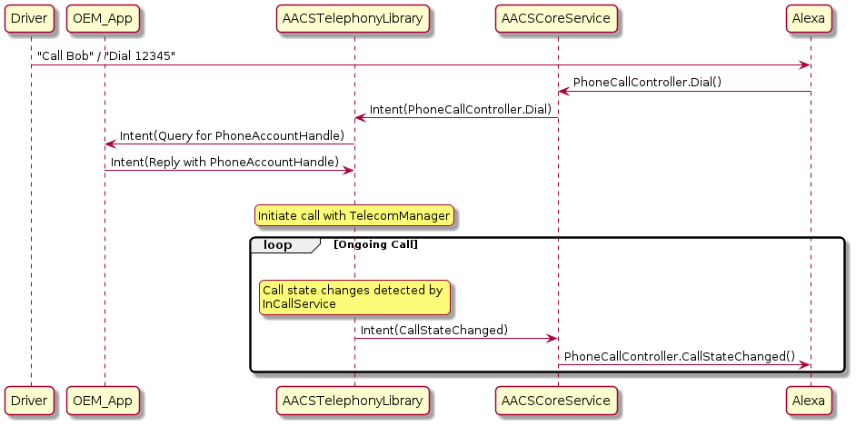

# AACS Telephony Library 

The AACS Telephony Library is an Android library for you to pre-integrate Alexa Phone Call Controller functionalities with Android Telephony. The library handles phone-related directives and events from and to the Alexa Auto SDK Engine, via the AACS Core Service. The library also works with the Dialer app on the car head unit. By including this optional library in AACS or your own application, you can easily integrate phone capabilities (e.g., dialing, redialing, and answering calls) with Alexa.  

<!-- omit in toc -->
## Table of Contents
- [Overview](#overview)
- [Prerequisites](#prerequisites)
- [Obtaining the Library](#obtaining-the-library)
- [Setup for AACS Telephony Library](#setup-for-aacs-telephony-library)
- [Sequence Diagram](#sequence-diagram)
- [Phone Call Controlling](#phone-call-controlling)
- [(Optional) Receiving Device Connection Changes](#optional-receiving-device-connection-changes)
- [How AACS Telephony Service Works with Multiple Connected Phones](#how-aacs-telephony-service-works-with-multiple-connected-phones)
- [Known Issue](#known-issue)

## Overview

AACS Telephony Library is responsible for communicating with the AACS Core Service and initiating the corresponding actions based on the incoming directives from the Engine. The following list describes its major components that carry out these responsibilities: 

* The AACS Telephony Service is responsible for:
  * Receiving and processing `PhoneCallController` AASB message intents from the AACS Core Service.
  * Receiving defined intents from your application for specific actions, such as providing the proper Phone Account Handler to be used to place a call.

* The AACS Telephony platform implementation (`PhoneCallController`) with the Android telephony framework is responsible for:
  * Fulfilling the phone-call-related directives, which are received as intents by the AACS Telephony Service 
  * Capturing and reporting call state changes to the AACS Core Service
  * Capturing and reporting Bluetooth connection state changes to the AACS Core Service, and broadcasting the changes to any client listeners

The AACS Telephony Library is an optional module, which you can use as is or as a reference when you integrate the Phone Call Controller module with AACS. You can build it into an Android archive (AAR) to be included in the AACS APK (recommended) or in your application APK.

## Prerequisites
* Your Android system needs to support the Android Telephony framework.
* Your Android system needs to have a default dialer app that provides dialer and in-call UI. 
* Your Android system needs to support Bluetooth Hands-Free Profile (HFP) and Phone Book Access Profile (PBAP). Specifically, Bluetooth profiles with ID `HEADSET_CLIENT` and `PBAP_CLIENT` are required. For example, a device running Android Automotive OS supports these profiles.

## Obtaining the Library

You can obtain the AACS Telephony Library in one of two ways: 
* Obtain the pre-built AACS APK with the pre-built AACS Telephony Library (as an AAR). Contact your Amazon Solutions Architect (SA) or Partner manager for information about obtaining the AACS APK. 
* Use the Auto SDK builder to build AACS with the AACS Telephony library, which you can put in the AACS APK or your application. Enter the command as follows:

    `builder/build.sh android -t androidarm64 --aacs-android --include-aacs-telephony`

    The command generates the AACS APK, which includes the AACS Telephony AAR. The path to the AACS Telephony AAR is `$AAC_SDK_HOME/builder/deploy/aar/aacstelephony-release.aar`. Amazon recommends that you put the AACS Telephony AAR in the AACS APK because the AACS APK has all the dependencies required by the AACS Telephony AAR. Otherwise, you must include the `AACSIPC`, `AACSConstants`, and `AACSCommonUtils` AARs in your application to use with the AACS Telephony AAR.

## Setup for AACS Telephony Library
Before using the AACS Telephony Library, follow these major steps:

1) Make the application containing the library into a system-privileged application.
2) Provide the library with appropriate system permissions.
3) Provide permission in your application's Android manifest so that the AACS Telephony Service can be started by your application.
4) Specify targets for intents from the AACS Core Service.

### Making Application into a System-Privileged App

The AACS Telephony Library needs to control the phone calls, and monitor the Bluetooth connection states and phone call states. Therefore, the application containing the library must be a system-privileged application. 

If the library is included in AACS, as recommended, you must run AACS as a system-privileged application. Similarly, if you put the library in your application, your application must be system-privileged. An application acquires system privilege when you install it in `/system/priv-app/`. 

### Providing System Permissions

The AACS Telephony Library requires three system-level permissions:

```
android.permission.CONTROL_INCALL_EXPERIENCE
android.permission.INTERACT_ACROSS_USERS
android.permission.CAPTURE_AUDIO_OUTPUT
```

Grant the permissions to the package containing the AACS Telephony Library. For instructions about granting permissions, see the [Android documentation](https://source.android.com/devices/tech/config/perms-allowlist). To grant permissions to AACS, if it contains the library, use `com.amazon.alexaautoclientservice` as the package name in the XML file referenced in the Android documentation.

### Providing Permission in Android Manifest

For security reasons, for your application to send intents to or receive intents from the AACS Telephony Service, specify the `com.amazon.aacstelephony` permission in your application's Android manifest as follows: 

```
<uses-permission android:name="com.amazon.aacstelephony" />
```

### Intent Targets

The AACS Telephony Service listens to intents from the AACS Core Service with these topics: `AASB` and `PhoneCallController`. To specify AACS Telephony Service as the intent target, follow one of these steps: 

* Manually specify the messages in the AACS configuration file. The targets in the AACS configuration file override the ones specified by intent filters. The following example shows how to specify AACS Telephony Service as an intent target for both the `AASB` and `PhoneCallController` topics. In this example, the AACS Telephony Library AAR is part of the AACS APK. For more information about specifying intent targets, see the [AACS README](../../alexa-auto-client-service/README.md#specifying-the-intent-targets-for-handling-messages).

```
    "AASB" : {
    "type": ["<target_1_type>","SERVICE", ...],
        "package": ["<target_1_package_name>", "com.amazon.alexaautoclientservice", ...], 
        "class": ["<target_1_type>", "com.amazon.aacstelephony.AACSTelephonyService", ...]
    },
    //... other modules
    "PhoneCallController" : {
        "type": ["<target_1_type>", "SERVICE", ...],
        "package": ["<target_1_type>", "com.amazon.alexaautoclientservice", ...],   
        "class": ["<target_1_type>", "com.amazon.aacstelephony.AACSTelephonyService", ...]
    }
    //... other modules
```

* Omit ANY targets for the `AASB` and `PhoneCallController` topics in the AACS configuration file. As a result, the intent filter defined in the AACS Telephony Library takes effect, enabling the AACS Telephony Service to receive the intents. 

## Sequence Diagram
The following sequence diagram illustrates the flow when the driver initiates a call with Alexa if the AACS Telephony Library is used.

<p>

</p>

## Phone Call Controlling

This section describes the phone call controlling actions and work flows, whether the calls are initiated by Alexa or by the user from the head unit or mobile phone. 

### Answer

When a user asks Alexa to answer a call, the AACS Telephony Library answers the call that has the matching CallId in the `PhoneCallController.Answer` payload of the AASB message. 

### Dial

When a user asks Alexa to dial a number or call an uploaded contact, the AACS Telephony Service first receives the `PhoneCallController.Dial` message. Then the AACS Telephony Service sends a query intent with the following attributes to determine the proper [PhoneAccountHandle](https://developer.android.com/reference/android/telecom/PhoneAccountHandle) to use for initiating the call, regardless of how many phones are connected:

* Action is `com.amazon.aacstelephony.phoneAccount.query`
* Category is `com.amazon.aacstelephony`
* Extras is:
```
    {
        "CallerId": "{STRING}",
        "CallId": "{STRING}",
        "isRedial": <Boolean>
    }
```
The following list explains the `Extras` values:

  * `CallerId` is the number to be dialed. 
  *  `CallId` is a unique identifier for the call. 
  * `isRedial` is a boolean value indicating whether the call is a redial.

Your application is responsible for subscribing to the query intent. After the application receives the query intent, the application must reply with the chosen phone account handle in the form of an intent with the following  definition:

* Action is `com.amazon.aacstelephony.phoneAccount.reply`
* Category is `com.amazon.aacstelephony`
* Extras is:   
  
```
    {
        "CallerId": "{STRING}",
        "CallId": "{STRING}",
        "isRedial": <Boolean>,
        "phoneAccountBundle": 
            Bundle {
                "phoneAccountHandle": <Selected phone account handle>
            }
    }
```
The `CallerId`, `CallId`, and `isRedial` values in `Extras` must be the same as the corresponding values in the query intent.

If no phone is available to make the call, the AACS Telephony Service expects a reply with a null `phoneAccountHandle` and reports the call failure to Alexa.

>**Note:** The AACS Telephony Service does not cache the phone account handle. Each call with Alexa requires a query intent to determine which phone account handle to use.

### Redial

Similar to the Dial action, each Redial action requires the AACS Telephony Service to send a query intent, to which your application replies with the proper phone account handle. Unlike the Dial action, however, the Redial action sends the query intent without the number to dial in `Extras`. The AACS Telephony phone call controller queries the Android system on the head unit by using the `CallLog.Calls.getLastOutgoingCall` method, which provides the last dialed number. 

### SendDTMF

When AACS Telephony Service gets a `sendDTMF` message, it applies the specified Dual Tone Multiple-Frequency (DTMF) tones to the call that has the matching CallId in the `PhoneCallController.SendDTMF` payload of the AASB message. 

### Stop

When AACS Telephony Service gets a `PhoneCallController.Stop` AASB message, it stops the current call that has the matching `CallId` in the message payload. 

### Update Device Configuration

This section describes how to update the device configuration.

>**Note:** the Auto SDK only supports updates to `DTMF_SUPPORTED` to enable or disable `SendDTMF`.

Use one of the following methods to update the device configuration:

* Use intent. Your application can send messages with a particular intent to the AACS Telephony Service to update the device configuration. Specify the attributes of the intent as follows:

  * Action is `com.amazon.aacstelephony.updateDeviceConfiguration`.
  * Category is `com.amazon.aacstelephony`.
  * Extras is:
```
        {
            "deviceProperty": "<Property name>",
            "enable": <Boolean value to enable or disable specified property>
        }
```

* Use a direct API call. This method is applicable only if you put the AACS Telephony Library in your application. The following code shows how to use the `PhoneCallController` API:

```java
    // Instantiate PhoneCallController
    PhoneCallController phoneCallController = new PhoneCallController(context, aacsMessageSender);
    phoneCallController.updateDeviceConfiguration(deviceProperty, enable);
```

>**Tip:** All the key constants, intent actions, and categories are defined in the `TelephonyConstants` class in the AACS Constants Library.

## (Optional) Receiving Device Connection Changes

The AACS Telephony Library not only detects and reports the Bluetooth connection state changes to the Engine (and subsequently Alexa), but can also broadcast the changes to your application if you find the broadcasts useful. Whenever `BluetoothStateListener` in the AACS Telephony Service detects a connection change with the Phone Book Access Profile (PBAP), it sends an intent with the device name and address to the listeners. The attributes of the intent with the connection information are as follows:

* Action is `com.amazon.aacstelephony.bluetooth.connected` for connected events and 
`com.amazon.aacstelephony.bluetooth.disconnected` for disconnected events.
* Category is `com.amazon.aacstelephony`.
* Extras is
```  
    {
        "deviceName": "<Device name>",
        "deviceAddress": "<Device Bluetooth MAC address>"
    }
```

## How AACS Telephony Library Works with Multiple Connected Phones

For Alexa to make a call, the AACS Telephony Library queries the application for a proper phone account handle to use. If multiple phones are connected, your application must reply to this query with a user-selected phone account, among all the connected phones. Your application, not the AACS Telephony Library, decides how the user can select the phone account.

## Known Issue

* When there is an active phone call, and if the application (either AACS or your application) containing AACS Telephony Library crashes, when it comes back, the InCallService defined in AACS Telephony Library would not automatically rebound, and therefore you cannot control the active call with Alexa. This is due to the InCallService in this library is not with the default dialer. New calls after the crash would trigger the InCallService to rebind to the system and phone call controlling would work as usual. Besides, reconnecting Bluetooth also triggers a rebinding in this case. 