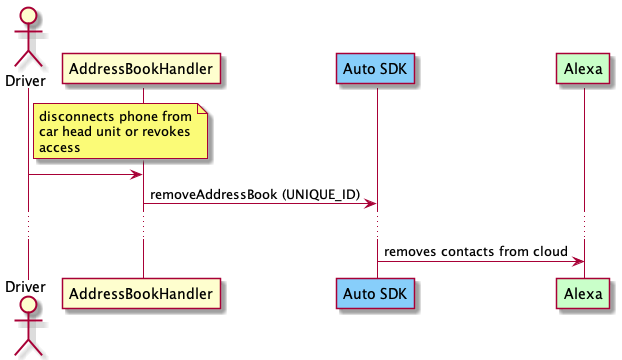
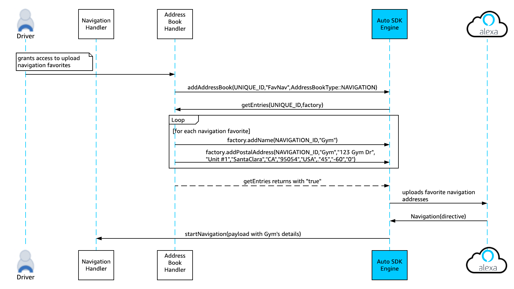

# Address Book Module


The Alexa Auto SDK Address Book module provides the features required by a platform implementation to augment the communications and navigation capabilities of Alexa with user data such as phone contacts and/or navigation favorites ("home", "work", etc.), allowing the user to upload and access phone contacts, or navigation favorites, or both.

> **Note:** In order to use the Address Book contact and navigation favorites uploading functionality, your product must be placed on the allow list by Amazon. See [Requesting Additional Functionality](../../../../NEED_HELP.md#requesting-additional-functionality) for details.

**Table of Contents**

* [Overview](#overview)
* [Address Book Sequence Diagrams](#sequence-diagrams)
* [Using the Address Book Module](#using-the-address-book-module)

## Overview<a id="overview"></a>

The Address Book module provides a common platform interface that you can implement to either upload user data to the Alexa cloud or allow the local communications and navigation capabilities to access user data for offline use cases (supported by the optional local voice control (LVC) module). The user can then use Alexa to call contacts by name, be informed of a caller's name, or get directions to favorite destinations.

Both the [Phone Call Controller](../phonecontrol/README.md) and Alexa-to-Alexa communications implemented via the optional Alexa Communications extension use the phone contacts uploaded via the Address Book module. However, the Contact and Navigation address books are not available for use with any other Alexa devices.

Your platform implementation is responsible for managing the life cycle of an address book, including:

* obtaining consent from end users to allow Alexa to use their data.
* notifying the Alexa Auto SDK Engine when end users revoke permission for Alexa to use their data (this notification ensures that the Alexa Auto SDK Engine will remove the user data from the Alexa cloud).

> **Important!** Each time an address book becomes unavailable (when the phone is disconnected, for example), your platform implementation must notify the Alexa Auto SDK Engine to trigger the deletion of the corresponding address book from the Alexa cloud and upload it when phone connects again.

### AddressBookType
The AddressBook API defines the type `aace.addressbook.AddressBook.AddressBookType`, which specifies the type of address book to add. The currently supported address book types are:

* `aace.addressbook.AddressBook.AddressBookType.CONTACT` for phone contacts
* `aace.addressbook.AddressBook.AddressBookType.NAVIGATION` for navigation favorites

## Sequence Diagrams<a id ="sequence-diagrams"></a>

The following sequence diagrams provide an overview of how the Address Book module handles uploading and removing contacts and navigation favorites.

### Upload Contacts

This diagram illustrates the sequence for uploading contacts and calling one of the uploaded contacts using voice.


### Remove Contacts

This diagram illustrates the sequence for removing uploaded contacts.



### Upload Navigation Favorites

This diagram illustrates the sequence for uploading navigation favorites and navigating to one of the uploaded destinations using voice.



### Remove Navigation Favorites

This diagram illustrates the sequence for removing uploaded navigation favorites.


## Using the Address Book Module<a id="using-the-address-book-module"></a>

To implement a custom Address Book handler, extend the `AddressBook` class:

```java
public class AddressBookHandler extends AddressBook {
    // The user connected a phone
    addAddressBook( ContactAddressBookUniqueId, "MyPhoneBook", AddressBookType.CONTACT );
    ...

    // Ingesting the navigation favorites
    addAddressBook( NavigationAddressBookUniqueId, "MyCarNavFavorites", AddressBookType.NAVIGATION );
    ...

    // Alexa Auto SDK to read the contact entries
    bool getEntries( addressBookSourceId, IAddressBookEntriesFactory factory ) {

        // For Contacts
        if ( addressBookSourceId == ContactAddressBookUniqueId ) {
            // Using factory, ingest all contacts data
            foreach( contact : ContactsBook ) {
                factory.addName( <UniqueContactEntryId>, "FirstName", "LastName", "NickName" );
                factory.addNumber( <UniqueContactEntryId>, "HOME", "1234567890" );
                ...
            }

            // On successful ingestion return true
            return true;
        }

        //For Navigation
        else if ( addressBookSourceId == NavigationAddressBookUniqueId ) {
            // Using factory, ingest all navigation favorites data
            foreach( navigation : NavigationBook ) {
                factory.addName( <UniqueNavigationEntryId>, "HOME" );
                factory.addPostalAddress( <UniqueNavigationEntryId>, "HOME", "123 Address", "", "",
                    "Seattle", "WA", "US", "98109", "US", 47.608, -122.33 , 0  );
                ...
            }

            // On successful ingestion return true
            return true;
        }
    }
    ...

    // The user disconnected a phone
    removeAddressBook( ContactAddressBookUniqueId );
    ...

    // Navigation Favorites is unavailable
    removeAddressBook( NavigationAddressBookUniqueId );
    ...
}

```
