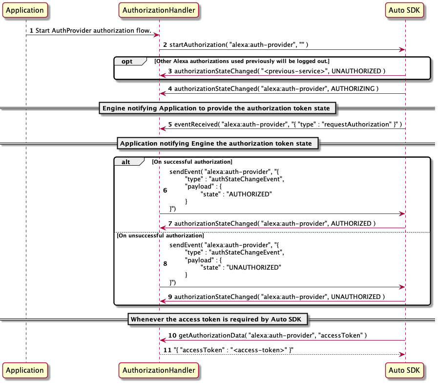
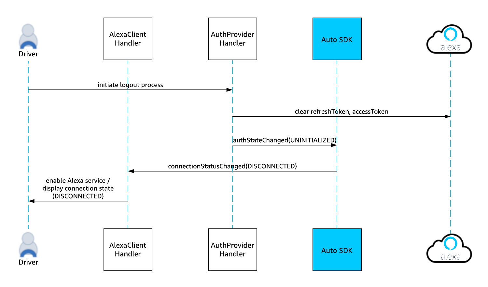
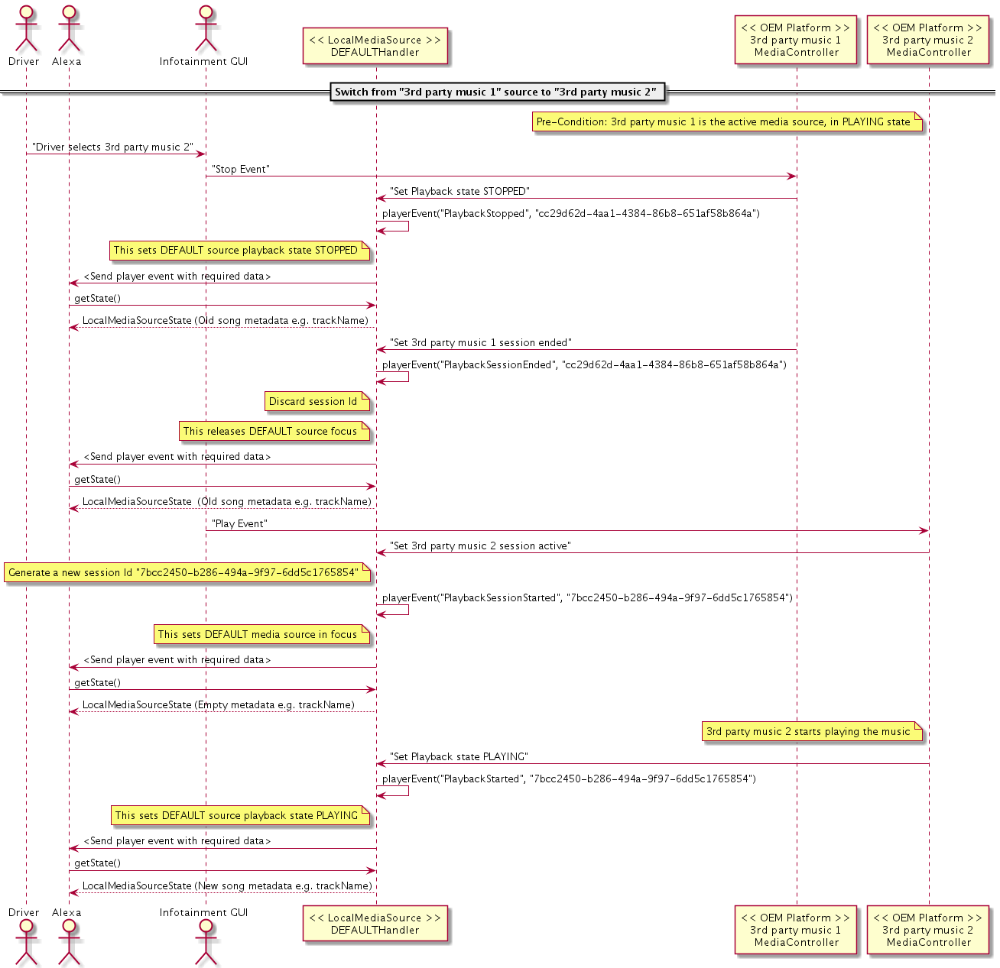

# Alexa Module

The Alexa Auto SDK Alexa module provides interfaces for standard Alexa features. The Engine handles some extra setup and steps to sequence events and handle directives so you can focus on using the provided API to interact with Alexa. You do this by registering platform interface implementations via the Engine object. 

>**Note:** If you want to enable wake word support, [contact your Amazon Solutions Architect (SA)](../../../../NEED_HELP.md#requesting-additional-functionality)

**Table of Contents**

- [Alexa Module Sequence Diagrams](#alexa-module-sequence-diagrams)
- [Configuring Alexa Module](#configuring-alexa-module)
  - [Using a JSON File](#using-a-json-file)
  - [Using Programmatic Configuration](#using-programmatic-configuration)
- [Handling Speech Input](#handling-speech-input)
- [Handling Speech Output](#handling-speech-output)
- [Handling Authorization](#handling-authorization)
  - [Using the Authorization Platform Interface to Carry out Auth Provider Authorization](#using-the-authorization-platform-interface-to-carry-out-auth-provider-authorization)
  - [Sequence Diagrams for Auth Provider Authorization](#sequence-diagrams-for-auth-provider-authorization)
  - [Optional Auth Provider Configuration](#optional-auth-provider-configuration)
  - [(Deprecated) Implementing a Custom Handler for AuthProvider](#deprecated-implementing-a-custom-handler-for-authprovider)
  - [Switching User Account](#switching-user-account)
  - [AuthProvider Login/Logout Sequence Diagrams](#authprovider-loginlogout-sequence-diagrams)
  - [Additional Authorization Resources](#additional-authorization-resources)
- [Handling Device Setup](#handling-device-setup)
  - [Implementing Custom Handler](#implementing-custom-handler)
  - [Handling an Event Response](#handling-an-event-response)
- [Handling Audio Output](#handling-audio-output)
  - [Custom Volume Control for Alexa Devices](#custom-volume-control-for-alexa-devices)
- [Handling Alexa Speaker](#handling-alexa-speaker)
- [Handling Audio Player Output](#handling-audio-player-output)
- [Handling Playback Controller Events](#handling-playback-controller-events)
- [Handling Equalizer Control](#handling-equalizer-control)
- [Handling Display Card Templates](#handling-display-card-templates)
- [Handling External Media Adapter with MACCAndroidClient](#handling-external-media-adapter-with-maccandroidclient)
- [Handling Local Media Sources](#handling-local-media-sources)
    - [Starting Playback with Content Selection by Voice](#starting-playback-with-content-selection-by-voice)
    - [Controlling Playback by Voice](#controlling-playback-by-voice) 
    - [Reporting Playback Events](#reporting-playback-events)
    - [Reporting Playback State](#reporting-playback-state)
    - [Example Sequence Diagrams](#example-sequence-diagrams)
- [Handling Notifications](#handling-notifications)
- [Handling Alerts](#handling-alerts)
- [Handling Do Not Disturb](#handling-do-not-disturb)
- [Handling Alexa State Changes](#handling-alexa-state-changes)

## Alexa Module Sequence Diagrams

For a view of how the Alexa Auto SDK flow works in selected use cases, see these sequence diagrams:

* [Tap to Talk Sequence Diagram](../../../../SEQUENCE_DIAGRAMS.md#tap-to-talk-sequence-diagram)
* [Wake Word Enabled Sequence Diagram](../../../../SEQUENCE_DIAGRAMS.md#wake-word-enabled-sequence-diagram)

## Configuring Alexa Module

The Alexa module can be configured in two ways:
* Specifying Configuration Data Using a JSON File.
* Specifying Configuration Data Programmatically.

See the [core module README](../core/README.md#configuring-the-engine) for steps to specify configuration data.

### Using a JSON File

Include the following structure in the JSON file:

```
"aace.alexa": {
        "avsDeviceSDK": {
            "deviceInfo": {
                "clientId": "${YOUR_CLIENT_ID}",
                "deviceSerialNumber": "${YOUR_DEVICE_SERIAL_NUMBER}",
                "productId": "${YOUR_PRODUCT_ID}",
                "manufacturerName": "${YOUR_MANUFACTURER_NAME}",
                "description": "${YOUR_DESCRIPTION}"
            },
            "libcurlUtils": {
                "CURLOPT_CAPATH" : "<CA_CERTIFICATES_FILE_PATH>"
                "CURLOPT_INTERFACE" : "<NETWORK_INTERFACE_NAME>"
            },
            "miscDatabase": {
                "databaseFilePath": "<SQLITE_DATABASE_FILE_PATH>"
            },
            "certifiedSender": {
                "databaseFilePath": "<SQLITE_DATABASE_FILE_PATH>"
            },
            "alertsCapabilityAgent": {
                "databaseFilePath": "<SQLITE_DATABASE_FILE_PATH>"
            },
            "notifications": {
                "databaseFilePath": "<SQLITE_DATABASE_FILE_PATH>"
            },
            "capabilitiesDelegate": {
                "databaseFilePath": "<SQLITE_DATABASE_FILE_PATH>"
            },
            "deviceSettings": {
                "databaseFilePath": "<SQLITE_DATABASE_FILE_PATH>",
                "locales": [<LIST_OF_LOCALE_STRINGS>],
                "defaultLocale": "<DEFAULT_LOCALE_STRING>",
                "localeCombinations": [[<LOCALE_STRING_PAIR>]],
                "defaultTimezone": "<TIMEZONE>"
            }
        }
    }
```
The `deviceInfo` field contains the details of the device. The fields `libcurlUtils`, `miscDatabase`, `certifiedSender`, `alertsCapabilityAgent`, `notifications`, and `capabilitiesDelegate` specify the respective database file paths.

The `deviceSettings` field specifies the settings on the device. The following list describes the settings:

* `databaseFilePath` is the path to the SQLite database that stores persistent settings. The database will be created on initialization if it does not already exist.
* `defaultLocale` specifies the default locale setting, which is Alexa's locale setting until updated on the device. The default value of `defaultLocale` is “en-US”.
* `locales` specifies the list of locales supported by the device. The default value is `["en-US","en-GB","de-DE","en-IN","en-CA","ja-JP","en-AU","fr-FR","it-IT","es-ES","es-MX","fr-CA","es-US", "hi-IN", "pt-BR"]`.
* `localeCombinations` specifies the list of locale pairs available on a device that supports multi-locale mode. Through the Dynamic Language Switching feature, Alexa can communicate with the user of such device in languages specified in the locale pairs. In each pair, the first value is the primary locale, which Alexa uses most often when interacting with the user. The second value is the secondary locale, which specifies an additional language that Alexa uses when responding to an utterance in the corresponding language. For example, if ["en-US", "es-US"] is declared in `localeCombinations` and the device specifies this pair as the current locale setting, Alexa primarily operates in English for the U.S. but can understand and respond to utterances in Spanish for the U.S., without requiring the device to update the locale setting.
  
  By default, `localeCombinations` is a list of the following combinations, which are also the supported combinations as of 2021-02-02. It is possible for the default value to be different from the list of supported combinations in the future. For updates to the supported combinations, see the [Alexa Voice Service documentation](https://developer.amazon.com/en-US/docs/alexa/alexa-voice-service/system.html#localecombinations).
  
  * ["en-US", "es-US"]
  * ["es-US", "en-US"]
  * ["en-IN", "hi-IN"]
  * ["hi-IN", "en-IN"]
  * ["en-CA", "fr-CA"]
  * ["fr-CA", "en-CA"]
  * ["en-US", "es-ES"]
  * ["es-ES", "en-US"]
  * ["en-US", "de-DE"]
  * ["de-DE", "en-US"]
  * ["en-US", "fr-FR"]
  * ["fr-FR", "en-US"]
  * ["en-US", "it-IT"]
  * ["it-IT", "en-US"]
  * ["en-US", "ja-JP"]
  * ["ja-JP", "en-US"]


  When a device operates in multi-locale mode, an application can select any locale pair in the list above as the locale setting if the following
  conditions are met:
  
  * The device's primary locale setting is the first locale in the selected pair. 
  * The device also supports the secondary locale in the pair.
  * The pair is specified in `localeCombinations`.
  
  **Note:** Dynamic Language Switching is only available in online mode. 

### Using Programmatic Configuration
You can configure programmatically all of the above specified fields using the methods provided by the AlexaConfiguration platform interface. For example, to create deviceInfo config:

```java
AlexaConfiguration deviceConfig = AlexaConfiguration.createDeviceInfoConfig(
    "<DEVICE_SERIAL_NUMBER>", "<CLIENT_ID>", "<PRODUCT_ID>", "<MANUFACTURER_NAME>", "<DESCRIPTION>");
```

```java
final String[] LOCALES =  new String[]{"<LOCALE1>", "<LOCALE2>", ...};
final String[][] LOCALE_COMBINATIONS = new String[][]{{"<LOCALE1>", "<LOCALE2>", ...}};
AlexaConfiguration deviceSettingsConfig = AlexaConfiguration.createDeviceSettingsConfig(
    "<SQLITE_DATABASE_FILE_PATH>",
    LOCALES,
    "<DEFAULT_LOCALE>",
    "<TIMEZONE>",
    LOCALE_COMBINATIONS);
```

## Handling Speech Input

It is the responsibility of the `AudioInputProvider` platform implementation to supply audio data to the Engine so that Alexa can process voice input. Since the Engine does not know how audio is managed on a specific platform, the specific audio capture implementation is up to you. An audio playback sound (earcon) is played whenever speech input is invoked. The playback is handled by whichever audio channel is assigned to the EARCON type. [Read more about handling media and volume here](#handling-audio-output).

To implement a custom handler for speech input, extend the `SpeechRecognizer` class:

```
public class SpeechRecognizerHandler extends SpeechRecognizer {

    @Override
    public boolean wakewordDetected( String wakeWord ) {
        // play audio cue and/or update GUI
        return true;
    }
    ...
    
    @Override
    public void endOfSpeechDetected() {
        // play audio cue and/or update GUI
    }
    ...
    
    // Notify engine of speech recognize event via press-and-hold initiation. 
    // startCapture( Initiator.HOLD_TO_TALK ) is equivalent.
    holdToTalk();
    ...
    
    // Notify the Engine of a speech recognize event press-and-release initiation.
    // startCapture( Initiator.TAP_TO_TALK ) is equivalent.
    tapToTalk();
    ... 
    
    // Notify the Engine that the wake word engine has detected the wake word. 
    // Currently the only keyword value supported is "ALEXA".  
    startCapture( Initiator::WAKEWORD, 54500, 162000, "ALEXA" );
    ...
    
    // Notify the Engine to stop speech recognition. 
    // For example, when hold-to-talk was used and is now being ended by the button release action
    stopCapture();
    ...
}
```

>**Note:** In the example for `startCapture()` above, 54500 is the value for `keywordBegin`, and 162000 is the value for `keywordEnd`. These parameters correspond to the wake word indexes in the audio input stream. You must increment `keywordBegin` for each subsequent wake word to match the index at which the wake word begins (for example, at 200000), making sure that there are 8000 samples preceding the wake word as pre-roll. Otherwise, Alexa would respond incorrectly. For more information about wake word indexes, see [this section on the developer portal](https://developer.amazon.com/en-US/docs/alexa/alexa-voice-service/implement-ww-verification.html#indices).

## Handling Speech Output

The `SpeechSynthesizer` is responsible for handling Alexa's speech. In v2.0.0 and later of the Auto SDK, this interface no longer has any platform-dependent implementation. However, you must still register it to enable the feature. The playback is handled by whichever audio channel is assigned to the TTS type. [Read more about handling media and volume here](#handling-audio-output).

To implement a custom handler for speech output extend the `SpeechSynthesizer` class:

```
public class SpeechSynthesizerHandler extends SpeechSynthesizer {
    ...
}
...

// Register the platform interface with the Engine
mEngine.registerPlatformInterface( mSpeechSynthesizer = new SpeechSynthesizerHandler() );
```  
## Handling Authorization

Every request to Alexa Voice Service (AVS) requires a Login with Amazon (LWA) access token.
Starting with Auto SDK v3.1.0, use the Authorization platform interface to start, cancel, and log out of authorization. The Auto SDK continues to support the AuthProvider platform interface, but it is on the deprecation path. For more information about how the Engine manages authorization, see the Core module [README](../core/README.md).

In this document, "Auth Provider authorization" refers to the general method through which the application implements acquiring access tokens itself and provides them to the Engine.

>**Note**: Auth Provider authorization and other authorization methods, such as [CBL](../cbl/README.md), are mutually exclusive. For example, if the device is already registered with CBL, starting Auth Provider authorization logs out the device from the previous authorization.

> **Note:** The access and refresh tokens must be cleared when the user logs out, and any time the access and refresh tokens are cleared, users must go through the authentication and authorization process again.

> **Note:** Your application should stop the audio player if the user logs out of a device when music is currently playing.

For more information about authorization, see the following documents:

* [Authorize from a Companion App](https://developer.amazon.com/en-US/docs/alexa/alexa-voice-service/authorize-companion-app.html)
* [Authorize from an AVS Product](https://developer.amazon.com/en-US/docs/alexa/alexa-voice-service/authorize-on-product.html)
* [Authorize from a Companion Site](https://developer.amazon.com/en-US/docs/alexa/alexa-voice-service/authorize-companion-site.html)

### Using the Authorization Platform Interface to Carry out Auth Provider Authorization
This section describes how an application uses the Authorization platform interface to carry out Auth Provider authorization.
The service name used by Authorization for Auth Provider authorization is `alexa:auth-provider`.

#### Starting Authorization	
To start authorization, the application uses the `startAuthorization` API.
The data parameter in the `startAuthorization` API is an empty string, as shown in the following example: 

~~~
startAuthorization( "alexa:auth-provider", "" )
~~~

>**Note:** With the Authorization platform interface, it is the responsibility of the application to start authorization at every Engine start. Each time the Engine is restarted, it does not automatically start the authorization that was previously in effect before the Engine restart.

#### Receiving Events from Engine
This section describes the protocol for the application to receive events from the Engine. The API used is `eventReceived`. 
The application needs to receive an event in these scenarios:

* when the Engine requests the application to start authorization
* when the application needs to log out of the authorization

To request the application to start authorization, the Engine passes the request to the application by using the event parameter in the `eventReceived` API. The parameter has the following JSON structure:

~~~
{
    "type": "requestAuthorization"
}
~~~

The application receives the event from the Engine through the `eventReceived` API as follows:

~~~
eventReceived( "alexa:auth-provider", "{"type":"requestAuthorization"}" )
~~~

To log out, the event parameter in the `eventReceived` API has the following JSON structure:

~~~
{
    "type": "logout"
}
~~~

The Engine calls the `eventReceived` method to log out the device as follows:

~~~
eventReceived( "alexa:auth-provider", "{"type":"logout"}" )
~~~

#### Sending Events to Engine
To notify the Engine of an authorization state change, the application uses the event parameter of the `sendEvent` API. The parameter has the following JSON structure:

~~~
{
    "type":"authStateChangeEvent",
    "payload": {
        "state":"{STRING}"
    }
}
~~~

The possible state strings are AUTHORIZED and UNAUTHORIZED.

The application needs to notify the Engine of an authorization state change for one of the following reasons:
* There is a request from Engine via `eventReceived` with `type` set to `requestAuthorization`.
* The application transitions to a new state, as shown in the following example where state transitions from `UNAUTHORIZED` to `AUTHORIZED`:

~~~
sendEvent( "alexa:auth-provider",
    "{
        "type":"authStateChangeEvent"
        "payload": {
            "state":"AUTHORIZED"
        }  
    }"
 )
~~~

#### Getting Access Token
The Engine calls the application to get the access token by using the `accessToken` parameter in the `getAuthorizationData` API as follows:

~~~
getAuthorizationData("accessToken")
~~~

The application responds with an access token, as shown in the following example.
~~~
{
    "accessToken":"Atza|AAAAAABBBBBBCCCCCC"
}
~~~

#### Canceling Authorization
To cancel authorization, the API to use is `cancelAuthorization`, as follows:

~~~
cancelAuthorization( "alexa:auth-provider" );
~~~

You may call this API to cancel the authorization that is started by calling `startAuthorization` but before sending an event via `sendEvent`. Canceling authorization does not affect the device authorization state.


#### Logging Out

The application makes the `logout` API call to the Engine to log out, as follows:

~~~
logout( "alexa:auth-provider" );
~~~

#### Handling Errors
The Engine notifies the application about any error during the authorization process.

The following list describes possible errors during authorization:

* `UNKNOWN_ERROR`: An unrecoverable error happens in the authorization process.
* `AUTH_FAILURE`: An invalid or expired access token is provided.
* `LOGOUT_FAILED`: The application cannot complete the logout process.
* `START_AUTHORIZATION_FAILED`: The authorization process cannot start.

The following example shows how the API handles an error when the provided access token is either expired or invalid:
~~~
authorizationError( "alexa:auth-provider", "AUTH_FAILURE", "" )
~~~

### Sequence Diagrams for Auth Provider Authorization

The following sequence diagram illustrates the flow when the Authorization platform interface starts an authorization.

<p align="center">

</p>

The following sequence diagram illustrates the flow when the Authorization platform interface cancels an authorization.

<p align="center">

</p>

The following sequence diagram illustrates the flow when the Authorization platform interface logs out of an authorization.

<p align="center">

</p>

### Optional Auth Provider Configuration
By default, the Engine supports one Auth Provider authorization. However, if your application supports more than one, provide the Engine with the following configuration. You can also build the configuration programmatically by using [`createAuthProviderConfig`](./src/main/java/com/amazon/aace/alexa/config/AlexaConfiguration.java).

```json
{
    "aace.alexa" : {
        "authProvider" : {
           "providers" : [<LIST_OF_PROVIDER_NAMES_STRINGS>]
        }
    }
}
```

For example, if your application supports two Auth Provider authorizations, named "serviceA" and "serviceB," provide the following configuration:


```json
{
    "aace.alexa" : {
        "authProvider" : {
           "providers" : ["serviceA" , "serviceB"]
        }
    }
}
```

With this configuration, the Engine uses the service names "serviceA" and "serviceB" with the Authorization platform interface instead of using the default Auth Provider service name `alexa:auth-provider`.


### (Deprecated) Implementing a Custom Handler for AuthProvider
>**Note:** The information in this section is not applicable if you use the Authorization platform interface. The AuthProvider platform interface is deprecated.

To implement a custom handler for authentication, extend the `AuthProvider` class:


```java
public class AuthProviderHandler extends AuthProvider {

    @Override
    public String getAuthToken() {
        // return the currently obtained access token
    }
	
    @Override
    public AuthState getAuthState() {
        // return the current auth state
	}
	...
	
    // Notify the Engine that the access token has been refreshed
    authStateChange( AuthProvider.AuthState.REFRESHED, AuthProvider.AuthError.NO_ERROR );
	...
}
...

// Register the platform interface with the Engine
mEngine.registerPlatformInterface( mAuthProvider = new AuthProviderHandler() );
```

### Switching User Account

When switching from one authorized user account to another, you must call the `authStateChanged(UNINITIALIZED)` API before providing access tokens for the second user.

>**NOTE:** Starting with the Auto SDK 3.1, you don't have to restart the Engine after a user logs out. Immediately after the `authStateChanged(UNINITIALIZED)` API returns, you may start a fresh Auth Provider authorization by calling the `authStateChanged(REFRESHED)` API.

### AuthProvider Login/Logout Sequence Diagrams

The following diagram illustrates the login sequence when using the AuthProvider platform interface to obtain access and refresh tokens.


The following diagram illustrates the logout sequence when using the AuthProvider platform interface to clear access and refresh tokens.



### Additional Authorization Resources

See the following for additional information on Authorization:

* [Customer Experience in Android/Fire apps](https://developer.amazon.com/docs/login-with-amazon/customer-experience-android.html#login-flows)
* [Implement Authorization for AVS Using Login With Amazon](https://developer.amazon.com/alexa-voice-service/auth)
* [Understanding Login Authentication with the AVS Sample App and the Node.js Server](https://developer.amazon.com/blogs/alexa/post/bb4a34ad-f805-43d9-bbe0-c113105dd8fd/understanding-login-authentication-with-the-avs-sample-app-and-the-node-js-server)

## Handling Device Setup
>**Note:** Support for device setup is only for devices allow-listed by Amazon. If you want to use this feature, contact your Solutions Architect or Partner Manager.

The `DeviceSetup` API handles events and directives related to device setup during or after an out-of-the-box experience (OOBE). After the user login, the `SetupCompleted` event is sent from the device to inform Alexa that device setup is complete. Alexa then starts the on-boarding experience, for example, by starting a short first-time conversation on the device.

>**Note:** Alexa provides the on-boarding experience to first-time users only. The experience might be different for returning users.

Because `SetupCompleted` is for triggering the on-boarding experience, call the API only if login is successful. Also, if the authorization session is started with an existing refresh token, do not call the `SetupCompleted`.

### Implementing Custom Handler
To implement a custom handler for device setup, extend the `DeviceSetup` class as follows:

```java
import com.amazon.aace.alexa.DeviceSetup;
public class DeviceSetupHandler extends DeviceSetup {
  ...
};
...

// Register the platform interface with the Engine
if (!mEngine.registerPlatformInterface(mDeviceSetupHandler = new DeviceSetupHandler()))
  throw new RuntimeException("Could not register Device Setup platform interface");
  
// Call 'setupCompleted()' when the device is authenticated
mDeviceSetupHandler -> setupCompleted();
```

### Handling an Event Response
After calling `setupCompleted()`, implement the `setupCompletedResponse(StatusCode statusCode)` method to determine whether the event was sent successfully, as follows:

```java
import com.amazon.aace.alexa.DeviceSetup;
public class DeviceSetupHandler extends DeviceSetup {
  public void setupCompletedResponse(final StatusCode statusCode) {
    // Handle or log the status
  }
};
```

`StatusCode` is "SUCCESS" or "FAIL", depending on whether the `setupCompleted` event was sent successfully to Alexa.

## Handling Audio Output

When audio data is received from Alexa, it is the responsibility of the platform implementation to read the data from the Engine and play it using a platform-specific audio output channel. It is also the responsibility of the platform implementation to define how each `AudioOutput` channel is handled. Each `AudioOutput` implementation will handle one or more of the following media types depending on the behavior defined in the `AudioOutputProvider`:

* TTS
* MUSIC
* NOTIFICATION
* ALARM
* EARCON
* COMMUNICATION

`AudioOutput` also has methods to control the volume of the audio channel. These methods allow the Engine to set the volume, either when the user asks Alexa to adjust it or if the Engine internally needs to adjust it during audio focus management. All local volume changes (initiated via button press or system-generated, for example) must be reported to the Engine through the `AlexaSpeaker` platform interface. For further details about the `AudioOutput` and `AudioOutputProvider` platform interfaces, please refer to the [Core module README](../core/README.md#implementing-audio).

### Custom Volume Control for Alexa Devices

You can use a custom volume control to support an Alexa device's native input volume range. By default, Alexa supports voice utterances that specify volume values between 0 and 10, but some devices may support a different range (i.e. 0 to 100). By placing on Amazon's allow list your Alexa device's volume range for your target platform, you can specify input volume levels per your device's range. Your device's input volume range is then mapped appropriately to the Alexa volume range.

Contact your Alexa Auto Solution Architect (SA) for help with allow lists. Placing a device on the allow list requires the following parameters:

* DeviceTypeID: <YOUR_DEVICE_TYPE_ID>
* Min: <YOUR_MIN_VOLUME_VALUE>
* Max: <YOUR_MAX_VOLUME_VALUE>

This does not impact the range used in the directives to the device. You must continue to use the SDK 0-100 volume range used by `AudioOutput` and `AlexaSpeaker` and map these values to the correct range in your implementation.

## Handling Alexa Speaker

The Alexa service keeps track of two device volume types: `ALEXA_VOLUME` and `ALERTS_VOLUME`. The `AlexaSpeaker` class should be implemented by the platform to both set the volume and mute state of these two speaker types and allow the user to set the volume and mute state of these two speaker types locally via GUI if applicable. 

```
public class AlexaSpeakerHandler extends AlexaSpeaker {
    ...    
    @Override
    public void speakerSettingsChanged( SpeakerType type, boolean local, byte volume, boolean mute ) {
        // When invoked, set the speaker volume and mute state
    }
    ...
    
    // Notify the Engine of local UI volume setting change
    SpeakerType type = SpeakerType.ALEXA_VOLUME;
    localSetVolume( type, 100 );
    ...
    
    // Notify the Engine of local UI volume adjustment
    SpeakerType type = SpeakerType.ALERTS_VOLUME; 
    localAdjustVolume( type, 10 );
    ...
    
    // Notify the Engine of local UI mute setting change
    SpeakerType type = SpeakerType.ALEXA_VOLUME;
    localSetMute( type, true );
```  

## Handling Audio Player Output

When an audio media stream is received from Alexa it is the responsibility of the platform implementation to play the stream in a platform-specific media player. The `AudioPlayer` class informs the platform of the changes in player state being tracked by the Engine. This can be used to update the platform GUI.

To implement a custom handler for audio player output, extend the `AudioPlayer` class:

```
public class AudioPlayerHandler extends AudioPlayer {
    ...
    @Override
    public void playerActivityChanged( AudioPlayer.PlayerActivity state) {
        // on state change, update playback control UI
    }
    ...
}
```
## Handling Playback Controller Events

The Engine provides a platform interface `com.amazon.aace.alexa.PlaybackController` for the platform implementation to report on-device transport control button presses for media playing through Alexa. For example, if the user presses the on-screen pause button while listening to Amazon Music through Alexa's `AudioPlayer` interface, the platform implementation calls a `PlaybackController` method to report the button press to the Engine.

>**Note:** `PlaybackController` method calls to manage `AudioPlayer`'s state or playback queue proactively report button presses or the equivalent so that Alexa can react; they do *not* report changes to the playback state that happen locally first. The Alexa cloud manages the playback queue for `AudioPlayer` content, so each `PlaybackController` method call is a request for Alexa to act on the user's local request. The result of the request will come as one or more method invocations on the `AudioOutput` associated with the channel used for `AudioPlayer`.

> **Note:** If your implementation needs to stop `AudioPlayer` media in response to system events, such as audio focus transitions to audio playing outside the scope of the Auto SDK, use `PlaybackController` to notify the Engine of such changes. However, bear in mind that the expected usage of the interface does not change when it is used in this use case.

>**Note:** `PlaybackController` only controls media coming from Alexa, i.e. the `AudioPlayer`. `PlaybackController` should not be used the expectation of controlling playback for non-media Alexa audio sources like `SpeechSynthesizer` or Alexa-aware external media sources integrated with `ExternalMediaAdapter` or `LocalMediaSource`. Additionally, calling a `PlaybackController` method while audio is playing through another Alexa-aware external media source will produce unexpected results and is not recommended.

Whenever Alexa plays a source, the `TemplateRuntime` platform interface will also receive a player info card. This card will contain information about which playback controls should be shown, and will vary case by case. When any button is pressed, an event is sent to Alexa, and then another player info directive will be issued with the new control state in the payload to synchronize the display. 

Below is a table of supported button and toggle controls, and how they relate to player info controls.

| associated PlayerInfo control name | PlaybackController | 
|:---|:--- |
| **PlaybackButton** | | 
| "PLAY_PAUSE" | PLAY | 
| "PLAY_PAUSE" | PAUSE | 
| "NEXT" | NEXT |
| "PREVIOUS" | PREVIOUS |
| "SKIP_FORWARD" | SKIP_FORWARD | 
| "SKIP_BACKWARD" | SKIP_BACKWARD |
| **PlaybackToggle** |
| "SHUFFLE" | SHUFFLE | 
| "LOOP" | LOOP | 
| "REPEAT" | REPEAT | 
| "THUMBS_UP" | THUMBS_UP |
| "THUMBS_DOWN" | THUMBS_DOWN |

To implement a custom handler for the playback controller, extend the `PlaybackController` class:

```
public class PlaybackControllerHandler extends PlaybackController {
    @Override
    public void playButtonPressed() {
    	// Notify the engine the play button was pressed
    	buttonPressed(PlaybackButton.PLAY);
    }
    // Other buttons are similar
    ...
	
    // After displaying controls given by PlayerInfo
    public void skipForwardPressed() {
    	// Notify the Engine that the skip forward button was pressed
    	buttonPressed(PlaybackButton.SKIP_FORWARD);
    }
    ...

    // toggle control state is given by PlayerInfo
    togglePressed(PlaybackButton.SHUFFLE, true); // should be called with opposing state from the PlayerInfo template
```

## Handling Equalizer Control

The Equalizer Controller enables Alexa voice control of the device's audio equalizer settings, which includes making gain level adjustments to any of the supported frequency bands ("BASS", "MIDRANGE", and/or "TREBLE") using the device's onboard audio processing. 

The platform implementation is responsible for the following:
* Determining how each supported band affects the audio
* Mapping Alexa's equalizer bands to the bands supported on the device, if they do not directly correspond
* Scaling Alexa's level values as necessary so that each step corresponds to one decibel of amplitude gain on the device
* Applying equalization to only selected portions of the audio output so that Alexa's speech, alarms, etc. will not be affected
* Persisting settings across power cycles

The Equalizer Controller is configurable to the device's capabilities. See `com.amazon.aace.alexa.config.AlexaConfiguration.createEqualizerControllerConfig` for details on configuring the supported bands, default state, and decibel adjustment range.

To implement a custom handler for Equalizer Controller, extend the `EqualizerController` class:

```
public class EqualizerControllerHandler extends EqualizerController {
    @Override
    public void setBandLevels( EqualizerBandLevel[] bandLevels ) {
    	// Handle performing audio equalization on the device
    	// according to the provided band dB level settings
    	
    	// This invocation may come from "Alexa, reset bass", 
    	// "Alexa, reset my equalizer", "Alexa, increase treble", etc.
    }
    
    @Override
    public EqualizerBandLevel[] getBandLevels() {
    	// Return the current band level settings on the device
    	return mCurrentBandLevels;
    }
    
    ...
}
...

// Configure the Engine
// For example, 2 supported bands with amplitude gains ranging from -8dB to +8dB, each with a default of 0dB
EqualizerBand[] bands = new EqualizerBand[]{ EqualizerBand.BASS, EqualizerBand.TREBLE };
EqualizerBandLevel[] defaults = new EqualizerBandLevel[]{ 
	new EqualizerBandLevel( EqualizerBand.BASS, 0 ), 
	new EqualizerBandLevel( EqualizerBand.TREBLE, 0 )};
EngineConfiguration eqConfig = AlexaConfiguration.createEqualizerControllerConfig( bands, -8, 8, defaults );

mEngine.configure( new EngineConfiguration[]{
	// other config objects,
	eqConfig,
	...
});

...

// Register the platform interface with the Engine
EqualizerController mEqController = new EqualizerControllerHandler();
mEngine.registerPlatformInterface( mEqController );

...

// If level changes are adjusted using local on-device controls, call inherited methods to notify the Engine:

// To set a band to an absolute gain level in decibels
EqualizerBandLevel[] settings = new EqualizerBandLevel[]{ 
	new EqualizerBandLevel( EqualizerBand.BASS, 4 )}; // Sets bass amplitude to +4dB
mEqController.localSetBandLevels( settings );

// To make a relative adjustment to level settings
EqualizerBandLevel[] adjustments = new EqualizerBandLevel[]{ 
	new EqualizerBandLevel( EqualizerBand.BASS, -2 )}; // Decreases bass gain by 2dB
mEqController.localAdjustBandLevels( adjustments );

// To reset gain levels to the configured defaults (usually 0dB)
EqualizerBand[] bands = new EqualizerBand[]{ EqualizerBand.BASS, EqualizerBand.TREBLE }; // Resets bass and treble bands
mEqController.localResetBands( bands );
```

## Handling Display Card Templates

Alexa sends visual metadata (display card templates) for your device to display. When template information is received from Alexa, it is the responsibility of the platform implementation to handle the rendering of any UI with the information that is received from Alexa. There are two display card template types:

* The [Template](https://alexa.design/DevDocRenderTemplate) type provides visuals associated with a user request to accompany Alexa speech.
* The [PlayerInfo](https://amzn.to/DevDocTemplatePlayerInfo) type provides visuals associated with media playing through the `AudioPlayer` interface. This includes playback control buttons, which must be used with the `PlaybackController` interface.

To implement a custom handler for GUI templates, extend the `TemplateRuntime` class:

```
public class TemplateRuntimeHandler extends TemplateRuntime {
    ...
    @Override
    public void renderTemplate( String payload ) {
    	// Handle rendering the JSON string payload as a display card
    }
    ...
    
    @Override
    public void renderPlayerInfo( String payload ) {
    	// Handle rendering the JSON string payload as a display card
    }
    ...
    
    @Override
    public void clearTemplate() {
        // Handle dismissing the display card
    }
    ...
    @Override
    public void clearPlayerInfo() {
        // Handle clearing the player info display card here
    }
```
>**Note:** In the case of lists, it is the responsibility of the platform implementation to handle pagination. Alexa sends down the entire list as a JSON response and starts reading out the first five elements of the list. At the end of the first five elements, Alexa prompts the user whether or not to read the remaining elements from the list. If the user chooses to proceed with the remaining elements, Alexa sends down the entire list as a JSON response but starts reading from the sixth element onwards.

## Handling External Media Adapter with MACCAndroidClient 

The External Media Player (EMP) Adapter allows you to declare and use external media application sources in your application. In order to interface with the EMP Adapter, you must use one of the following:

* A media connection client to interface the EMP Adapter to the external app. The Android Sample App supports an example external media connection client called the Media App Command and Control (MACC) client. Use the MACC client to interface with the Spotify app running on Android. 
An embedded media app. For information about external embedded media app solutions, contact your SA or Partner Manager.

>**Note:** If the media app service requires additional customer experience details, incorporate the requirement in your implementation. For example, if the provider requires your application to show the provider's logo in a particular way, modify the implementation to meet the requirement. 

When advised by your SA or Partner Manager, configure the External Media Player Adapter to the device's capabilities. See `com.amazon.aace.alexa.config.AlexaConfiguration.createExternalMediaPlayerConfig()` for details on configuring the supported agent.

An example use case for the MACC client is to interface with the Spotify app running on Android, as described below. 

The following example shows how to register an ExternalMediaAdapter handler using the MACCAndroidClient:

```
mEngine.registerPlatformInterface( new MACCPlayer( this,  mLogger ) );
```

To implement the MACC player handler, extend the `ExternalMediaAdapter` class, then create the `MACCAndroidClient` and register the callback in the constructor:

```
public class MACCPlayer extends ExternalMediaAdapter {
    private final MACCAndroidClient mClient; // the MACC client
    ...
    
    public MACCPlayer( Context context) {
        mClient = new MACCAndroidClient(mContext);
        mClient.registerCallback(mMACCAndroidClientCallback);
        ...
    }
    ...

``` 

After registering the platform, make a call to `initAndRunDiscovery()`. This initializes and tells the MACC client to discover all MACC applications available on the device.

```
public void runDiscovery() {
    mHandler.postDelayed(new Runnable() {
        @Override
        public void run() {
            mClient.initAndRunDiscovery();
        }
    }, 100);
```    

In the `MACCAndroidClientCallback` class `onPlayerDiscovered()`, call `reportDiscoveredPlayers()` with the discovered players array populated according to the spec. This notifies the cloud of the discovered players. 

The `playerId` passed in the methods is discovered from the MACC client and is associated with one unique MACC application (for example, Spotify).

```
private final MACCAndroidClientCallback mMACCAndroidClientCallback = new MACCAndroidClientCallback() {
    ...
@Override
public void onPlayerDiscovered(List<DiscoveredPlayer> list) {
    DiscoveredPlayerInfo[] discoveredPlayers = new DiscoveredPlayerInfo[list.size()];
    //populate
    ...
    //call to interface
    reportDiscoveredPlayers(discoveredPlayers);
```

The cloud confirms the players by invoking the authorize method. Here we submit the authorized players list back to the MACCClient:

```
@Override
public boolean authorize(AuthorizedPlayerInfo[] authorizedPlayers) {
    ...
    mClient.onAuthorizedPlayers(mAuthorizedPlayers);
```

Once the discovery and authorization has been completed, the MACC client reports a player event with at least `SessionsStarted`. 

You should call two interface methods whenever media application events occur:

* The `playerEvent()` method informs the cloud of the player event to maintain synchronization.
* The `playerError()` method informs the cloud of a player error and should be handled in the same way as the `playerEvent()` method. 

```
@Override
public void onPlayerEvent(String playerId, Set<PlayerEvents> playerEvents, String skillToken, UUID playbackSessionId) {
...
    playerEvent(playerId, event.getName());
...
@Override
public void onError(String errorName, int errorCode, boolean fatal, String playerId, UUID playbackSessionId) {
    playerError(playerId, errorName, errorCode, "none", fatal);
    ...
```

The tables below describe the supported event and error names implemented according to the MACC specification:

| playerEvent() event name | Description |
|:--|:--|
| "PlaybackSessionStarted" | A new playback session has started, either from a GUI interaction or as a result of a user voice request to Alexa. The Engine considers the player active and in focus (although it may or may not yet be playing). |
| "PlaybackStarted" | During an active session, the player has started to play or resumed from a paused state. The Engine considers the player active and in focus. |
| "TrackChanged" | During an active session, one track has ended and another has started. The Engine uses this primarily for state reporting.  |
| "PlaybackNext" | During an active session, the player skipped from one track to the next track, either as a result of a GUI interaction or a user voice request to Alexa. The Engine uses this primarily for state reporting. |
| "PlaybackPrevious" | During an active session, the player skipped from one track to the previous track, either as a result of a GUI interaction or a user voice request to Alexa. The Engine uses this primarily for state reporting. |
| "PlayModeChanged" | During an active session, some user setting for the track or playback session changed, such as the favorite setting or the shuffle mode. The Engine uses this primarily for state reporting.|
| "PlaybackStopped" | During an active session, the player has paused or stopped, either as a result of a GUI interaction or a user voice request to Alexa. The Engine considers the player active and in focus, just not currently playing. User voice requests to resume still control the player. |
| "PlaybackSessionEnded" | An active playback session has ended. The player should no longer be playing or playable until a new session is started by GUI interaction or user voice request to Alexa. The Engine considers the player inactive and no longer in focus. |

| playerError() event name | Description |
|:--|:--|
| "INTERNAL\_ERROR" | Any fatal player error has occurred
| "UNKNOWN\_ERROR" | An unknown error occurred
| "UNPLAYABLE\_BY\_AUTHORIZATION" | The media couldn't be played due to an unauthorized account
| "UNPLAYABLE\_BY\_STREAM\_CONCURRENCY" | The media couldn't be played due to the number of accounts currently streaming
| "UNPLAYABLE\_BY\_ACCOUNT" | The media couldn't be played due to the account type
| "UNPLAYABLE\_BY\_REGION" | The media couldn't be played due to the current region
| "UNPLAYABLE\_BY\_PARENTAL\_CONTROL" | The media couldn't be played due to parental settings
| "UNPLAYABLE\_BY\_SUBSCRIPTION" | The media couldn't be played due to the subscription type 
| "OPERATION\_REJECTED\_UNINTERRUPTIBLE" | The operation could not be performed due to non interruptible media
| "OPERATION\_REJECTED\_END\_OF\_QUEUE" | The operation could not be performed due to the end of media being reached
| "OPERATION\_UNSUPPORTED" | The operation was not supported
| "OPERATION\_REJECTED\_SKIP\_LIMIT" | The operation failed because a skip limit was reached 
| "PLAYER\_UNKNOWN" | An unknown player was detected
| "PLAYER\_NOT\_FOUND" | The player was not discovered
| "PLAYER\_CONNECTION\_REJECTED" | The connection to the player failed
| "PLAYER\_CONNECTION\_TIMEOUT" | The connection to the player timed out

The Alexa client usually sets internal focus via the `playerEvent()` and `playerError()` methods in addition to successful calls to `play()` and `playControl()`. If the platform wishes to update the Alexa client focus in some way other than via Alexa interaction (for example via external GUI navigation), the `setFocus()` method can be used. Then the user can subsequently use Alexa to voice control the source.

Additionally, successful calls to `play()` and `playControl()` will also set the focus, and unsuccessful calls will unset the focus. A call to the `removeDiscoveredPlayer()` will unset focus.

The `login()` and `logout()` methods inform AVS of login state changes, if applicable. If your application has the ability to handle cloud-based login and logout, you should also call the `loginComplete()` and `logoutComplete()` where appropriate. 

```
@Override
public boolean login(String localPlayerId, String accessToken, String userName, boolean forceLogin, long tokenRefreshInterval) {
    mClient.handleDirective(new LoginDirective(localPlayerId, accessToken, userName, forceLogin, tokenRefreshInterval));
...
@Override
public boolean logout(String localPlayerId) {
    mClient.handleDirective(new LogoutDirective(localPlayerId));
...
```

When the user makes an Alexa voice request (for example, "Play Spotify"), the `play()` method is invoked. This method contains various parameters, including the player id of the player to which the playback information should be routed. In our example, we forward this play request to the MACC client. 

```
@Override
public boolean play(String localPlayerId, String playContextToken, long index, long offset, boolean preload, Navigation navigation) {
    mClient.handleDirective(new PlayDirective(localPlayerId, playContextToken, index, offset, preload, navigation.toString()));
    return true;
```   

Whether through voice or GUI event, the `playControl()` method is called with the relevant `PlayControlType`. The `supportedOperations` are specified in the `getState()` interface.  Similar to `play()`, we pass the directive to the MACC client.

The `seek()` and `adjustSeek()` methods are invokable via Alexa if the currently in-focus external player supports them. `seek()` specifies an absolute offset, whereas `adjustSeek()` specifies a relative offset. 

```
@Override
public boolean seek(String localPlayerId, long offset) {
    mClient.handleDirective(new SeekDirective(localPlayerId, (int) offset));
    ...
@Override
public boolean seek(String localPlayerId, long deltaOffset) {
    mClient.handleDirective(new AdjustSeekDirective(localPlayerId, (int) deltaOffset));
    ...
```

The `volumeChanged()` and `mutedStateChanged()` methods are invoked to change the volume and mute state of the currently-focused external player. `volumeChanged()` specifies the new volume. `mutedStateChanged()` specifies the new `MutedState`.

```
@Override
public boolean volumeChanged( float volume ) {
    // handle volume change
...
@Override
public boolean mutedStateChanged( MutedState state ) {
    // handle setting mute state
...
```

The `playControl` interface is called when a user requests playback control via voice (for example, "Pause"), while the EMP source is in focus. 

```
@Override
public boolean playControl(String localPlayerId, PlayControlType playControlType) {
    mClient.handleDirective(new PlayControlDirective(localPlayerId, playControlType.toString()));
    ...
```

The `PlayControlType` is determined by player's `supportedOperations`, which are specified by your implementation in the return value of `getState()`. 

The `getState()` method is called to synchronize the MACC player's state with the cloud. This method is used to maintain correct state during start up, and after every Alexa request. 

We construct the `ExternalMediaAdapterState` object using the data taken from the MACCClient (associated via `localPlayerId`) and return the state information.

```
@Override
public ExternalMediaAdapter.ExternalMediaAdapterState getState(String localPlayerId) {
    ExternalMediaPlayerState state = mClient.getState(localPlayerId);
    ...
    ExternalMediaAdapterState stateToReturn = new ExternalMediaAdapterState();
    stateToReturn.playbackState = new PlaybackState();
    stateToReturn.playbackState.state = state.getMediaAppPlaybackState().getMediaAppMetaData();
    stateToReturn.playbackState.type = "ExternalMediaPlayerMusicItem";
    stateToReturn.playbackState.supportedOperations = getSupportedOperations(state.getMediaAppPlaybackState().getSupportedOperations());
    stateToReturn.playbackState.shuffleEnabled = state.getMediaAppPlaybackState().isShuffleEnabled();
    stateToReturn.playbackState.repeatEnabled = state.getMediaAppPlaybackState().getRepeatMode();
     ...
    stateToReturn.sessionState = new SessionState();
    stateToReturn.sessionState.active = state.getMediaAppSessionState().isActive();
    ...
    stateToReturn.sessionState.spiVersion = state.getMediaAppSessionState().getSpiVersion();   
    return stateToReturn;
```


The following table describes the fields comprising an `ExternalMediaAdapterState` for MACC app integration, which includes two sub-components: `PlaybackState` and `SessionState`. The exact state reporting requirements may be subject to change depending on the platform or media service. 

| State        | Type           | Required | Notes  |
| :------------- |:-------------| :-----| :-----|
| **PlaybackState**      |
| state      | String        | Yes | "IDLE"/"STOPPED"/"PLAYING" |
| supportedOperations | SupportedPlaybackOperation[] | Yes | see SupportedOperation |
| trackOffset      | long  | No |  optional |
| shuffleEnabled      | boolean       |  Yes | report shuffle status |
| repeatEnabled      | boolean       |  Yes | report repeat status |
| favorites      | Favorites  | No | see Favorites |
| type      | String  |  Yes | must be set as "ExternalMediaPlayerMusicItem" |
| playbackSource      | String       | No |   If available else use local player name |
| playbackSourceId      | String  | No |  empty |
| trackName      | String   | No |  If available else use local player name |
| trackId      | String    |  No | empty |
| trackNumber      | String   | No | optional |
| artistName      | String    | No | optional |
| artistId      | String   |  No | empty |
| albumName      | String |  No | optional |
| albumId      | String | No |  empty |
| tinyURL      | String | No |  optional |
| smallURL      | String | No |  optional |
| mediumURL      | String | No |  optional |
| largeURL      | String | No |  optional |
| coverId      | String  |  No | empty |
| mediaProvider      | String  | No |  optional |
| mediaType      | MediaType | Yes |  see MediaType |
| duration      | long  | No |  optional |
| **SessionsState** |
| endpointId      | String  | No |  empty |
| loggedIn      | boolean  | No |  empty |
| userName      | String  |  No | empty |
| isGuest      | boolean  | No |  empty |
| launched      | boolean  | Yes |  True if MediaController was successfully connected and MediaControllerCompat.Callback.onSessionDestroyed has not been invoked |
| active      | boolean  | Yes |  Media session state  |
| accessToken      | String  |  No | empty |
| tokenRefreshInterval      | long  | No |   empty |
| playerCookie      | String  | No |  A player may declare arbitrary information for itself |
| spiVersion      | String  |  Yes | must be set as "1.0" |


`supportedOperations` should be a list the operations that the external media adapter supports. Below is a list of every `SupportedPlaybackOperation`.

```
SupportedPlaybackOperation.PLAY,
SupportedPlaybackOperation.PAUSE,
SupportedPlaybackOperation.STOP,
SupportedPlaybackOperation.PREVIOUS,
SupportedPlaybackOperation.NEXT,
SupportedPlaybackOperation.ENABLE_SHUFFLE,
SupportedPlaybackOperation.DISABLE_SHUFFLE,
SupportedPlaybackOperation.ENABLE_REPEAT_ONE,
SupportedPlaybackOperation.ENABLE_REPEAT,
SupportedPlaybackOperation.DISABLE_REPEAT,
SupportedPlaybackOperation.SEEK,
SupportedPlaybackOperation.ADJUST_SEEK,
SupportedPlaybackOperation.FAVORITE,
SupportedPlaybackOperation.UNFAVORITE,
SupportedPlaybackOperation.FAST_FORWARD,
SupportedPlaybackOperation.REWIND,
SupportedPlaybackOperation.START_OVER
```
>**Note:** Currently PLAY/PAUSE/STOP will always be supported for a source. Passing null will allow ALL supported operations for the source. 

## Handling Local Media Sources

The `LocalMediaSource` interface allows the platform to register a local media source by type (`BLUETOOTH`, `USB`, `AM_RADIO`, `FM_RADIO`, `SATELLITE_RADIO`, `LINE_IN`, `COMPACT_DISC`, `SIRIUS_XM`, `DAB`, and `DEFAULT`). Registering a local media source allows playback control of that source via Alexa (e.g. "Alexa, play the CD player"). It also enables playback initiation via Alexa by frequency, channel, or preset for relevant source types (e.g. "Alexa, play 98.7 FM").

`DEFAULT` media source is a generic media source which can be used for controlling the any local media source on the OEM infotainment system. It is recommended to use `DEFAULT` media source for every local media except Alexa Music, MACC supported deep linked media players and other registered Local Media Sources. `DEFAULT` media player can not be launched by name like "Alexa, Play CD player" but it can be used to control playback actions reported in the [`supportedOperations`](#reporting-playback-state) e.g. "Alexa, play" resumes the playback as long as this player is in [focus](#reporting-playback-events).

The following is an example of registering a CD player local media source using type `Source.COMPACT_DISC`:

```
mEngine.registerPlatformInterface(mCDLocalMediaSource = new CDLocalMediaSource(this, mLogger, Source.COMPACT_DISC);
```

To implement a custom handler for a CD player local media source extend the `LocalMediaSource` class:

```
public class CDLocalMediaSource extends LocalMediaSource {
    ... 
```
### Starting Playback with Content Selection by Voice
The `play()` method is called when Alexa invokes play by `ContentSelector` type (`FREQUENCY`, `CHANNEL`, `PRESET`) for a radio local media source (`AM_RADIO`, `FM_RADIO`, `SIRIUS_XM`, `DAB`). The `payload` is a string that depends on the `ContentSelector` type and local media `Source` type (e.g., "1", "98.7 FM HD 1").

```	
@Override
public boolean play( ContentSelector type, String payload, String sessionId ) {
    // play initiation for frequency, channel, or presets
    ...
    return true;
}
```
The table below provides details about the supported `ContentSelector` types based on `Source` type:

| Source type | Supported content selector(s) |
|:------|:---------|
| FM | FREQUENCY, PRESET | 
| AM | FREQUENCY, PRESET | 
| SXM | CHANNEL, PRESET | 
| DAB | CHANNEL |
| DEFAULT | PRESET |

The supported ranges and increments for valid frequency, preset, and channel may vary depending on the region you are in. Contact your partner manager for more detailed information.

>**Note:** The `DAB` channel payload is the radio station name string. If supported, then the name string must be handled by the client's DAB implementation.

The `play()` method will not be invoked if a source cannot handle the specified `ContentSelector` type.

The `DEFAULT` `Local Media Source` handles "Alexa, play preset \<number>\" utterances without requiring that users explicitly say which local media source (`AM_RADIO`, `FM_RADIO`, `SIRIUS_XM`) actually corresponds to the preset. The meaning of the preset in the `payload` parameter of `play(ContentSelector contentSelectorType, String payload, String sessionId)`is determined by the `DEFAULT` platform implementation and should suit the needs of the vehicle's infotainment system, i.e. when the `play()` method is called, your implementation should map the preset to a preset that makes sense for the current context.

>**Note:** The `GlobalPreset` platform interface is deprecated. Use `DEFAULT` `LocalMediaSource` instead.

### Controlling Playback by Voice 

The `playControl()` method is called with a `PlayControlType`(`RESUME`, `PAUSE`, `STOP`, `NEXT`, `PREVIOUS`, `START_OVER`, `FAST_FORWARD`, `REWIND`, `ENABLE_REPEAT_ONE`, `ENABLE_REPEAT`, `DISABLE_REPEAT`, `ENABLE_SHUFFLE`, `DISABLE_SHUFFLE`, `FAVORITE`, `UNFAVORITE`) when Alexa invokes a playback control on the local media source.

```
@Override
public boolean playControl( PlayControlType controlType ) {
    // handle the control type appropriately for CD player
    return true;
}
```

>**Note:** The `play()` method is used to initiate playback with specified content selection, whereas `playControl(RESUME)` is used to play or resume the source when content is not specified or not supported. E.g. FM receives `play()` when the user requests FM with a specific frequency ("Alexa, play 98.7 FM radio"), and USB receives `playControl(RESUME)` when the user requests playback with just the source name ("Alexa, play USB").

The `seek()` and `adjustSeek()` methods are invoked to seek the currently focused `LocalMediaSource`. These methods are only used by sources that are capable of seeking. `seek()` is for specifying an absolute offset, whereas `adjustSeek()` is for specifying a relative offset. 

```
@Override
public boolean seek( long offset ) {
    // handle seeking CD player
}
...
@Override
public boolean adjustSeek( long offset ) {
    // handle adjust seek CD player
}
```

The `volumeChanged()` and `mutedStateChanged()` methods are invoked to change the volume and mute state of the currently focused local media player. `volumeChanged()` specifies the new volume. `mutedStateChanged()` specifies the new `MutedState`.

```
@Override
public boolean volumeChanged( float volume ) {
    // handle volume change
}
...

@Override
public boolean mutedStateChanged( MutedState state ) {
    // handle setting mute state
}
...
```

### Reporting Playback Events

The `LocalMediaSource` interface provides methods `playerEvent()` and `playerError()` for your implementation to report events regarding the state of the playback session managed by your local source. Even though your local source manages its own playback, including reacting to on-device transport control button presses from the user and reacting appropriately to other non-Alexa audio events on the system, the  `playerEvent()` and `playerError()` calls provide important information to the Engine:
    
1. The Engine may use calls to these methods to synchronize the state of your local source's playback session with Alexa.

2. The Engine may react to these calls according to the event name specified to update its internal view of your local source's state. Particular event names indicate if the source is focused on the system (meaning it has an active playback session) or if it is un-focused (meaning it is not in use and is brought into use only by further on-device interaction by the user or a user voice request to Alexa). The Engine uses this information to sync its internal focus management.


| playerEvent() event name | Description |
|:--|:--|
| "PlaybackSessionStarted" |  The local media source is switched from the inactive to active media state or a new playback session has started, either from a GUI interaction or as a result of a user voice request to Alexa. The Engine considers the player active and in focus (although it may or may not yet be playing).|
| "PlaybackSessionEnded" |  The local media source is switched from the active to inactive media state or an active playback session has ended. The player should no longer be playing or playable until a new session is started by GUI interaction or user voice request to Alexa. The Engine considers the player inactive and no longer in focus.|
| "PlaybackStarted" |  During an active session, the local source has started to play or resumed from a paused state. |
| "PlaybackStopped" | During an active session, the player stopped, either as a result of a GUI interaction or a user voice request to Alexa. |

| playerError() event name | Description |
|:--|:--|
| "INTERNAL\_ERROR" | During an active session, an internal error caused playback to stop.

Both `playerEvent()` and `playerError()` are expected to provide the appropriate sessionId.

Call `playerEvent("PlaybackSessionStarted", sessionId)` to tell the Engine that the user brought the `LocalMediaSource` to the foreground with a GUI interaction. The Engine considers the source to have an active playback session, although it may or may not be playing yet. If no other Alexa media source is playing, utterances such as “Alexa, play” target this source. You must also call `playerEvent("PlaybackSessionStarted", sessionId)` when the source is brought into the foreground by a call to `play()` or `playControl()` as a result of a user voice request. Once the source starts playing, call `playerEvent("PlaybackStarted", sessionId)`.

Call `playerEvent("PlaybackSessionEnded", sessionId)` to tell the Engine that the `LocalMediaSource` is no longer in the foreground, typically as a result of a GUI interaction from the user after the player is stopped. The Engine considers the source inactive or not in focus, and starting a new playback session for the source requires a further GUI interaction or user voice request to Alexa that targets the source by name.

```	
public class CDLocalMediaSource extends LocalMediaSource {
...
// public method in source handler	
public void setAlexaFocusForFMRadio( boolean isFocused ) {  
...  
	if (isFocused) {
        ...
        // FM Radio begins playback independantly of Alexa
   	    playerEvent("PlaybackSessionStarted", mSessionId);
        ...
    } else {   
 	    // Notify Alexa that FM Radio is no longer the active media source on the device as a result of platform driven change
   	    playerEvent("PlaybackSessionEnded", mSessionId);
        ...
    }   
...    
```
>**Note:** Only one `LocalMediaSource` type can have Alexa focus at a time.

>**Note** `setFocus()` and `setFocus(bool)` methods are deprecated for the `LocalMediaSource` platform interface. `playerEvent()` with `"PlaybackSessionStarted"` or `"PlaybackSessionEnded"` should be used instead of `setFocus(true)` and `setFocus(false)`.

Please abide by following rules related to `sessionId` in your `LocalMediaSource` integration:

- `sessionId` is a universally unique identifier (UUID) generated according to the RFC 4122 specification.

- If a media source starts because of a call to `play(ContentSelector, payload, sessionId)` from the Engine, note the `sessionId` parameter and use it in any `playerEvent()` calls until the session is inactive.

- If a media source starts for any other reason (e.g. a call to `playControl(RESUME)` from the Engine, or user GUI interaction on the head unit), create a new `sessionId` and use it in any `playerEvent()` calls until the session is inactive.

- A `sessionId` is always associated with one media source playback session, so `USB`'s `sessionId` should be different than `COMPACT_DISC`'s `sessionId`.

- Individual LocalMediaSource should maintain the `sessionId` from playback session started to playback session ended cycle.

- For any "opening" `playerEvent()` call for a particular `sessionId` (e.g. `"PlaybackSessionStarted"`, `"PlaybackStarted"`), you must report a corresponding closing call (e.g. `"PlaybackStopped"`, `"PlaybackSessionEnded"`) at the appropriate time (i.e., when the source is stopped, switched, etc.)

### Reporting Playback State

The `getState()` method is called to synchronize the local player's state with the cloud. This method is used to maintain correct state during startup and with every Alexa request. All relevant information should be added to the `LocalMediaSourceState` and returned.

Many fields of the `LocalMediaSourceState` are not required for local media source players. You should omit these, as noted below.

```
@Override
public LocalMediaSourceState getState() {
    LocalMediaSourceState stateToReturn = new LocalMediaSourceState();
    stateToReturn.playbackState = new PlaybackState();
    stateToReturn.playbackState.state = "IDLE";
    stateToReturn.playbackState.type = "ExternalMediaPlayerMusicItem";
    stateToReturn.playbackState.supportedOperations = {
        SupportedOperations.PLAY, SupportedOperations.PAUSE, SupportedOperations.STOP
    };
    stateToReturn.sessionState = new SessionState();
    stateToReturn.sessionState.spiVersion = "1.0";   
    return stateToReturn;
```

The following table describes the fields comprising a `LocalMediaSourceState`, which includes two sub-components: `PlaybackState` and `SessionState`.

| State        | Type           | Required | Notes  |
| :------------- |:-------------| -----:| -----:|
| **PlaybackState**      | 
| state      | String        |  Yes | "IDLE"/"STOPPED"/"PLAYING" |
| supportedOperations | SupportedPlaybackOperation[] | Yes | see SupportedPlaybackOperation |
| trackOffset      | long  |  No | optional | 
| shuffleEnabled      | boolean       |   No | optional |
| repeatEnabled      | boolean       |   No | optional |
| favorites      | Favorites  |   No  | see Favorites |
| type      | String  |   Yes | must be set to "ExternalMediaPlayerMusicItem" |
| playbackSource      | String       |  No | If available else use local player name |
| playbackSourceId      | String  |   No | optional |
| trackName      | String   | No | If available else use local player name |
| trackId      | String    | No |  empty |
| trackNumber      | String   | No | optional |
| artistName      | String    | No | optional |
| artistId      | String   | No |  empty |
| albumName      | String |  No | optional |
| albumId      | String |  No | empty |
| tinyURL      | String | No | optional |
| smallURL      | String | No |  optional |
| mediumURL      | String | No |  optional |
| largeURL      | String | No |  optional |
| coverId      | String  | No |  empty |
| mediaProvider      | String  | No | optional |
| mediaType      | MediaType | No |  TRACK, PODCAST, STATION, AD, SAMPLE, OTHER |
| duration      | long  | No |  optional |
| **SessionsState** | 
| endpointId      | String  | No |  empty |
| loggedIn      | boolean  |  No | empty |
| userName      | String  | No |  empty |
| isGuest      | boolean  | No |  empty |
| launched      | boolean  |  Yes | true if the source is enabled, false otherwise |
| active      | boolean  | No |  empty |
| accessToken      | String  | No |  empty |
| tokenRefreshInterval      | long  | No |  empty |
| supportedContentSelectors      | ContentSelector[]  | No | see ContentSelector |
| spiVersion      | String  |  Yes | must be "1.0"  |

`supportedOperations` should list the operations that the local media source supports. Below is a list of all `SupportedPlaybackOperation`:

```
SupportedPlaybackOperation.PLAY,
SupportedPlaybackOperation.PAUSE,
SupportedPlaybackOperation.STOP,
SupportedPlaybackOperation.PREVIOUS,
SupportedPlaybackOperation.NEXT,
SupportedPlaybackOperation.ENABLE_SHUFFLE,
SupportedPlaybackOperation.DISABLE_SHUFFLE,
SupportedPlaybackOperation.ENABLE_REPEAT_ONE,
SupportedPlaybackOperation.ENABLE_REPEAT,
SupportedPlaybackOperation.DISABLE_REPEAT,
SupportedPlaybackOperation.SEEK,
SupportedPlaybackOperation.ADJUST_SEEK,
SupportedPlaybackOperation.FAVORITE,
SupportedPlaybackOperation.UNFAVORITE,
SupportedPlaybackOperation.FAST_FORWARD,
SupportedPlaybackOperation.REWIND,
SupportedPlaybackOperation.START_OVER
```

>**Note:** Currently PLAY/PAUSE/STOP are always supported for a source. Passing null allows ALL supported operations for the source. 

`supportedContentSelectors` should list the `ContentSelector` types the radio local media source supports. The table below lists the valid local media `Source`/`ContentSelector` pairs.

| Source | Supportable `ContentSelector` Values |
|:---|:---|
| `AM_RADIO` |  `PRESET`, `FREQUENCY` |
| `FM_RADIO` |  `PRESET`, `FREQUENCY` |
| `SIRIUS_XM` |  `PRESET`, `CHANNEL` |
| `DEFAULT` |  `PRESET` |

`launched` specifies whether the source is enabled. The player is disabled for use with Alexa when this value is false, such as when a removable source like USB is disconnected.

### Example Sequence Diagrams
The following diagrams show examples of Local Media Source usage:

**1. Starting FM by voice**
<p>

</p>

**2. Switching from FM to DEFAULT media source with GUI**
<p>

</p>

**3. Switching between different DEFAULT sources**
<p>

</p>

## Handling Notifications

It is the responsibility of the platform implementation to provide a visual indication to the user when notifications (for example, package shipment notifications, notifications from skills, etc.) are available from Alexa. See the [AVS Notifications interface documentation](https://developer.amazon.com/en-US/docs/alexa/alexa-voice-service/notifications.html) for more information about notifications. The Engine uses the registered Notifications implementation to notify you when a notification indicator should be displayed or removed. It does not give any information about the notifications. Audio playback for the notification is handled by whichever audio channel is assigned to the `NOTIFICATION` type.

To implement a custom handler for Notifications extend the `Notifications` class:

```
public class NotificationsHandler extends Notifications {
	@Override
	public void setIndicator( IndicatorState state ) {
		// set your notifications indicator ON/OFF
	}
```

## Handling Alerts

When an alert is received from Alexa, it is the responsibility of the platform implementation to play the alert sounds in a platform-specific media player. See the [AVS Alerts interface documentation](https://developer.amazon.com/en-US/docs/alexa/alexa-voice-service/alerts.html) for more information about alerts. The state of the alert is also made available for the platform to react to. The playback is handled by whichever audio channel is assigned to the `ALERT` type.

To implement a custom handler for alerts, extend the `Alerts` class:

```
public class AlertsHandler extends Alerts {
	...
	@Override
	public void alertStateChanged( String alertToken, AlertState state, String reason ) {
		// handle alert state change
	}
	...
	@Override
	public void alertCreated( String alertToken, String detailedInfo ) {
		//handle the alert detailed info when alert is created (optional)
		/*
		* JSON string detailedInfo :
		* {
		*	 "time" : <String>
		*	 "type" : <String>
		*	 "label" : <String>
		* }
		*/
	}
	...
	@Override
	public void alertDeleted( String alertToken ) {
		// handle the alert when alert is deleted (optional)
	}
```

For local Alerts control, you should use the the methods `localStop` (stop current playing alert), and `removeAllAlerts` (remove all locally stored alerts).

## Handling Do Not Disturb

The DoNotDisturb (DND) interface allows users to block all incoming notifications, announcements, and calls to their devices, and to set daily recurring schedules that turn DND off and on.  For details, see the [DND Interface documentation](https://developer.amazon.com/docs/alexa-voice-service/donotdisturb.html). The Engine uses the registered DND implementation to notify the client when DND has been set or unset. A user's voice request to change the DND state triggers audio playback, but no audio playback occurs when a user sets the DND state using the touch screen.


To implement a custom handler for DND extend the `DoNotDisturb` class:

```
public class DoNotDisturbHandler extends DoNotDisturb {
	 ...
	 @Override
    public boolean setDoNotDisturb( final boolean doNotDisturb ) {
         // handle setting DND GUI state
    }	
    ...
        // in GUI state change listener
        boolean updatedState = newState;
        doNotDisturbChanged( updatedState );
    ...
```

## Handling Alexa State Changes

The Alexa Auto SDK manages internal state information for Alexa and provides an interface for you to handle Alexa state changes in your platform implementation. The information provided by method invocations of this class might be useful, for instance, to enable or disable certain functionality or trigger state changes in your Alexa attention state UI (such as Voice Chrome). To implement a custom handler for Alexa state changes, extend the `AlexaClient` class:

```
public class AlexaClientHandler extends AlexaClient {
	@Override
	public dialogStateChanged( DialogState state ) {
        // handle dialog state change!
    }
    
    @Override
    public authStateChanged( AuthState state, AuthError error ) {
        // handle auth state change!
    }
    
    @Override
    public connectionStatusChanged( ConnectionStatus status, ConnectionChangedReason reason ) {
        // handle connection status change!
    }
}
...
```
