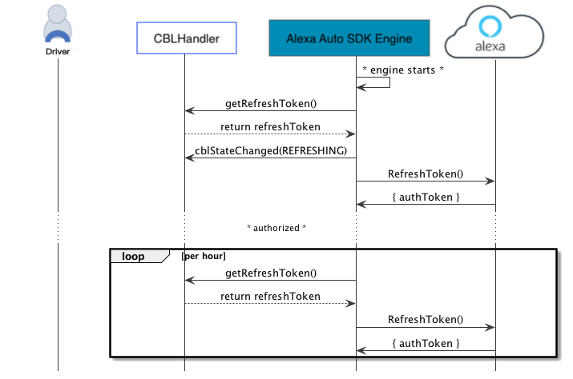

# Code-Based Linking (CBL) Module

The Alexa Auto SDK CBL module provides the features required by a platform implementation to fully handle the authentication flow with Alexa. The platform implementation is responsible for storing and supplying the refresh token to the SDK.

**Table of Contents**

* [Sequence Diagrams](#sequence-diagrams)
* [Using CBL](#using-cbl)


## Sequence Diagrams <a id = "sequence-diagrams"></a>

The following sequence diagrams provide an overview of the authentication flow and the process of refreshing the authentication when the application provides a valid refresh token.

### Initial authentication flow

This diagram provides an overview of the initial authenticaion flow.


### Refreshing token

This diagram provides an overview of how CBL refreshes your authentication on startup.




## Using CBL <a id ="using-cbl"></a>

To implement a custom CBL handler, extend the `CBL` class:

```
public class CBLHandler extends CBL
{

    // Notifing the platform for a state change in authorization flow with reason
    @Override
    public void cblStateChanged( CBLState state, CBLStateChangedReason reason, String url, String code ) {
        // Display url and code when supplied
        // Track state
    }

    @Override
    public void clearRefreshToken() {
        // Remove refresh token from platform application
    }

    @Override
    public void setRefreshToken( String refreshToken ) {
        // Set refresh token
        // The platform application is responsible for storing the refresh token securely
    }

    @Override
    public String getRefreshToken() {
        // Return refresh token, if available, otherwise empty string
    }

    @Override
    public void setUserProfile( String name, String email ) {
        // Set name and email
        // The platform application will be notfied during login
    }

    // Begin authorization flow
    start();
    ...

    // Cancel authorization flow
    cancel();
    ...

    // Reset authorization state
    reset();
    ...
}
```

Configuration to enable user profile
```json
{
    "aace.cbl": {
        "enableUserProfile": true
    }
}
```
