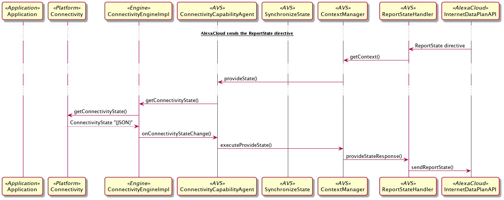
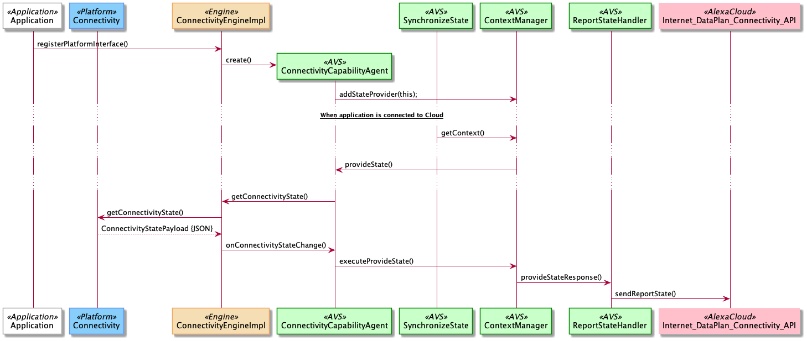

# Connectivity Module

The Connectivity module for the Alexa Auto SDK creates a lower data consumption mode for Alexa, allowing automakers to offer tiered functionality based on the status of their connectivity plans. By using this module, you can send the customer's connectivity status from the vehicle to Alexa, which determines whether the customer can enjoy a full or partial set of Alexa features. This module allows the automaker to create tiered access to Alexa for customers and offer upsell opportunities to subscribe to a full connectivity plan.  
 
<!-- omit in toc -->
## Table of Contents
- [Overview](#overview)
- [Responsibilities of the Platform Implementation](#responsibilities-of-the-platform-implementation)
- [Understanding Connectivity State](#understanding-connectivity-state)
- [Auto SDK Connectivity Sequence Diagrams](#auto-sdk-connectivity-sequence-diagrams)
  - [When Alexa Requests Connectivity State Report](#when-alexa-requests-connectivity-state-report)
  - [When Application Connects to Alexa](#when-application-connects-to-alexa)
- [Implementing the Auto SDK with the Connectivity Module](#implementing-the-auto-sdk-with-the-connectivity-module)

## Overview

A customer who purchases an Alexa-enabled vehicle typically has to subscribe to the automaker’s connectivity plans and accept the automaker's and network provider's terms and conditions to access Alexa. Without the Connectivity module, if the customer declines the terms and conditions, or does not have a data plan (for example, due to plan expiration), the customer loses access to Alexa. The Connectivity module, however, provides an option that allows the automaker to offer a reduced set of Alexa functionality and limited bandwidth consumption for little or no cost. In this low data consumption mode, utterances sent to the cloud are filtered by feature, because the Connectivity module offers a restricted set of features. For example, when a user accesses Alexa through the Connectivity module, an utterance requesting music streaming does not start the streaming but turns on the FM radio station that was last played. Features such as Flash Briefing, weather, and traffic remain accessible.  

The Connectivity module handles vehicle internet connection properties and configurations, and reports to Alexa so that the appropriate free features are available to the customer. For the Auto SDK to send internet connection information to Alexa, implement the function provided by the AlexaConnectivity platform interface.

## Responsibilities of the Platform Implementation 
To use the Connectivity module, implement the AlexaConnectivity platform interface. Then implement the `getConnectivityState()` method to return the connectivity payload in JSON. The `getConnectivityState()` method is called after the platform interface notifies the Engine of a connectivity state change with the `connectivityStateChange()` method.

For Alexa to correctly parse the internet connectivity information from the customer's vehicle,  `getConnectivityState()` must produce a payload in JSON as follows:

```
 {
    "managedProvider": {
        "type": "{{STRING_ENUM}}", // "MANAGED" || "NOT_MANAGED",
        "id": {{STRING}} // "AMAZON"
    },
    "termStatus": "{{STRING_ENUM}}", // "ACCEPTED" || "DECLINED",
    "dataPlan": {
        "type": "{{STRING_ENUM}}", // "PAID" || "AMAZON_SPONSORED" || "TRIAL"
        "endDate": "{{STRING}}" // RFC 3339 format date on which the current data plan ends.
    },
    "dataPlansAvailable": "[{{STRING}}, {{STRING}}, ...]" // "PAID" || "AMAZON_SPONSORED" || "TRIAL"
}
```
## Understanding Connectivity State
Connectivity state refers to the JSON payload sent to Alexa from the vehicle. The data in the payload determines whether the customer is eligible for the full or partial Alexa experience. The following list describes the keys in the JSON object:

* `dataPlan` provides the active data plan type and end date. 
  
   The following list describes the possible plan types:
  * `PAID` or `TRIAL`: A customer with either of these data plan has unrestricted access to all Alexa features. `PAID` indicates that the device has an active data plan paid for by the customer.`TRIAL` indicates that the device has an active data plan which has been provided to the customer as a promotional event.
   * `AMAZON_SPONSORED`: This type means that the customer has not paid for a data plan or signed up for a free trial. The customer can connect to the internet via a plan sponsored by Amazon and can access a limited number of Alexa features.
  
  The `endDate` value is required only if the data plan type is `TRIAL`. It indicates when the trial data plan ends. Specifies the value in the RFC 3339 format.

* `termsStatus` indicates whether the customer has accepted the terms and conditions of the OEM and network provider. Possible string values are `ACCEPTED` and `DECLINED`. `ACCEPTED` means that the customer agrees to receive voice messages from Alexa, which enable the customer to use voice to purchase a data plan. `DECLINED` prevents the customer from receiving reminders from Alexa for upgrading the data plan. A customer who has declined the terms and conditions can accept them at a later time.
  
* `dataPlansAvailable` indicates the data plans that can be activated on a device. Possible string values are `PAID`, `AMAZON_SPONSORED`, and `TRIAL`. This property indicates whether Alexa can encourage a customer to upgrade to a plan that provides more Alexa features. Currently, only the `TRIAL` value results in messages from Alexa, which encourage the customer to move from an AMAZON_SPONSORED plan to a TRIAL plan.

* `managedProvider` provides information about the type of network connectivity that the device has. 

   There are two fields in `managedProvider`:
   * `managedProvider.type` can be one of the following strings:
     * `MANAGED`: The device's internet connectivity is managed by a provider. The only possible provider that manages connectivity is Amazon. When `managedProvider.type` is `MANAGED`, the Alexa experience is affected by the attribute values of the `InternetDataPlan` capability in the following ways:
       * If the customer is on a paid or trial data plan, `MANAGED` has no effect on the customer's Alexa experience. 
       * If the customer does not have a paid or trial data plan, the customer, through the AlexaConnectivity platform interface, can access a limited number of Alexa features.
 
     * `NOT_MANAGED`: The device's internet connectivity is not managed by a provider. For example, if the customer accesses the internet via a WiFi network or mobile hotspot, set `managedProvider.type` to `NOT_MANAGED`. In this case, the customer can access all Alexa features, regardless of the attribute values of the `InternetDataPlan` capability.

   * `managedProvider.id` is required only when `managedProvider.type` is `MANAGED`. It specifies the name of the provider that manages connectivity. The only accepted value is `AMAZON`.

## Auto SDK Connectivity Sequence Diagrams
The sequence diagram below shows two major information flows from the Connectivity module to Alexa.

### When Alexa Requests Connectivity State Report
The following sequence diagram illustrates the flow when Alexa requests that the Connectivity module report its current connectivity state.



### When Application Connects to Alexa
The following sequence diagram illustrates the flow when a client application starts a connection with Alexa. 



## Implementing the Auto SDK with the Connectivity Module
To implement the Auto SDK with Connectivity, extend the `AlexaConnectivity` class. For more information about this class, see the C++ or Java file in the following list:

* [Connectivity Interface for C++](../../../../modules/connectivity/platform/include/AACE/Connectivity/AlexaConnectivity.h)

   To see an example of extending `AlexaConnectivity`, go to the [C++ code example](../../../../samples/cpp/SampleApp/src/Connectivity/AlexaConnectivityHandler.cpp).

* [Connectivity Interface for Java](./src/main/java/com/amazon/aace/connectivity/AlexaConnectivity.java)

   To see an example of extending `AlexaConnectivity`, go to the [Java code example](../../../../samples/android/modules/sample-connectivity/src/main/java/com/amazon/sampleapp/connectivity/AlexaConnectivityHandler.java).