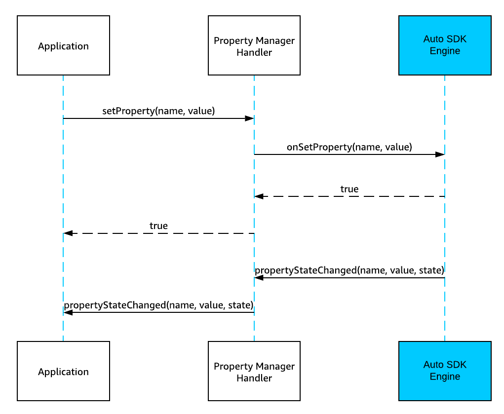
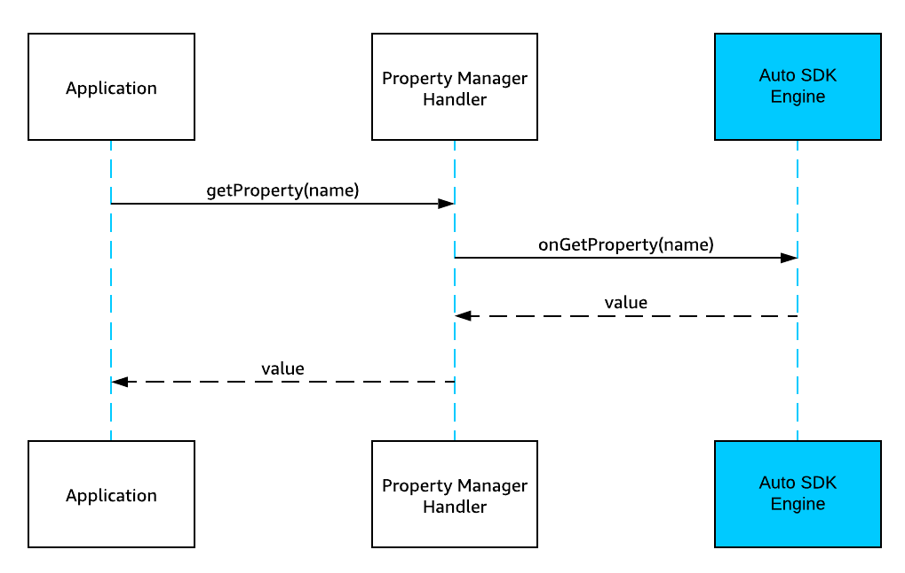
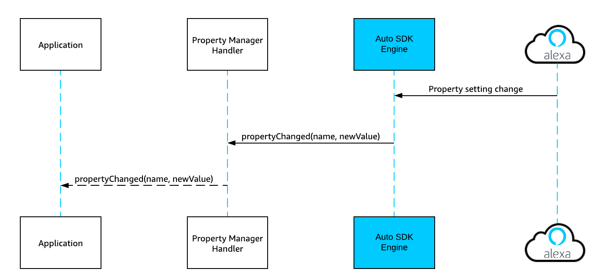
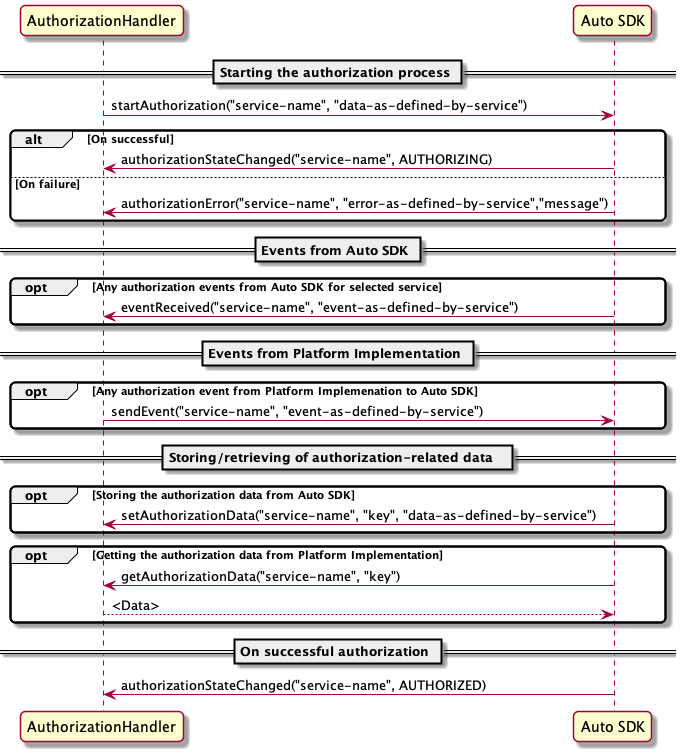
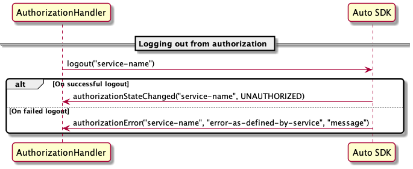

# Core Module

The Alexa Auto SDK module contains the Engine base classes and the abstract platform interfaces that can be utilized by the platform and/or other modules.

**Table of Contents**

* [Overview](#overview)
* [Creating the Engine](#creating-the-engine)
* [Configuring the Engine](#configuring-the-engine)
* [Extending the Default Platform Implementation](#extending-the-default-platform-implementation)
* [Starting the Engine](#starting-the-engine)
* [Stopping the Engine](#stopping-the-engine)
* [Managing Runtime Properties with the Property Manager](#managing-runtime-properties-with-the-property-manager)
* [Managing Authorization](#managing-authorization)

## Overview <a id="overview"></a>
The Core module provides an easy way to integrate Alexa Auto SDK into an application or a framework. To do this, follow these steps:

1. [Create](#creating-the-engine) and [configure](#configuring-the-engine) an instance of `aace.core.Engine`.
2. [Override default platform implementation classes](#extending-the-default-platform-implementation) to extend the default Alexa Auto SDK platform implementation and register the platform interface handlers with the instantiated Engine.
4. [Start the Engine](#starting-the-engine).
5. [Change the runtime settings](#getting-and-setting-core-engine-properties) if desired.

## Creating the Engine <a id="creating-the-engine"></a>

To create an instance of the Engine, call the static function `Engine.create()`:

    m_engine = Engine.create();

## Configuring the Engine <a id= "configuring-the-engine"></a>

Before you can start the Engine, you must configure it using the required `aace.core.config.EngineConfiguration` object(s) for the services you will be using:

1. Generate the `EngineConfiguration` object(s). You can do this [using a JSON configuration file](#specifying-configuration-data-using-a-json-file), [programmatically (using factory methods)](#specifying-configuration-data-programmatically), or using a combination of both approaches; however, for Android certpath and data path runtime resolution, we recommend [configuring the engine programmatically](#specifying-configuration-data-programmatically).

    >**Note:** You can generate a single `EngineConfiguration` object that includes all configuration data for the services you will be using, or you can break the configuration data into logical sections and generate multiple `EngineConfiguration` objects. For example, you might generate one `EngineConfiguration` object for each module.
  
2. Call the Engine's `configure()` function, passing in the `EngineConfiguration` object(s): 

  * For a single `EngineConfiguration` object, use:

      `engine->configure( config );`
  
 *  For multiple `EngineConfiguration` objects, use:

      `engine->configure( { xConfig, yConfig, zConfig, ... } );`
      
      replacing `xConfig, yConfig, zConfig` with logical names to identify the `EngineConfiguration` objects you generated; for example: `coreConfig, alexaConfig, navigationConfig`

    > **Note**: You can call the Engine's `configure()` method only once, and you must call it before you register any platform interfaces or start the Engine.

### Configuration Database Files

Some values in the configuration, such as `"defaultlocale"`, are used only to configure the Engine the first time it is started. After the first start, the Auto SDK engine creates configuration database files (also referred to as SQLite database files) so that these settings are preserved the next time you start the application. You can change the default settings if desired.

By default, the Auto SDK stores the configuration database files in the `/opt/AAC/data/` directory, but you have the option to change the path to the configuration database files as part of your Engine configuration. If you delete the database files, the Auto SDK will create new ones the next time you run the application.

### Specifying Configuration Data Using a JSON File <a id = "specifying-configuration-data-using-a-json-file"></a>

The Auto SDK provides a class in [`EngineConfiguration.java`](./src/main/java/com/amazon/aace/core/config/EngineConfiguration.java) that reads the configuration from a specified JSON file and creates an `EngineConfiguration` object from that configuration:

`com.amazon.aace.core.config.ConfigurationFile.create( “<filename.json>” )`
 
You can include all the configuration data in a single JSON file to create a single `EngineConfiguration` object; for example:

`auto config = aace.core.config.ConfigurationFile.create( “config.json” );`

or break the configuration data into multiple JSON files to create multiple `EngineConfiguration` objects; for example:

```java
auto coreConfig = com.amazon.aace.core.config.ConfigurationFile.create( “core-config.json” );
auto alexaConfig = com.amazon.aace.core.config.ConfigurationFile.create( “alexa-config.json” );
auto navigationConfig = com.amazon.aace.core.config.ConfigurationFile.create( “navigation-config.json” );
```

The [config.json.in](../../../../samples/cpp/assets/config.json.in) file provides an example of a JSON configuration file. If desired, you can use this file as a starting point for customizing the Engine configuration to suit your needs.

### Specifying Configuration Data Programmatically <a id ="specifying-configuration-data-programmatically"></a>

You can also specify the configuration data programmatically by using the configuration factory methods provided in the library. The following code sample provides an example of using factory methods to instantiate an `EngineConfiguration` object:

```java
m_engine.configure( new EngineConfiguration[]{
    AlexaConfiguration.createCurlConfig( "<CERTS_PATH>" ),
    AlexaConfiguration.createDeviceInfoConfig(  "<DEVICE_SERIAL_NUMBER>", "<CLIENT_ID>", "<PRODUCT_ID>" ),
    AlexaConfiguration.createMiscStorageConfig( "<SQLITE_DATABASE_FILE_PATH>" ),
    AlexaConfiguration.createCertifiedSenderConfig( "<SQLITE_DATABASE_FILE_PATH>" ),
    AlexaConfiguration.createAlertsConfig( "<SQLITE_DATABASE_FILE_PATH>" ),
    AlexaConfiguration.createSettingsConfig( "<SQLITE_DATABASE_FILE_PATH>" ),
    AlexaConfiguration.createNotificationsConfig( "<SQLITE_DATABASE_FILE_PATH>" ),
    LoggerConfiguration.createSyslogSinkConfig( "syslog", "<LOGGER_LEVEL>" )
});
```

See the API reference documentation for the [`AlexaConfiguration Class`](https://alexa.github.io/alexa-auto-sdk/docs/android/classcom_1_1amazon_1_1aace_1_1alexa_1_1config_1_1_alexa_configuration.html) for details about the configurable methods used to generate the `EngineConfiguration` object.

### Vehicle Information Requirements

You must configure vehicle information in the Engine configuration. A sample configuration is detailed below. You can generate the `EngineConfiguration` object including this information by using this schema in a `.json` config file or programmatically using the `VehicleConfiguration.createVehicleInfoConfig()` factory method.

```java
{
  "aace.vehicle":
  {
     "info": {
         "make": "<MAKE>",
         "model": "<MODEL>",
         "year": "<YEAR>",
         "trim": "<TRIM>",
         "geography": "<GEOGRAPHY>",
         "version": "<SOFTWARE_VERSION>",
         "os": "<OPERATING_SYSTEM>",
         "arch": "<HARDWARE_ARCH>",
         "language": "<LANGUAGE>",
         "microphone": "<MICROPHONE>",
         "vehicleIdentifier": "<VEHICLE_IDENTIFIER>"
     }
  }
}
```

For details about the vehicle properties included in the `VehicleConfiguration` class, see the [`VehicleConfiguration.java`](src/main/java/com/amazon/aace/vehicle/config/VehicleConfiguration.java) file.

>**Important!** To pass the certification process, the vehicle information that you provide in the Engine configuration must include a `"vehicleIdentifier"` that is NOT the vehicle identification number (VIN).

## Extending the Default Platform Implementation <a id="extending-the-default-platform-implementation"></a>

To extend each Auto SDK interface you will use in your platform implementation:

1. Create a handler for the interface by overriding the various classes in the library that, when registered with the Engine, allow your application to interact with Amazon services.
2. Register the handler with the Engine by passing an instance to `registerPlatformInterface`.

The functions that you override in the interface handlers are typically associated with directives from Alexa Voice Service (AVS). The functions that are made available by the interfaces are typically associated with events or context sent to AVS. It is not always a one-to-one mapping however, because the Alexa Auto SDK attempts to simplify the interaction with AVS.

The code sample below provides an example of creating and registering platform interface handlers with the Engine.

```java
// LoggerHandler.java
	public class LoggerHandler extends Logger {
	...
	// AlexaClientHandler.java
	public class AlexaClientHandler extends AlexaClient {
	...
	// MainActivity.java
	m_engine.registerPlatformInterface( m_logger = new LoggerHandler( getApplicationContext(), Logger.Level.INFO ) );
	m_engine.registerPlatformInterface( m_alexaClient = new AlexaClientHandler( getApplicationContext(), m_logger ) );
	...
```
The sections below provide information about and examples for creating [location provider](#implementing-a-location-provider), [network information provider](#implementing-a-network-information-provider), [logging](#implementing-log-events) and [audio](#implementing-audio) interface handlers with the Engine. For details about creating handlers for the various Auto SDK modules, see the README files for those modules.

### Implementing a Location Provider<a id="implementing-a-location-provider"></a>
The Engine provides a callback for implementing location requests from Alexa and other modules and a location type definition. This is optional and dependent on the platform implementation.

To implement a custom `LocationProvider` handler to provide location using the default Engine `LocationProvider` class, extend the `LocationProvider` class:

```java
public class LocationProviderHandler extends LocationProvider {

	@Override
	abstract public location getLocation(); {
		// get platform location
	}
	...
}	
```
### Implementing a Network Information Provider <a id = "implementing-a-network-information-provider"></a>

The `NetworkInfoProvider` platform interface provides methods that you can implement in a custom handler to allow your application to monitor network connectivity and send network status change events whenever the network status changes. Methods such as `getNetworkStatus()` and `getWifiSignalStrength()` allow the Engine to retrieve network status information, while the `networkStatusChanged()` method informs the Engine about network status changes.

The `NetworkInfoProvider` methods are dependent on your platform implementation and are required by various internal Auto SDK components to get the initial network status from the network provider and update that status appropriately. When you implement the `NetworkInfoProvider` platform interface correctly, Auto SDK components that use the methods provided by this interface work more effectively and can adapt their internal behavior to the initial network status and changing network status events as they come in.

> **Important!** Connectivity monitoring is the responsibility of the platform. The Alexa Auto SDK doesn't monitor network connectivity.

To implement a custom handler to monitor network connectivity and send network status change events, extend the `NetworkInfoProvider` class:

```java
public class NetworkInfoProviderHandler extends NetworkInfoProvider {

	@Override
	public NetworkStatus getNetworkStatus(); {
		// Return the current network status as determined on the platform.
		// Here we return the default, but you should return the real network status.
		return NetworkStatus.CONNECTED;
	}
	
	@Override
	public int getWifiSignalStrength(); {
		// Return the current WiFi signal strength RSSI (Received Signal Strength Indicator)
		// as determined on the platform.
		// Here we return the default, but you should return the real WiFi signal strength.
		return 100;
	}
	
}	

```
>**Note:** Refer to the Android Sample App for an example of how to call `networkStatusChanged()` when network status changes.

### Implementing Log Events<a id="implementing-log-events"></a>

The Engine provides a callback for implementing log events from the AVS SDK. This is optional, but useful for the platform implementation.

To implement a custom log event handler for logging events from AVS using the default engine Logger class, extend the `Logger` class:

```java
public class LoggerHandler extends Logger
{
	@Override
	public boolean logEvent( Level level, long time, String source, String message )
	{
		//handle the log events from Alexa Auto SDK, AVS, or other source
	...
		//notify the Engine of a new log event
		log((Level) level, (String) tag, (String) message );

```    

#### Source Tags
There are generally three different log `tag` values, depending on the `source`.

* `AVS` refers to logs being passed from the AVS Device SDK.
* `AAC` refers to logs being passed from the Alexa Auto SDK.
* `CLI` refers to logs coming from the client itself, by convention.

### Implementing Audio<a id="implementing-audio"></a>

The platform should implement audio input and audio output handling. Other Auto SDK components will make use of the provided implementation to provision audio input and output channels. 
  
The `AudioInputProvider` should provide a platform specific implementation of the `AudioInput` interface, for the type of input specified by the `AudioInputType` parameter, when its `openChannel()` method is called. There should be only one instance of `AudioInput` per `AudioInputType`. For example, the `SpeechRecognizer` Engine implementation requests an audio channel for type `VOICE`, while AlexaComms requests a channel for type `COMMUNICATION` - it's up to the implementation to determine if these are shared or separate input channels. If it is a shared input channel, then whenever the platform implementation writes data to the interface, any instance in the Engine that has opened that channel will receive a callback with the audio data.
  
```java
public class AudioInputProviderHandler extends AudioInputProvider
{
...
    @Override
    public AudioInput openChannel( String name, AudioInputType type )
    {
        // Create a shared AudioInput for VOICE and COMMUNICATION input channels. In this
        // use case both SpeechRecognizer and AlexaComms are sharing a single microphone.
        if( type == AudioInputType.VOICE || type == AudioInputType.COMMUNICATION ) {
            return getDefaultAudioInput();
        }
        // If a loopback audio can be provided then return the AudioInput implementation
        // for the loopback audio source.
        else if( type == AudioInputType.LOOPBACK ) {    
            return getAudioLoopbackSource();
        }
        else {
            return null;
        }
    }
    ...
};
```

The `AudioInput` interface is required to implement platform-specific support for providing audio data from a specific input channel when requested by the Auto SDK. When a request for audio input is made (for example tap-to-talk from `SpeechRecognizer`), the `AudioInput`'s `startAudioInput()` method is called and the implementation must start writing audio data until `stopAudioInput()` is called. 
In the case where two components in the Auto SDK both request audio from the same channel, `startAudioInput()` will only be called when the first component requests the audio. All of the components that have requested audio from the input channel will receive a callback when audio data is written to the interface, until they explicitly cancel the request. The `stopAudioInput()` method will only be called after the last component has canceled its request to receive audio from the channel.

The audio input format for all input types should be encoded as:

* 16bit Linear PCM
* 16kHz sample rate
* Single channel
* Signed, little endian byte order

```java
public class AudioInputHandler extends AudioInput
{
    ...
    @Override
    public boolean startAudioInput() {
        ...
        // start receiving audio data from the platform specific input device
        return startRecording();
    }
    
    @Override
    public boolean stopAudioInput() {
        ...
        try {
            // stop requesting audio data from the platform specific input device
            mAudioInput.stop();
        } catch (IllegalStateException e) {
            return false;
        }

        return true;
    }
    ...
};
```

The `AudioOutputProvider` provides a platform-specific implementation of the `AudioOutput` interface, for the type of input specified by the `AudioOutputType` parameter, when its `openChannel()` method is called. The `AudioOutputProvider` should create a new instance of `AudioOutput` each time `openChannel()` is called. The `openChannel()` method will be called from components in the Auto SDK that require support for playing back audio. The characteristics of the audio that will be played on the channel are specified by the `AudioOutputType` parameter. The following types are currently defined by `AudioOutputType`:

* TTS
* MUSIC
* NOTIFICATION
* ALARM
* EARCON
* COMMUNICATION
 
It's up to the `AudioOutputProvider` implementation to determine how to handle each different audio type. The simplest implementation, for example, may ignore the audio type and return the same `AudioOutput` implementation for all channels. 

A more sophisticated implementation may provide completely different `AudioOutput` implementations depending on the audio type - for example, providing a low level audio implementation for `NOTIFICATION` and `EARCON` types, and a high level implementation (such as ExoPlayer) for `TTS` and `MUSIC`. The best approach is highly dependent on your system specific use case.

```java
public class AudioOutputProviderHandler extends AudioOutputProvider
{
    ...
    @Override
    public AudioOutput openChannel( String name, AudioOutputType type )
    {
        AudioOutput audioOutputChannel = null;
        // Simple implementation which returns a new instance of AudioOutputHandler
        // whenever openChannel() is called. 
        switch( type )
        {
            case COMMUNICATION:
                audioOutputChannel = new RawAudioOutputHandler( mActivity, mLogger, name );
                break;

            default:
                audioOutputChannel = new AudioOutputHandler( mActivity, mLogger, name );
                break;
        }

        mAudioOutputMap.put( name, audioOutputChannel );

        return audioOutputChannel;
    }
    ...
};
```

The `AudioOutput` describes a platform-specific implementation of an audio output channel. The platform should have one or more implementations of it, depending on on the desired behavior. In addition to implementing the callback methods, each `AudioOutput` channel implementation should report the state of its media, when appropriate. 

The full `AudioOutput` API is described below. 

```java
public class AudioOutputHandler extends AudioOutput implements AuthStateObserver
{ 
    ...
    @Override
    public boolean prepare( AudioStream stream, boolean repeating ) {   
        ... // tell the platform media player to prepare audio stream
        mPlayer.prepare( mediaSource );
        return true;
    ...
    
    @Override
    public boolean prepare( String utl, boolean repeating ) {   
        ... // tell the platform media player to prepare the url
        mPlayer.prepare( url );
    ...
    
    @Override
    public boolean play() {
        ... // tell the platform media player to start playing
        mPlayer.setPlayWhenReady( true );
    ...
 
    @Override
    public boolean stop() {
        ... // tell the platform media player to stop playing
        mPlayer.setPlayWhenReady( false );
    ...
 
    @Override
    public boolean pause() {
        ... // tell the platform media player to pause playback
        mPlayer.setPlayWhenReady( false );
    ...
 
    @Override
    public boolean resume() {
        ... // tell the platform media player to resume playback
        mPlayer.setPlayWhenReady( true );
    ...
 
    @Override
    public boolean setPosition( long position ) {
        ... // set the current media position of the platform media player
        mPlayer.seekTo( position );
    ...
 
    @Override
    public long getPosition() {
        ... // return the current media position of the platform media player        
        return mPosition;
    ...
    
    @Override
    public long getDuration() {
        ... // return the current media duration of the platform media player        
        return mPlayer.getDuration();
    ...
    
    @Override
    public boolean volumeChanged( float volume ) {
        ... // set the current media volume of the platform media player
        mPlayer.setVolume( volume );
    ...
    
    @Override
    public boolean mutedStateChanged( MutedState state ) {
        ... // set the current media mute state of the platform media player   
        mPlayer.setVolume( state == MutedState.MUTED ? 0 : mVolume );
    ...
        // on playback started notification from the platform media player  
        mediaStateChanged( MediaState.PLAYING );
        ...
        // on playback stopped notification from the platform media player  
        mediaStateChanged( MediaState.STOPPED );
        ...
        // on playback buffering notification from the platform media player  
        mediaStateChanged( MediaState.BUFFERING );    
    ...
};
```

## Starting the Engine<a id="starting-the-engine"></a>

After creating and registering handlers for all required platform interfaces, you can start the Engine. The Engine will first attempt to register all listed interface handlers, and then attempt to establish a connection with the given authorization implementation.

```
m_engine.start();
```

## Stopping the Engine<a id="stopping-the-engine"></a>

If you need to stop the engine for any reason except for logging out the user, use the Engine's `stop()` method. You can then restart the Engine by calling `start()` again.

```
if( m_engine != null ) {
    m_engine.stop();
}
```

You should call `dispose()` on the Engine when the app is being destroyed or the user is logged out. This makes sure when the next user logs in, a corresponding publish message is sent to the cloud with new capabilities and configuration that is tied to the new user.

```
if( m_engine != null ) {
    m_engine.dispose();
}
```

## Managing Runtime Properties with the Property Manager <a id ="managing-runtime-properties-with-the-property-manager"></a>

Certain modules in the Auto SDK define constants (for example `FIRMWARE_VERSION` and `LOCALE`) that are used to get and set the values of runtime properties in the Engine. Changes to property values may also be initiated from the Alexa Voice Service (AVS). For example, the `TIMEZONE` property may be changed through AVS when the user changes the timezone setting in the Alexa Companion App.

The Auto SDK Property Manager maintains the runtime properties by storing properties and listeners to the properties and delegating the `setProperty()` and `getProperty()` calls to from your application to the respective Engine services. It also calls `propertyChanged()` to notify your application about property value changes originating in the Engine. The Property Manager includes a `PropertyManager` platform interface that provides the following methods:

* `setProperty()` - called by your application to set a property value in the Engine.
* `getProperty()` - called by your application to retrieve a property value from the Engine.
    >**Note:** `setProperty()` is asynchronous. After calling `setProperty()`, `getProperty()` returns the updated value only after the Engine calls `propertyStateChanged()` with `PropertyState.SUCCEEDED`.
* `propertyStateChanged()` - notifies your application about the status of a property value change (`SUCCEEDED` or `FAILED`). This is an asynchronous response to your application's call to `setProperty()`.
* `propertyChanged()` - notifies your application about a property value change in the Engine that was initiated internally, either by AVS or an Engine component.

### Property Manager Sequence Diagrams

#### Application Changes a Property Value
The following sequence diagram illustrates the flow when your application calls `setProperty()` to set a property value in the Engine.



#### Application Retrieves a Property Value
The following sequence diagram illustrates the flow when your application calls `getProperty()` to retrieve a property value from the Engine.




#### Notification of Property Value Change Initiated via AVS
The following sequence diagram illustrates the flow when a property value change is initiated by AVS and the Property Manager notifies your application.




### Implementing a Custom Property Manager Handler
To implement a custom Property Manager handler to set and retrieve Engine property values and be notified of property value changes, extend the `PropertyManager` class:

```java
public class PropertyManagerHandler extends PropertyManager {

    @Override
    public void propertyStateChanged(String name, String value, PropertyState state) {
       // Handle the status of a property change after a call to setProperty().
    }
    
    @Override
    public void propertyChanged( String name, String newValue ) {
        // Handle the property value change initiated by the Engine.
        // For example, if the user sets the TIMEZONE to "Pacific Standard Time - Vancouver"
        // in the companion app, your application gets a call to:
        // propertyChanged(com.amazon.aace.alexa.TIMEZONE, "America/Vancouver")
    }
}
...

// Register the platform interface with the Engine
PropertyManager mPropertyManager = newPropertyManagerHandler();
mEngine.registerPlatformInterface ( mPropertyManager );

// You can also set and retrieve properties in the Engine by calling the inherited
// setProperty() and getProperty() methods.

// For example, to set the LOCALE property to English-Canada:
mPropertyManager.setProperty(com.amazon.aace.alexa.AlexaProperties.LOCALE, "en-CA");

// For example, to retrieve the value of the LOCALE property:
String locale  = mPropertyManager.getProperty(com.amazon.aace.alexa.AlexaProperties.LOCALE);

```
### Property Definitions
The definitions of the properties used with the `PropertyManager.setProperty()` and `PropertyManager.getProperty()` methods are included in the [AlexaProperties.java](../alexa/src/main/java/com/amazon/aace/alexa/AlexaProperties.java) and [CoreProperties.java](./src/main/java/com/amazon/aace/core/CoreProperties.java) files. For a list of the Alexa Voice Service (AVS) supported locales for the `LOCALE` property, see the [Alexa Voice Service (AVS) documentation](https://developer.amazon.com/docs/alexa-voice-service/system.html#locales).

## Managing Authorization

The Auto SDK needs access to cloud services and resources to function. Gaining access requires that the device be authorized with an authorization service such as Login With Amazon (LWA), which provides the access token. The Engine uses the token to access cloud services and resources. For example, to access Alexa APIs, the device must be authorized with LWA to obtain the access token.

The Auto SDK Authorization module is responsible for managing authorizations for different cloud services. For example, to use Alexa, your device must be authorized with LWA. The module provides a single platform interface for all authorizations and communicates with the engine services (referred to here as authorization services). The authorization service is responsible for carrying out the authorization method you choose. For example, for Alexa, you can use the CBL authorization or Auth Provider authorization method. The CBL or Auth Provider authorization service carries out the actual authorization process or flow.

For information on how to use the Authorization module with different authorization methods, see the Alexa module [README](../alexa/README.md#handling-authorization) and the CBL module [README](../cbl/README.md).

### Authorization Sequence Diagrams

#### Starting the Authorization Process

The following sequence diagram shows the typical call sequences between platform implementation and Auto SDK to start an authorization process.



#### Canceling the Authorization Process

The following sequence diagram shows the typical call sequence between the platform implementation and Auto SDK to cancel an authorization process.


#### Logging out the Authorization

The following sequence diagram shows the typical call sequence between the platform implementation and Auto SDK to log out of an authorization.



## Using the Authorization Module

To implement the custom `Authorization`  handler, extend the `Authorization` class as follows:

```java
public class MyAuthorizationHandler extends Authorization {     
    // There is an event from the requested authorization service.
    @Override
    void eventReceived(String service, String event) {
        // Take the necessary action as defined by the service protocol.
    }

    // Authorization service notifying the platform implementation of the state change.
    @Override
    void authorizationStateChanged(String service, AuthorizationState state) {
        // Handle the authorization state change as required by your application.
    }
    
    // Authorization service notifies an error in the process.
    @Override
    void authorizationError(String service, String error, String message) {
        // Handle the authorization error as required by your application.
    }

    // Authorization service needs to get the authorization-related data from the platform implementation.
    @Override
    std::string getAuthorizationData(String service, String key) {
        // Return the data identified by key.
    }
    
    // Authorization service requires the platform implementation to store the authorization-related data.
    void setAuthorizationData(String service, String key, String data) {
        // Store/Clear the data identified by the key securely on the device.
    }
}
...

// Register the platform interface with the Engine
Authorization mAuthorizationHandler = new MyAuthorizationHandler();
mEngine.registerPlatformInterface( mAuthorizationHandler );

// To notify the Engine to start authorization process represented by `service-name`
mAuthorizationHandler.startAuthorization("service-name", "data-as-defined-by-service");

// To notify the Engine to cancel authorization process represented by `service-name`, which is already in progress
mAuthorizationHandler.cancelAuthorization("service-name");

// To notify the Engine to log out from the authorization for the service represented by `service-name`.
mAuthorizationHandler.logout("service-name");

// To send events from the platform implementation to the authorization service.
mAuthorizationHandler.sendEvent("service-name", "event-data-as-defined-by-service");

```
