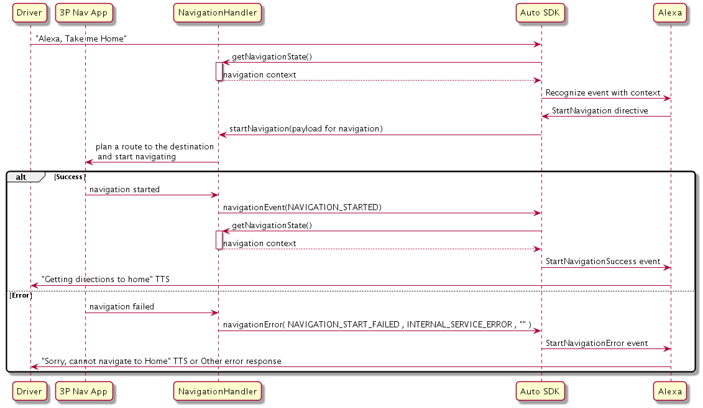
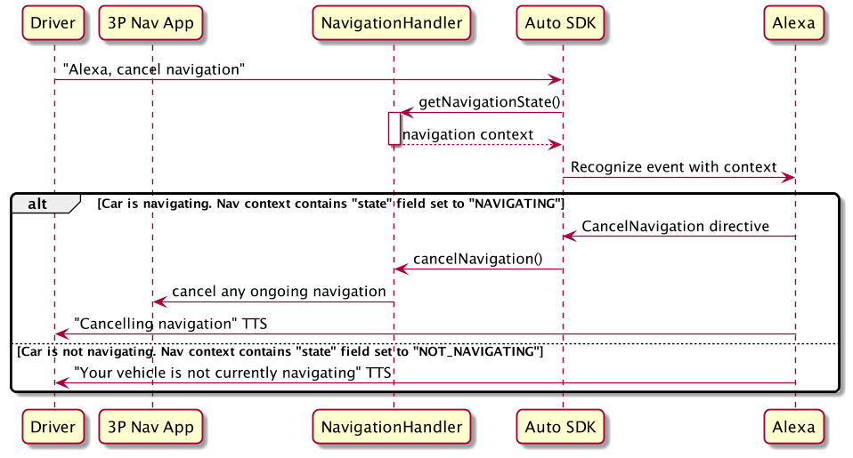
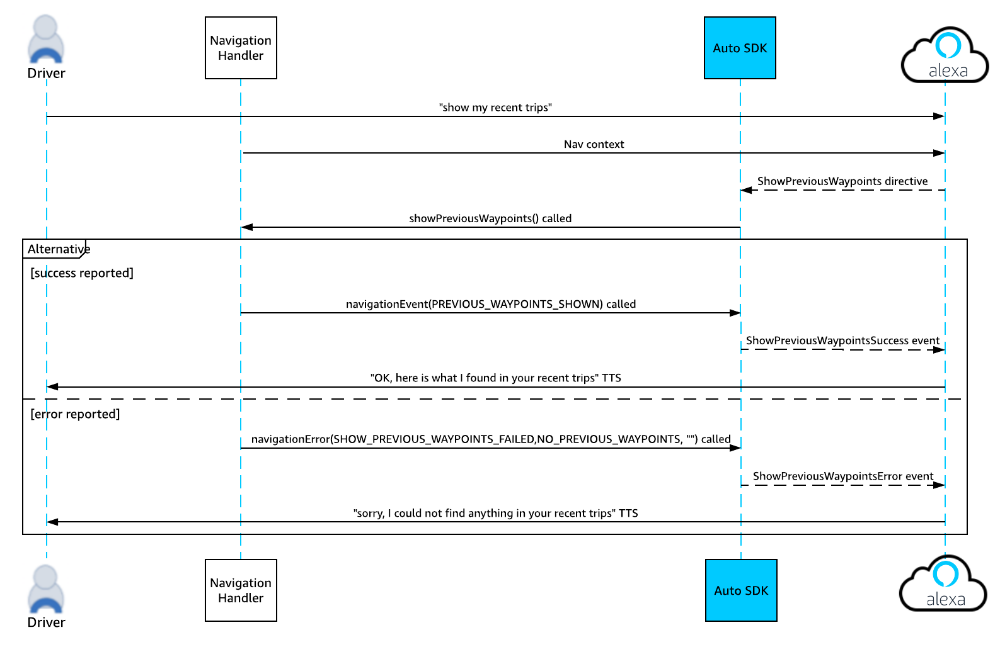
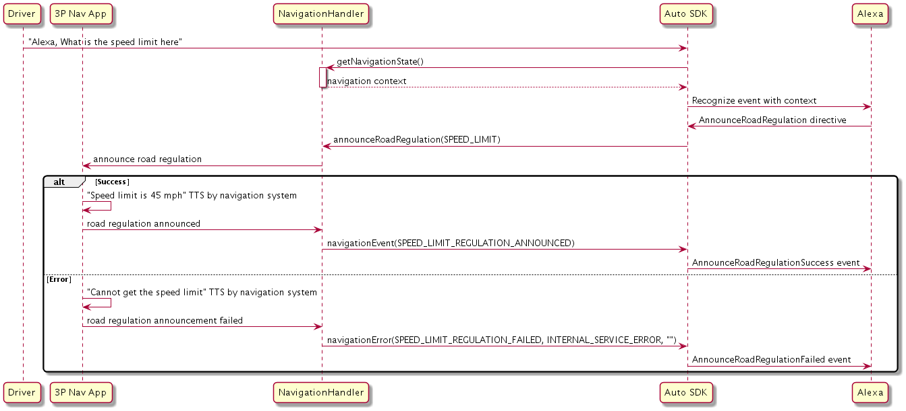
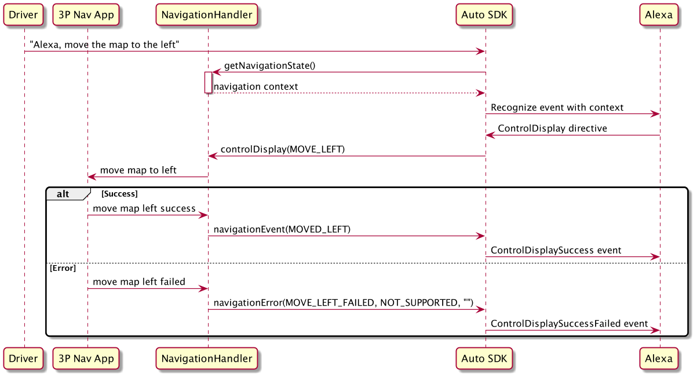

# Navigation Module

The Alexa Auto SDK Navigation module enables your platform implementation to interface with the navigation capabilities of Alexa.

<!-- omit in toc -->
## Table of Contents
- [Overview](#overview)
- [Configuring the Navigation Module](#configuring-the-navigation-module)
  - [Configuring with a File](#configuring-with-a-file)
  - [Configuring Programmatically](#configuring-programmatically)
- [Implementing a Navigation Handler](#implementing-a-navigation-handler)
  - [Starting Navigation](#starting-navigation)
  - [Stopping Navigation](#stopping-navigation)
  - [Adding a Waypoint](#adding-a-waypoint)
  - [Canceling a Waypoint](#canceling-a-waypoint)
  - [Showing Previous Waypoints](#showing-previous-waypoints)
  - [Navigating to a Previous Waypoint](#navigating-to-a-previous-waypoint)
  - [Getting Turn and Lane Guidance Information](#getting-turn-and-lane-guidance-information)
  - [Getting Road Regulation Information](#getting-road-regulation-information)
  - [Controlling the Display](#controlling-the-display)
  - [Showing Alternative Routes](#showing-alternative-routes)
- [Providing the Current Navigation State](#providing-the-current-navigation-state)
  - [Understanding the Navigation State Payload](#understanding-the-navigation-state-payload)
  - [Examples of Navigation State Payload](#examples-of-navigation-state-payload)

## Overview

The `Navigation` platform interface enables the user to use the following features:  

* Starting navigation:  
  The user can start a navigation session for a destination, for  example, by saying, "Alexa, take me to Whole Foods."

* Stopping navigation:  
  The user can stop the current navigation, for example, by saying, "Alexa, cancel navigation."

* Adding a waypoint:  
  The user can add intermediate stops on the route to the destination in one of the following ways:
  * Directly requesting a waypoint. For example, the user can say, "Alexa, add SFO airport to the route."
  * Searching for waypoints and then selecting one. For example, the user can say, "Alexa, find me nearby coffee shops". After viewing the list returned by Alexa, the user can say, "Alexa, add the second to my route."

* Canceling a waypoint:  
  The user can remove a waypoint on the current route, for example, by saying, "Alexa, remove next stop on the route." 

* Showing previous waypoints:   
  The user can view a list of previous destinations, for example, by saying, "Alexa, show me my recent trips." Previous destinations  include final destinations and intermediate waypoints that the user visited in previous navigation sessions.

* Navigating to a previous waypoint:  
  The user can navigate to the most recent destination used in the navigation app, for example, by saying, "Alexa, navigate me to last destination."

* Getting turn and lane guidance:     
  The user can obtain details about the next navigation instruction, for example, by saying, "Alexa, where is next turn?"
  
* Getting road regulation information:   
  The user can obtain information about the road they are driving on, for example, by saying, "Alexa, is carpool free now?"

* Controlling the display:  
  The user can verbally interact with the onscreen map application to scroll the display in different directions and to view alternative routes. For example, the user can say, "Alexa, show me an overview of the entire route." 

* Querying route information:  
  The user can ask Alexa for information about the current route, for example, by saying,  "Alexa, what's my ETA?"

Your platform implementation must implement handlers to handle navigation actions when notified to do so by the Engine. How your implementation handles these requests is based on your navigation provider.

## Configuring the Navigation Module
To inform Alexa which navigation provider is used on the head unit, configure the Navigation module. Sometimes Alexa needs to query a cloud navigation provider API to fulfill a user request. Knowing which provider is used on the device allows for better customer experience because Alexa's results can more closely match what the user sees on the screen in the navigation app.

You can either define the JSON in a file and construct `EngineConfiguration` from that file, or you can use the provided [`NavigationConfiguration` class](#configuring-programmatically) to programmatically construct the `EngineConfiguration`.

The accepted navigation provider names are `"HERE"` (default), `"TOMTOM"`, and `"TELENAV"`.

### Configuring with a File
The following `aace.navigation` object specifies the navigation provider name:

```
"aace.navigation": {
    "providerName": "{{STRING}}" 
}
```

Add the object to the same configuration file you use to configure the Engine.

### Configuring Programmatically

Use the `createNavigationConfig` method to configure the navigation provider programmatically as follows:

```java
// Configure the Engine
EngineConfiguration navigationConfiguration = NavigationConfiguration.createNavigationConfig( "HERE" );

mEngine.configure( new EngineConfiguration[]{
	// other config objects,
	navigationConfiguration,
	...
});
```

For more information about the method, see [`com.amazon.aace.navigation.config.NavigationConfiguration.createNavigationConfig`](./src/main/java/com/amazon/aace/navigation/config/NavigationConfiguration.java).

## Implementing a Navigation Handler
This section provides information you need for implementing a custom navigation handler for various use cases.
 
### Starting Navigation
To start navigation, the Engine calls the `startNavigation()` method, which passes a JSON payload with the following schema:

```
{
    "transportationMode": "DRIVING",
    "waypoints":[
       {
          "type":"{{STRING}}",
          "estimatedTimeOfArrival":{
             "ideal":"{{STRING}}",
             "predicted":"{{STRING}}"
          },
          "address": {
               "addressLine1": "{{STRING}}",
               "addressLine2": "{{STRING}}",
               "addressLine3": "{{STRING}}",
               "city": "{{STRING}}",
               "districtOrCounty": "{{STRING}}",
               "stateOrRegion": "{{STRING}}",
               "countryCode": "{{STRING}}", 
               "postalCode": "{{STRING}}"
          },
          "coordinate":[
             {{LATITUDE_DOUBLE}},
             {{LONGITUDE_DOUBLE}}
          ],
          "name":"{{STRING}}"
       },
       {
          "type":"{{STRING}}",
          "estimatedTimeOfArrival":{
             "ideal":"{{STRING}}",
             "predicted":"{{STRING}}"
          },
          "address":"{{STRING}}",
          "coordinate":[
             {{LATITUDE_DOUBLE}},
             {{LONGITUDE_DOUBLE}}
          ],
          "name":"{{STRING}}",
          "pointOfInterest":{
             "id":"{{STRING}}",
             "hoursOfOperation":[
                {
                   "dayOfWeek":"{{STRING}}",
                   "hours":[
                      {
                         "open":"{{STRING}}",
                         "close":"{{STRING}}"
                      }
                   ],
                   "type":"{{STRING}}"
                }
             ],
             "phoneNumber":"{{STRING}}"
        }
      }
    ]
  }      
}
```

For `transportationMode` (optional), the value can be `"BIKING"`, `"DRIVING"`, `"TRANSIT"`, or `"WALKING"`. The properties in `waypoints` use the same schema as used for state reporting. See the table about the JSON string in the `getNavigationState()` method in [this section](#understanding-the-navigation-state-payload). 

The waypoints in the route are determined by Alexa either through a proximity search or by resolving the user's uploaded navigation favorite name to its location. Your implementation should calculate the route from the `SOURCE` waypoint to the `DESTINATION` waypoint, with stops along the way at `INTERIM` waypoints in the order in which they appear in the payload. If there are multiple routes, your implementation should either pick the fastest route if no user interaction is possible, or let the user choose the route. After the route is chosen, your implementation should start navigation.

If navigation starts successfully, your implementation should call `navigationEvent()` with a `NAVIGATION_STARTED` event. Otherwise, it should call `navigationError()` with the  `NAVIGATION_START_FAILED` type, and `INTERNAL_SERVICE_ERROR` or `ROUTE_NOT_FOUND` code.

This sequence diagram illustrates a possible flow for starting navigation after a user specifies a destination.



### Stopping Navigation
To stop navigation, the Engine calls the `cancelNavigation()` method. 

If there is an active navigation session to cancel, return `true` from the call and cancel the session. In the next call to `getNavigationState()`, the state should be `NOT_NAVIGATING`. If you cannot cancel the session or there is no session to cancel, return `false`. The next call to `getNavigationState()` should reflect the accurate state of the session.

Navigation state context is described in [this section](#information-in-the-navigation-state-payload).

This sequence diagram illustrates a possible flow for cancelling navigation upon user request.



### Adding a Waypoint
If the user wants to add a waypoint, the Engine calls the `startNavigation()` method. 

If navigation is in progress or route is present, the route to the final destination is changed by including the additional waypoint.

The stops along the route are in the JSON passed by `startNavigation()`, which is described in [this section](#starting-navigation). Your implementation should calculate or re-calculate the route with that information.

If the waypoint is added successfully, your implementation should call `navigationEvent()` with a `NAVIGATION_STARTED` event. Otherwise, it should call `navigationError()` with the  `NAVIGATION_START_FAILED` type, and `INTERNAL_SERVICE_ERROR` or  `ROUTE_NOT_FOUND` code.

This sequence diagram illustrates a possible flow for starting navigation after a user adds a waypoint to their route.


### Canceling a Waypoint
If the user wants to cancel a waypoint, the Engine calls the `startNavigation()` method after receiving the directive from Alexa with the updated waypoints. Your implementation should start navigation using the updated waypoints.

If navigation is started successfully, your implementation should call `navigationEvent()` with a `NAVIGATION_STARTED` event. Otherwise, it should call `navigationError()` with the  `NAVIGATION_START_FAILED` type, and `INTERNAL_SERVICE_ERROR` or `ROUTE_NOT_FOUND` code.

This sequence diagram illustrates a possible flow for canceling a waypoint from a user's route.


### Showing Previous Waypoints
If the user wants to display previous waypoints, the Engine calls the `showPreviousWaypoints()` method. Each waypoint displayed includes at least the address. 

If the device can successfully display the previous waypoints, your implementation should call `navigationEvent()` with a  `PREVIOUS_WAYPOINTS_SHOWN` event. Otherwise, it should call `navigationError()` with the `SHOW_PREVIOUS_WAYPOINTS_FAILED` type, and `INTERNAL_SERVICE_ERROR` or `NO_PREVIOUS_WAYPOINTS` code.

>**Note:** It is the responsibility of the navigation provider to store and provide the previous destination list to the user.

This sequence diagram illustrates a possible flow for showing previous waypoints.



### Navigating to a Previous Waypoint
If the user wants to  navigate to a previous waypoint, the Engine calls the `navigateToPreviousWaypoint()` method.

 The navigation app retrieves the most recently used destination, calculates a route from the current location, selects the fastest route or a route preferred by the user, and starts navigation.

If navigation starts successfully, your implementation should call `navigationEvent()` with a `PREVIOUS_NAVIGATION_STARTED` event. Otherwise, it should call `navigationError()` with the `PREVIOUS_NAVIGATION_START_FAILED` type, and `INTERNAL_SERVICE_ERROR` or `NO_PREVIOUS_WAYPOINTS` code.

This sequence diagram illustrates a possible flow for navigating to a previous destination.


### Getting Turn and Lane Guidance Information
If the user wants to get turn and lane guidance, the Engine calls the `announceManeuver()` method, which passes a payload with the following schema:

```
{
  "type": "{{STRING}}",
  "targetLocation" : {
        "name": "{{STRING}}",
        "address": { 
            "addressLine1": "{{STRING}}", 
            "addressLine2": "{{STRING}}", 
            "addressLine3": "{{STRING}}", 
            "city": "{{STRING}}",
            "districtOrCounty": "{{STRING}}",
            "stateOrRegion": "{{STRING}}",
            "countryCode": "{{STRING}}",
            "postalCode": "{{STRING}}"
        },
        "coordinate": [
            {{LATITUDE_DOUBLE}},
            {{LONGITUDE_DOUBLE}}
        ]
  }
}
```

The following table describes the schema.

| Property | Type | Required | Description |
|-|-|-|-|
| type | String | Y | Specifies the type of information requested. The possible values are:<p><ul><li>`"TURN"`:  The user asks about a turn. (e.g., "What's my next turn?")</li><li>`"EXIT"`: The user asks about a freeway exit. (e.g., "What's my next exit?")</li><li>`"ENTER"`: The user asks about how to get onto a street. (e.g., "Which lane should I be to get onto the US-101?")</li><li>`"MERGE"`: The user asks about the merge onto a street. (e.g., "Alexa, which lane do i need to merge onto the highway?")</li><li>`"LANE"`: The user asks for lane guidance. (e.g., "Alexa, which lane to take?")</li></ul>
| targetLocation | Object | N | Describes the location for which maneuver information is requested. If the target location is a POI, user place, or street address, Alexa provides at least one field in this object. If the utterance does not include a location (for example, if the user requests the next maneuver instruction by saying, "Alexa, what's my next turn?"), `targetLocation` is omitted.  
| targetLocation.name | String | N | Specifies the name of the location (e.g., "HOME" or "WORK") for which the user requests the maneuver instruction.
| targetLocation.address | Object | N | Specifies the address for which the user requests the maneuver instruction. The object contains multiple string fields, which together form the complete address.
| targetLocation.coordinate | Array | N | The array value specifies the latitude and longitude of the target location. Data type for the values in the array is double.
<p>
Your implementation should provide the navigation instruction as follows:

* If `targetLocation` is omitted, announce the next maneuver along the route.
* If `targetLocation` is specified and the location is along the route, announce the maneuver about the location. If `targetLocation` is specified but the location is not along the route, calculate the route to the location, announce maneuver from the user's current location to the target location, and inform the user the target location is NOT along the current route.
 
If the device can provide the maneuver instruction successfully, your implementation should call `navigationEvent()` with one of the following events:

* `TURN_GUIDANCE_ANNOUNCED`
* `EXIT_GUIDANCE_ANNOUNCED`
* `ENTER_GUIDANCE_ANNOUNCED`
* `MERGE_GUIDANCE_ANNOUNCED`
* `LANE_GUIDANCE_ANNOUNCED`
  
Otherwise, your implementation should call `navigationError()` with a type and code in the following list:

* types:

  * `TURN_GUIDANCE_FAILED`
  * `EXIT_GUIDANCE_FAILED` 
  * `ENTER_GUIDANCE_FAILED`
  * `MERGE_GUIDANCE_FAILED` 
  * `LANE_GUIDANCE_FAILED`

* codes:
  * `INTERNAL_SERVICE_ERROR`
  * `ROUTE_NOT_FOUND`
  * `NOT_SUPPORTED`

This sequence diagram illustrates a possible flow when the user requests turn or lane guidance.


### Getting Road Regulation Information
If the user wants to get road regulation information, the Engine calls the `announceRoadRegulation()` method, which passes a payload with the following schema:

```
{
  "type": "{{STRING}}"
}
```

The `type` field is required. Its value is one of the following strings:

* `"SPEED_LIMIT"` specifies the speed limit at the current position (e.g., when the user asks, "Alexa, what is the speed limit?").
* `"CARPOOL_RULES"` specifies the carpool regulations on the current highway (e.g., when the user asks, "Alexa, is carpool free now?").

If the device can provide the road regulation information successfully, your implementation should call `navigationEvent()` with a `SPEED_LIMIT_REGULATION_ANNOUNCED` or `CARPOOL_RULES_REGULATION_ANNOUNCED` event. Otherwise, it should call `navigationError()` with the `SPEED_LIMIT_REGULATION_FAILED` or  `CARPOOL_RULES_REGULATION_FAILED` type, and `INTERNAL_SERVICE_ERROR` or  `NOT_SUPPORTED` code.



### Controlling the Display
If the user wants to control the map display on the screen, the Engine calls the `controlDisplay()` method.

If the device can adjust the display successfully, your implementation should call `navigationEvent()` with one of the following events:

* `ROUTE_OVERVIEW_SHOWN`
* `DIRECTIONS_LIST_SHOWN`
* `ZOOMED_IN`
* `ZOOMED_OUT`
* `MAP_CENTERED`
* `ORIENTED_NORTH`
* `SCROLLED_NORTH`
* `SCROLLED_UP`
* `SCROLLED_EAST`
* `SCROLLED_RIGHT`
* `SCROLLED_SOUTH`
* `SCROLLED_DOWN`
* `SCROLLED_WEST`
* `SCROLLED_LEFT`
* `ROUTE_GUIDANCE_MUTED`
* `ROUTE_GUIDANCE_UNMUTED`

Otherwise, your implementation should call `navigationError()` with a type and code in the following list:

* types:
  * `ROUTE_OVERVIEW_FAILED`
  * `DIRECTIONS_LIST_FAILED`
  * `ZOOMED_IN_FAILED`
  * `ZOOMED_OUT_FAILED`
  * `MAP_CENTERED_FAILED`
  * `ORIENTED_NORTH_FAILED`
  * `SCROLLED_NORTH_FAILED`
  * `SCROLLED_UP_FAILED`
  * `SCROLLED_EAST_FAILED`
  * `SCROLLED_RIGHT_FAILED`
  * `SCROLLED_SOUTH_FAILED`
  * `SCROLLED_DOWN_FAILED`
  * `SCROLLED_WEST_FAILED`
  * `SCROLLED_LEFT_FAILED`
  * `ROUTE_GUIDANCE_MUTED_FAILED`
  * `ROUTE_GUIDANCE_UNMUTED_FAILED`

* codes:
  * `INTERNAL_SERVICE_ERROR`
  * `ROUTE_NOT_FOUND`
  * `NOT_SUPPORTED`
  * `NOT_ALLOWED`

This sequence diagram illustrates a possible flow when the user requests to adjust a map display.



### Showing Alternative Routes
If the user wants to display alternative routes, the Engine calls the `showAlternativeRoutes()` function, which passes the type of alternate route to be displayed. It can either be `DEFAULT`, `SHORTER_TIME` or `SHORTER_DISTANCE`

If the device can display the alternative route successfully, your implementation should call `showAlternativeRoutesSucceeded()` with a JSON payload containing information about the alternative route. The JSON schema is as follows : 

```
{
  "inquiryType": "{{STRING}}",
  "alternateRoute":
  {
      "labels": ["{{STRING}}"],
      "savings": [
          {
              "type": "{{STRING}}",
              "amount": "{{FLOAT}}",
              "unit": "{{STRING}}"
          }
      ]              
  }
}
```

The following table describes the properties in the JSON.

| Property | Type | Required | Description |
|-|-|-|-|
| inquiryType | String | Yes | The type of alternative routes based on the user's preference, which can be:<ul><li>`"DEFAULT"`, which means there is no preference as to whether the alternate route saves time or distance.</li><li>`"SHORTER_TIME"`, which means the alternate route saves time.</li><li>`"SHORTER_DISTANCE"`, which means the alternate route saves distance.</li></ul>
| alternateRoute | Object | Yes | Information about the best route that matches the preference specified by `inquiryType`.
| alternateRoute.labels | Array of strings |Yes | Unique names within a route (e.g., names of highways) used to distinguish between alternative routes. Each label might contain the direction of the route.
| alternateRoute.savings | Array | No | List of savings achieved by the route. 
| alternateRoute.savings.type | String | Yes | The type of savings, which can be `"DISTANCE"` or `"TIME"`.
| alternateRoute.savings.amount | Float | Yes | The amount of savings achieved by the route. Alexa uses prescribed unit to convert the amount of savings to improve user experience, if needed.
| alternateRoute.savings.unit | String | Yes | Measurement unit of the savings, which can be `"MINUTE"`, `"HOUR"`, `"YARD"`, `"FOOT"`, `"MILE"`, `"METER"`, or `"KILOMETER"`.

Otherwise, your implementation should call `navigationError()` with a type and code in the following list:

* types:
  * `DEFAULT_ALTERNATE_ROUTES_FAILED`
  * `SHORTER_TIME_ROUTES_FAILED`
  * `SHORTER_DISTANCE_ROUTES_FAILED`

* codes:
  * `INTERNAL_SERVICE_ERROR`
  * `ROUTE_NOT_FOUND`
  * `NOT_SUPPORTED`
  * `NOT_ALLOWED`
    
This sequence diagram illustrates a possible flow when the user requests alternative routes to a destination.


## Providing the Current Navigation State
The navigation state context informs Alexa whether the device is navigating and provides Alexa with the user's routing information or the destination set by the user. Such information is necessary for Alexa to respond to route-based utterances, allowing the user to use the following features:

* Adding or removing waypoints
* Obtaining Estimated Time of Arrival (ETA)
* Obtaining Distance To Arrival (DTA)

### Understanding the Navigation State Payload
When the user requests navigation information based on the current route, the Engine invokes the `getNavigation()` method. The implementation should respond with the navigation state as a return value of the `getNavigation()`, passing a JSON string payload.

**Note:** Returning the navigation state in the `getNavigationState()` request must be quick. If querying the navigation provider for state information takes significant time, Amazon recommends that the application periodically query the provider to update the state in a cache. Then the application can obtain the information each time the Engine requests the navigation state.

The following table explains the properties in the JSON.

| Property | Type | Required | Description |
|-|-|-|-|
| state | String | Y | Navigation device state, which can be either of these values: <ul><li>`"NAVIGATING"`: Navigation engine is navigating to a predefined destination set. Be sure to specify `waypoints` and `shape` if state is `NAVIGATING`. </li> <li>`"NOT_NAVIGATING"`: Navigation is not in progress.</li></ul> |
| shapes | Array of arrays | Y (if `state` is `"NAVIGATING"`) | The array contains an ordered list of coordinates. This list depicts the route to be driven from the source to destination. Each coordinate is a latitude-longitude pair, specified as an array of doubles. Latitude must precede longitude in the pair. The maximum number of coordinates allowed is 100. The array can be empty. <p>Special considerations: <ul><li>The set of coordinates might not represent the complete route.</li><li>Shapes are provider specific. The shape of a route can correspond to one of these versions: a complete route, a route for a view port, or a route defined for a particular distance.</li><li>It is recommended to use one mile spacing between each coordinate in the shapes array.</li><li>The coordinates in the array are ordered in the same direction as the user is driving.</li></ul>
| waypoints | Array | Y | List of objects, each of which represents a waypoint that is a stop on the route. It can be empty. The [properties of the object](#properties-of-waypoints) provide detailed information about the waypoint.   

#### Properties of waypoints

The following table describes the properties in the `waypoints` object. 

| Property | Type | Required | Description |
|-|-|-|-|
| type | String | Y | Type of the location on the route. Possible values:<ul><li>`SOURCE`: The location from which the user starts driving.</li><li>`DESTINATION`: Final location to which the user wants to navigate to.</li><li>`INTERIM`: Intermediate stop where the user wants to navigate to before reaching the destination.</ul>
| estimatedTimeOfArrival | Object | N (Applicable only if `type` is "DESTINATION" or "INTERIM".) | Time of arrival at the waypoint, specified in the ISO-8601 time format. 
| estimatedTimeOfArrival.ideal | String | N | Expected arrival time without considering traffic, diversions, etc.
| estimatedTimeOfArrival.predicted | String | Y | Expected arrival time, after considering traffic conditions. If the ideal ETA and predicted ETA match, only the predicted ETA will be populated.
| address | Object | N | Address of the waypoint specified in multiple string fields, such as `addressLine1`, `city`, etc. <p>**Note:** `countryCode` is a 3-letter country code in ISO 3166-1 alpha-3 format.
| name | String | N | Name of the waypoint (e.g., "work" or "Starbucks").
| coordinate | Array | Y | An array consisting of the waypoint's latitude and longitude (in that order). The data type of latitude and longitude is double.
| pointOfInterest | Object | N | [Information about the waypoint](#properties-of-pointofinterest) if the waypoint is also a point of interest (POI).
<p>

#### Properties of pointOfInterest

The following table describes the properties of the `pointOfInterest` object.

| Property | Type | Required | Description |
|-|-|-|-|
| id | String | N (recommended if available) | ID for the POI known to Alexa. If `id` is provided, you can omit other properties of `pointOfInterest`. If the waypoint is added by the user via the navigation app, omit `id` because Alexa cannot recognize any ID assigned by the app. You can specify the ID if the waypoint is added by Alexa (e.g., by the utterance "Alexa, navigate to Whole Foods along the way"). The ID is the one in the `startNavigation` JSON payload received from Alexa, which is shown in the [Implementing a Navigation Handler section](#implementing-a-navigation-handler).
| hoursOfOperation | Array | N | Hours of operation for the POI.
| hoursOfOperation.dayOfWeek | String | Y | Day of week for this day, which can be one of these values: `"MONDAY"`, `"TUESDAY"`, `"WEDNESDAY"`, `"THURSDAY"`, `"FRIDAY"`, `"SATURDAY"`, `"SUNDAY"`.
| hoursOfOperation.hours | Array | Y | List of times when the POI is open or closed for the day, specified in ISO 8601 format with the timezone offset (time difference from UTC). Properties in the array are:<ul><li>`open`: Time at which the POI is open.</li><li>`close`: Time at which the POI is closed.</li></ul>Timezone considerations:<ul><li>If the user and the POI are in different timezones, hours are converted to the timezone of the POI.</li><li>If timezone offset is omitted, the time is assumed to be a UTC time and then converted to the POI's timezone.</li></ul>**Note:** Hours for the next 7 days are provided by the data provider.
| hoursOfOperation.type | String | Y | Status of the current operation. It can be `"OPEN_DURING_HOURS"`, `"OPEN_24_HOURS"`, `"CLOSED"`, `"UNKNOWN"`, `"HOLIDAY"`.
| phoneNumber | String | N | Phone number of the POI in E.164 format. 	
<p>

### Examples of Navigation State Payload
The following navigation state payload example illustrates the schema when navigation is in progress.

<details><summary>Click to expand or collapse example</summary>

```json
{
  "state": "NAVIGATING",
  "waypoints": [
    {
      "type": "SOURCE",
      "address": {
        "addressLine1": "2795 Augustine Drive",
        "addressLine2": "",
        "addressLine3": "",
        "city": "Santa Clara",
        "districtOrCounty": "",
        "stateOrRegion": "CA",
        "countryCode": "USA",
        "postalCode": "95054"
      },
      "name": "work",
      "coordinate": [
        37.3809462,
        -121.9794846
      ]
    },
    {
      "type": "INTERIM",
      "estimatedTimeOfArrival": {
        "ideal": "2019-12-09T17:00:00-08:00",
        "predicted": "2019-12-09T17:10:00-08:00"
      },
      "address": {
        "addressLine1": "750 Castro Street",
        "addressLine2": "",
        "addressLine3": "",
        "city": "Mountain View",
        "districtOrCounty": "",
        "stateOrRegion": "CA",
        "countryCode": "USA",
        "postalCode": "94041"
      },
      "name": "Starbucks",
      "coordinate": [
        37.3809461,
        -122.0830221
      ],
      "pointOfInterest": {
        "id": "AlexaLocalSearch:eyJpZCI6InllbHA6OnRGV01ySS1VWERGa09FcnZ6eXJ0clEiLCJjb3ZlcnMiOnsiUExBQ0VTX1JFUE8iOiJ5ZWxwOjp0RldNckktVVhERmtPRXJ2enlydHJRIn0sInF1ZXJ5SWQiOiItNjYxMzI1NTYxIiwiZGRiVGFibGVOYW1lIjoiZXMtbHNzLTIwMjEwNjE2Iiwid2VibGFiQWxsb2NhdGlvbnMiOnsiQUxTU19XRUJMQUJfT05CT0FSRF9URVNUSU5HXzI4MDI4NiI6IlQxIiwiQUxFWEFfTE9DQUxTRUFSQ0hfUExBQ0VUWVBFX0NMQVNTSUZJRVJfMzA4MTY5IjoiQyIsIkFMRVhBX0xPQ0FMX1NFQVJDSF9MMlJfRU5USVRZX1NIQURPV18yOTA5MDUiOiJDIiwiQUxFWEFfTE9DQUxfU0VBUkNIX1RSSUdHRVJfQU1CSUdVT1VTX1FVRVJZX0lERU5USUZJQ0FUSU9OXzMyNjMxNSI6IlQxIn19",
        "phoneNumber": "+14084968523"
      }
    },
    {
      "type": "DESTINATION",
      "estimatedTimeOfArrival": {
        "ideal": "2019-12-09T17:30:00-08:00",
        "predicted": "2019-12-09T17:40:00-08:00"
      },
      "address": {
        "addressLine1": "4800 El Camino Real",
        "addressLine2": "",
        "addressLine3": "",
        "city": "Los Altos",
        "districtOrCounty": "",
        "stateOrRegion": "CA",
        "countryCode": "",
        "postalCode": "94022"
      },
      "name": "Whole Foods Market",
      "coordinate": [
        37.3991897,
        -122.1106268
      ],
      "pointOfInterest": {
        "hoursOfOperation": [
          {
            "dayOfWeek": "MONDAY",
            "hours": [
              {
                "open": "08:00:00-08:00",
                "close": "22:00:00-08:00"
              }
            ],
            "type": "OPEN_DURING_HOURS"
          }
        ]
      }
    }
  ],
  "shapes": [
    [
      "37.380946",
      "-121.9794846"
    ],
    [
      "37.380545",
      "-122.073252"
    ],
    ...
  ]
}   
```
</details>

The following navigation state payload example illustrates the schema when no navigation is in progress.

<details><summary>Click to expand or collapse example</summary>

```json
{
  "state": "NOT_NAVIGATING",
  "waypoints":[],
  "shapes":[]
}
```
</details>

