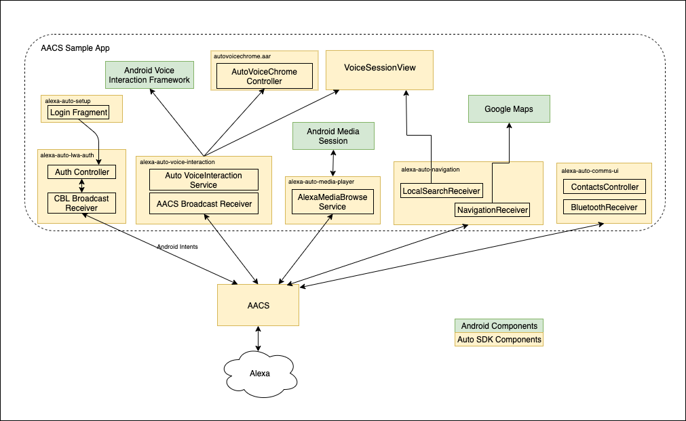

# AACS Sample App

The AACS Sample App is an Android-based application that runs on your vehicle's head unit. It demonstrates how an application uses Alexa Auto Client Service (AACS), an Alexa Auto SDK feature that speeds up Alexa integration for in-vehicle infotainment (IVI). The app shows how the user can select Alexa as an alternative to Google Assistant, and how Alexa and another application running simultaneously can interface with each other. 

<!-- omit in toc -->
## Table of Contents
- [AACS Sample App Features](#aacs-sample-app-features)
- [AACS Sample App Architecture](#aacs-sample-app-architecture)
- [Prerequisites](#prerequisites)
  - [Requirements for Using the AACS Sample App](#requirements-for-using-the-aacs-sample-app)
  - [Requirements for Building the AACS Sample App](#requirements-for-building-the-aacs-sample-app)
- [About App Components](#about-app-components)
- [Setting up the AACS Sample App](#setting-up-the-aacs-sample-app)
- [Editing the Configuration File](#editing-the-configuration-file)
- [Including Build Dependency (AAR)](#including-build-dependency-aar)
- [Building and Signing the AACS Sample App APK](#building-and-signing-the-aacs-sample-app-apk)
  - [Using the CLI to Build the AACS Sample App APK](#using-the-cli-to-build-the-aacs-sample-app-apk)
  - [Using Android Studio to Build the AACS Sample App](#using-android-studio-to-build-the-aacs-sample-app)
- [Understanding AACS Before Using the AACS Sample App](#understanding-aacs-before-using-the-aacs-sample-app)
- [Using the AACS Sample App](#using-the-aacs-sample-app)
  - [Selecting Alexa as the Assistant](#selecting-alexa-as-the-assistant)
  - [Authenticating with AVS using Code-Based Linking (CBL)](#authenticating-with-avs-using-code-based-linking-cbl)
  - [Using the AACS Sample App for Media Player](#using-the-aacs-sample-app-for-media-player)
  - [Logging Out of the AACS Sample App](#logging-out-of-the-aacs-sample-app)
- [Known Issues](#known-issues)

## AACS Sample App Features
The following list describes the AACS Sample App features:
* The app is built on all default Auto SDK modules. All core capabilities are enabled, and the app has implemented full-stack support for the Media Player, Voice Chrome, and AmazonLite Wake Word capabilities. The app also supports single waypoint navigation, canceling existing navigation, and showing local search views.
* On the Android Automotive platform, the app provides multimodal support when displaying the media player. For example, the app accepts both voice input and touch-screen input when the user tries to control the player.
  
## AACS Sample App Architecture
The following diagram illustrates the AACS Sample App Architecture.

<p align="center">

</p>

## Prerequisites
You must meet the prerequisites described in this section before you can run the AACS Sample App.

### Requirements for Using the AACS Sample App
The following list describes the requirements for AACS Sample App:

* The app can only run on an Android device.
* The app requires AACS to be running. You can obtain the AACS APK according to the instructions in the [AACS README](../../../platforms/android/alexa-auto-client-service/README.md).
* The app requires the Voice Chrome extension.

The app is optimized for and tested with the Android Automotive operating system. It is tested with Android API level 28.

### Requirements for Building the AACS Sample App
The requirements for building the app depends on whether you use the command line interface (CLI) or Android Studio:

* CLI: You need Gradle to build the AACS Sample App. The tested Gradle version is 6.5.

* Android Studio: The Android Studio version must be 4.0 or later. Make sure that your Gradle version and Android Studio are compatible. See the [Android Gradle Plugin Release Notes](https://developer.android.com/studio/releases/gradle-plugin#updating-gradle) for information about matching Android Studio versions to Gradle versions.

## About App Components

The AACS Sample App APK contains app components, each of which consists of the compiled source code or resources used by the app to provide the UI layout, communicate with AACS, and so on. The following list shows the contents of the `app-components` directory: 

* alexa-auto-apis
* alexa-auto-apps-common-ui
* alexa-auto-apps-common-util
* alexa-auto-login
* alexa-auto-lwa-auth
* alexa-auto-media-player
* alexa-auto-voice-interaction
* alexa-auto-navigation
  
See the respective README file about the purpose of each component.

## Setting up the AACS Sample App

1) Create your project directory (if you do not already have one):

```shell
    mkdir ~/Projects
    cd ~/Projects
```

2) Clone the alexa-auto-sdk repository into your project directory:

```shell
    git clone https://github.com/alexa/alexa-auto-sdk.git
    cd alexa-auto-sdk
```

The Projects directory contains the Auto SDK directory structure with the `android-aacs-sample-app directory` and `app-components` directory, as shown in the following Auto SDK directory structure:

~~~
alexa-auto-sdk
  ├── ...
  ├── assets
  ├── builder
  ├── extensions
  ├── modules
  ├── platforms
  │       └── android
  │             ├── modules        
  │             ├── alexa-auto-client-service
  │             └── app-components
  |                   └── alexa-auto-apis
  │                   └── alexa-auto-apps-common-ui
  │                   └── alexa-auto-apps-common-util
  │                   └── alexa-auto-login
  |                   └── alexa-auto-lwa-auth
  |                   └── alexa-auto-media-player
  │                   └── alexa-auto-voice-interaction
  |                   └── alexa-auto-navigation
  ├── samples
  │   ├── android
  │   ├── android-aacs-sample-app
  │   │    ├── alexa-auto-app
  │   │          └── README.md
~~~

## Editing the Configuration File
For Alexa Voice Service (AVS) to authenticate your device profile, you must specify the configuration information in this file:

[alexa-auto-sdk/samples/android-aacs-sample-app/alexa-auto-app/src/main/assets/config/aacs_config.json](src/main/assets/config/aacs_config.json) file.

The following list describes the required information in the configuration file:

* For `clientId`, specify the Client ID that you generated when you [set up your security profile](https://developer.amazon.com/en-US/docs/alexa/alexa-voice-service/register-a-product.html#set-up-your-security-profile) for your development device.
* For `productId`, specify the Product ID that you entered when you [filled in the product information](https://developer.amazon.com/en-US/docs/alexa/alexa-voice-service/register-a-product.html#fill-in-product-information) for your development device.

    >**Note:** `clientId` and `productId` must correspond to a development device profile that you created as an **automotive** product by selecting the `Automotive` product category when you [filled in the product information](https://developer.amazon.com/en-US/docs/alexa/alexa-voice-service/register-a-product.html#fill-in-product-information).  
* For `deviceSerialNumber`, specify the serial number of your device.
* For `manufacturerName`, specify the name of the device manufacturer.
* For `description`, specify a description of your device.

## Including Build Dependency (AAR)
The AACS Sample App APK requires the Auto SDK Voice Chrome extension (autovoicechrome.aar) as a dependency. Follow these steps to include the AAR:

1. Create the following directory:

   `alexa-auto-sdk/platforms/android/app-components/alexa-auto-voice-interaction/libs`
2. Copy the AAR into the directory.
  
After including the dependency, you can build the AACS Sample App APK either on the CLI or by using Android Studio.

## Building and Signing the AACS Sample App APK 
You can use the command line interface (CLI) or the Android Studio to build and sign the AACS Sample App APK.

### Using the CLI to Build the AACS Sample App APK   
Follow these steps to build the AACS Sample App APK:
1) Enter the following command to change the directory:

~~~
    cd ~/Projects/alexa-auto-sdk/samples/android-aacs-sample-app/
~~~   

2) Enter the following command to start the build:
  
~~~
    ./gradlew assembleRelease
~~~

>**Note:** To enable the debug log during the build, use `assembleDebug` in the `gradlew` command.

The `gradlew` command creates the unsigned APK, which is located in the following directory:

alexa-auto-app/build/outputs/apk/release/alexa-auto-app_release_1.0.apk

The `gradlew` command also creates each app component's AAR, which is located in each component's build output directory. For example, the Alexa Auto Media Player AAR is in the following directory:

../../platforms/android/app-components/alexa-auto-media-player/build/outputs/aar/alexa-auto-media-player_release.aar

#### Using the CLI to Sign the APK

The procedure for signing the APK requires these commands:
* `zipalign` is included in the Android SDK Build Tools. On a Mac, it is usually located in this directory:
    
  ~/Library/Android/sdk/build-tools/<Android_SDK_Build_Tools_version>/zipalign
* `apksigner` is in Android SDK Build Tools 24.0.3 or higher. On a Mac, it is usually in the following directory:
    
  ~/Library/Android/sdk/build-tools/<Android_SDK_Build_Tools_version>/apksigner

You can include the build tools in your path so that you can run the commands from any directory. The following example is for Android SDK Build Tools version 29.0.2:
  
   `echo "export PATH=\$PATH:~/Library/Android/sdk/build-tools/29.0.2/" ~/.bash_profile && . ~/.bash_profile`

>**Important!** Sign the AACS Sample App APK with the same signing key as the one for the AACS APK.

To sign the APK, follow these steps:

1. Create a custom keystore using the following command, or skip to the next step and use an existing keystore:
    
    `keytool -genkey -v -keystore <keystore_name>.keystore -alias <alias> -keyalg RSA -keysize 2048 -validity 10000`

2. Enter the following command to change to the directory where the APK is:
   
   `cd alexa-auto-app/build/outputs/apk/release`

3. Enter the following command to optimize the APK files:
   
    `zipalign -v -p 4 alexa-auto-app_release_1.0.apk alexa-auto-app_unsigned_release_1.0-aligned.apk`

4. Enter the following commands to sign the APK by using your keystore:
   
    `apksigner sign --ks <path_to_keystore>/<keystore_name>.keystore  --ks-pass pass:<passphrase> --out alexa-auto-app_signed_release_1.0.apk alexa-auto-app_unsigned_release_1.0-aligned.apk`

5. When prompted, enter the passphrase that you set when you created the keystore. 

### Using Android Studio to Build the AACS Sample App

> **Note:** These instructions assume that you have edited the [configuration files](#editing-the-configuration-file).

1. Launch <a href=https://developer.android.com/studio/index.html>Android Studio</a> and select Open an existing Android Studio project.
2. Open the folder containing the APK. For example, open the `alexa-auto-app/samples/android-aacs-sample-app` folder.
3. Click the <strong>Open</strong> button.
4. Under **Build Variants**, select **release**.

> **Note**: Android Studio builds and signs the APK.

## Understanding AACS Before Using the AACS Sample App
Before you use the AACS Sample App, Amazon recommends that you familiarize yourself with AACS by reading the [AACS README](../../../platforms/android/alexa-auto-client-service/README.md). The document includes information about how to change settings for your Android application to work with AACS.

## Using the AACS Sample App
This section describes what the user experiences after you deploy the AACS Sample App on an Android device.

### Selecting Alexa as the Assistant
While Google Assistant is usually the default voice assistant on an Android device, when the AACS Sample App is running, the user has the option of selecting Alexa as the assistant. The app, by running Alexa Voice Interaction as an Android service, demonstrates how a user can use the Android Automotive System UI to select Alexa as the assistant as follows:

1) Go to the device's Settings.
2) Go to `Apps & notifications` > `Default apps` > `Assist & voice input`. Then select Alexa.

### Authenticating with AVS using Code-Based Linking (CBL)
The following steps are for user authentication:
1) After selecting Alexa as the assistant, the user goes to the upper level and clicks the Settings icon beside `Assist apps`. The AACS Sample App displays a code (in the form of a string and a QR code) and a URL. 

2) The user follows the on-screen prompt to complete authentication with Alexa Voice Service (AVS) using CBL. 

After authentication is completed, the user can use the wake word, tap-to-talk system icon, or push-to-talk voice control button on the steering wheel to interact with Alexa. When Alexa is invoked in this way, the AACS Sample App displays the Alexa voice chrome that represents the different attention states for Alexa.

### Using the AACS Sample App for Media Player
In addition to letting the user choose Alexa as the voice assistant, the AACS Sample app enables the user to start and control the media player.

Alexa integrates with most music providers in cloud. After the user launches the app and selects Alexa as the assistant, the user can say, for example, "Alexa, play the station [station call sign] on iHeartRadio."

The app displays the user interface (UI) that comes with Android Automotive. The same UI is presented for all media providers, such as iHeartRadio and Amazon Music. However, the exact UI elements depend on the provider. For example, when the app plays music from iHeartRadio, it does not include a rewind button to go back. When the app plays music from Amazon Music, the rewind button is present. In addition, the user can say, "Go back 30 seconds," to go back.

The user can also use the app to listen to audio books. For example, if the user says, "Alexa, play the start of lord of the rings book one," Alexa starts playing the audio book from Audible. The UI displayed by the app includes the buttons for skipping 30 seconds backward or forward.

### Logging Out of the AACS Sample App
To log out of the AACS Sample App, the user goes to the Alexa Voice Assistant Settings and selects `Logout`. After responding to a confirmation message, the user is logged out of the app.

To log back in to the app, the user has to be authenticated by AVS again.

## Known Issues
* Android Emulator on macOS has poor audio quality, which would cause the Alexa Text-to-Speech (TTS) output to be unusable.
* In the Android Automotive Emulator, the Push-to-Talk button on the system navigation bar does not integrate with the Android Voice Interaction module properly. It is hard coded to invoke Google Assistant instead. Therefore, even if the user tries to switch from the default voice assistant to Alexa, the Push-to-Talk button on the bottom navigation bar still invokes the Google Assistant.
* This version of the Sample App does not work with AACS built with Local Voice Control (LVC) extension.